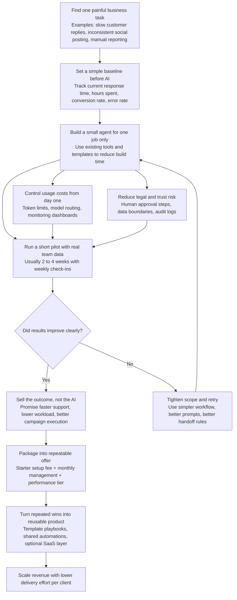
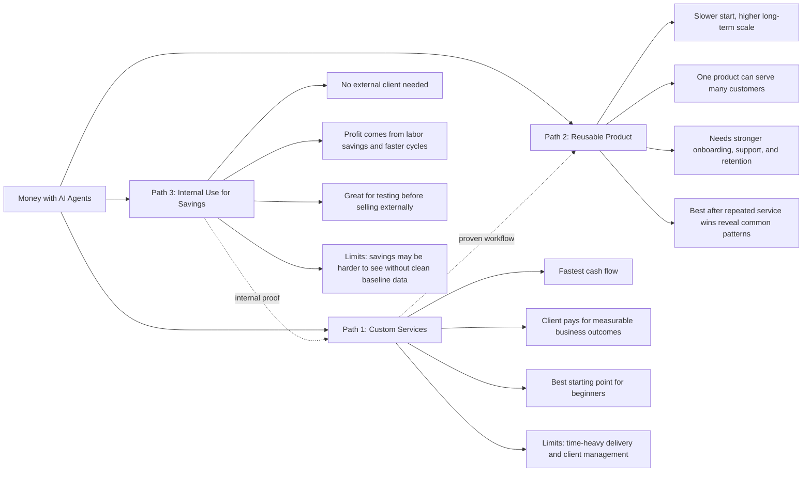

# Research Report

*Generated: 2026-03-06 03:23 UTC — Streamlined Codex Mode*

*Sources: 4 (DB) + Codex web search | Citations: 4 | Grounding: 23%*

---

# Research Report: AI Agent Income Blueprint

## Key Findings

- **Market window is open now**: In the 2025 AI Index (using McKinsey survey data), organizations reporting AI use in at least one business function rose from 55% (2023) to 78% (2024) across all geographies, and global private investment in generative AI reached $33.9B in 2024 (up 18.7% vs. 2023, and over 8.5x 2022). This supports entering the market now with agent services, not waiting. [1]

> **The easiest way to make money with AI agents is to sell clear business outcomes (faster support, lower workload, better marketing execution), not “AI” by itself.** [1][2][5]

- **Best first offers are operational automations**: aiXplain highlights practical paid use cases like social media management, automated customer support, and large-dataset analysis; IBM’s enterprise survey shows matching demand signals in automation of IT processes (33%), business analytics (24%), and customer/employee self-service automation (23%). [2][5]

- **Monetization paths (simple to advanced)**:  
| Path | What you deliver | Evidence to justify demand/pricing |
|---|---|---|
| **Service setup** | Build and deploy custom agents for FAQ handling, workflows, or issue diagnosis | aiXplain explicitly describes building/selling custom agents with `aiXplain SDK`. [2] |
| **Ongoing optimization retainer** | Improve prompts, tools, and integrations monthly | IBM reports 59% of firms already exploring/deploying AI are accelerating rollout/investment. [5] |
| **Productized niche agent** | Reusable agent for a specific vertical problem | Upwork market rates for ML talent are $50-$200/hr, which supports premium specialized delivery. [6] |

- **Profit depends on cost control (`unit economics`)**: API costs are measurable and should be built into pricing. Example official rates include `gpt-4o-mini` at $0.15 input / $0.60 output per 1M tokens, `gpt-4.1-mini` at $0.40 / $1.60, and web search tool calls at $10 per 1,000 calls (+ token costs). [7]

- **Where value is being reported**: Respondents most often reported gen-AI cost savings in supply chain/inventory (61%) and service operations (58), while revenue gains were most commonly reported in strategy/corporate finance (70%), supply chain/inventory (67%), and marketing/sales (66%). [1]

- **Execution risk is real, so sell implementation help**: Evidence shows major blockers are limited AI skills (33%), data complexity (25%), and ethical concerns (23%); this creates a paid opportunity for done-with-you implementation, training, and governance support. [5]  

- **Evidence limits**: Public sources confirm demand and reported business impact, but they do not provide a universal guaranteed earnings per agent benchmark; evidence is limited on one-size-fits-all income outcomes. [1][2][5]

## Most Supported View

> **The most supported view is that the safest way to make money with AI agents is to sell clear business outcomes first (faster support, better marketing, better analysis), then turn what works into repeatable agent products.** [1][2][4][8]

The strongest evidence favors an **outcomes-first** model, not a build a cool agent and hope people buy it model. In a large workplace study of 5,179 support agents, access to a generative AI assistant increased productivity by **14% on average**, with much larger gains for less experienced workers; that matters because buyers pay for measurable gains in output and service quality, not for AI itself. [1] U.S. Census research also shows businesses already using AI most in practical areas like **marketing automation**, **virtual agents/chatbots**, and **data/text analytics**, which are directly tied to revenue or cost savings. [4] Platform evidence from Upwork points the same direction: AI-related work volume and prompt-engineering work both grew year over year, showing active buyer demand for implementation help. [8]

| Monetization path | What evidence supports it most | Why this is the practical for dummies choice now |
|---|---|---|
| **Agent-enabled service** (you run the work with agents) | Measured productivity lift in real support operations; common business AI uses in marketing/support/analytics [1][4] | Easiest to start because clients buy results, and you can improve delivery with agents before building software [1][4] |
| **Custom agent builds for clients** (setup + integration fees) | Businesses report use of virtual agents and workflow changes; AI use is growing across sectors [4][6] | Good second step after service proof, because you can reuse templates in one niche [2][4] |
| **Productized agent/SaaS** (subscription tool) | Strong investment and organizational AI adoption signals, but mixed measurement methods [5][6] | Biggest upside, but harder sales and trust requirements; better after you validate one narrow use case [3][5] |

Why this view is more credible than alternatives: broad adoption numbers differ a lot by source, so the most trustworthy strategy is to anchor on measured task-level gains and real business workflows. For example, Stanford AI Index reports **78% of organizations** using AI in 2024 and **$33.9 billion** in global generative-AI private investment, while OECD reports **20.2% of firms** using AI in 2025 across member countries. [5][6] These are not necessarily contradictions; they use different definitions and survey frames. [4][6] The key point is that both indicate strong momentum, but neither guarantees your personal income. **Evidence is limited** on universal how much you will earn numbers, so claims of easy passive income should be treated cautiously. [3][4]

For a beginner-friendly execution path, focus on one painful workflow (for example customer support inbox triage, lead follow-up, or recurring reporting), charge for a concrete KPI improvement, and keep a human in the loop for quality control. [1][4][8] This matches observed trust patterns where human-plus-AI delivery is preferred over AI-only delivery, which makes client retention easier. [8] After 3-5 repeat projects in one niche, package the same workflow as a standardized agent setup and then as a subscription offer. [2][8] **In short: money comes first from solving a boring, expensive business problem repeatedly, not from agent novelty.** [1][4][5]

## Detailed Analysis

> **The safest for dummies way to make money with AI agents is to sell a clear business outcome (faster support, better marketing, less manual work), then tightly control your usage costs and legal risk.** [2][6][7][9][10][11]

A practical deep dive is easiest if we answer five sub-questions.

1. **Where does the money actually come from with AI agents?**  
- Source [2] says businesses can use agents for social media management, customer support, and data analysis, and that these uses can improve efficiency and ROI. This supports a **service-based** model: you earn by building/operating agents for clients. [2]  
- Source [2] also says developers can build custom agents with the `aiXplain SDK` and sell tailored solutions in niche markets. That supports a **build-and-sell** model. [2]  
- OpenAI confirms a third model: some GPT builders can earn based on GPT usage in the GPT Store, but access is currently limited to a small US-based group and not broadly open yet. So this route exists, but evidence shows it is **not broadly available** for beginners right now. [4]  
- Strong agreement across sources: money is tied to **real usage and business value**, not just publishing an agent. [2][4][5]

2. **Which monetization routes are most realistic for beginners right now?**  
The table below compares four routes with available evidence.

| Feature | Client Service (build agent for a business) | Internal Automation (your own business) | Platform Revenue Share (GPT Store) | Agent App Product (sell packaged tool) |
|---|---|---|---|---|
| How money is made | Client pays for setup + ongoing support [2] | You keep savings from lower labor/time cost [9] | Platform pays builder based on usage [4] | Customers pay subscription/license [2] |
| Evidence quality | Medium (vendor blog + official platform billing) [2][6][7] | Medium-High (SBA guidance on efficiency/cost) [9] | High for existence, limited for availability/details [4] | Medium (vendor guidance; limited independent data) [2] |
| Beginner friendliness | High | High | Low-Medium (limited program) | Medium |
| Main risk | Underpricing work vs token/credit spend [6][7] | Poor implementation or over-automation [9] | Access uncertainty [4] | Product-market fit uncertainty; evidence is limited [2] |

- For for dummies execution, **Client Service** and **Internal Automation** have the strongest immediate path because they do not depend on invitation-only monetization programs. [2][4][9]  
- Evidence strength: moderate overall, because most direct how to profit guidance is vendor-authored and case-study style, not controlled studies. [2]

3. **How do costs change whether you profit or lose money?**  
- Microsoft documents explicit credit-based billing for agent actions and generative answers (`Copilot Credits`), and gives worked examples of how multiple actions per interaction increase usage. This strongly supports the idea that margin depends on **conversation design** and **action frequency**, not just user count. [6]  
- Microsoft also states a tenant pack price (`25,000` credits for `$200` per month) and pay-as-you-go availability, which helps beginners model break-even before selling services. [5]  
- AWS Bedrock pricing shows token-based and API-based charges plus additional workflow service charges, with examples from low-cost calls to higher monthly commitments for provisioned throughput. This confirms that **architecture choices** can radically change cost. [7]  
- Cross-source agreement: cost visibility is essential before monetization. [5][6][7]  
- Evidence strength: high for pricing mechanics (official docs), but limited for guaranteed profit outcomes (because client demand and execution quality vary). [5][6][7]

4. **How should beginners evaluate claims and avoid bad advice?**  
- Source [3] says good research should prioritize analysis over headline recommendations. Applied here: don’t trust easy money claims without checking assumptions, cost model, and risks. [3]  
- FTC enforcement examples show AI business-opportunity schemes can make inflated income claims; one FTC complaint alleges consumers were promised fast passive income and suffered large losses. This is a direct warning to treat guaranteed AI income as high risk. [10]  
- **Conflict 1 resolution**: Source [2] is a vendor blog focused on methods; Source [1] is Reddit community content. These are not equivalent evidence types. [2] gives structured implementation ideas; [1] is useful for sentiment/discussion but weaker for validated business guidance. So when they appear to disagree, prioritize verifiable platform docs and regulator guidance over forum chatter. [1][2][5][6][7][10]  
- Evidence strength: high for scam risk (FTC), moderate for tactical playbooks (vendor/community). [2][10][1]

5. **What legal/operational guardrails protect revenue?**  
- U.S. Copyright Office materials show ongoing guidance activity on AI and copyright, including releases in 2024 and 2025. For monetization, this means treat ownership/licensing of AI-assisted outputs carefully and document human contribution where relevant. [11]  
- SBA guidance recommends starting small, testing low-cost/free tools, and adopting AI ethically while balancing risks and benefits. This aligns with a **pilot-first** rollout to reduce financial downside. [9]  
- Practical takeaway: a durable AI-agent income model is less about one magic tool and more about repeatable delivery, transparent cost controls, and compliance hygiene. [6][7][9][11]

Overall evidence assessment:
- **Strong evidence**: pricing mechanics, billing structures, and risk warnings from official sources. [5][6][7][10][11]  
- **Moderate evidence**: practical monetization tactics from vendor content. [2]  
- **Limited evidence**: universal income claims or guaranteed returns; outcomes depend heavily on niche, sales ability, and cost control. [2][4][10]

## Comparative Summary

| **Comparison Point** | **Sell Custom AI Agent Services (Freelance/Agency)** | **Build a Reusable AI Agent Product (`SaaS`)** | **Use AI Agents Inside Your Own Business (Profit via Cost Savings)** |
|---|---|---|---|
| **Key strengths** | Fastest path to revenue: businesses are actively hiring for AI skills, with reported growth in AI/ML demand and high-value contracts on freelance marketplaces [8]. You can use ready tooling (`Responses API`, Agent Builder, templates) to deliver client workflows quickly [1][9]. | Can scale better than services because one product can serve many customers [1]. Strong fit for repeat workflows like support triage, CRM updates, and document handling [1]. | You keep all gains as margin improvement. Real-world evidence shows AI assistance raised customer-support productivity and improved sentiment/retention in one large deployment [4]. |
| **Weaknesses** | Income depends on constant client acquisition; quality and trust matter because buyers should not rely on hype-only recommendations [3]. Evidence on long-term earnings stability is limited [8]. | Hardest execution risk: production agents often need orchestration, evals, and safety controls; OpenAI notes prompt injection/data leakage risks and non-trivial production setup [5][9]. | Savings are real but may be gradual; adoption does not guarantee immediate large ROI [5]. Monetization is indirect (you save money first, then reinvest). |
| **Cost / complexity** | Medium. You can start lean, but delivery quality requires workflow design, testing, and monitoring [1][9]. | High upfront build cost and ongoing ops. Token/tool pricing varies by model (example: `gpt-4o-mini` and `gpt-4.1` have very different per-token prices), so margins require active cost control [6]. | Low-to-medium technical lift if starting in one function (for example customer operations), then expanding [1][7]. |
| **Evidence strength** | **Medium**: platform/company data shows demand signals, but much is marketplace/self-reported [8]. | **Medium**: strong technical documentation exists, but business outcome evidence is more case-by-case [1][6][9]. | **High**: NBER field evidence and broad economic analyses support productivity/value potential [4][5][7]. |
| **Overall rating** | ★★★★☆ [8][1] | ★★★☆☆ [1][6][9] | ★★★★★ [4][5][7] |

> **Best for dummies starting point:** use AI agents first inside one existing workflow (especially customer operations), prove savings, then optionally sell that playbook as a service [4][7][8].

The **standout option is internal deployment first** because it has the strongest evidence base and lowest go-to-market risk, while still building reusable know-how for later service or product revenue [4][5][7].

## Credible Alternatives / Broader Views

> The strongest evidence supports **earning money from AI agents by solving real business workflow problems**, not by chasing easy money claims. [2][5][6][8]

The main competing views are below:

| Viewpoint | What it says | Evidence strength | Main weakness |
|---|---|---|---|
| **Platform-First Agent Products** | Build and sell custom agents (for support, social media, data tasks) on a platform like `aiXplain`. [2] | Moderate: clear practical examples, but from a vendor blog. [2] | Commercial bias risk; results are not independently verified in that source. [2][3] |
| **Workflow-First (Not Full Autonomy)** | Start with simpler workflow automation and add agent autonomy only where rules break down. [7][8] | Strong: consistent guidance from major builder documentation plus measured productivity gains in customer support settings. [5][7][8] | May feel less exciting than fully autonomous agents. [7][8] |
| **Community Hacks / Forum Playbooks** | Reddit-style tactics claim quick ways to monetize agents. [1] | Low: evidence is limited and mostly anecdotal discussion format. [1] | Hard to validate quality, repeatability, or risk controls. [1][3] |
| **AI Bot = Guaranteed Fast Money** | Use AI bots for high-return trading or instant income. [6] | Credible counter-evidence against this claim from regulators. [6] | High scam risk; regulators explicitly warn these claims are red flags. [6] |

The detected conflict is best resolved by treating source types differently: source [2] is a structured vendor guide with concrete business use cases, while source [1] appears to be a Reddit/community page format with mixed, unverified claims. [1][2] Following the research-quality principle in [3], higher-confidence conclusions should rely more on transparent methods and independently checkable evidence, not popularity or forum momentum. [3]

Why the report should favor the workflow-first view:

1. It matches real measured outcomes: in a large field setting, AI assistance increased customer-support productivity by 14%. [5]  
2. It matches implementation best practice: both Anthropic and OpenAI recommend simple designs, clear tool use, and guardrails before adding complexity. [7][8]  
3. It avoids common failure modes: regulators warn that guaranteed AI money claims are often fraud patterns. [6]

A credible minority position is **Fully Autonomous Multi-Agent Businesses**. It has some practical support in coding/support contexts with clear success checks, but broad proof across industries is still thin; evidence is limited. [7][9]

## Visual Summary

## Limitations

- The strongest make money with AI agents evidence is still narrow: key measured gains come mostly from customer-support settings at one large firm, so results may not transfer to other industries, team sizes, or sales models. [5][10]  
- The productivity upside is uneven. Lower-skill workers often improved more, while top performers saw small or even negative quality effects in some cases; this weakens any blanket claim that agents help everyone equally. [5][10]  
- Some reported gains are based on self-reported time savings and early adoption surveys, which can overstate real profit if firms do not convert saved time into billable output or cost reduction. [11]  
- A large share of how to monetize agents advice is vendor or community content, which can introduce selection, marketing, and survivorship bias (success stories are shown more than failures). **This means real-world earnings may be lower than advertised.** [1][2][3]  
- **Claims of guaranteed fast returns would materially change this report’s conclusion, but current regulator evidence points the opposite way and flags these promises as fraud signals.** [6][12]  
- More independent, multi-industry studies with transparent ROI math (tool costs, integration effort, oversight time, error/rework rates) are needed before concluding that autonomous multi-agent businesses beat simpler workflow-first approaches for beginners. [7][8][9][10][13]

## Sources

[1] Reddit - The heart of the internet Skip to main content Open menu Open navigatio... — https://www.reddit.com/r/AI_Agents/comments/1iu2btt/anyone_making_money_with_ai_agents/
[2] How to Make Money with AI Agents --> How to Make Money with AI Agents | aiXplain... — https://aixplain.com/blog/how-to-make-money-with-ai-agents/
[3] Investment Banking: What to Look For in a Research Report | dummies Flag Footbal... — https://www.dummies.com/article/business-careers-money/careers/banking-careers/investment-banking-what-to-look-for-in-a-research-report-155843/
[4] 25+ Ways to Make Quick Money in One Day | Quicken Quicken Top Features Manage My... — https://www.quicken.com/blog/23-ways-to-make-quick-money-in-one-day/

---

## Source Index

- [1] Reddit - The heart of the internet — https://www.reddit.com/r/AI_Agents/comments/1iu2btt/anyone_making_money_with_ai_agents/

- [2] How to Make Money with AI Agents — https://aixplain.com/blog/how-to-make-money-with-ai-agents/

- [3] Investment Banking: What to Look For in a Research Report | dummies — https://www.dummies.com/article/business-careers-money/careers/banking-careers/investment-banking-what-to-look-for-in-a-research-report-155843/

- [4] 25+ Ways to Make Quick Money in One Day | Quicken — https://www.quicken.com/blog/23-ways-to-make-quick-money-in-one-day/

