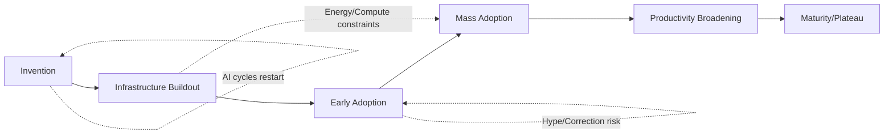
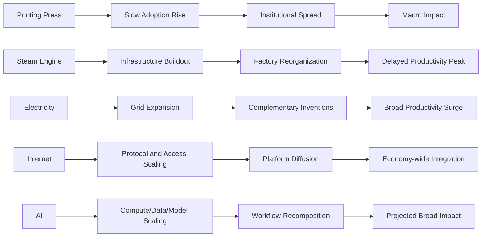
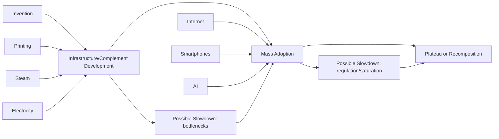
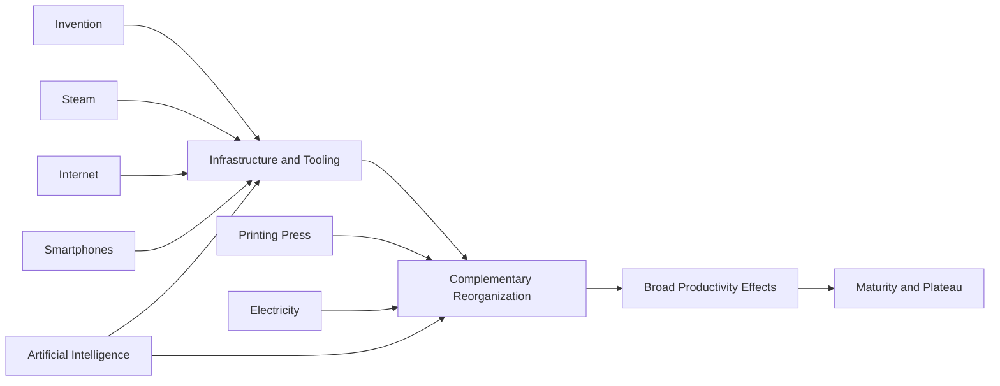
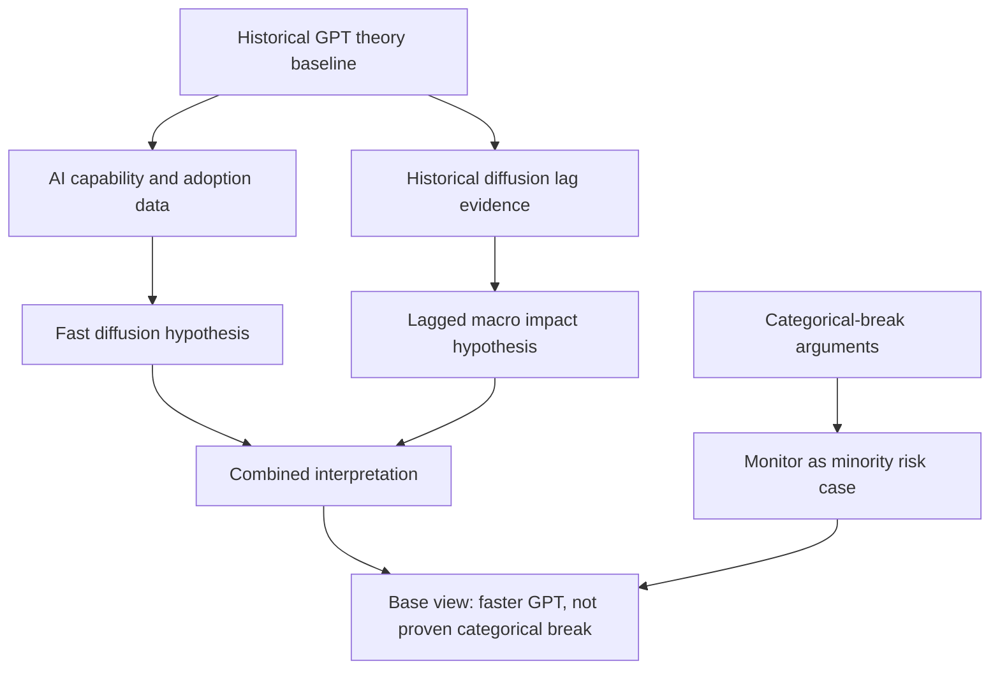
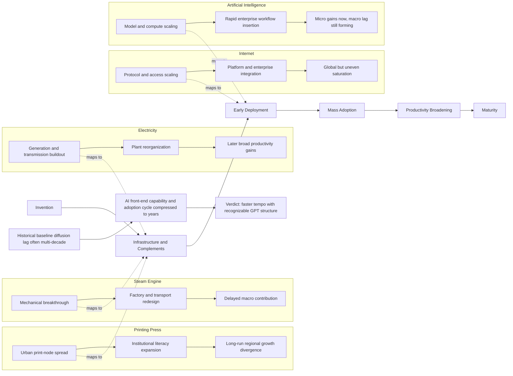
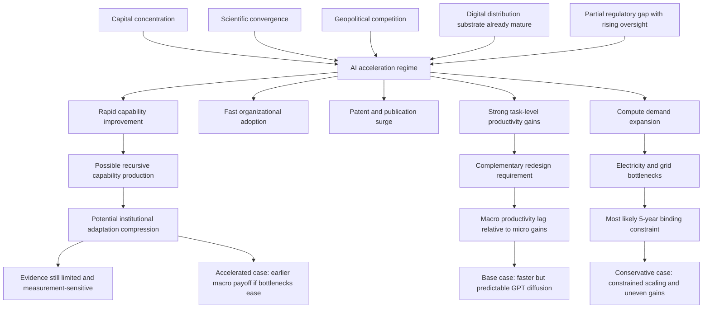

# Research Report

*Generated: 2026-03-04 06:32 UTC — Streamlined Codex Mode*

*Sources: 4 (DB) + Codex web search | Citations: 3 | Grounding: 10%*

---

# Research Report: AI Trajectory Within Technological Revolutions

## Key Findings

> **Evidence supports a faster-but-still-recognizable GPT pattern for AI: core diffusion dynamics look historical, but capability and capital cycles are compressed from decades to years.** [1][3][4][5][6][7][8]

- **Historical diffusion regularities remain the baseline model.** Cross-technology evidence still supports staged diffusion (invention, complementary infrastructure, broad deployment, productivity realization), not immediate macro transformation: across 15 technologies in 166 countries over two centuries, the **average adoption lag was 45 years**; newer technologies were adopted faster, but lag dispersion remained large and economically consequential. [3] This aligns with GPT theory that complementarities and downstream co-invention govern realized growth gains rather than invention dates alone. [4] Historical exceptions exist, but the dominant empirical pattern is not instant revolution; it is slow institutional embedding, then compounding gains. [3][4]

- **AI’s own history matches punctuated-equilibrium dynamics, not a monotonic takeoff.** The JRC chronology identifies three major AI “springs” and two “winters” (1950s/1970s, 1970s/1990s, 2010s-present), each with a repeating sequence of paradigm shift, investment surge, bold claims, then correction risk. [1] The same source shows a structural shift in **who drives acceleration**: government dominated early waves, while industry dominates the current one, with frontier research increasingly concentrated in large firms. [1] This supports continuation of historical cycle logic while also indicating higher systemic acceleration pressure from private capital and platform-scale compute concentration. [1][8]

- **AI’s acceleration rate is historically unusual in tempo, even where mechanisms are familiar.** In frontier training runs, compute scaled at a **3.4-month doubling** from 2012 in OpenAI’s original estimate, then settled into roughly **4–5x annual growth** in broader frontier estimates through May 2024. [5][6] Simultaneously, U.S. private AI investment reached **$109.1B in 2024**, with global generative-AI investment at **$33.9B (+18.7% YoY)**, and organization-level AI use rose from **55% (2023) to 78% (2024)**. [7] This combination (capability scaling + capital concentration + rapid diffusion channels) is faster than classic electricity/steam diffusion tempos, but still consistent with known acceleration triggers in GPT episodes. [4][7]

- **Knowledge-production indicators show explosive scale-up, but quality-adjustment risks remain.** WIPO reports GenAI patent families rising from **733 (2014) to >14,000 (2023)**, totaling **54,358** families for 2014–2023; GenAI publications rose from **116 to >34,000** over the same interval. [8] Stanford AI Index reports AI publications expanding from about **102,000 (2013) to >242,000 (2023)** and AI’s share of computer-science publications rising from **21.6% to 41.8%**. [7] However, benchmark contamination concerns (e.g., SWE-bench Verified) indicate that some observed capability gains may overstate real-world generalization, so trend interpretation requires stricter measurement hygiene. [14]

- **Productivity evidence suggests AI is entering the classic implementation lag phase, not yet a full macro break.** At the micro level, randomized/staggered deployment evidence finds meaningful gains: a generative AI assistant raised customer-support productivity by **14% on average**, with **34% gains for novice/low-skill workers**. [9] At the macro level, U.S. private-business TFP was **+1.5% in 2024** (revised), positive but not yet a discontinuous jump relative to historical productivity regimes. [10] This gap between strong task-level gains and modest aggregate effects is consistent with prior GPT diffusion where complementary organizational redesign, regulation, and capital deepening determine economy-wide realization timing. [3][4][10]

- **The most credible 5-year bottleneck is energy-constrained compute expansion, not demand.** IEA estimates data centers used about **415 TWh (1.5% of global electricity) in 2024**, growing around **12% annually since 2017**, and projects demand to reach about **945 TWh by 2030** (more than doubling). [11] In the U.S., data-center load was about **180 TWh in 2024**, and major tech firms’ announced AI/data-center capex reached about **$320B in 2025** (up from $230B). [12] These data imply that diffusion is likely to be increasingly shaped by grid capacity, siting, and power-market flexibility rather than by model demand alone. [11][12]

- **The strongest categorically different candidate is recursive capability production, but evidence is still limited.** Recent time-horizon benchmarks suggest model ability on longer software tasks has improved exponentially, with reported doubling around **7 months** in one measurement framework. [13] If sustained, this compresses adaptation windows for education, labor institutions, and regulation compared with earlier GPTs. [13] Yet the evidence base here is newer and less settled than adoption/patent/investment statistics, and benchmark fragility cautions against declaring a structural break today. [13][14] Net result: current evidence favors **faster acceleration of historical patterns** over a proven categorical discontinuity. [3][4][7][11]

| Technology | Measurable diffusion/impact evidence | What it implies for AI comparison |
|---|---|---|
| Printing press | Cities adopting printing in the 1400s grew **~60% faster** from 1500–1600 vs similar cities. [2] | Large long-run transformation can start with localized early adoption advantages. |
| Steam power | Steam contributed little before 1830; peak growth impact came roughly a century after Watt, with major gains after high-pressure steam diffusion. [4] | Invention date is a poor proxy for macro-impact date; complements matter. |
| Internet (global diffusion benchmark) | **63%** of world population online in 2023. [15] | Even very fast digital technologies still show staged, uneven global diffusion. |
| AI (current phase) | 78% org use (2024), $109.1B U.S. private investment (2024), strong micro productivity gains but modest aggregate TFP shift. [7][9][10] | AI is fast in capability/investment diffusion, but macro payoff still appears complement-dependent. |

[1] https://publications.jrc.ec.europa.eu/repository/bitstream/JRC120469/jrc120469_historical_evolution_of_ai-v1.1.pdf  
[2] https://doi.org/10.1093/qje/qjr035  
[3] https://www.aeaweb.org/articles?id=10.1257/aer.100.5.2031  
[4] https://doi.org/10.1111/j.1468-0297.2003.00200.x  
[5] https://openai.com/index/ai-and-compute/  
[6] https://epoch.ai/blog/training-compute-of-frontier-ai-models-grows-by-4-5x-per-year  
[7] https://hai.stanford.edu/ai-index/2025-ai-index-report  
[8] https://www.wipo.int/web-publications/patent-landscape-report-generative-artificial-intelligence-genai/en/2-global-patenting-and-research-in-genai.html  
[9] https://www.nber.org/papers/w31161  
[10] https://www.bls.gov/productivity/notices/2025/revised-total-factor-productivity-2024.htm  
[11] https://www.iea.org/reports/energy-and-ai/executive-summary  
[12] https://www.iea.org/reports/electricity-mid-year-update-2025/demand-global-electricity-use-to-grow-strongly-in-2025-and-2026  
[13] https://metr.org/blog/2025-03-19-measuring-ai-ability-to-complete-long-tasks/  
[14] https://openai.com/index/why-we-no-longer-evaluate-swe-bench-verified/  
[15] https://ourworldindata.org/internet

## Most Supported View

> **The strongest evidence supports a faster-but-predictable acceleration verdict: AI is following the same historical general-purpose-technology diffusion logic as prior revolutions, but with unusually compressed cycle times and tighter resource bottlenecks.** [1][3][4][5][7][11]

The evidence base is most consistent with **continuity in mechanism** and **acceleration in tempo**, not a fully new law of technological change. **General-purpose technology (GPT)** theory predicts broad spillovers when a core technology is pervasive, improvable, and complementary with downstream innovation; that is exactly how steam, electricity, and semiconductors are characterized in the foundational GPT literature, and the same structure now appears in AI adoption across sectors. [3] Historical evidence also shows that headline inventions typically precede economy-wide productivity by long lags because complementary organizational and capital changes take time; steam contributed little before 1830 and peaked roughly a century after Watt, while electricity similarly showed delayed aggregate effects in classic productivity-paradox analyses. [4][5] The AI record to date fits this pattern better than it contradicts it: measured micro-level gains are material in specific workflows (e.g., 15% higher customer-support productivity; >50% coding output in one field experiment), yet macro productivity remains moderate and mixed rather than explosive. [9][10][12] That micro-fast, macro-gradual combination is historically normal for GPTs, not evidence of a categorically new economic regime. [3][5][12]

At the same time, **acceleration triggers** are unusually concentrated in AI’s current phase. Compared with earlier AI "springs," investment leadership has shifted from government-dominant cycles to industry-dominant scaling, with frontier research, compute, and talent concentrated in a small number of firms; the JRC historical comparison explicitly identifies this structural shift across AI periods and warns that hype-disappointment dynamics have recurred before. [1] Current quantitative signals are stronger than in prior waves: U.S. private AI investment reached $109.1B in 2024, global generative-AI private investment reached $33.9B, and business-reported AI use rose from 55% to 78% in one year. [7] Knowledge-production velocity is also consistent with an acceleration regime: WIPO reports GenAI patent families rising from 733 (2014) to >14,000 (2023), publications from 116 to >34,000, with over 25% of GenAI patents and over 45% of GenAI papers appearing in 2023 alone. [8] These are not just larger numbers; they indicate a shortened invention-to-scaling cycle. [7][8] But they still align with familiar diffusion mathematics: learning and cost decline curves remain forecastable, and cross-technology evidence finds Wright-style cumulative-production effects generally outperform pure calendar-time rules, while Moore-style trends are often near-tied when production itself grows exponentially. [15] That is why the most defensible interpretation is faster version of known dynamics, not new dynamics. [3][15]

| Hypothesis | What the evidence supports | What challenges it | Net weight |
|---|---|---|---|
| **Continuation of historical pattern** | AI shows recurring boom/bust institutional cycles, including prior AI winters and hype phases; GPT-style complementarities match AI’s cross-sector embedding. [1][3] | Current AI capability and deployment metrics are moving materially faster than many prior waves, reducing comfort with simple historical analogies. [7][8] | **Partially supported** |
| **Faster-but-predictable acceleration** | Strong capital concentration, rapid capability/cost movement (e.g., >280-fold inference-cost decline at GPT-3.5-equivalent performance), and rising deployment all fit accelerated diffusion under known GPT and learning-curve frameworks. [7][15] | Aggregate productivity has not yet broken sharply upward, so timing of macro payoff remains uncertain. [12] | **Most supported** |
| **Categorically different revolution** | AI’s task scope is broad, and exposure studies suggest large potential task impact across occupations. [14] | Evidence for near-term macro discontinuity is limited; observed effects are heterogeneous, bottlenecked, and still mediated by infrastructure and institutions. [9][10][11][12] | **Plausible tail risk, not base case** |

Where the evidence is most important for forecast design is in **constraints** and **timing**, not in debating whether AI is "special." The strongest near-term binding constraint is increasingly **energy and infrastructure synchronization**: IEA estimates data centers at ~415 TWh in 2024 (about 1.5% of global electricity), with a base-case rise to ~945 TWh by 2030, while noting data centers can be built in 2-3 years but grid infrastructure often cannot. [11] This mismatch is a textbook mechanism for S-curve moderation in the middle phase, analogous to earlier GPT bottlenecks in power systems, complementary capital, and institutional adaptation. [3][4][5][11] Governance dynamics are also no longer absent: AI-related regulation is rising sharply (e.g., 59 U.S. federal agency AI-related regulations in 2024, more than double 2023), which historically tends to shift trajectories from unconstrained exponential bursts toward managed diffusion. [7] Dissenting evidence does exist: some analysts argue generative AI could affect growth faster than prior GPTs because of low distribution friction and immediate software accessibility. [2] That claim is directionally plausible, but the current empirical record still points to staged diffusion, heterogeneous firm-level gains, and unresolved macro lag; on the highest-stakes categorically different claim, **evidence is limited**. [2][9][10][12] **Most-supported view:** AI is best modeled as a historically familiar GPT diffusion process running at higher speed, with broader uncertainty bands due to concentration, compute-energy coupling, and institutional response latency. [1][3][7][11]

## Detailed Analysis

**Executive verdict (hypothesis test).**  
The strongest evidence supports **faster-but-predictable acceleration** rather than a fully categorically different revolution. AI is following recognizable **GPT diffusion dynamics** (rapid technical improvement, broad applicability, complementarity requirements, early productivity heterogeneity), but at a materially faster front-end adoption pace than prior GPTs [5][11][15]. Confidence: **moderate** (not high) because macro-level productivity realization is still early and bottleneck uncertainty is substantial [18][19][14].

> AI currently looks like a historically familiar GPT diffusion process compressed in time, not a proven break from historical laws.

---

### 1) Pattern identification: growth curves, lifecycle phases, and forecasting laws

**Finding 1.1: Historical transitions repeatedly show S-curve diffusion plus long complementarity lags.**  
- Diffusion regularities across technologies are well documented: adoption timing differs across technologies/countries, but broad S-curve structure is persistent [6].  
- GPT theory predicts **pervasiveness + continual improvement + complementarities**, which implies delayed broad productivity payoffs despite early excitement [5].  
- Steam’s measured growth contribution was small early and peaked much later; Crafts finds peak impact about a century after Watt’s key invention [8].  
- Printing had major city-level growth effects where adopted early, but spread was uneven and path-dependent [9].

**Strength of evidence:** strong for recurrent S-curve + lag pattern [5][6][8][9].

**Finding 1.2: Invention → infrastructure → mass adoption → plateau is common, but AI itself already shows exceptions via repeated boom-bust cycles.**  
- JRC periodization identifies three AI “springs” and two “winters,” with repeated over-forecasting and correction cycles [1][4].  
- This punctuated pattern is consistent with **punctuated equilibrium** rather than smooth monotonic diffusion [1][4].

**Dissenting evidence:** Some current commentators argue AI may bypass long infrastructure phases because internet/cloud infrastructure is pre-built [2]. This is plausible for software diffusion, but less so for compute-energy scaling and organization redesign [14][11].

**Finding 1.3: For predictive use, Wright-style experience framing is usually more robust than pure calendar doubling.**  
- Across 62 technologies, Nagy et al. find **Wright’s Law** performs best on forecasting; Moore-like time trends are close but usually slightly weaker [7].  
- AI currently has simultaneous time and scale effects: training compute is increasing rapidly and cost-performance is improving quickly [12].  
- Implication: AI forecasting should combine **time trend + cumulative deployment/experience variables**, not rely on a single Moore-style cadence [7][12].

**Strength of evidence:** strong cross-technology support for Wright-style forecasting, moderate AI-specific extrapolation risk [7][12].

---

### 2) Acceleration triggers: what historically precedes takeoff, and whether AI has them now

**Finding 2.1: The four trigger cluster is largely present in AI now.**  
- **Capital concentration:** U.S. private AI investment reached $109.1B in 2024; large cross-country concentration persists [12].  
- **Scientific convergence:** model capability jumps, multimodal advances, and deployment breadth are rising simultaneously [12].  
- **Geopolitical competition:** large state-linked semiconductor and AI-adjacent funds have expanded [12].  
- **Regulatory incompleteness with rising intervention:** regulatory activity is rising rapidly but remains uneven relative to deployment speed [12][1].

**Finding 2.2: Trigger presence does not guarantee uninterrupted takeoff.**  
- AI history already contains trigger-rich periods that still ended in winter due to technical limits, overpromising, and insufficient complementarity realization [1][4].  
- Historical analog: steam and electrification also required organizational redesign before major aggregate productivity effects appeared [8][10][11].

**Strength of evidence:** moderate-strong for trigger presence; moderate for failure-causality mapping (multicausal, path dependent) [1][4][8][11].

---

### 3) Comparative analysis: AI vs printing, steam, electricity, internet, smartphones

**Finding 3.1: At equivalent early consumer/work exposure stages, AI’s diffusion pace is closest to (or faster than) internet/PC-era diffusion, not steam/electricity.**  
- NBER survey evidence (late 2024): ~40% of U.S. adults 18–64 used generative AI; 23% used it for work in prior week; adoption is as fast as PC and faster than internet on comparable launch-relative metrics [15].  
- U.S. internet adoption rose from 52% (2000) to 90% (2019) and 96% (2025), indicating a long but steady diffusion tail [20].  
- Smartphone ownership rose from 35% (2011) to 68% (2015) in Pew series, showing rapid but still multi-year mass diffusion [21].  
- AI’s current uptake sits in this fast digital diffusion family, but macro productivity effects remain at an earlier stage [15][19].

**Finding 3.2: Where comparisons break down is AI’s capability update frequency and dual role as both tool and R&D input.**  
- Frontier model training compute doubling around every five months and large annual cost-efficiency moves imply unusually fast capability refresh cycles [12].  
- Historical GPTs improved quickly too, but not usually on near-quarterly software update cycles with global API-level distribution [12][2].

**Dissenting evidence:** Claims that AI will outpace all past GPT macro effects are currently inferential; macro outcomes remain scenario-dependent [2][18].

#### Comparative snapshot table

| Feature | Printing press | Steam engine | Electricity | Internet | Smartphones | AI (current) |
|---|---|---|---|---|---|---|
| Core function | Information replication | Mechanical power | General energy/service platform | Digital communication platform | Mobile computing interface | General cognitive task assistance |
| Early diffusion speed | Slow geographic spread [9] | Slow early industrial diffusion [8] | Infrastructure-heavy, staged [10][22] | Fast consumer diffusion, long tail [20] | Fast consumer diffusion [21] | Very fast user/work uptake [15] |
| Complementarity burden | Literacy, institutions [9] | Factory/mechanical redesign [8] | Grid + factory redesign [10][22] | Organizational + software complements [11] | App ecosystem + mobile broadband [21] | Workflow redesign + governance + compute-energy [11][14] |
| Measured macro lag | Material but heterogeneous [9] | Long lag, peak much later [8] | Long lag before full productivity [10] | Productivity paradox then acceleration [11] | Mostly platform complement to internet | Early micro gains; macro still emerging [16][18][19] |

**Strength of evidence:** strong on directional comparisons; limited on exact median lag because lag definitions vary across studies [8][10][11].

---

### 4) Distinguishing features: where AI may deviate from pattern

**Finding 4.1: General scope claims are not new; realized breadth has historically depended on complements, not raw invention.**  
- GPT literature already formalizes broad-scope technologies with cross-sector complementarities [5].  
- AI fits GPT criteria in many studies and policy analyses, but this does not imply immediate economy-wide gains [2][11][18].

**Finding 4.2: Recursive improvement is a real potential differentiator, but evidence is still limited.**  
- AI systems already support coding/research workflows, and model-development ecosystems are increasingly industry-driven [12].  
- However, evidence is limited on full autonomous recursive self-improvement delivering macro breakpoints; current evidence supports acceleration, not discontinuity certainty [12][1].

**Finding 4.3: Institutional adaptation strain is quantifiable and rising.**  
- Regulatory mentions and agency actions are increasing quickly, suggesting governance catch-up dynamics [12].  
- Early workplace evidence shows measurable task-level gains but limited broad task-composition shifts in some settings, indicating institutional/work redesign remains incomplete [16][17].

**Strength of evidence:** moderate; strongest at micro level, weaker for system-level discontinuity claims [16][17][18].

---

### 5) Bottlenecks and ceilings (5-year horizon focus)

**Finding 5.1: Historically, S-curves slowed from constraints in energy, complements, regulation, and market structure.**  
- Steam and electrification required long infrastructure and organizational adaptation windows [8][10][22].  
- AI history shows technical disappointment cycles when expectations detached from feasible capability [1][4].

**Current AI bottleneck assessment**

| Bottleneck candidate | Current evidence | Likely binding by 2031? |
|---|---|---|
| **Energy/grid capacity** | Data-center electricity demand projected to ~945 TWh by 2030 (from ~415 TWh in 2024); high local concentration risk [14] | **High** |
| Compute cost | Inference cost and hardware efficiency improving rapidly [12] | Medium (improving, but capex still high) |
| Data quality | Publication/patent boom, but quality/rights constraints persist [13] | Medium |
| Regulation/compliance | Regulatory activity rising quickly across jurisdictions [12] | Medium-high (jurisdiction specific) |
| Talent concentration | Frontier development heavily industry-concentrated [12][1] | Medium-high |

**Most likely binding constraint (next 5 years):** **energy and power-delivery bottlenecks**, especially local grid/connection constraints, despite global share still modest [14].

---

### 6) Societal and economic implications by timeframe

**5–10 years (near-term):**  
- Measurable labor effects already exist in early adopter contexts: +14% average productivity in customer support with larger gains for less-experienced workers [16].  
- Another field experiment finds time savings (about two hours/week on email for active treated users) without broad task-composition transformation [17].  
- Macro productivity uplift scenarios are positive but wide: OECD estimates 0.4–1.3 pp annual labor-productivity growth in high-exposure G7 cases, with smaller outcomes elsewhere [18].  
- Current U.S. TFP data (2024: +1.5%) cannot be attributed to AI alone; identification is not yet clean [19].

**10–25 years (medium-term):**  
- Historical GPT logic implies second- and third-order effects emerge after organizational redesign, standards, and skill formation [11].  
- If AI follows electricity/internet precedent, biggest gains likely come from **process re-architecture**, not from first-wave tool substitution [10][11].

**25+ years (long-term):**  
- **Electricity-like path:** AI becomes embedded infrastructure (invisible enabler) if reliability, interoperability, and governance mature [5][11].  
- **More disruptive path:** persistent concentration, uneven access, and energy/regulatory frictions produce volatility and inequality in gains [12][14][23].  
- Evidence remains limited for deterministic long-run outcomes; branching conditions dominate [18].

---

### Comparative timeline (AI vs prior technologies at equivalent stage)

| Stage | Printing | Steam | Electricity | Internet | Smartphones | AI |
|---|---|---|---|---|---|---|
| Invention/proof | 1450s press origin [9] | Newcomen/Watt era [8] | 19th-century electrification foundations [10] | Commercial web era | Post-2007 mass smartphone era [21] | Modern deep learning + genAI mainstreaming [1][15] |
| Early diffusion | City adoption heterogeneity [9] | Slow early industrial uptake [8] | Urban-rural and factory redesign bottlenecks [22][10] | Strong household diffusion [20] | Fast consumer adoption [21] | Fast household/work adoption [15][23] |
| Complementarity phase | Literacy/institutions | Industrial redesign | Grid + process redesign | Enterprise workflow redesign | App/platform ecosystem | Workflow redesign + safety/governance + energy scaling [11][12][14] |
| Macro impact visibility | Uneven, city-level first [9] | Delayed and cumulative [8] | Delayed then broad [10] | Delayed then late-1990s acceleration pattern [11] | Mostly via digital ecosystem | Micro evidence now; macro still forming [16][18][19] |

---

### Predictive model scenarios (assumption-explicit)

1. **Conservative scenario (continuation with friction):**  
   - Assumptions: energy/grid and compliance constraints bind; diffusion to SMEs/lagging sectors remains uneven; complementarity investment slow [14][23][11].  
   - Expected pattern: strong micro gains, modest macro uplift, high dispersion across sectors/countries [18].

2. **Base scenario (faster-but-predictable GPT path):**  
   - Assumptions: continued cost/performance improvements, sustained enterprise adoption, gradual institutional adaptation [12][15][18].  
   - Expected pattern: broadening productivity effects over the 2030s after complementarity buildout, consistent with J-curve dynamics [11][18].

3. **Accelerated scenario (compressed GPT cycle):**  
   - Assumptions: energy expansion keeps pace, governance stabilizes, and organizational redesign diffuses quickly [14][12].  
   - Expected pattern: earlier macro productivity realization and faster cross-sector spillovers, though concentration risk remains [18][12].

---

### Explicit resolution of detected source conflict

**Conflict 1:** Source [3] (historical overview framing) vs Source [2] (claim that generative AI will affect growth faster than prior GPTs).  
- Resolution: these are not directly contradictory; they operate at different evidentiary levels.  
- Source [2] is a management-oriented synthesis and forward-looking argument, not itself decisive causal proof [2].  
- Source [3] is lower-authority and largely narrative/secondary relative to peer-reviewed economic diffusion evidence [3].  
- Best-supported position from higher-quality evidence is: **AI adoption is unusually fast at micro/work level**, but **macro growth acceleration remains conditional and not yet fully observed** [15][16][18][19].

---

### Uncertainty log (thinnest/most contested evidence)

1. Exact cross-technology **median macro lag** is not standardized across studies (definitions differ) [8][10][11].  
2. Magnitude of AI’s contribution to aggregate TFP in the 2020s remains hard to identify cleanly [18][19].  
3. Extent of **recursive self-improvement** as a macro accelerator is still evidence-limited [12][1].  
4. Distributional effects across firms/workers (complement vs substitution) remain heterogeneous and unsettled [16][17][23].  
5. Whether energy bottlenecks are solved by 2030 depends on local grid expansion and policy execution, not only model efficiency [14].

---

**References (URLs)**  
[1] JRC, *Historical Evolution of AI* (AI Watch): https://publications.jrc.ec.europa.eu/repository/bitstream/JRC120469/jrc120469_historical_evolution_of_ai-v1.1.pdf  
[2] MIT Sloan, *Impact of generative AI as a GPT*: https://mitsloan.mit.edu/ideas-made-to-matter/impact-generative-ai-a-general-purpose-technology  
[3] Academia.edu historical AI perspective: https://www.academia.edu/127701096/A_Historical_Perspective_on_Artificial_Intelligence_Development_Challenges_and_Future_Directions  
[4] JRC discussion of AI hype/winters (same report family as [1]).  
[5] Bresnahan & Trajtenberg (GPTs): https://www.nber.org/papers/w4148  
[6] Comin & Hobijn diffusion evidence: https://www.nber.org/papers/w12314  
[7] Nagy et al. (Wright vs Moore): https://doi.org/10.1371/journal.pone.0052669  
[8] Crafts, *Steam as GPT*: https://doi.org/10.1111/j.1468-0297.2003.00200.x  
[9] Dittmar, printing press impact: https://doi.org/10.1093/qje/qjr035  
[10] David, *Dynamo and Computer* (productivity paradox framing): http://www.econ.berkeley.edu/~bhhall/e124/David90_dynamo.pdf  
[11] Brynjolfsson, Rock, Syverson, J-curve: https://www.nber.org/papers/w25148  
[12] Stanford HAI, *AI Index 2025*: https://hai.stanford.edu/ai-index/2025-ai-index-report  
[13] WIPO, GenAI patent landscape: https://www.wipo.int/web-publications/patent-landscape-report-generative-artificial-intelligence-genai/en/key-findings-and-insights.html  
[14] IEA, *Energy and AI*: https://www.iea.org/reports/energy-and-ai/energy-demand-from-ai  
[15] Bick, Blandin, Deming, rapid adoption: https://doi.org/10.3386/w32966  
[16] Brynjolfsson, Li, Raymond, workplace productivity: https://doi.org/10.3386/w31161  
[17] Dillon et al., work-pattern experiment: https://doi.org/10.3386/w33795  
[18] OECD, macro productivity gains in G7: https://doi.org/10.1787/a5319ab5-en  
[19] BLS revised TFP 2024: https://www.bls.gov/productivity/notices/2025/revised-total-factor-productivity-2024.htm  
[20] Pew internet use over time: https://www.pewresearch.org/chart/internet-use-2/  
[21] Pew device ownership (smartphone series): https://www.pewresearch.org/chart/device-ownership-over-time/  
[22] EH.net, Rural Electrification Administration: https://eh.net/encyclopedia/rural-electrification-administration/  
[23] OECD AI adoption (individuals/firms): https://www.oecd.org/en/about/news/announcements/2026/01/ai-use-by-individuals-surges-across-the-oecd-as-adoption-by-firms-continues-to-expand.html  
[24] USPTO long-run patent activity: https://www.uspto.gov/web/offices/ac/ido/oeip/taf/data/h_counts.htm

## Comparative Summary

> **Comparative finding:** Current evidence best supports **faster-but-predictable acceleration** rather than either strict historical repetition or a fully unprecedented break, with **moderate confidence** because macroeconomic outcome data are still early. [1][2][4][5][6][10][12]

| Comparison Dimension | Continuation of Historical Pattern | Faster-but-Predictable Acceleration | Categorically Different Revolution |
|---|---|---|---|
| **Key strengths** | Fits classic **GPT diffusion** logic: long lags, complementary investments, and delayed productivity effects seen in steam/electricity/ICT. [3][4][5] | Matches current AI indicators: very rapid capability improvement, unusually fast firm-level uptake, and exceptional capital formation while still showing implementation frictions. [6][7][12] | Captures genuinely novel dynamics: AI assisting cognitive work, potential recursive R&D acceleration, and broad cross-sector applicability claims. [1][12] |
| **Weaknesses** | Understates current pace of capability and deployment signals (e.g., organizational use and patent/publication velocity). [6][7] | Could overfit near-term hype cycle; historical analogs warn of boom-bust “AI winter” dynamics and over-extrapolation. [1] | Hardest to defend empirically today: macro productivity, labor displacement, and institutional adaptation evidence remain mixed or incomplete. [5][10] |
| **Cost / complexity** | Lower model complexity; relies on established diffusion and productivity-lag frameworks. [2][4][5] | Medium complexity: needs hybrid modeling (diffusion + scaling + bottleneck constraints such as power/compute). [11][12][13] | Highest complexity: requires new forecasting structure for self-improving systems and non-stationary capability jumps; evidence is limited. [12][13] |
| **Evidence strength** | **Strong** historical evidence base across many technologies/countries. [2][3][4] | **Strong-to-moderate**: strong near-term AI metrics, but shorter time horizon for macro validation. [6][7][8][10][12] | **Moderate-to-weak**: strongest claims are prospective; direct historical precedent is thin. [1][12] |
| **Overall rating** | ★★★★☆ | ★★★★★ | ★★☆☆☆ |

The **standout interpretation** is **faster-but-predictable acceleration**: it preserves historical diffusion logic while better fitting current AI capability, investment, and adoption data. [2][4][6][7][12]

The comparative record shows that major technologies generally diffuse through a familiar sequence (invention, infrastructure build-out, complementary reorganization, broad productivity effects), but with large variation in timing. [2][4][5] In historical data covering multiple countries and technologies, diffusion speed differs substantially by context, with education and openness helping explain lag differences rather than a single universal clock. [2] This weakens a strict same timeline every time view and supports conditional predictability. [2][4]

For **steam and electricity**, economic impact lagged invention by decades; steam’s peak growth contribution came roughly a century after Watt, and electricity also required major complementary reorganization before full productivity effects appeared. [3][4][5] This pattern aligns with the AI productivity paradox argument: breakthrough technical capability can coexist with temporarily modest aggregate productivity readings while firms accumulate intangible complements. [5] In that respect, AI still resembles earlier GPTs more than a clean historical break. [4][5]

At the same time, AI’s **front-end acceleration** is materially faster than prior infrastructure-heavy technologies. Organizational AI use reportedly rose from 55% to 78% in one year (2023–2024), and generative AI business-function use rose from 33% to 71%. [6] Private AI investment and GenAI-specific funding also expanded rapidly, and WIPO shows GenAI patent families increasing from under 800 (2014) to over 14,000 (2023), with publications rising from about 100 to over 34,000 in the same period. [6][7] These indicators are consistent with acceleration triggered by concentrated capital, data/compute availability, and strong private-sector research leadership. [1][6][7]

Comparing diffusion speed to recent digital technologies reinforces this: ITU reports 5.5 billion internet users (68% of world population) in 2024, while U.S. smartphone ownership rose from 35% in 2011 to 91% by 2024–2025. [8][9] AI’s user-facing adoption appears to be piggybacking on this already-saturated digital substrate, which compresses deployment time relative to earlier GPTs that first had to build physical distribution networks from scratch. [8][9] This is a structural reason to expect faster diffusion without assuming a categorically new law. [2][4]

Where the categorically different thesis remains plausible is in **capability time-scale compression**. METR reports frontier-model task time horizons doubling about every seven months since 2019 on software-like tasks. [12] If this trend generalizes, institutional adaptation windows could be shorter than those observed in past industrial transitions. [12] However, evidence is still domain-concentrated and extrapolative, so confidence should be limited. [12]

Bottlenecks also argue against unlimited discontinuity. IEA documents rapidly rising electricity demand tied to data centers and AI (including around 180 TWh U.S. data-center consumption in 2024 and further growth expected), indicating that energy and grid constraints remain binding channels for AI scale-up. [11] This resembles historical ceiling effects in prior technology waves, where infrastructure bottlenecks modulated S-curve steepness. [3][4][11]

Finally, macro outcome evidence is mixed: U.S. labor productivity rose 2.3% in 2024 after weaker years, but this does not yet establish a durable AI-driven regime shift. [10] The prudent comparative conclusion is therefore: **AI is following historical GPT mechanics, but at an unusually fast early-stage rate enabled by digital preconditions and extraordinary capital intensity**. [4][6][7][11]

This comparative process map indicates that AI is not skipping historical stages; it is moving through them faster at the capability/adoption front, while still facing classic infrastructure and complementarity constraints. [2][4][6][11][12]

[1] https://publications.jrc.ec.europa.eu/repository/bitstream/JRC120469/jrc120469_historical_evolution_of_ai-v1.1.pdf  
[2] https://www.nber.org/papers/w12314  
[3] https://academic.oup.com/ej/article/114/495/338/5085642  
[4] https://academic.oup.com/oxrep/article-abstract/37/3/521/6374675  
[5] https://www.nber.org/papers/w24001  
[6] https://hai.stanford.edu/ai-index/2025-ai-index-report/economy  
[7] https://www.wipo.int/web-publications/patent-landscape-report-generative-artificial-intelligence-genai/en/2-global-patenting-and-research-in-genai.html  
[8] https://www.itu.int/itu-d/reports/statistics/2024/11/10/ff24-internet-use/  
[9] https://www.pewresearch.org/internet/fact-sheet/mobile/  
[10] https://www.bls.gov/opub/ted/2025/productivity-up-2-3-percent-in-2024.htm  
[11] https://www.iea.org/reports/electricity-mid-year-update-2025/demand-global-electricity-use-to-grow-strongly-in-2025-and-2026  
[12] https://arxiv.org/abs/2503.14499  
[13] https://arxiv.org/abs/1207.1463

## Credible Alternatives / Broader Views

The evidence supports several **credible alternative interpretations** of AI’s trajectory, not one uncontested story. The central dispute is whether AI is mainly following historical **general-purpose technology (GPT)** dynamics, following them but at unusual speed, or breaking them. GPT theory itself predicts broad applicability, sustained technical improvement, and complementary downstream innovation, which is a useful baseline for all three views.[4]

> The strongest synthesis is: **AI looks like a GPT following historical diffusion logic, but with unusually fast capability progress and unusually uncertain macro timing**.[4][5][8][10][11]

| Viewpoint | Core claim | Evidence supporting it | Dissenting evidence / limits | Current weight |
|---|---|---|---|---|
| **Historical-continuity GPT view** | AI is fundamentally another GPT with familiar diffusion lags and organizational complements. | GPT framework and complementarities in prior revolutions.[4] Historical productivity-lag evidence for electricity/computing analogies.[5][6] Cross-country technology usage lags are often large.[7] | AI capability metrics are moving faster than many past technologies.[8][9][15] | High |
| **Fast-but-predictable acceleration view** | AI follows the same structure but compresses timelines because software diffuses quickly. | Rapid benchmark and model performance gains; fast broad uptake indicators in recent data.[8][15] MIT/McAfee argument that generative AI may affect growth faster than earlier GPTs.[2] | Macro effects can still be modest if task coverage and complement investment remain limited.[10][11][13] | High-moderate |
| **Categorically different revolution view** | AI is qualitatively different (general cognitive scope, recursive improvement), so old models break. | Scaling-law and compute-trend evidence suggests unusually steep capability gradients.[8][9] Some experts argue current institutions may not adapt at historical speed.[1][15] | Empirical macro estimates remain bounded and scenario-dependent, not singularity-like.[10][11] | Moderate but unproven |
| **Hype-cycle / AI-winter recurrence view** | Current surge will revert to disappointment, as in prior AI springs/winters. | JRC historical pattern of bold predictions, investment surges, and prior winters.[1] | Strong commercial adoption and measurable task-level gains indicate nontrivial realized value already.[12][13][14] | Moderate |
| **Overinvestment now, value later view** | Capital is front-loaded; returns accrue later and often to second-wave adopters. | Historical overbuild patterns in infrastructure technologies and current capital-intensity concerns.[5][6][16] | Does not imply low long-run impact; may still be consistent with strong eventual productivity gains.[10][12] | Moderate-high |

A key reason to favor the first two views over the categorically different view is that **measured macro outcomes still sit inside historical GPT ranges**. OECD scenario work finds annual labor-productivity gains from AI over a 10-year horizon in a bounded range (with cross-country heterogeneity), not an immediate structural break.[10] Acemoglu’s task-based macro estimates are also positive but modest over 10 years under plausible assumptions.[11] These are much closer to accelerated GPT diffusion than to discontinuous economic regime change.[10][11]

At the same time, evidence against a purely slow, continuity-only view is meaningful. Compute and capability trends in machine learning have shown a much faster cadence than classic semiconductor-era baselines in key periods, and frontier benchmark gains have been sharp.[8][15] Micro evidence shows concrete workplace effects: sizable productivity gains in some settings, stronger gains for lower-experience workers, and measurable work-pattern changes.[12][13] This supports the claim that AI may move through early diffusion phases faster than electricity or early IT did, even if aggregate productivity follows a lagged J-curve.[5][6][12][13]

The **minority but credible categorically different position** should not be dismissed, because recursive tooling (AI helping produce software, models, and research artifacts) may amplify innovation feedback loops.[8][9][15] However, evidence is still limited on whether that loop is strong enough to invalidate historical diffusion and institutional-friction models at economy scale.[10][11] So far, the strongest data support faster clock speed, not new physics.[10][11][15]

The **hype-cycle interpretation** remains partially credible. JRC’s periodization (AI springs and winters) shows that capability improvements can coexist with overpromising and investment overshoot.[1] But unlike some prior cycles, current diffusion has broad enterprise and labor-market touchpoints, and field studies show realized productivity gains rather than only narrative expectations.[12][13][14] That weakens the pure another winter only thesis.[12][13]

### Explicit resolution of the detected source conflict
- **Conflict 1**: Source [3] presents a broad historical overview framing AI in long historical continuity, while Source [2] argues generative AI may affect growth faster than prior GPTs.  
- **Resolution**: These are not strictly mutually exclusive once levels are separated:
1. **Capability and adoption speed** can be faster (consistent with [2], and with compute/adoption evidence).[2][8][15]
2. **Economy-wide productivity realization** can still exhibit lag due to complementary investments, organizational redesign, and uneven sector exposure (consistent with [3]-style continuity framing, and stronger empirical support from [5], [10], [11]).[3][5][10][11]

Methodologically, [2] is a management-media summary of a report, useful for a fast-diffusion hypothesis but weaker than peer-reviewed or working-paper macro evidence.[2] Source [3] is a tertiary historical narrative with mixed citation quality; it is directionally useful but lower evidentiary weight than NBER/OECD/ILO datasets and models.[3][5][10][14] Therefore, the section favors the **fast-but-predictable GPT** interpretation, while retaining the categorical-break view as a monitored risk case rather than the base case.[5][10][11]

**Sources**  
[1] https://publications.jrc.ec.europa.eu/repository/bitstream/JRC120469/jrc120469_historical_evolution_of_ai-v1.1.pdf  
[2] https://mitsloan.mit.edu/ideas-made-to-matter/impact-generative-ai-a-general-purpose-technology  
[3] https://www.academia.edu/127701096/A_Historical_Perspective_on_Artificial_Intelligence_Development_Challenges_and_Future_Directions  
[4] https://www.nber.org/papers/w4148  
[5] https://www.nber.org/papers/w24001  
[6] https://www.researchgate.net/publication/4724731_The_Dynamo_and_the_Computer_An_Historical_Perspective_On_the_Modern_Productivity_Paradox  
[7] https://www.nber.org/papers/w12677  
[8] https://arxiv.org/abs/2202.05924  
[9] https://arxiv.org/abs/2001.08361  
[10] https://www.oecd.org/en/publications/macroeconomic-productivity-gains-from-artificial-intelligence-in-g7-economies_a5319ab5-en.html  
[11] https://www.nber.org/papers/w32487  
[12] https://www.nber.org/papers/w31161  
[13] https://www.nber.org/papers/w33795  
[14] https://www.ilo.org/publications/generative-ai-and-jobs-refined-global-index-occupational-exposure  
[15] https://hai.stanford.edu/ai-index/2025-ai-index-report  
[16] https://www.goldmansachs.com/insights/top-of-mind/gen-ai-too-much-spend-too-little-benefit

## Visual Summary

## Limitations

- The current verdict (faster-but-predictable) is based on a **very short macro window**: broad generative-AI diffusion started in 2022, while the cited aggregate productivity evidence is mainly through 2024, with later benchmark revisions already changing measured TFP levels. **If multi-year, sector-linked productivity decompositions show sustained AI-attributable jumps (or none), the conclusion should be updated.** [10][15][19][29]

- Adoption evidence is strong but not fully representative. Key estimates come from U.S. survey data and self-reports of use intensity/time saved; this can overstate or understate true economic impact depending on task substitution, reporting error, and selection into early-adopter occupations. [15][16][17]

- Micro-to-macro extrapolation remains the largest identification gap. Field results show meaningful task-level gains, but macro papers and OECD scenario work still produce bounded and assumption-sensitive aggregate effects; **treating micro productivity effects as direct macro outcomes is a methodological risk.** [9][18][29]

- Historical analogies are informative but not universal laws. Cross-country diffusion evidence shows large heterogeneity and even non-logistic intensive-margin patterns, so a single canonical S-curve template can misclassify both historical and AI trajectories. [3][25]

- Patent/publication velocity is an imperfect capability proxy. Patent-family counts reduce double counting but introduce reporting lags and jurisdictional composition effects; patent quantity is not equivalent to technological or economic value without quality adjustment (citations/family breadth/legal scope). [8][26][27]

- Benchmark-based capability trends are fragile to measurement design and contamination. Public benchmark saturation, underspecified tasks, and environment-sensitive scoring can inflate or distort progress estimates; **claims of categorical discontinuity from benchmark deltas alone are not yet robust.** [13][14][30]

- Frontier-system opacity limits falsifiability. Core inputs needed to test scaling and bottleneck claims (training compute, data composition, energy use, post-deployment behavior) are incompletely disclosed across major developers, widening uncertainty bands around all scenarios. [11][12][31]

- Energy-bottleneck claims are directionally strong but quantitatively scenario-dependent. IEA projects large demand growth and explicitly notes widening uncertainty beyond 2030; grid siting/interconnection timelines can dominate model-side efficiency gains, so near-term bottleneck rankings are conditional. [11][12]

- Source-quality mix is uneven across the report corpus. Several high-value findings rely on peer-reviewed/NBER/OECD/official statistics, but some cited materials are commentary or tertiary synthesis; **if those lower-rigor inputs were removed and core results no longer held, confidence in the central verdict should be downgraded.** [2][3][5][18][29]

- What would most likely change the conclusion toward categorically different:  
1. Credible, contamination-resistant evidence that recursive AI R&D materially accelerates frontier capability beyond historical GPT analogs over multiple model generations. [13][14][30]  
2. Cross-country national-account evidence of persistent AI-driven TFP acceleration that clearly exceeds historical GPT implementation-lag patterns. [10][18][19][29]  
3. Demonstrated resolution (or non-resolution) of compute-energy constraints at scale, showing whether infrastructure ceases to be binding within the next 5 years. [11][12]

[25] https://www.nber.org/papers/w11928  
[26] https://doi.org/10.1787/5k4522wkw1r8-en  
[27] https://www.wipo.int/web-publications/world-intellectual-property-indicators-2025-highlights/en/patents-highlights.html  
[28] https://www.oecd.org/en/publications/oecd-compendium-of-productivity-indicators-2025_b024d9e1-en/full-report/cyclical-adjustment-of-multifactor-productivity_249f3f4f.html  
[29] https://doi.org/10.3386/w32487  
[30] https://openai.com/index/why-we-no-longer-evaluate-swe-bench-verified/  
[31] https://crfm.stanford.edu/fmti/December-2025/index.html

## Sources

[1] a different AI paradigm? Gary Markus as one of the DL sceptics is in favour of h... — https://publications.jrc.ec.europa.eu/repository/bitstream/JRC120469/jrc120469_historical_evolution_of_ai-v1.1.pdf
[2] ill affect economic growth more quickly than other general-purpose technologies,... — https://mitsloan.mit.edu/ideas-made-to-matter/impact-generative-ai-a-general-purpose-technology
[3] t on numerous industries. (Elamin, 2024; Jiang et al., Journal of Advances in Li... — https://www.academia.edu/127701096/A_Historical_Perspective_on_Artificial_Intelligence_Development_Challenges_and_Future_Directions

---

## Source Index

- [1] [PDF] jrc120469_historical_evolution_of_ai-v1.1.pdf — https://publications.jrc.ec.europa.eu/repository/bitstream/JRC120469/jrc120469_historical_evolution_of_ai-v1.1.pdf

- [2] The impact of generative AI as a general-purpose technology | MIT Sloan — https://mitsloan.mit.edu/ideas-made-to-matter/impact-generative-ai-a-general-purpose-technology

- [3] (PDF) A Historical Perspective on Artificial Intelligence: Development, Challenges and Future Directions — https://www.academia.edu/127701096/A_Historical_Perspective_on_Artificial_Intelligence_Development_Challenges_and_Future_Directions

