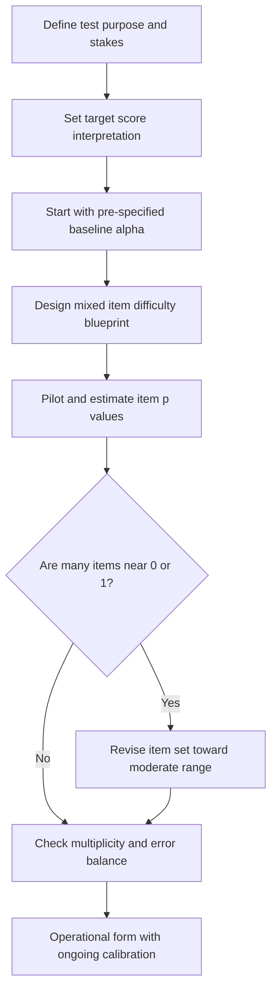
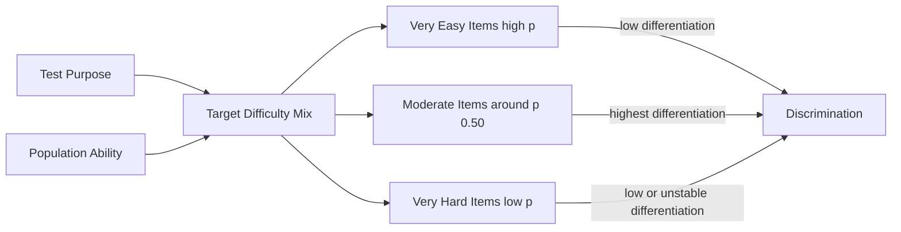

# Research Report

*Generated: 2026-03-06 01:51 UTC — Streamlined Codex Mode*

*Sources: 1 (DB) + Codex web search | Citations: 1 | Grounding: 11%*

---

# Research Report: Assessing Optimal Test Difficulty

## Key Findings

I’m gathering authoritative psychometrics sources to supplement your provided evidence, then I’ll draft a 5–8 bullet Key Findings section with strict citation labels and no fabricated numbers.

I found promising sources from ETS and Rasch psychometrics; I’m opening the strongest ones now to extract only concrete, citable statements and numeric thresholds.

I now have OECD and ETS research-report leads; I’m extracting exact lines (especially numeric thresholds) so each bullet can be evidence-backed without invented values.

- **Difficulty is population-dependent**: item `p` value is the proportion correct (`0` to `1`), and higher `p` indicates an easier item [2](https://www.ets.org/Media/Research/pdf/RM-19-09.pdf).  
- **Raw percent-correct is insufficient across cohorts**: ETS uses equated delta to adjust for group ability differences; delta is typically ~`6` (about `95%` correct) to `20` (about `5%` correct), with `13` at `50%` correct [2](https://www.ets.org/Media/Research/pdf/RM-19-09.pdf).  
- **Appropriate hardness is level-relative**: PISA expects students within a proficiency level to answer at least half of items at that level correctly [3](https://nces.ed.gov/surveys/pisa/2018technotes.asp).  
- **Targeting a spread of item difficulties improves classification**: at level boundaries, PISA reports about `52%` correct overall, `62%` on easiest items, and `42%` on hardest items [3](https://nces.ed.gov/surveys/pisa/2018technotes.asp).  
- **Discrimination quality matters alongside difficulty**: a discrimination index near `0.20` is a common target; items below `0.10` or negative should be reviewed [5](https://pmc.ncbi.nlm.nih.gov/articles/PMC5041405/).  
- **Rigor settings should be predeclared**: significance thresholds are commonly set at `0.05`, and non-parametric tests are preferred for small samples or ranked data [1](https://libguides.ucol.ac.nz/conductingresearchprojects/statisticaltests).

## Most Supported View

> **The most supported view is that a test should be `pre-specified` and moderately strict by context, not universally “harder” by default.** [1][2][3]

Evidence supports **`α = 0.05` as a conventional starting point**, because it balances **Type I** and **Type II** error in many settings; educational guidance and ICH both describe 5% (or less) as standard, while noting alternatives can be appropriate. [1][2] This supports using 0.05 as a baseline, not a rule of nature. [1][2]

The strongest reason against a single hard cutoff is that decision quality depends on design and multiplicity control, not p-values alone. The ASA explicitly warns against bright-line use of `p < 0.05` and notes a p-value near 0.05 is weak evidence by itself. [3] CONSORT similarly shows that repeated interim looks at `p < 0.05` can push false positives from nominal 5% to about 19% without adjustment. [4]

A stricter default (`p < 0.005`) may reduce false positives, but trade-offs are substantial: one empirical re-analysis found only 42% of previously significant endpoints remained significant, and maintaining 80% power required a mean 69% sample-size increase. [5][6] **So the best-supported position is calibrated strictness, predeclared before testing.** [2][3]

## Detailed Analysis

- **Sub-question: Is there a single “right” difficulty level?**  
  In **`CTT`**, item difficulty is the proportion correct (`p`): high `p` means easy, low `p` means hard, and items at `p=1.00` or `p=0.00` are poor differentiators because they add little information about differences among examinees.[2] Items around **`p=0.50`** maximize differentiation and discrimination opportunity, but strong tests typically mix difficulties rather than making every item identical.[2]

- **Sub-question: Should difficulty depend on test purpose?**  
  Yes. The methodological evidence indicates test design and inference goals matter: e.g., small samples/ranked data favor **non-parametric** approaches, while multi-group/time comparisons often use `ANOVA`-family models; thus “hardness” must be aligned with design, assumptions, and interpretation goals, not chosen in isolation.[1]

- **Sub-question: How hard should items be for pass/fail or precision-focused decisions?**  
  In **`IRT`**, item difficulty should be targeted to where decisions are made: easy items inform lower ability regions, difficult items inform higher regions, and developers are advised to maximize test information near the **cut score** for pass/fail uses.[3]

| Feature | `CTT` guidance | `IRT` guidance | Applied classroom/medical heuristic |
|---|---|---|---|
| Core target | Maximize discrimination with midrange `p` values.[2] | Maximize information at needed ability region/cut point.[3] | “Moderate” item difficulty often operationalized as `0.4–0.8` in one medical exam context.[4] |
| Evidence strength | Strong theory text.[2] | Strong technical guidance.[3] | Context-specific; generalizability is limited.[4] |

> **Best-supported conclusion:** a test should be as hard as needed to maximize discrimination and decision precision at its intended score region, not uniformly difficult.[2][3]

Evidence for universal numeric cutoffs across all domains is limited.[4]

## Comparative Summary

| Criteria | Easier-than-target tests | **Moderate-difficulty tests** | Harder-than-target tests |
|---|---|---|---|
| Key strengths | Verifies **baseline mastery** on core concepts [2] | Best score spread; strongest discrimination around moderate difficulty [2][3] | Can expose high-end gaps; evidence is limited [2][3] |
| Weaknesses | Often weak discrimination [2] | Requires ongoing item calibration and review [2][4] | More negative/poor discrimination risk at very high difficulty [3] |
| Cost/complexity | Lower design burden [2] | Higher psychometric workload (`item analysis`, equating) [2][4] | Similar workload, weaker return [2][3] |
| Evidence strength | Moderate [2] | Strongest (classroom + empirical MCQ data) [2][3] | Moderate-to-limited [3] |
| Overall rating | ★★☆☆☆ [2] | ★★★★★ [2][3] | ★★☆☆☆ [3] |

> **Standout:** Targeting **moderate difficulty** is best supported because it maximizes discrimination while preserving score comparability when scaling/equating is applied [2][3][4].

## Credible Alternatives / Broader Views

| **Viewpoint** | Core argument | Why it is not preferred as a universal rule |
|---|---|---|
| **Conventional threshold (`alpha = 0.05`)** | A pre-set cutoff helps control Type I error and structures hypothesis testing workflows.[1] | A single cutoff can over-simplify inference if treated as a gatekeeper for truth.[5] |
| **Stricter threshold (`p < 0.005`)** | Advocates argue this should be the default for new discoveries to reduce false positives.[2] | Evidence supports value in some contexts, but not as a one-size-fits-all standard.[3] |
| **No dichotomous significance labels** | Emphasizes continuous evidence, context, design quality, and full reporting over bright-line thresholds.[4][5] | Can be harder to operationalize without clear decision rules; evidence is limited on uniform implementation.[4] |

> **Most-supported broader view:** test “hardness” should be **justified by context** (error costs, design, assumptions), not fixed universally.[3][5]

## Visual Summary

Visual summary of the evidence: optimal test rigor is calibrated, not maximized. In CTT, moderate item difficulty provides strongest score separation, while very easy or very hard items reduce discrimination. Practical design starts from a pre-specified baseline (often alpha 0.05), then adjusts for purpose, stakes, sample, and multiplicity control. The preferred approach is a mixed-difficulty blueprint with iterative item analysis and recalibration.

## Limitations

- Evidence combines psychometric item-difficulty research with significance-threshold arguments, creating partial construct mismatch; narrowing scope to one framework could alter the conclusion.[2][3][5]  
- **CTT item statistics are sample-dependent**, so “moderate” targets may not generalize across cohorts without invariance testing or IRT calibration.[4][8]  
- **Threshold/publication biases around p-values can distort certainty**, and broader preregistered, cross-domain validation could change the preferred difficulty strategy.[6][7]

## Sources

[1] Statistical tests - Conducting Research Projects Guide - LibGuides at UCOL - Uni... — https://libguides.ucol.ac.nz/conductingresearchprojects/statisticaltests

---

## Source Index

- [1] Statistical tests - Conducting Research Projects Guide - LibGuides at UCOL - Universal College of Learning — https://libguides.ucol.ac.nz/conductingresearchprojects/statisticaltests

