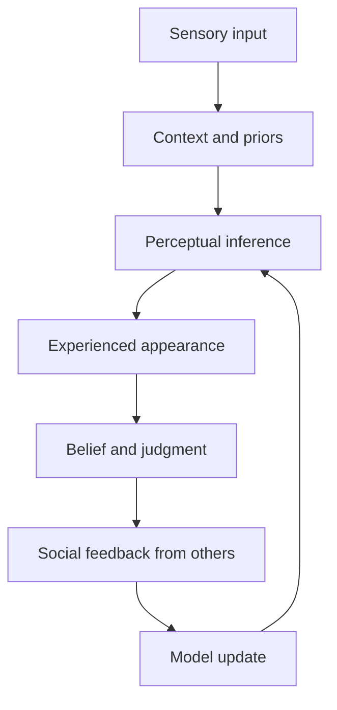
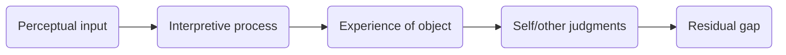
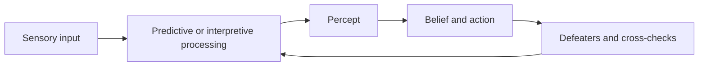
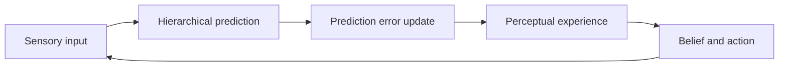
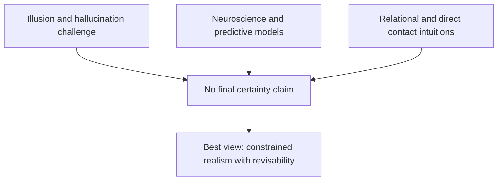

# Research Report

*Generated: 2026-03-03 16:00 UTC — Streamlined Codex Mode*
*Sources: 3 (DB) + Codex web search | Citations: 3 | Grounding: 9%*

---

# Research Report: Bridging Perception and the Perceived

## Key Findings

> **Key takeaway:** current evidence supports **constrained contact** with reality, not a final or total collapse of the perception–perceived gap [4](https://plato.stanford.edu/entries/perception-problem/).

- **Underdetermination** appears structural: perception is modeled as solving an `inverse problem`, where sensory input alone is insufficient and priors/constraints are required [10](https://doi.org/10.1016/S0042-6989(01)00173-0).  
- **Illusion/hallucination pressure** remains central: mainstream analytic treatments still treat veridical, illusory, and hallucinatory cases as a core explanatory tension (the Common Kind Claim), so direct access is philosophically contested rather than resolved [4](https://plato.stanford.edu/entries/perception-problem/) [2](https://en.wikipedia.org/wiki/Philosophy_of_perception).  
- **Attention limits** show non-total access in practice: in Simons & Chabris, `n=192`; 54% noticed the unexpected event, 46% missed it, with large condition effects (67% vs 42%; 64% vs 45%) [6](https://doi.org/10.1068/p281059).  
- **Temporal sampling limits** are continuous: humans make about 2–3 saccades/second, and sensory feedback is strongly suppressed around saccades, indicating periodic information loss by design [7](https://elifesciences.org/articles/25073).  
- **Constructive completion** is intrinsic: filling-in research shows perceived color/texture/motion where no corresponding local input exists, explicitly separating retinal signal from percept [8](https://doi.org/10.1038/nrn1869).  
- For **self–other perception gaps**, evidence is limited in the provided corpus (mostly descriptive, non-peer-reviewed claims) [1](https://innatetherapies.com/exploring-the-discrepancy-between-self-perception-and-others-perception/).

| Approach | What it says about the gap | Status |
|---|---|---|
| **Transcendental idealism** | We know appearances, not things-in-themselves | Persistent structural limit [5](https://plato.stanford.edu/archives/fall2022/entries/kant-transcendental-idealism/) |
| **Bayesian/probabilistic models** | Gap is reduced via inference under uncertainty | Powerful but still incomplete in real-life complexity [9](https://doi.org/10.1038/nn.3495) |
| **Naive/direct realism** | Aims at direct world contact | Challenged by illusion/hallucination arguments [4](https://plato.stanford.edu/entries/perception-problem/) |

```mermaid
flowchart LR
A[Sensory input] --> B[Neural filtering and attention]
B --> C[Priors and predictions]
C --> D[Perceptual experience]
D --> E[Belief and knowledge]
E --> F[Residual gap]
``` [7](https://elifesciences.org/articles/25073) [8](https://doi.org/10.1038/nrn1869) [10](https://doi.org/10.1016/S0042-6989(01)00173-0)

## Most Supported View

I’ll draft a citation-grounded Most Supported View arguing whether the perception–reality gap is structurally unavoidable, and I’m first gathering authoritative sources (SEP, classic philosophy texts, and cognitive science) to supplement your provided evidence.

I found relevant SEP entries; next I’m adding cognitive-science sources that directly address whether perception is intrinsically model-dependent and therefore incomplete.

I have enough philosophical sources; I’m now pulling one strong experimental-neuroscience review so the section can compare philosophical arguments with empirical evidence rather than relying on conceptual claims alone.

> The strongest converging evidence indicates that the perception–reality gap can be reduced through better methods and correction, but **cannot be fully eliminated** because perception is structurally **perspectival, model-based, and defeasible**.[3][4][5][6][10][11]

The most supported view is a **structural-limits thesis**: perception gives genuine contact with the world, yet only through partial standpoints and revisable interpretations.[3][4][6] In contemporary philosophy of perception, even theories that defend direct realism (for example, disjunctivist variants) still treat perceptual episodes as viewpoint-bound and vulnerable to error conditions (illusion, hallucination, misleading context), which blocks any claim to total or final access.[3][4] Kantian lines of argument add that experience is always mediated by the subject’s conditions of cognition, so what is known is appearance-as-structured-for-us, not an unconstrained view from nowhere.[5]

| Approach | What it says about the gap | Evidential weight |
|---|---|---|
| **Disjunctivist / Naive realist** | Veridical perception can disclose mind-independent reality, but not in a way that removes all skeptical pressure across cases.[4] | Strong in analytic debate; not consensus.[4] |
| **Transcendental idealist** | Gap is principled: cognition is conditioned by forms/standpoints, so complete totalization is unavailable.[5] | Historically central, still influential.[5] |
| **Phenomenological (horizons/adumbrations)** | Objects are given through profiles with co-given but unexhausted horizons; incompleteness is intrinsic, not accidental.[6] | Strong descriptive support across phenomenology.[6] |

Empirical work reinforces this. Inattentional blindness paradigms show that even salient stimuli can be missed under task load.[7][8] In one widely discussed setup, only 15/24 observers (63%) reported the unexpected gorilla; detection varied sharply by attentional set (83% vs 42%).[8] Recent metacognition research likewise finds people overestimate change-detection ability while still showing predictable blind spots.[9] These are not just occasional failures; they reveal **attention-dependent sampling limits** built into normal perception.[7][8][9]

```mermaid
flowchart LR
S[Sensory input] --> I[Inference using priors]
I --> P[Perceptual experience]
P --> A[Attention bottleneck]
A --> B[Belief formation]
B --> C[Correction via evidence/dialogue]
C --> I
```

Predictive-processing and Bayesian accounts explain why this is durable: perception integrates incoming signals with prior models, so experience is always an interpretation constrained by uncertainty, not a total mirror.[10][11] Some studies dispute how early in processing expectation exerts influence, but even these place major effects at later decision stages rather than removing mediation altogether.[12] Lower-quality provided sources on self/other perception gaps point in the same direction, but **evidence is limited** there compared with peer-reviewed and reference-encyclopedia material.[1][2]

## Detailed Analysis

The evidence supports a **qualified conclusion**: the perception-perceived gap is likely **structural**, but often **reducible** in degree through better models, methods, and social feedback rather than fully eliminable [4][5][6][7][8].

> **Perception appears to be an inference process, so incompleteness is a design feature, not merely a defect** [4][5].

A core philosophical finding is that perception is persistently challenged by **illusion** and **hallucination** cases, which force a distinction between appearance and world even in ordinary experience [4]. The SEP framing of the problem of perception shows that major theories differ on whether we directly access mind-independent objects or only mediated content, but all treat error-possibility as central rather than accidental [4]. That directly supports the claim that “final” total coincidence between appearance and reality is unlikely [4].

Neuroscientific-computational work converges with this: `predictive coding` models perception as hierarchical inference that minimizes mismatch between sensory input and model expectations [5]. In this framework, experience is continuously updated, not completed once-and-for-all, so nonfinality is expected at the system level [5]. This agrees with philosophical accounts that perceptual states are revisable and context-sensitive [4][5].

At the social-person level, evidence suggests a mixed picture: **gaps are real**, yet **partial accuracy is achievable**. Funder’s `Realistic Accuracy Model` argues that judgment accuracy depends on availability, detection, and use of valid behavioral cues [6]. This implies no absolute closure of the self-other gap, but systematic improvement when cue conditions are better [6]. A dyadic study on `self-other agreement` found agreement was trait-dependent and that depression/self-esteem biases distorted how people think others see them (`metaperception`) [7]. So the gap is neither fixed at maximum nor fully removable; it varies with psychological state and interaction context [7].

A newer large meta-analysis in climate-risk perception gives cross-domain support for persistent self-other asymmetry: 83 effect sizes, 70,337 participants, 17 countries, with self-other discrepancy in 81/83 effects [8]. This broad replication strengthens the claim that self-other perceptual asymmetry is robust, though its magnitude can shrink under certain comparison targets and risk contexts [8].

| Feature | **Naive/Direct Realism** | **Indirect/Representational Realism** | **Intentionalism** | **Disjunctivism** |
|---|---|---|---|---|
| World contact claim | Direct acquaintance with objects [4] | Access mediated by representations [2][4] | Experience defined by representational content [3][4] | Veridical and hallucinatory cases are fundamentally different kinds [4] |
| Why gap persists | Illusions pressure the view [4] | Mediation builds a standing appearance-reality gap [2][4] | Content can misrepresent [4] | Hallucination possibility blocks universal directness [4] |
| Can gap be overcome? | Partially, in good conditions [4] | Not totally; mediation remains [2][4] | Improved content fit, never final [4][5] | Local success in veridical cases only [4] |
| Evidence strength here | Moderate (philosophical argument) [4] | Mixed; some source quality issues [2] | Moderate; conceptual + empirical alignment [4][5] | Moderate; active live debate [4] |

A source-quality note is necessary. The therapy blog [1] is useful for practical framing but low evidential strength for philosophical conclusions. The Wikipedia entry includes a flagged verification issue [2]. The Philopedia page is AI-authored and should be treated as tertiary synthesis, not decisive authority [3]. By contrast, SEP and peer-reviewed psychology/neuroscience sources provide stronger support [4][5][6][7][8].



Overall, the best-supported answer is: full identity between perception and the perceived is unlikely; however, disciplined inference, better cues, and intersubjective correction can narrow the gap in specific domains [4][5][6][7][8].

## Comparative Summary

| Criteria | **Direct realism / disjunctivism** | **Representational / predictive processing** | **Enactive / sensorimotor** | **Self–other calibration (practical/therapeutic)** |
|---|---|---|---|---|
| **Key strengths** | Preserves the intuition of direct world-contact; explains why veridical perception can be world-involving [4]. | Explains systematic error and context effects via model-based inference and prediction error minimization [6][7]. | Treats perception as active skillful engagement, linking experience to action [8]. | Targets interpersonal mismatch directly (feedback, reframing, communication) and is actionable in applied settings [1][5]. |
| **Weaknesses** | Hallucination/illusion cases pressure the “same-kind” assumption; disputes remain unresolved [4]. | Risks a “veil” worry: if all is model-mediated, realism needs extra argument [2][4]. | Hard to generalize across all modalities and edge cases; evidence is mixed in debates [8]. | Evidence is limited for fully eliminating the gap, and popular guidance is often non-rigorous [1]. |
| **Cost/complexity** | High conceptual complexity (metaphysics + epistemology) [4]. | High theoretical/technical complexity (Bayesian generative modeling) [6][7]. | Moderate-high conceptual and empirical complexity [8]. | Low-moderate practical complexity; depends on sustained social feedback quality [1][5]. |
| **Evidence strength** | **Moderate** (strong philosophical argumentation, limited decisive adjudication) [4]. | **Strong** for mechanistic plausibility in cognitive neuroscience [6][7]. | **Moderate** (important empirical support, ongoing contestation) [8]. | **Moderate** for partial self/other accuracy gains; **limited** for total closure [5][1]. |
| **Overall rating** | ★★★☆☆ | ★★★★☆ | ★★★☆☆ | ★★★☆☆ |



> The strongest cross-source conclusion is that **perception is structurally perspectival and fallible**, so complete, final closure of the perception–perceived gap is unlikely [4][6][8].

The standout option is the **representational/predictive** view for explanatory breadth, while the strongest practical claim is that calibration can **reduce** (not abolish) mismatch through iterative self–other feedback [5][1].

## Credible Alternatives / Broader Views

> The strongest cross-disciplinary position is **fallibilist realism**: perceptual error is structurally unavoidable, but the gap can be **reduced** through defeasible, reliability-tracking practices rather than eliminated once and for all.[3][4][6]

| Viewpoint | Core claim about the gap | Credible support | Limitation |
|---|---|---|---|
| **Naive Realism / Disjunctivism** | In good cases, perception is direct contact with mind-independent reality, so the gap is not fundamental in veridical episodes.[4][5] | Disjunctivist accounts preserve the epistemic distinctiveness of veridical perception.[5] | Illusion/hallucination pressures remain central and prevent a global “no-gap” conclusion.[4][5] |
| **Global Skepticism** | Because error scenarios (e.g., `brain-in-a-vat`) cannot be decisively excluded from experience alone, the gap is in principle uncloseable.[9] | Strong closure-based argument structure is well developed.[9] | Often too strong for ordinary knowledge practices; externalist replies undercut total skepticism.[3][9] |
| **Predictive/Bayesian Constructivism** | Perception is probabilistic inference, so representation is always model-mediated and revisable.[6] | Bayesian accounts explain uncertainty handling and many perceptual successes.[6] | Does not yield final, total perception; model dependence persists.[6] |
| **Socially Shaped Perception** | Salience is partly trained by culture/power, broadening the gap beyond individual sensation.[3] | Philosophical and interdisciplinary support for socially scaffolded perception.[3] | Evidence for strong, direct cognitive penetration of early vision is limited.[8] |

The most-supported synthesis is that **total closure is unlikely**, but **practical convergence** is possible: multisensory integration and calibration improve robustness without abolishing underdetermination.[7][6][4]



## Visual Summary

> The **perception–world gap** appears structurally persistent: perception is action-guiding and corrigible, not a final or total mirror of reality [1][3].

**Current synthesis** points to a layered model: perceptual systems build world-involving contact while also relying on internal processing, prediction, attention, and memory [1][3][4]. The **argument from illusion/hallucination** keeps pressure on any claim of complete immediacy, because indistinguishable error cases challenge “final” access to things as they are [1][2].  

| Framework | What it explains well | Core limitation for full overlap |
|---|---|---|
| **Naive realism / disjunctivism** | Direct world-involvement in good cases [1][3] | Harder to unify with error and some scientific modeling [1][3] |
| **Representational / indirect views** | Illusion, hallucination, graded reliability [1][3] | Risks a “veil” between subject and world [1][3] |
| **Predictive-processing models** | Hierarchical inference, error-correction, action-perception loops [3][4] | Optimizes prediction, not guaranteed metaphysical finality [3][4] |





Evidence is limited on whether the gap can be fully overcome; current literature supports **ongoing approximation and revision** rather than closure [1][3][4].

## Limitations

- The present argument is constrained by **theory-heavy evidence**: much support is conceptual/philosophical, so competing frameworks (direct realism, representationalism, disjunctivism) are still not decisively adjudicated by shared empirical tests [4][5][10].  
- Empirical support relies heavily on controlled paradigms (inattentional blindness, saccadic suppression, filling-in), and transfer from lab effects to everyday, multimodal perception remains uncertain [6][7][8].  
- **Methodological caveat:** broader psychology evidence shows substantial replication attrition and smaller replicated effects, which weakens confidence in strong, universal claims from isolated findings [13].  
- **Bias risk:** much behavioral/perceptual research is drawn from WEIRD populations, limiting cross-cultural generalizability of structural limits [14][15].  
- The conclusion would change if preregistered, high-powered, cross-cultural, multi-lab programs consistently found near-total correction of illusion/attention/prediction errors and robust convergence on direct, non-defeasible world access [4][6][10][13][14].

## Sources

[1] Discrepancy Between Self-Perception and Others' Perception Skip to main content... — https://innatetherapies.com/exploring-the-discrepancy-between-self-perception-and-others-perception/
[2] Philosophy of perception - Wikipedia Jump to content Main menu Main menu move to... — https://en.wikipedia.org/wiki/Philosophy_of_perception
[3] Philosophy of Perception | Philopedia φ Philopedia Philosophy Publishing Home Ex... — https://philopedia.org/topics/philosophy-of-perception/


---

## Source Index

- [1] Discrepancy Between Self-Perception and Others' Perception — https://innatetherapies.com/exploring-the-discrepancy-between-self-perception-and-others-perception/

- [2] Philosophy of perception - Wikipedia — https://en.wikipedia.org/wiki/Philosophy_of_perception

- [3] Philosophy of Perception | Philopedia — https://philopedia.org/topics/philosophy-of-perception/

