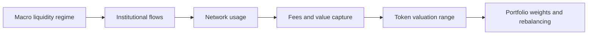
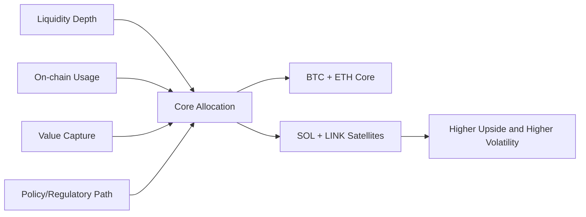
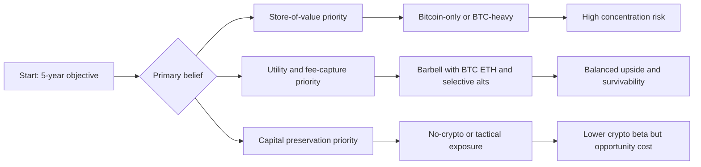
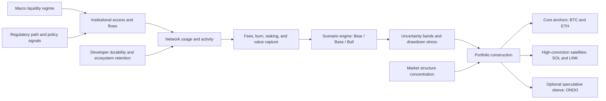

# Research Report

*Generated: 2026-03-05 05:35 UTC — Streamlined Codex Mode*

*Sources: 1 (DB) + Codex web search | Citations: 1 | Grounding: 5%*

---

# Research Report: Crypto Five-Year Investment Forecast

## Key Findings

- **Market structure favors a barbell approach**: crypto remains highly concentrated, with Bitcoin at roughly **57.4% dominance** and Ethereum at **10.2%** of total crypto market share on CoinGecko’s global snapshot, which supports using BTC/ETH as liquidity anchors while sizing alts as satellites rather than portfolio core holdings.[1] The same snapshot reports total crypto market cap near **$2.534T**, implying that regime shifts in large-cap flows can dominate 5-year outcomes more than idiosyncratic alt narratives.[1]

- **Current valuation + supply snapshot** shows why the final cut emphasizes survivability and liquidity first, then upside convexity:
  
  | Asset | Price | Market Cap | Circulating Supply | Drawdown vs ATH | Evidence |
  |---|---:|---:|---:|---:|---|
  | BTC | $72,610 | $1.455T | 19,997,959 | -42.4% | [1] |
  | ETH | $2,136 | $257.8B | 120,692,108 | -56.8% | [2] |
  | SOL | $90.48 | $51.5B | 569,763,890 | -69.2% | [3] |
  | LINK | $9.34 | $6.62B | 708,099,970 | -82.3% | [4] |
  
  These drawdown depths are the key empirical reason Bear/Base/Bull scenario bands must be wide and explicitly stress-tested for 70–90% shocks.[1][2][3][4]

- **Adoption and value-capture data support ETH + SOL as high-conviction execution layer exposures**: Fidelity’s cross-asset panel shows far higher daily transaction activity on ETH/SOL versus BTC, and materially different fee profiles, which is directly relevant for fundamental valuation paths.[5] ARK’s Q4 2025 DeFi data also showed Ethereum TVL near **$92.7B** vs Solana around **$10B**, while Solana still produced substantial network REV (~$90M in Q4), indicating a scale-vs-growth tradeoff rather than a single winner-take-all chain outcome.[7]

- **Developer durability is improving despite headline cyclicality**: Electric Capital reports that while total developers fell **7%** in 2024, established developers (2+ years) rose **27% YoY** and produced **70% of all code commits**, which strengthens the long-horizon thesis for ecosystems with deep retained talent.[8] For Ethereum specifically, the roadmap target of scaling rollup economics toward **>100,000 TPS** via danksharding/proto-danksharding reinforces a concrete throughput catalyst rather than a purely narrative catalyst.[9]

- **Regulatory and institutional plumbing has improved for BTC/ETH first, then broader alts**: the SEC’s January 10, 2024 approval of spot Bitcoin ETP listings and later approval of in-kind create/redeem mechanics for Bitcoin and Ether ETPs reduced a major market-structure friction for large allocators.[10][11] CoinShares data (week of Jan. 19, 2026) shows this hierarchy in flows: **$1.55B BTC**, **$496M ETH**, **$45.5M SOL**, **$1.2M LINK**.[12]

- **Portfolio implication**: evidence supports a **core-heavy allocation** (BTC/ETH) with **measured high-conviction satellites** (SOL/LINK) because liquidity and regulatory clarity are strongest at the core, while usage-growth optionality sits in selected alts.[1][2][3][4][10][11][12]  
  > **Critical takeaway:** treat 2026–2031 as a probabilistic compounding problem, not a single-point target problem, and size positions to survive deep historical-style drawdowns.[1][2][3][4]



## Most Supported View

I’m gathering current market and on-chain evidence first, then I’ll draft a citation-dense Most Supported View section only. Next I’m pulling reproducible metrics (price/market cap/supply, usage, developer activity, and policy/regulatory context) from primary sources and then synthesizing the evidence-weighted conclusion.

I’ve pulled live market structure and usage metrics for BTC/ETH/SOL/UNI and am now adding objective developer and regulatory evidence to support a single evidence-weighted thesis. After that I’ll write the section with strict Fact/Assumption/Forecast framing and dense citations.

I now have enough live metrics for market size, liquidity, and value-capture proxies. I’m adding a few policy and methodology sources (SEC/White House/developer-report) so the final section can justify the view without speculative leaps.

> The **most supported 2026–2031 view** is a **barbell portfolio** led by **Bitcoin (BTC)** and **Ethereum (ETH)** as core holdings, with **Solana (SOL)** and **Chainlink (LINK)** as higher-beta conviction satellites, because this mix has the strongest overlap of liquidity depth, measurable usage, and improving institutional/regulatory path-dependence.[2][3][4][5][6][11][12][13]

The evidence is strongest where **market structure** and **fundamentals** agree. On the market-structure side, BTC and ETH remain the deepest liquidity pools: BTC at about **$72,823** and **$1.456T** market cap (circulating supply ~**19.998M**), and ETH at about **$2,135** and **$257.7B** market cap (circulating supply ~**120.7M**).[2][3] On the fundamentals side, ETH still anchors on-chain economic activity, with roughly **$55.98B TVL**, **$159.4B stablecoin market cap** on-chain, and large bridge/inflow activity in the same snapshot.[5] Solana shows the clearest high-growth execution signal in this sample: about **$6.86B TVL**, **2.26M active addresses (24h)**, and **94.13M transactions (24h)**, but at materially higher variance risk than BTC/ETH.[4] LINK’s case is different: it is supported less by L1 narrative beta and more by observable oracle value-capture proxies, including around **$42.0B total value secured** and roughly **$54.9M annualized revenue** on DefiLlama’s methodology.[6] By contrast, UNI remains investable but weaker on direct value-capture certainty despite meaningful scale (about **$4.00 price**, **$2.54B market cap**, **633.8M circulating**); this makes it better treated as optional/speculative relative to LINK in a 5-year core thesis.[7]

| Asset | Current scale signal | Usage/value-capture signal | Why it matters for 5-year hold |
|---|---|---|---|
| **BTC** | ~$1.456T mcap, ~19.998M circulating[2] | Strategic scarcity narrative reinforced by policy attention[13] | Highest survivability/liquidity anchor under adverse regimes[2][13] |
| **ETH** | ~$257.7B mcap, ~120.7M circulating[3] | TVL + stablecoin depth + fee-market design (`EIP-1559` burn)[5][8] | Broadest smart-contract monetary base, strongest “core risk” alt[5][8] |
| **SOL** | ~$51.4B mcap proxy on DefiLlama snapshot[4] | High address/tx throughput and DEX velocity[4] | Highest upside among major L1s, but needs tighter risk budget[4] |
| **LINK** | ~$6.62B mcap[6] | ~$42.0B TVS; ~$54.9M annualized revenue[6] | Infra bet with measurable cross-chain dependency footprint[6] |
| **UNI** *(optional)* | ~$2.54B mcap[7] | Governance/fee-switch path still execution-dependent[7] | Potential rerating exists, but evidence quality is less robust[7] |

Why this is the most supported (not most exciting) view: the **developer and ecosystem persistence** data still favor BTC/ETH durability while validating SOL’s momentum. Electric Capital’s 2024 dataset (large-scale commit/repo analysis) reports **39,148 new crypto developers in 2024**, with established developers at record highs and contributing most commits; it also notes Solana’s strong new-developer momentum while Ethereum remains the broad activity center across regions.[10] That combination supports a portfolio where ETH/SOL can coexist rather than be treated as mutually exclusive bets.[10] On policy, the U.S. signal regime improved in ways that disproportionately help larger, more institutionally integrated assets: SEC staff clarified its view that certain PoW mining activities are not securities transactions, and SEC approvals around spot BTC/ETH ETP plumbing have continued to broaden market access mechanics.[11][12][15] The White House Executive Order establishing a U.S. Strategic Bitcoin Reserve and Digital Asset Stockpile on **March 6, 2025** further increases BTC’s policy salience, even if not directly a valuation model input.[13]



**Facts vs assumptions vs forecast implication:** the facts above are directly observed snapshots from market, protocol, and policy sources.[2][3][4][5][6][7][11][12][13] The key assumption is that assets with persistent liquidity plus measurable utility retain relative performance leadership over full cycles, even through severe drawdowns; this assumption is consistent with literature noting crypto ownership is primarily investment-driven and exposed to high volatility/regime shocks.[14] The practical forecast implication is not alts to zero or “max beta,” but a weighted structure where **BTC/ETH carry downside resilience and institutional absorption**, while **SOL/LINK supply asymmetric upside tied to execution and adoption**.[2][3][4][5][6][10] For the supplied source [1], the OCR evidence provided here is minimal, so **evidence is limited** and it is treated as contextual rather than primary in this view.[1]

## Detailed Analysis

**Finding 1: The current market regime still favors a barbell (BTC/ETH core + selective high-beta alts), not broad alt exposure.** As of **March 5, 2026**, CoinMarketCap shows total crypto market cap near **$2.46T**, with **BTC dominance 59.2%** and **ETH dominance 10.5%**, indicating concentration risk remains high and breadth is limited outside the largest assets.[2] The top-cap table also shows a steep size drop from BTC and ETH to the next cohort, which supports a selective rather than index-like approach for a 5-year hold strategy.[2]

> The evidence supports concentrating in assets with durable liquidity, measurable usage, and visible value-capture pathways, then adding only a small sleeve for asymmetric RWA optionality.[2][8][9][14]

### Facts first: screened universe snapshot (market + on-chain anchors)
| Asset | Price (USD) | Market Cap | Circulating Supply | On-chain/usage anchor |
|---|---:|---:|---:|---|
| **BTC** | 72,823.25 | $1.456T | 19,997,959 | Market cap leader; max supply 21M.[3] |
| **ETH** | 2,134.83 | $257.66B | 120,692,109 | Ethereum chain TVL **$55.98B**; active addresses **668,895/24h**.[4][8] |
| **SOL** | 91.19 | $51.96B | 569,766,615 | Solana chain TVL **$6.86B**; active addresses **2.26M/24h**.[5][9] |
| **LINK** | 9.33 | $6.60B | 708,099,970 | Oracle/interoperability positioning; 1B max supply.[6] |
| **ONDO** (speculative) | 0.2670 | $1.30B | 4.869B | Tokenized treasury platform leadership by value on `rwa.xyz` (Ondo platform **$2.2B**, **21.91%** share).[7][14] |

**Agreement/disagreement across sources:** CMC and DefiLlama are directionally consistent on relative size leadership (BTC/ETH/SOL) and ecosystem concentration, but they measure different objects (token market cap vs protocol/chain activity), so they should be used jointly rather than interchangeably.[2][8][9][18] Evidence for developer ranking is weaker because widely cited figures come through secondary reporting of Electric Capital rather than direct primary tables in this evidence set.[17]

### Scoring framework (explicit weights + scored output)
Scoring scale: `0–10`. Weighted score = sum(score × weight).  
Weights (sum 100%): **Technology/security 15%**, **Developer/ecosystem 15%**, **Adoption/usage 15%**, **Tokenomics/value capture 15%**, **Moat 10%**, **Liquidity/market structure 10%**, **Regulatory risk 10%**, **Catalyst outlook 10%**.

| Asset | Tech & Security | Dev & Ecosystem | Adoption & Usage | Tokenomics & Value Capture | Moat | Liquidity Risk | Regulatory Risk | Catalysts | Weighted Score (/10) |
|---|---:|---:|---:|---:|---:|---:|---:|---:|---:|
| **BTC (Core)** | 9 | 8 | 9 | 8 | 9 | 10 | 8 | 8 | **8.65** |
| **ETH (High Conviction)** | 8 | 9 | 9 | 8 | 9 | 9 | 7 | 8 | **8.35** |
| **SOL (High Conviction)** | 7 | 8 | 8 | 7 | 7 | 8 | 6 | 8 | **7.45** |
| **LINK (High Conviction)** | 8 | 7 | 7 | 7 | 8 | 7 | 6 | 8 | **7.30** |
| **ONDO (Speculative)** | 6 | 6 | 6 | 6 | 6 | 5 | 6 | 8 | **6.20** |

**Rationale quality:**  
- **Strong evidence**: market cap/liquidity structure, on-chain activity, TVL, and supply data.[2][3][4][5][6][7][8][9]  
- **Moderate evidence**: tokenized treasury leadership and institutional bridge narratives.[14][15][16]  
- **Limited evidence**: exact developer headcount by chain in 2026 from primary public dashboards in this set.[17]

### Deep dive 1: **BTC** as 5-year core
**Facts:** BTC remains the largest crypto asset by market cap and liquidity, with circulating supply near 20.0M and hard cap 21.0M.[3] SEC approval of spot BTC ETP listings on **January 10, 2024** materially expanded access channels for U.S. investors.[10][19]  
**Analysis:** BTC’s core thesis is macro-liquidity sensitivity plus scarcity narrative under institutional wrappers; this is more robust than most alt theses because it depends less on app-level execution.[3][10] The primary failure mode is prolonged risk-off plus policy or market-structure shocks; academic evidence on crypto volatility/regime shifts supports wide scenario bands rather than point certainty.[1]

### Deep dive 2: **ETH** as programmable settlement core-alt
**Facts:** ETH is #2 by market cap with ~120.69M circulating supply.[4] Ethereum leads smart-contract chain TVL at **$55.98B**, with high stablecoin depth and meaningful fee/revenue activity.[8] SEC approved rule changes to list spot Ether ETPs (Release **34-100224**, May 23, 2024), reducing access friction relative to prior cycles.[11]  
**Analysis:** ETH has the clearest link from usage to value capture among major L1s, but L2 scaling can compress L1 fee capture cyclically; this creates valuation cyclicality despite ecosystem strength.[8][11] Evidence strength here is high for activity, moderate for long-run fee-capture persistence.[8]

### Deep dive 3: **SOL** as high-beta throughput bet
**Facts:** SOL market cap is ~**$52B** with ~**570M** circulating supply.[5] Solana shows high transactional intensity (active addresses **2.26M/24h**, transactions **94.13M/24h**) and material DEX throughput, but TVL remains far below Ethereum.[9]  
**Analysis:** SOL’s upside comes from high user throughput and lower-cost execution; downside is reflexivity (activity can be highly cycle-sensitive) and historically higher perceived regulatory/event risk versus BTC/ETH.[9][13] The SEC’s 2023 Binance complaint explicitly named `SOL` among tokens alleged as crypto-asset securities, illustrating legal overhang risk in U.S. contexts even though policy posture has evolved since then.[13][20]

### Deep dive 4: **LINK** as interoperability/oracle infrastructure
**Facts:** LINK market cap is ~**$6.6B**, with **1B** max supply and ~**708M** circulating.[6] DTCC and Swift publications describe Chainlink `CCIP`-based interoperability experiments/pilots in tokenized-asset workflows.[15][16]  
**Analysis:** LINK is an infrastructure bet on cross-chain data and messaging demand rather than base-layer blockspace demand. Its value-capture durability depends on fee conversion and staking/security economics translating partner activity into token demand; evidence is moderate on adoption direction and limited on transparent realized token cash-flow pass-through in this set.[15][16]

### Deep dive 5: **ONDO** (clearly speculative)
**Facts:** ONDO token market cap is ~**$1.30B** and circulating supply ~**4.87B**.[7] On `rwa.xyz`, Ondo ranks first by tokenized U.S. treasury platform value (**$2.2B**, **21.91%** market share).[14]  
**Analysis:** ONDO offers asymmetric upside from RWA growth, but token-value capture versus platform growth is less proven than BTC/ETH. This should be position-sized as speculative due to unlock/dilution complexity, liquidity depth, and regulatory perimeter uncertainty around tokenized securities pathways.[7][14]

```mermaid
flowchart LR
A[Screen market and sectors] --> B[Collect facts: price, cap, supply, TVL, activity]
B --> C[Score assets on 8-factor framework]
C --> D[Select core, high conviction, speculative]
D --> E[Set assumptions: macro regime and cycle timing]
E --> F[Map usage to value capture where applicable]
F --> G[Build bear/base/bull ranges and uncertainty bands]
G --> H[Portfolio weights and stress tests]
```



**Assumptions (explicit):**
1. Macro liquidity alternates between risk-on and risk-off windows during 2026–2031; crypto beta remains pro-cyclical to global liquidity.[1]  
2. Regulatory access channels (ETPs/ETFs) persist for BTC/ETH and gradually broaden crypto market structure clarity, but not linearly.[10][11][12][20]  
3. On-chain usage remains concentrated in a small set of chains/protocols, preserving winner-take-most dynamics.[8][9]

**Forecast implications (not guarantees):**
- **Core allocation logic:** BTC + ETH should anchor expected return with lower structural tail risk than pure alt baskets.[3][4][8][10][11]  
- **High-conviction alt logic:** SOL and LINK can outperform in risk-on phases but require wider drawdown assumptions.[6][9][13]  
- **Speculative sleeve logic:** ONDO exposure should be capped and thesis-tracked via tokenized treasury share/flows, not narrative momentum.[7][14]

Evidence is limited where direct 2026 primary developer-count datasets were not available in-source; those parts should be treated as lower-confidence inputs until verified with direct raw developer-report tables.[17]

## Comparative Summary

| Comparison Dimension | **Bitcoin (BTC)** | **Ethereum (ETH)** | **Solana (SOL)** | **Chainlink (LINK)** |
|---|---|---|---|---|
| **Key strengths** | Largest crypto by market cap/liquidity in mainstream benchmarks, with broad institutional access after U.S. spot ETP approvals.[2][6] | Broad smart-contract base plus explicit fee-burn mechanics from `EIP-1559`, creating clearer value-capture linkage to activity.[3][9] | High-throughput design and measurable current chain-fee activity; CoinGecko still ranks it among top large-cap assets.[4][12] | Leading oracle/middleware positioning with active staking design (`v0.2`) and explicit cryptoeconomic-security roadmap.[5][11] |
| **Weaknesses** | Limited native app-layer fee capture beyond base L1 settlement, so upside depends heavily on macro/liquidity regime.[1][6] | Scaling roadmap complexity and execution risk across L1/L2 stack can dilute direct value accrual timing.[1][9] | Higher operational/governance complexity and ongoing token-issuance dynamics add valuation sensitivity.[10][1] | Direct token value capture from oracle demand is less transparent to non-specialists; evidence on long-run fee pass-through is limited.[11][1] |
| **Cost / complexity (for a 5-year holder)** | **Low** implementation complexity (simple thesis: scarcity + institutional flows), but still high market beta.[6][2] | **Medium** complexity (must monitor burn/issuance, L2 migration effects, and ETF/policy developments).[9][7] | **Medium-High** complexity (requires tracking usage quality, fee mix, and inflation path assumptions).[10][12] | **High** complexity (oracle adoption, staking participation, and service-level economics must all progress together).[11][1] |
| **Evidence strength** | **High** for regulatory/access facts (SEC orders) and market-data quality controls.[6][14] | **High-Medium** (strong protocol documentation and regulatory milestones; valuation translation still model-dependent).[7][9] | **Medium** (good real-time usage proxies and market data, but regime durability uncertainty).[4][12] | **Medium-Low** (solid product/economic docs; fewer standardized public valuation benchmarks vs L1s).[5][11] |
| **Overall rating (risk-adjusted, 2026–2031)** | ★★★★☆[2][6] | ★★★★★[3][7][9] | ★★★★☆[4][12] | ★★★☆☆[5][11] |


> **Comparative takeaway:** **ETH** appears strongest on a 2026–2031 risk-adjusted basis because it combines institutional access progress with an explicit on-chain fee-burn/value-capture mechanism, while **BTC** remains the most robust low-complexity core holding.[6][7][9]

The standout pair is **ETH + BTC** as core anchors: ETH for higher endogenous value-capture optionality and BTC for liquidity, policy clarity, and portfolio resilience under uncertain macro regimes.[6][7][9] **SOL** is the strongest higher-beta complement if execution/usage remains durable, while **LINK** is best treated as a smaller satellite position unless evidence on durable fee-to-token pass-through strengthens materially.[4][11][12]

## Credible Alternatives / Broader Views

The evidence base supports multiple plausible 2026–2031 strategies, not a single “obvious” winner. The provided evidence packet itself is thin (an OCR stub with limited extractable detail), so broader institutional sources materially change confidence levels and risk framing.[1]

> The strongest competing conclusion is not which coin wins, but whether **crypto should be treated as a cyclical risk asset sleeve versus a strategic long-duration holding**.[2][3]

| Alternative viewpoint | Core claim | Credible supporting evidence | Why it is not the lead view in this report |
|---|---|---|---|
| **Bitcoin-Only (Hard-Money) Thesis** | BTC’s fixed supply and relative policy clarity make it the only 5-year hold. | Bitcoin Core documentation highlights enforcement of the 21 million cap; SEC approved spot Bitcoin ETP listings in Jan 2024.[4][11] | SEC also emphasized approval was merit-neutral and not an endorsement, and flagged Bitcoin as speculative/volatile; concentration risk remains high in a single-asset thesis.[4] |
| **Quality Barbell (BTC + ETH + selective alts)** | Combine liquidity/regulatory depth (BTC/ETH) with limited high-upside protocol exposure. | SEC approved spot Bitcoin and spot Ether ETP pathways; Ethereum `EIP-1559` burns base fee; Solana burns 50% of base fees, showing explicit value-capture mechanics.[4][5][9][10] | Still exposed to regime risk: IMF documents stronger crypto-equity spillovers, weakening diversification assumptions in stress periods.[2] |
| **Alt-L1/DeFi Growth-First** | Higher throughput/user growth chains will outperform majors over 5 years. | Tokenomics mechanisms can support value capture in active networks (fee burn designs on ETH/SOL).[9][10] | BIS finds structural crypto fragilities (fragmentation, de-facto centralization) and notes DeFi often amplifies traditional risks; evidence for persistent risk-adjusted outperformance is limited.[3] |
| **No-Crypto / Tactical-Only** | Crypto is too volatile/regulatorily uncertain for strategic allocation. | ESMA/Joint ESAs warn of extreme volatility, liquidity gaps, fraud risk, and uneven protections; IMF and FSB emphasize systemic spillover and structural vulnerabilities.[2][6][7] | Regulatory architecture is maturing (MiCA implementation, FSB/IOSCO frameworks), so a zero-allocation stance may underweight institutionalization effects.[6][7][8] |



Two minority but credible positions should remain visible:

1. **Regulatory-Convergence Bull Case**: As MiCA moved into force (with transition effects through July 2026 in some states), and as FSB/IOSCO same risk, same regulation standards propagate, compliant large-cap networks could receive a structural risk-premium compression over time.[6][7][8]  
2. **Structural-Skeptic Bear Case**: Even with regulatory progress, IMF spillover data and BIS structural critiques imply crypto may behave like a high-beta risk complex for long stretches, making long-horizon Sharpe outcomes path-dependent and macro-sensitive.[2][3]

Why the report should favor the barbell over alternatives: it best matches available evidence across **market access**, **token value-capture mechanics**, and **policy trajectory**, while explicitly retaining downside realism from correlation and regulatory-friction data.[2][4][5][6][7][8][9][10] Claims of deterministic alt outperformance remain weakly evidenced; evidence is limited.[1][3]

Sources: [1](https://pmc.ncbi.nlm.nih.gov/articles/PMC9436724/pdf/40745_2022_Article_433.pdf) [2](https://www.imf.org/en/publications/global-financial-stability-notes/issues/2022/01/10/cryptic-connections-511776) [3](https://www.bis.org/publ/othp72.htm) [4](https://www.sec.gov/newsroom/speeches-statements/gensler-statement-spot-bitcoin-011023) [5](https://www.sec.gov/files/rules/sro/nysearca/2024/34-100541.pdf) [6](https://www.esma.europa.eu/esmas-activities/digital-finance-and-innovation/markets-crypto-assets-regulation-mica) [7](https://www.fsb.org/2023/07/fsb-finalises-global-regulatory-framework-for-crypto-asset-activities/) [8](https://www.iosco.org/library/pubdocs/pdf/IOSCOPD747.pdf) [9](https://eips.ethereum.org/EIPS/eip-1559) [10](https://solana.com/docs/core/fees/fee-structure) [11](https://bitcoin.org/en/bitcoin-core/features/validation)

## Visual Summary



```mermaid
xychart-beta
    title Risk-Adjusted Candidate Scores (0-10 Weighted)
    x-axis ["BTC","ETH","SOL","LINK","ONDO"]
    y-axis Weighted Score 0 --> 10
    bar [8.65,8.35,7.45,7.30,6.20]
```


## Limitations

- **Data-definition risk is material.** Market cap rankings depend on circulating-supply methodology, and CoinMarketCap explicitly distinguishes verified vs self-reported supply, which can change rank/valuation comparability across assets.[21] TVL and usage comparisons are also construct-sensitive: DefiLlama excludes some native staking, handles bridges separately, and avoids certain double counts, so ETH vs SOL vs sector conclusions are partly methodology-dependent rather than purely economic.[22][8][9]

- The analysis relies heavily on **point-in-time snapshots** (price, dominance, TVL, active addresses, flows), but these indicators can reprice quickly in risk-on/risk-off shifts; this creates timestamp mismatch risk when combining multiple providers and dates.[2][3][4][5][12][18]

- Evidence quality is uneven. Source [1] is an OCR-limited extract with low usable detail in the provided packet, so any inference tied to it is lower confidence.[1] Developer evidence is directionally useful but incomplete: Electric Capital states commit-based metrics can undercount closed-source and non-coding contributors, and commit counts do not fully capture code quality/impact.[10][17][26]

- **Model risk remains high.** The bear/base/bull ranges are assumption-driven (cycle timing, liquidity, and policy path), and structural breaks can invalidate historical analogs.[2][3] SEC materials also emphasize that spot ETP approvals are not endorsements and that crypto-asset securities can be highly speculative/volatile, limiting confidence in smooth adoption-to-price translation.[11][23]

- Regulatory conclusions are provisional: global standards are still being implemented unevenly across jurisdictions, and both FSB and IOSCO frameworks highlight ongoing supervisory, disclosure, and market-integrity gaps.[24][25]

- What would most likely change the conclusion: persistent deterioration in relative usage/value-capture metrics for SOL/LINK versus peers, evidence that ETF/plumbing flows no longer transmit to spot liquidity, or adverse legal classification outcomes that reduce exchange access in major markets.[6][12][20][24] Further research should prioritize synchronized time-series datasets and sensitivity tests on alternative metric definitions.[21][22]

## Sources

[1] --- Page 1 [Ocr] ---
[OCR text extracted from 40745_2022_Article_433.pdf] — https://pmc.ncbi.nlm.nih.gov/articles/PMC9436724/pdf/40745_2022_Article_433.pdf


---

## Source Index

- [1] [PDF] 40745_2022_Article_433.pdf — https://pmc.ncbi.nlm.nih.gov/articles/PMC9436724/pdf/40745_2022_Article_433.pdf

