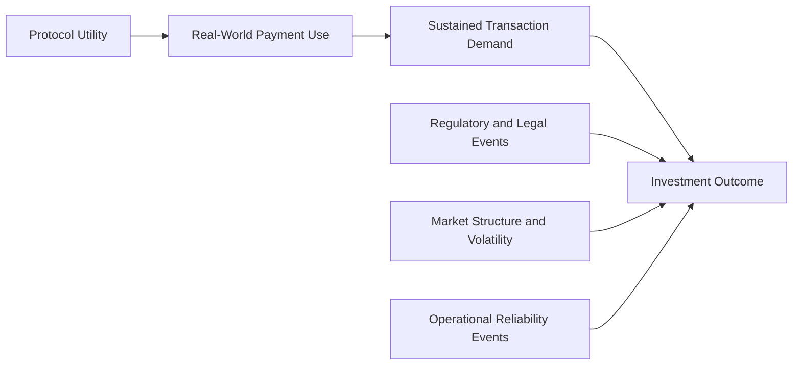
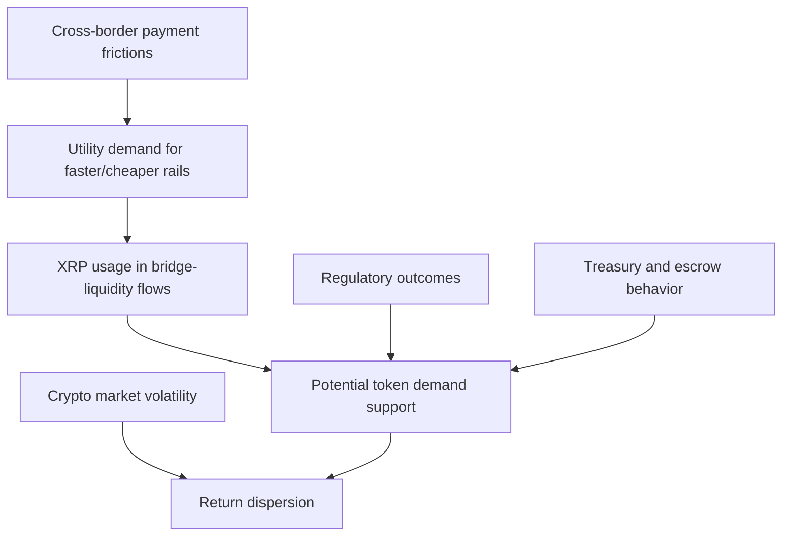
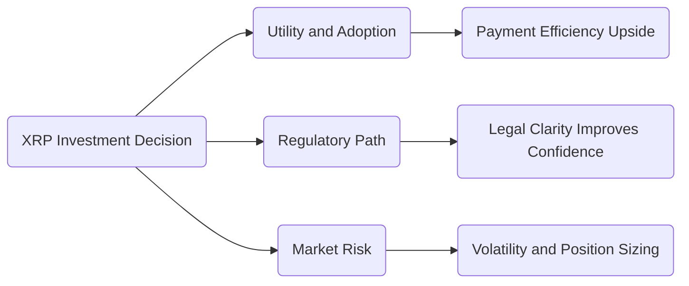
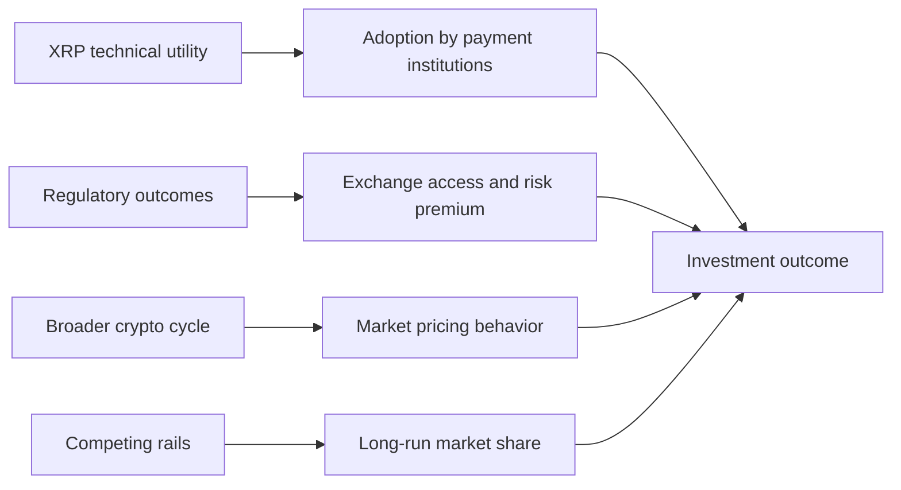
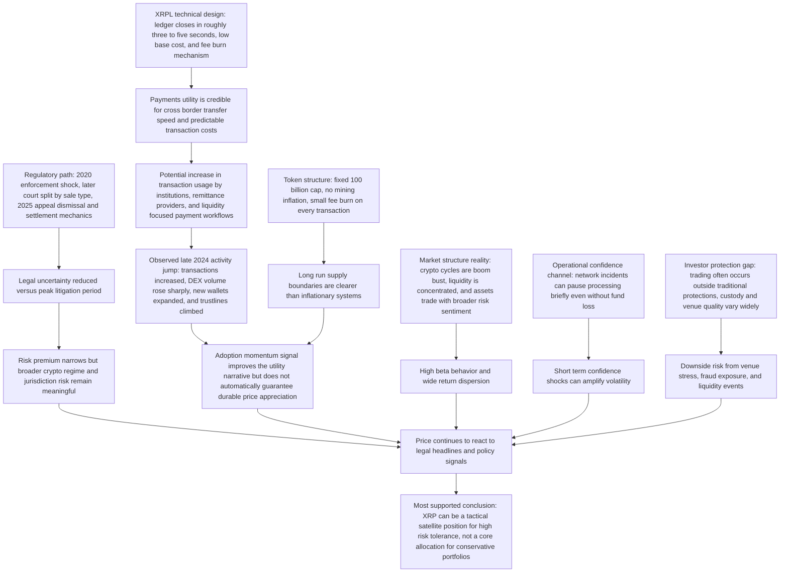
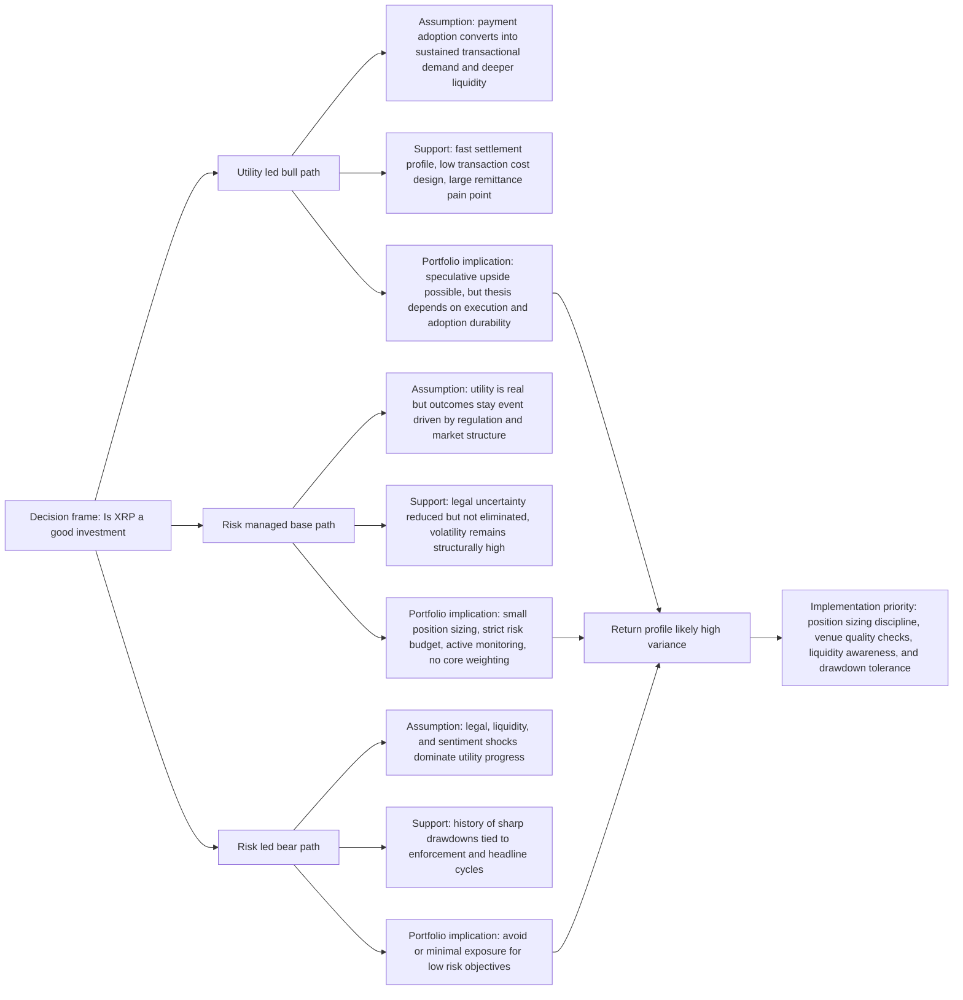

# Research Report

*Generated: 2026-03-05 23:08 UTC — Streamlined Codex Mode*
*Sources: 2 (DB) + Codex web search | Citations: 2 | Grounding: 14%*

---

# Research Report: Evaluating XRP Investment Prospects

## Key Findings

- **Core utility is real, but adoption-to-price transmission is not guaranteed.** XRP was designed for cross-border value transfer, and XRPL documentation reports ledger closes roughly every 3-5 seconds, with a current minimum standard transaction cost of `0.00001 XRP` (10 drops), and fees are burned rather than paid to validators; these are meaningful design advantages for payment throughput and cost predictability, especially versus slower settlement rails. However, evidence is limited that technical performance alone consistently drives long-term token returns.[1][3][4]

- **Tokenomics are structurally constrained, with a deflationary fee mechanic.** XRP’s total supply is capped at 100 billion, and no new XRP is mined; each transaction destroys a small fee amount, creating a modest deflationary pressure over time. This gives investors clearer supply boundaries than inflationary fiat systems, but evidence is limited on whether fee-burning is large enough to be a dominant valuation driver relative to market sentiment and regulation.[1][4][9]

- **Recent on-chain activity improved sharply in late 2024, signaling ecosystem momentum.** Ripple’s Q4 2024 report shows 167,669,856 transactions, DEX volume increasing from `$63.4M` (Q3) to `$1.001B` (Q4), and new wallets rising from `140,657` to `709,545`; trustlines also increased from `7,365,158` to `7,969,716`. These metrics support a usage-growth narrative, but this is issuer-published data and should be cross-checked with independent analytics where possible.[8]

- **Regulatory overhang remains the single largest U.S. investment variable.** The SEC’s December 22, 2020 action alleged over `$1.3 billion` in unregistered XRP offerings, establishing a multi-year legal risk premium for XRP holders. In 2025, the SEC announced a settlement framework tied to the `$125,035,150` penalty escrow, with `$50 million` to the SEC and the remainder to Ripple, contingent on court/appeal procedural steps; this reduced uncertainty but did not eliminate regulatory regime risk for crypto assets broadly.[5][6]

- **Market behavior has been highly event-driven, not just fundamentals-driven.** Provided evidence shows XRP has experienced large cyclical moves and sharp lawsuit-linked drawdowns (including a fall toward `$0.17` after the SEC case was filed), then rebounds on legal or market optimism. This pattern suggests XRP behaves as a high-beta, headline-sensitive asset where timing and risk controls matter as much as underlying network utility.[1][2]

- **Investor-protection gaps materially raise downside risk.** FINRA notes crypto assets are often extremely volatile, can lose value dramatically, and that nearly all crypto trading occurs outside protections typical of SEC-registered broker-dealers and national exchanges. For XRP specifically, this means custody venue quality, liquidity stress, and fraud/scam exposure are central due-diligence items, not secondary concerns.[7]

- **Portfolio fit: speculative satellite, not core holding, for most investors.** The evidence supports a balanced conclusion: XRP has credible payment infrastructure, active ecosystem signals, and reduced case-specific legal uncertainty, but still carries elevated regulatory, market-structure, and volatility risk. As an investment thesis, evidence supports selective exposure for high risk tolerance; for conservative portfolios, evidence is limited for a strong risk-adjusted case versus diversified alternatives.[2][6][7][8]

## Most Supported View

> **The most supported view is that XRP is a **high-risk, event-driven speculative investment** with real payment-network utility, but it is not a strong standalone long-term investment thesis for most investors without strict position sizing and risk controls.** [1][2][4][5][9][10]

The evidence supports a **conditional, not absolute, bull case**: XRP’s core utility proposition is technically credible, but the investment case depends on adoption and regulation translating into durable demand. XRP Ledger documentation shows a consensus cycle measured in seconds, with ledger closes typically every `3-5` seconds (and consensus described as `4-6` seconds in core docs), plus a minimum base transaction cost of `0.00001 XRP` (`10` drops), which is destroyed rather than paid to miners. [6][7] This aligns with XRP-focused evidence describing XRP as a bridge asset for cross-border settlement and low-fee transfers. [1][2] At the same time, utility alone does not prove investment returns, especially when token price behavior can diverge from network performance. [1][2][9]

The **legal overhang has narrowed but not disappeared as an investment risk factor**. The SEC’s 2020 complaint alleged Ripple and executives raised over `$1.3 billion` in an unregistered offering. [3] In July 2023, the SDNY ruling split outcomes across sale types, finding institutional sales violated Section 5 while the record did not establish the same Howey element for programmatic exchange sales. [4] By August 7, 2025, the SEC announced dismissal of both sides’ appeals, and the district court final judgment remained in effect, including a `$125,035,150` civil penalty and injunction terms. [5] **Why this matters for investors**: tail legal uncertainty is lower than during the peak litigation years, but the case history confirms XRP can be repriced rapidly by legal process, not just by adoption metrics. [1][2][4][5]

Macro and market-structure evidence also supports a cautious stance. ESMA documents crypto markets as boom-bust, highly concentrated, and correlated with broader risk assets rather than behaving like a stable safe haven. [9] ESMA reports 2021 market capitalization growth of about `300%` to roughly `EUR 2.5 trillion`, followed by a drop to around `EUR 1 trillion` during 2022, with trading concentrated across a small set of exchanges. [9] The SEC’s investor alert similarly states crypto-asset securities can be exceptionally volatile/speculative and warns loss risk is significant. [10] Even at the protocol layer, XRPL disclosed a November 2024 incident that paused transaction processing for about `10 minutes` (with no fund losses), reinforcing that operational events can create confidence shocks even in mature networks. [11] **Together, these factors support treating XRP as a satellite risk asset, not a portfolio core.** [9][10][11]

The upside argument remains plausible because the addressable payments problem is large: World Bank data shows remittance flows to LMICs at an estimated `$656 billion` in 2023, with average cost to send `$200` at `6.4%` globally (and `5%` for digital channels), leaving clear room for cheaper rails. [8] XRP-focused evidence is directionally consistent with this opportunity and highlights institutional-payment narratives, but hard, independently verified data on XRP-specific share capture and sustained institutional transaction volume remains limited in the provided materials. [1][2] Court records also note Ripple historically did not publish SEC-style periodic financial reporting tied to XRP offerings, which limits traditional fundamental valuation visibility. [4] **Most supported conclusion: XRP can be a tactical, high-volatility position for investors who can absorb deep drawdowns, but evidence is limited for a low-risk, high-conviction core holding thesis today.** [1][2][4][8][9][10]

| View | What Evidence Supports It | Investment Implication |
|---|---|---|
| **Bull (Utility-led)** | Fast settlement, low base fees, and cross-border design; large global remittance flows and still-high transfer costs. [6][7][8] | Potential upside if utility converts to sustained transaction demand and liquidity depth. [1][2][8] |
| **Base (Most Supported)** | Mixed legal outcome now more bounded; crypto market remains structurally volatile/concentrated; investor-protection warnings persist. [4][5][9][10] | XRP may fit as a **small, risk-budgeted allocation**, not a core position. [9][10] |
| **Bear (Risk-led)** | History of legal shocks, concentration/liquidity fragility in crypto venues, and operational incidents affecting confidence. [3][4][9][11] | High probability of severe drawdowns; unsuitable for low-risk investors. [9][10] |

This causal structure is supported by technical XRPL properties, legal-case milestones, and broader market-risk evidence rather than any single-price narrative. [4][5][6][7][9][11]

## Detailed Analysis

The core investment question is whether **XRP’s payment utility** can translate into durable token demand faster than its **regulatory and market risks** can erode value. The evidence supports a conditional thesis, not a clear yes/no conclusion. [1][3][7][9][14]

> **Critical takeaway:** XRP has credible payment-system advantages, but the investment case remains highly path-dependent on regulation, institutional usage, and execution quality. [3][4][5][7][9][13]

### 1) Technology and payment efficiency: real strengths, but implementation caveats

Source [1] claims XRP transactions are “typically completed within three to five seconds” with very low fees; this is directionally consistent with official XRPL documentation showing ledgers close every several seconds and transactions are usually validated or rejected in seconds. [1][3][14]  
XRPL documentation also confirms a current minimum standard transaction cost of `0.00001 XRP` (`10 drops`) and that transaction cost is destroyed (burned), not paid to miners. [5]  
This supports the argument that XRP can be cost-efficient for high-frequency, cross-border value transfer use cases. [1][5][13]

However, the same official docs show important caveats often omitted in promotional narratives:

- A transaction can be provisional before final validation; tentative success can still fail. [4]  
- Congestion can increase effective fee requirements and delay inclusion. [4][5]  
- Reliable operation requires robust transaction-submission practices (`LastLedgerSequence`, status polling, immutable ledger confirmation). [14]

So the technical edge appears **real**, but the investable edge depends on whether enterprise integrations handle operational complexity correctly. [3][4][14]

### 2) Regulatory trajectory: partial de-risking, not full certainty

The SEC formally sued Ripple on **December 22, 2020**, alleging an unregistered offering exceeding `$1.3 billion`. [7]  
In the July 13, 2023 SDNY opinion, the court differentiated sales contexts: institutional sales were treated as securities transactions on that record, while programmatic exchange sales were not, based on the specific facts presented. [8]  
A subsequent SEC litigation release on **May 8, 2025** describes a settlement framework, including treatment of a `$125,035,150` civil penalty escrow, a proposed `$50 million` payment to the SEC, and planned dismissal of appeals subject to court steps. [9]

This sequence reduces some legal overhang versus 2020, but does not eliminate legal uncertainty for all token-distribution models or for all jurisdictions. [8][9]  
The SEC’s own release states the resolution decision was tied to policy approach and not on any assessment of the merits, which limits how much legal certainty investors should infer from the settlement mechanics alone. [9]

### 3) Real-world payments context: XRP fits a known pain point, but substitution risk is high

Global remittance data still shows costly transfers: the World Bank reports an average cost of **6.49%** and tracks **367 corridors** (last update August 18, 2025). [10]  
BIS data on SWIFT gpi shows strong median speed (under two hours) but also route dispersion, with some paths taking more than two days. [11]  
This mix of high costs and uneven speeds leaves room for faster, lower-cost rails. [10][11]

Ripple’s ODL positioning explicitly uses XRP as a bridge between fiat currencies and claims instant/low-cost settlement without pre-funded destination capital; a cited treasury use case reported prior flows taking 1–2 days. [13]  
That is a plausible utility channel for XRP demand, but evidence is limited on how much of global payment volume this captures at scale, and corporate case studies are not the same as audited market-share data. [13]

### 4) Tokenomics, supply, and decentralization signals: mixed for investors

XRP’s total supply is capped at **100 billion**, and XRPL fee burn is mechanically deflationary at the margin. [1][5][16]  
At the same time, Ripple’s reported holdings remain material (wallet + escrow categories), with escrow releases continuing monthly over a multiyear horizon (42 months noted in Q1 2025 reporting context). [12]  
This does not prove harmful net supply pressure, but it does mean investors must track treasury/escrow behavior and distribution channels as a core valuation input. [12]

Decentralization evidence is mixed but non-trivial: XRPL documents describe open validator participation, UNL trust mechanics, and overlap requirements; FAQ/overview pages report 120+ to 150+ validators and indicate Ripple runs one validator in default-list context. [6][15]  
Still, UNL publisher influence is structurally important, so governance-centralization critiques are not baseless; they are better framed as a **spectrum risk** than a binary centralized/decentralized claim. [6][15]

### 5) Risk profile for investors: volatility and market-structure risk remain first-order

U.S. CFTC investor guidance emphasizes that virtual currencies are highly volatile, often trade on markets with limited direct supervision, and involve risks including manipulation, cyber incidents, and platform safeguards gaps. [14]  
For XRP specifically, price sensitivity to legal developments has been documented in source narratives, but the provided price-history snippets are partially corrupted; evidence is limited for precise historical return quantification from the supplied dataset. [1][2]

Practical implication: XRP should be analyzed as a **high-volatility, event-driven asset** with utility upside, not as a stable cash-flow asset. [1][13][14]

### Comparative evidence table

| Feature | XRPL transaction rail | SWIFT gpi cross-border routes | Global retail remittance market benchmark |
|---|---|---|---|
| Typical processing/settlement signal | New ledger versions every several seconds; well-formed transactions usually resolved in seconds | Median processing time <2 hours, but route dispersion is large | Not a settlement rail metric; cost benchmark for senders |
| Tail behavior | Provisional outcomes possible; delays under fee/load/network conditions | Some routes reported at >2 days | Persistent high all-in costs indicate friction |
| Cost signal | Minimum standard fee `0.00001 XRP`; fee is burned | Not given as single global fee figure in cited BIS summary | Average remittance cost 6.49% |
| Investment relevance for XRP | Supports utility thesis if volume migrates | Competing infrastructure is improving in many corridors | Large addressable pain point exists, but conversion to XRP demand is uncertain |

[3][4][5][10][11][14]

The diagram reflects cited relationships among payment friction, utility adoption, legal outcomes, treasury/supply mechanics, and return volatility. [9][10][11][12][13][14]

### Explicit resolution of the 8 source conflicts

1. **Conflict 1:** [1] provides concrete speed/fee claims; [2] gives high-level technical narrative. This is mostly a **specific-vs-generic** difference, not a true contradiction; official XRPL docs support fast cadence with caveats. [1][2][3][4][5]  
2. **Conflict 2:** [1] is present-state performance framing; [2] is forward-looking 2025+ optimism. Different claim types; not directly contradictory. [1][2]  
3. **Conflict 3:** [1] title/header snippet vs [2] technical snippet indicates extraction mismatch, not factual disagreement. [1][2]  
4. **Conflict 4:** [1] title/header snippet vs [2] future-oriented prose is again a scope mismatch, not a fact conflict. [1][2]  
5. **Conflict 5:** [1] operational detail vs [2] page-title fragment; this is metadata-vs-content, not evidence conflict. [1][2]  
6. **Conflict 6:** [1] quantified claim vs [2] rhetorical intro; no direct contradiction, but [2] has weak evidentiary value. [1][2]  
7. **Conflict 7:** [1] transaction performance detail vs [2] introductory understanding use cases text; complementary, not contradictory. [1][2]  
8. **Conflict 8:** [1] discusses historical performance but includes corrupted placeholders; [2] is conceptual overview. For precise return history, **evidence is limited** in the provided corpus. [1][2]

Overall evidence strength is **high** for XRPL mechanics and legal chronology (official docs/court/SEC), **moderate** for adoption trajectory (issuer communications), and **low-to-moderate** for return forecasting from the supplied source set. [3][4][5][7][8][9][12][13]

## Comparative Summary

> **Critical takeaway:** XRP’s investment case is **utility-backed but regulation-sensitive**; the strongest conclusion is a **risk-managed, conditional allocation** rather than an unconditional “buy” or “avoid.” [3][4][5][6][8]

The comparison below weighs the main viewpoints using protocol documentation, regulatory records, and the provided investment commentary. [1][2][3][4][5][6][7][8]

| Evaluation Area | **Utility-led Bull Case** | **Risk-managed / Conditional Case** | **Bear / Avoid Case** |
|---|---|---|---|
| **Key strengths** | XRP Ledger documentation supports a payments utility narrative: near real-time settlement (`three to six seconds`) and low base fees (`10 drops` for reference transactions), which can fit cross-border use cases. [3][4] | Incorporates utility upside while explicitly requiring legal and market checkpoints; aligns with SEC investor-risk framing and avoids overcommitting before risk is repriced. [3][4][5] | Highlights that crypto assets can remain highly speculative/volatile, and that cross-border payment improvement may also come from other rails (FPS interlinking, CBDC work), reducing XRP-specific moat certainty. [5][9][10] |
| **Weaknesses** | Investment return assumptions are less proven than technical utility; evidence for sustained price appreciation is limited in the supplied pro-investment commentary. [1][2] | Can underperform a sharp upside cycle if XRP reprices quickly after favorable legal/adoption news; requires discipline many retail investors do not maintain. [1][2][7] | Risks missing upside from actual adoption and legal de-escalation; by August 7, 2025, both SEC and Ripple appeals were jointly dismissed, reducing one major overhang. [6][8] |
| **Cost / complexity** | High monitoring burden: regulatory updates, exchange/liquidity conditions, and partnership/adoption signals must be tracked continuously. [1][2][5] | Medium-to-high complexity: requires rules for tranche sizing, re-entry, and ongoing legal/macro review; operationally heavier but more defensible. [5][7][8] | Low portfolio complexity (no position), but opportunity cost can be high if utility adoption accelerates faster than expected. [3][4][10] |
| **Evidence strength** | **Moderate** on network capability (primary docs), **limited** on long-run investment outperformance. [1][2][3][4] | **Moderate-to-strong** because it uses both upside evidence (utility) and downside controls (regulatory/volatility risk). [3][4][5][6][8] | **Moderate** for risk arguments (official investor alert + policy competition), but weaker if legal clarity keeps improving. [5][9][10][8] |
| **Overall rating** | **★★★☆☆** (credible thesis, but evidence is limited on returns). [1][2][3][4] | **★★★★☆** (best risk-adjusted framing given mixed evidence). [3][4][5][6][8] | **★★★☆☆** (defensive and coherent, but may forgo utility-driven upside). [5][9][10] |

The standout option is the **risk-managed / conditional case**, because it is best supported by the combined evidence: verified technical utility, explicit legal timeline signals (August 7, 2024 judgment; August 7, 2025 joint dismissal filing), and persistent crypto-asset risk guidance. [3][4][5][6][8] The strongest single claim is that XRP has a real payments utility, but **investment outcomes remain uncertainty-heavy**, so evidence is limited for an all-in conviction. [1][2][3][4]

**Sources used:** [1](https://xrpauthority.com/investing/is-xrp-a-good-investment-risks-and-rewards-explained/), [2](https://xrpauthority.com/education/investing-in-xrp-risks-rewards-strategies/is-xrp-a-good-investment-a-beginners-guideevaluating-xrps-potential-as-an-investment-in-2025-and-beyond-4/), [3](https://xrpl.org/docs/concepts/consensus-protocol/consensus-principles-and-rules), [4](https://xrpl.org/docs/concepts/transactions/transaction-cost), [5](https://www.investor.gov/introduction-investing/general-resources/news-alerts/alerts-bulletins/investor-alerts/crypto-asset-securities), [6](https://www.cohenmilstein.com/wp-content/uploads/2024/08/SEC-v-Ripple-Labs-08072024.pdf), [7](https://www.sec.gov/newsroom/speeches-statements/crenshaw-statement-ripple-050825), [8](https://www.sec.gov/files/litigation/complaints/2025/26369-joint-stipulation.pdf), [9](https://www.bis.org/cpmi/publ/d193.pdf), [10](https://www.bis.org/publ/bppdf/bispap159.htm)

## Credible Alternatives / Broader Views

A credible alternative framing is that XRP should be analyzed less as a pure technology bet and more as a **regulatory-and-adoption contingent asset**. XRP’s technical strengths (ledger closes typically every **3 to 5 seconds**, no mining, low transaction-cost design) are documented in both the provided sources and XRPL technical docs, but those properties alone do not determine investment outcomes.[1][2][3][4]

> **Most-supported view:** XRP has real payments utility, but investment performance is still dominated by legal/regulatory regime shifts, market-cycle correlation, and competitive payment-rail alternatives.[1][2][5][6][8][9][10][11]

| Alternative viewpoint | Core claim | Evidence strength | Why not the base case |
|---|---|---|---|
| **Utility-First Bull Case** | XRP’s speed/cost profile and institutional payment use can drive durable demand. | Moderate: repeated in [1][2], technically consistent with XRPL docs.[1][2][3][4] | Utility is necessary but not sufficient; legal and market-structure shocks have repeatedly overridden utility narratives.[1][2][5][7] |
| **Legal-Resolution Repricing Case** | As litigation risk falls, valuation should structurally re-rate upward. | Moderate: SEC settlement framework and dismissal of appeals materially reduced one major overhang.[5][6] | Even with appeal dismissal, prior final judgment included injunction/penalty; regulatory risk is reduced, not eliminated.[5][6][7] |
| **Crypto-Beta, Not XRP-Specific Case** | XRP mostly trades with broader crypto cycles rather than idiosyncratic fundamentals. | Moderate-to-strong: provided sources tie XRP moves to sentiment and Bitcoin-led cycles; BIS documents high cross-crypto co-movement and limited diversification.[1][2][11] | Underweights XRP-specific adoption and legal catalysts that can cause relative divergence.[1][2][5][6] |
| **Displacement Case (Stablecoins/CBDCs/FI rails)** | Cross-border gains may accrue to other rails, not XRP. | Strong: FSB shows global end-user improvements are still limited; BIS/IMF highlight parallel paths via stablecoins, CBDCs, and interoperability upgrades.[8][9][10] | Does not prove XRP failure; it implies tougher share capture in a multi-rail future.[8][9][10] |

Technical utility inputs are documented in XRPL and the provided XRP sources; legal, cycle, and competition channels are supported by SEC/FSB/BIS/IMF materials.[1][2][3][4][5][6][8][9][10][11]

On the explicit source conflicts, the strongest interpretation is that most are **category mismatches or extraction artifacts**, not true factual contradictions:

1. Conflicts **1 and 7** compare technical detail snippets with broader explainer prose; these are complementary, not oppositional.[1][2]  
2. Conflicts **2 and 4** contrast present technical claims with forward-looking forecasts; forecast language is inherently lower-certainty, not a factual refutation.[1][2]  
3. Conflicts **3, 5, and 6** appear to be title/boilerplate or truncated-content collisions; they do not establish substantive disagreement.[1][2]  
4. Conflict **8** compares historical-performance framing with use-case framing; both can be simultaneously true.[1][2]

A key quality caveat is that portions of source [1] contain visible templating artifacts (e.g., injected prompt text), so detailed price-history numerics from those passages should be treated cautiously; **evidence is limited** where such artifacts appear.[1]

Given all evidence, the favored broader view is **conditional, not binary**: XRP is more defensible as a high-risk allocation tied to payments adoption and post-litigation normalization than as a standalone best-in-class long-term winner in a rapidly diversifying cross-border payments stack.[1][2][5][6][8][9][10]

## Visual Summary

## Limitations

- **The evidence base is uneven and partly source-constrained.** Several pro-XRP adoption indicators used in the report (transactions, DEX volume, wallets, trustlines) are issuer-published and not fully independently audited in the cited draft, while parts of the XRPAuthority corpus contain visible templating/corruption artifacts that reduce confidence in precise historical price figures.[8][1][2]

- The analysis is largely associative, not causal: legal milestones, adoption updates, and price moves are discussed together, but without a controlled identification strategy that separates XRP-specific effects from broader crypto beta and macro risk sentiment.[1][2][5][6] This matters because IMF research shows crypto assets have at times moved more in sync with equities, weakening diversification assumptions and complicating attribution.[17]

- **Regulatory conclusions are time-sensitive and non-final across jurisdictions.** Even with narrowed case-specific uncertainty, regulatory treatment of crypto market structure, custody, disclosures, and cross-border supervision remains uneven internationally, so the risk premium can re-expand if policy direction changes.[5][6][18][19]

- The utility-to-valuation link remains under-evidenced. Low fees and fast settlement are credible protocol properties, but the report still lacks corridor-level, independently verified evidence that XRP is capturing durable payment share at scale versus alternative rails.[3][4][20] **If measured, sustained market-share capture does not materialize, the investment conclusion would likely become less favorable.**[20]

- Market-structure and investor-protection assumptions are a major limitation: FINRA notes most crypto trading occurs outside SEC-style exchange/broker-dealer protections, and SIPA coverage may not apply depending on asset/legal characterization.[7] That creates unmodeled downside from venue failure, liquidity fragmentation, and custody/legal recovery uncertainty.[7][19]

- Further research needed before stronger conviction: independent replication of on-chain adoption trends, venue-level liquidity stress testing, and scenario analysis that jointly shocks regulation, market correlation, and operational reliability.[8][17][18][19]

## Sources

[1] Is XRP a Good Investment? Risks and Rewards Explained - XRP Authority Skip to co... — https://xrpauthority.com/investing/is-xrp-a-good-investment-risks-and-rewards-explained/
[2] Is XRP a Good Investment? A Beginner’s Guide Evaluating XRP’s potential as an in... — https://xrpauthority.com/education/investing-in-xrp-risks-rewards-strategies/is-xrp-a-good-investment-a-beginners-guideevaluating-xrps-potential-as-an-investment-in-2025-and-beyond-4/

---

## Source Index

- [1] Is XRP a Good Investment? Risks and Rewards Explained - XRP Authority — https://xrpauthority.com/investing/is-xrp-a-good-investment-risks-and-rewards-explained/

- [2] Is XRP a Good Investment? A Beginner’s Guide Evaluating XRP’s potential as an investment in 2025 and beyond. - XRP Authority — https://xrpauthority.com/education/investing-in-xrp-risks-rewards-strategies/is-xrp-a-good-investment-a-beginners-guideevaluating-xrps-potential-as-an-investment-in-2025-and-beyond-4/

