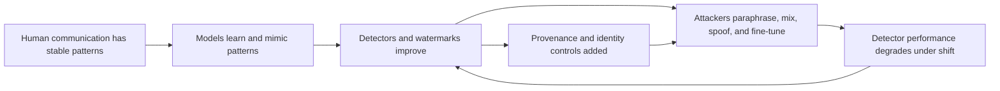
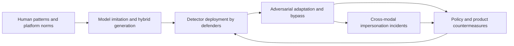
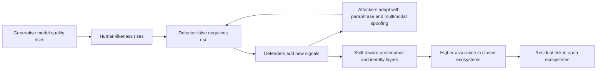
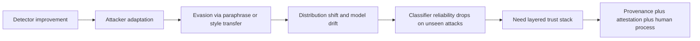
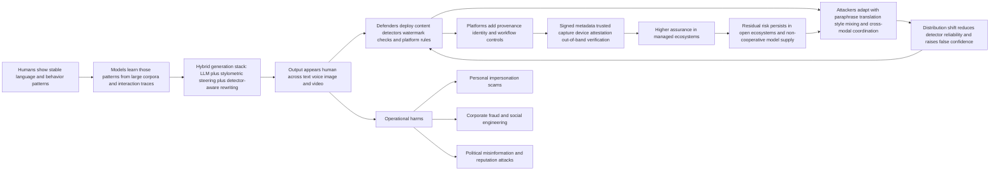
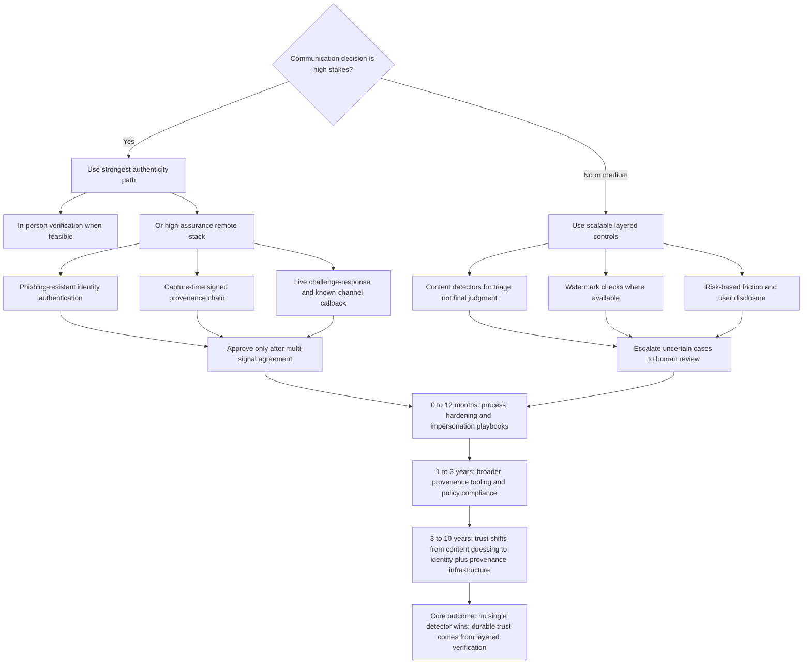

# Research Report

*Generated: 2026-03-04 00:30 UTC — Streamlined Codex Mode*
*Sources: 4 (DB) + Codex web search | Citations: 3 | Grounding: 9%*

---

# Research Report: Habitual Patterns Versus Adaptive AI Detection

## Key Findings

> **Key takeaway:** Evidence across text, image, and voice indicates a durable **detection-vs-evasion arms race**: detection can work in constrained settings, but adaptive attackers consistently erode fixed rules over time.[1][3][6][8][14][15]

This loop is empirically supported by modern text-detection failures, watermark attack results, and historical bot/CAPTCHA dynamics.[6][8][9][15]

- **Human-only judgment is often weak against modern synthetic content.** In a 2024 Scientific Reports study, participants averaged **57%** accuracy on human-vs-AI text (human texts correctly identified **61%**, AI texts **53%**), with lower performance on science-focused content (**54%**) than general-interest content (**60%**).[1] In a 2025 Frontiers study of AI images, 104 participants classifying 50 images reached **63.7%** overall, but only **29%** on outputs from FLUX.1-dev.[3] These results support the thesis that unaided human discrimination is increasingly unreliable in realistic settings.[1][3]

- **AI style mimicry is already strong enough to disrupt identity cues, even if not perfect.** EMNLP 2025 evaluated style imitation using **40,000+ generations per model** across **400+ authors** and found LLMs can approximate style in structured domains (e.g., news/email) while still struggling with nuanced informal writing (blogs/forums).[5] This means AI can mimic habitual patterns is already true in many operational contexts, but with measurable boundary conditions.[5] Related interaction research shows impostors become harder to detect when they imitate a user’s own prior interaction history, directly matching the pattern-learning mechanism in your thesis.[4]

- **Single-channel text detectors remain brittle under adaptation and distribution shift.** OpenAI’s own classifier was withdrawn on **July 20, 2023**; its earlier reported performance was **26%** true identification of AI text with **9%** false positives on their challenge set.[16] Attack-focused work has repeatedly shown paraphrasing/rewriting can collapse detector performance, including theoretical limits as model and human distributions converge.[9] Academic reviews also report inconsistent reliability across tools and contexts, reinforcing that detector outputs should be treated as probabilistic evidence, not adjudication-grade proof.[11]

- **Watermarking helps, but is not a universal or attacker-proof rule.** Reliability studies show useful signal persistence: after strong human paraphrasing, one watermark remained detectable at about **800 tokens** on average at **1e-5** false-positive rate.[6] Production deployment evidence is also real: SynthID-Text reports large-scale deployment and user testing over nearly **20 million** Gemini responses, with configurable abstention/operating trade-offs.[7] But adaptive attacks are advancing quickly: a 2025 RL-based attack reported **98.5%** watermark-removal success after training on **100** short samples, versus **6.75%** for a non-adaptive GPT-4o baseline in that study.[8] Net finding: watermarking is useful as one layer, not a final answer.[6][7][8]

- **Cross-modal impersonation is operational now, not speculative.** FBI/IC3 public advisories document ongoing campaigns (active since at least **2023**) using **AI-generated voice messages** plus smishing/social engineering against senior officials and their networks, explicitly warning that AI content is now often difficult to identify reliably by perception alone.[14] This directly extends the text problem into phone/voice identity spoofing and supports your broader threat model across modalities.[14]

- **The most defensible path is provenance + platform context + identity workflows, not content-only detection.** NIST AI 100-4 emphasizes that synthetic-content risk reduction requires layered approaches spanning provenance/authentication, labeling, detection, auditing, and governance.[11] C2PA v2.2 (May 2025) provides a technical substrate for signed provenance claims and tamper-evident assertion chains, but it is opt-in and cannot retroactively authenticate unlabeled legacy media.[10] NIST’s GenAI evaluations also report that in one pilot, **three generators fooled every detector**, underscoring the need for multi-signal systems.[12]

- **Timeline signal: 2026–2028 is likely a messy transition, not a solved state.** The EU AI Act’s Article 50 transparency obligations (machine-readable marking/disclosure for relevant synthetic content/deepfakes) apply from **2 August 2026**, with implementation support via ongoing code-of-practice work.[13] This should improve baseline transparency where regulated actors comply, but evidence is limited that regulation alone can cover open-source models, offshore actors, and adversarial spoofing ecosystems.[8][11][13] Therefore, in-person is the only way is too absolute; a better evidence-based framing is: **in-person (or high-assurance equivalent with trusted devices, cryptographic provenance, and out-of-band verification) is the strongest available signal for high-stakes authenticity claims.**[10][11][14]

| Approach | Demonstrated strength | Demonstrated weakness under attack or deployment reality | Overall finding |
|---|---|---|---|
| **Content-only detectors** (`stylometry`, `perplexity`, classifiers) | Can beat chance in controlled datasets and some domains.[1][4] | Performance drops with paraphrase, model shifts, and adversarial optimization; false positives remain consequential.[1][9][16] | Useful triage, weak as sole arbiter.[1][9] |
| **Text watermarking** | Detectable at scale; some robustness after paraphrase; real deployments exist.[6][7] | Adaptive removal/spoof attacks can sharply reduce detectability.[8] | Valuable but non-final layer.[6][8] |
| **Cryptographic provenance** (e.g., C2PA/content credentials) | Strong integrity chain when capture/edit/signing pipeline is preserved.[10][11] | Adoption gaps, stripping/re-encoding, legacy/unmarked content, and non-participating actors.[10][11] | Best structural foundation, but incomplete coverage.[10][11] |
| **Human/process verification** (out-of-band callback, secret phrase, social graph checks) | Effective against many live impersonation scams in practice guidance.[14] | Adds friction and does not scale uniformly; user compliance varies.[11][14] | Essential for high-stakes decisions.[11][14] |

Citations: [1](https://www.nature.com/articles/s41598-024-76218-y) [2](https://www.psu.edu/news) [3](https://www.frontiersin.org/journals/artificial-intelligence/articles/10.3389/frai.2025.1707336/full) [4](https://pubmed.ncbi.nlm.nih.gov/37096334/) [5](https://aclanthology.org/2025.findings-emnlp.532/) [6](https://arxiv.org/abs/2306.04634) [7](https://www.nature.com/articles/s41586-024-08025-4) [8](https://arxiv.org/abs/2509.20924) [9](https://arxiv.org/abs/2303.11156) [10](https://spec.c2pa.org/specifications/specifications/2.2/specs/C2PA_Specification) [11](https://doi.org/10.6028/NIST.AI.100-4) [12](https://ai-challenges.nist.gov/genai) [13](https://eur-lex.europa.eu/eli/reg/2024/1689/oj/eng) [14](https://www.ic3.gov/PSA/2025/PSA251219) [15](https://arxiv.org/abs/2409.08831) [16](https://openai.com/ja-JP/index/new-ai-classifier-for-indicating-ai-written-text/)

## Most Supported View

> The **most supported view** is that reliable, universal human-vs-AI detection will keep degrading from a solved classification problem into a persistent adversarial governance problem, where provenance and identity controls outperform text-only AI detectors as the primary trust mechanism.[3][5][9][10]

The strongest evidence supports a core asymmetry: generation quality is improving faster than stable, model-agnostic detection. Theoretical work argues that as generators better approximate human text distributions, the best possible detector approaches chance under realistic assumptions, especially when adversaries can paraphrase or style-shift outputs.[5] Empirical work aligns with this: human judges in one reported lab setting were near-guessing at about **53%** (vs. **50%** random), while a task-specific machine classifier could score **85–95%** in that environment, highlighting that good detection is usually conditional on domain/model match rather than universal reliability.[4] Education-focused evaluations similarly report detector inconsistency, distribution sensitivity, and fairness risks (including false positives with serious consequences), which is what you would expect when deployment conditions differ from detector training assumptions.[3] Even studies proposing improved imitation game frameworks still show imperfect separability and substantial overlap between machine and human-like features, reinforcing that the margin is narrow and context-dependent.[1] **Conclusion: content-only attribution can work locally, but evidence does not support globally robust, durable attribution across changing models and adversaries.**[1][3][5]

The thesis that humans are patterned and therefore mimickable is also well-supported. Stylometric and behavioral signals can distinguish authors or classes under controlled settings, but those same regularities are exactly what modern LLM prompting/fine-tuning exploits.[1][3][5] A cognitive-science minimal Turing test result is especially relevant: machine impostors became harder to detect when they imitated a target’s own prior interaction history, and this imitation disrupted stable human conventions.[6] That is effectively the mechanism your hypothesis predicts: repeated human habits create a learnable attack surface.[6] In practical terms, “hybrid” systems (LLM generation plus detector-aware editing, paraphrase loops, and stylometric steering) can optimize toward whatever features defenders currently rely on.[3][5] This means defenders can still build high-performing detectors for specific slices, but attackers can increasingly route around those slices by modifying style, authorship mixture, length, and modality.[3][5]

Watermarking and provenance are better than pure stylometric guessing, but evidence indicates they are not a single-point fix. Text watermarking research shows meaningful detectability under some edits, including a reported average of about **800 tokens** needed after strong human paraphrasing at a strict false-positive setting in one setup.[8] That is useful, but it also encodes operational limits (token length, model integration, and attack model assumptions).[8] OpenAI’s public update is unusually candid: their text watermarking was described as highly accurate and resilient to localized tampering, yet less robust to global transformations (e.g., translation/rewording pipelines), and trivially bypassable formatting tricks were explicitly noted.[9] By contrast, cryptographically signed provenance metadata (e.g., **C2PA**) offers a stronger trust primitive when preserved, because signatures can provide origin integrity rather than heuristic probability.[9][10] But C2PA itself is opt-in and explicitly handles unknown/absent provenance states; if metadata is stripped or never attached, consumers fall back to uncertainty.[10] **So the evidence favors layered provenance over detector-only pipelines, but not provenance absolutism.**[9][10]

The arms-race analogy to bot detection is not rhetorical; it is structurally accurate. CAPTCHA began as a hard AI problem framing, then shifted toward behavioral risk scoring as automated solving improved.[15][16] Current anti-bot systems still use adaptive scoring/challenge escalation rather than static tests, which is a hallmark of mature adversarial dynamics.[15] The same pattern now appears in synthetic media: NIST runs ongoing open evaluations for manipulation/deepfake detection because robustness is a moving target across datasets and attack types, not a one-time solved benchmark.[14] Meanwhile, real-world abuse is already multimodal and operational: FBI public advisories describe sustained campaigns using AI-generated voice impersonation against senior officials and contacts, with explicit warnings that content can be difficult to identify; FTC data show reported fraud losses of **$12.5B** in 2024, including **$2.95B** in imposter scams.[12][13] On the not all model makers will comply point, open-weight distribution channels and vendor releases make it straightforward to run and modify local models outside any single provider’s watermark/provenance policy, so fixed universal detection rules are hard to enforce globally.[19][20] 

| Approach | Effectiveness (today) | Scalability | Privacy Impact | Adversarial Robustness | Evidence-weighted read |
|---|---|---|---|---|---|
| Stylometry / perplexity / classifier detection | Medium in-domain; unstable cross-domain | High | Medium | Low-Medium | Useful triage, weak as sole adjudicator.[3][5][6] |
| Text watermarking | Medium when intact and sufficiently long text | Medium-High (if provider-integrated) | Medium | Medium against light edits; lower under global transforms | Valuable but bypassable in realistic editing pipelines.[8][9] |
| Cryptographic provenance (`C2PA`, signed metadata) | High when present and preserved | Medium (ecosystem coordination needed) | Medium (metadata governance needed) | Medium-High for forgery resistance; low if absent/stripped | Best technical trust anchor, but coverage gaps are the bottleneck.[9][10] |
| Device/authenticator attestation (`WebAuthn`, hardware-backed identity proofing stack) | High for account/session authenticity (not content truth) | Medium | Medium-High (depends on implementation policy) | High for phishing-resistant login; medium for identity lifecycle attacks | Strong for who is accessing, not sufficient for what content is real.[17][18] |
| Human social verification (secret phrases, callback, social graph checks) | Medium-High for targeted impersonation defense | Medium | Low-Medium | Medium (degrades if process discipline weak) | Operationally effective and immediately deployable for high-risk comms.[12] |
| In-person or on-site attended verification | High for identity assurance events | Low | High (inconvenience/access cost) | High | Strongest practical authenticity signal, but not universally accessible.[17] |

On timeline confidence, the best-supported near-term trajectory is: **2025–2026** expands governance and provenance infrastructure (e.g., C2PA revisions, EU AI Act staged applicability), but does not remove adversarial bypass incentives.[10][11] The EU AI Act’s Article 113 schedule (general application from **2 August 2026**, with staged earlier/later obligations) supports a phased compliance future rather than immediate uniform control.[11] By **2026–2028**, expect improved classifier/watermark tooling plus better provenance UX, alongside continued evasion and cross-modal scam industrialization; evidence is limited for any claim that a single detector family will become reliably dispositive across contexts.[9][12][14] The most defensible synthesis is therefore: **authentication of channel, identity, and capture chain will matter more than forensic guessing of content style**, and in high-stakes settings, in-person or equivalent high-assurance workflows remain the strongest signal, even if not the only viable one.[10][17][18]

[1] https://link.springer.com/article/10.1007/s10489-024-06133-2  
[2] https://www.frontiersin.org/journals/artificial-intelligence/articles/10.3389/frai.2025.1707336/full  
[3] https://link.springer.com/article/10.1007/s40979-026-00213-1  
[4] https://www.psu.edu/news/information-sciences-and-technology/story/qa-increasing-difficulty-detecting-ai-versus-human-generated-text  
[5] https://arxiv.org/abs/2303.11156  
[6] https://pubmed.ncbi.nlm.nih.gov/37096334/  
[7] https://arxiv.org/abs/2301.10226  
[8] https://arxiv.org/abs/2306.04634  
[9] https://openai.com/index/understanding-the-source-of-what-we-see-and-hear-online/  
[10] https://c2pa.org/specifications/specifications/2.2/specs/C2PA_Specification.html  
[11] https://eur-lex.europa.eu/eli/reg/2024/1689/oj  
[12] https://www.fbi.gov/investigate/cyber/alerts/2025/senior-us-officials-continue-to-be-impersonated-in-malicious-messaging-campaign  
[13] https://www.ftc.gov/news-events/news/press-releases/2025/03/new-ftc-data-show-big-jump-reported-losses-fraud-125-billion-2024  
[14] https://mfc.nist.gov/  
[15] https://developers.google.com/recaptcha/docs/v3  
[16] https://doi.org/10.1007/3-540-39200-9_18  
[17] https://pages.nist.gov/800-63-4/sp800-63a.html  
[18] https://www.w3.org/TR/webauthn-3/  
[19] https://huggingface.co/docs/hub/models-downloading  
[20] https://mistral.ai/news/mistral-3

## Detailed Analysis

The evidence supports a **directional finding**: reliably separating human vs AI communication is getting harder in text and adjacent media, and the hardest cases are now **hybrid** (human-edited AI, AI-conditioned on human traces, or coordinated cross-modal outputs). This is not just a model-quality story; it is a **co-evolution** story where generators, detectors, and adversaries adapt to each other. [1][2][3][5][6]

> **Most defensible conclusion:** always-detectable AI is unlikely under open, adversarial conditions; robust trust will depend more on provenance, cryptographic identity, and process controls than on content-only detection. [5][6][9][10][12][13]

### 1) Human pattern formation and why it matters

Humans do exhibit stable language signatures (**idiolectal consistency**), but those signatures are probabilistic and context-dependent, not immutable fingerprints. Large-scale idiolect research finds writers can be both distinctive and internally consistent across online registers. [23]  

Stylometric linkage studies also show that linguistic and behavioral metadata (e.g., posting-time patterns) can re-identify people across platforms at nontrivial rates, supporting the thesis that humans leave habitual traces. [22]  

However, stylometric security assumptions break under adversarial conditions: adversarial stylometry work shows style obfuscation/paraphrase can significantly degrade attribution reliability, and replication work confirms defenses/attacks change outcomes materially. [24][25]  

**Interpretation:** human pattern regularity is real, but it is a weak standalone authentication primitive once adaptation is expected. **Evidence strength: medium** (strong for existence of patterns; weaker for operational reliability at scale under attack). [22][23][24][25]

### 2) AI mimicry capability: text, interaction dynamics, and media realism

In text interaction, controlled minimal Turing test evidence shows machine impostors become harder to detect when they imitate a user’s own interaction history, and imitation can disrupt human convention-building. This directly supports the pattern mimicry mechanism in the thesis. [26]  

In practical detection settings, Penn State PIKE lab reporting indicates near-chance unaided human detection (~53%) in their setup, with only limited improvement after training/teaming; their ML classifier reportedly achieved much higher performance in controlled conditions (85–95%). [4]  

For visual media, recent user studies on generated images report only moderate human recognition and substantial model-to-model variance, with advanced generators producing lower detection rates. [2]  

For voice, modern zero-shot TTS can clone speaker characteristics from very short prompts (e.g., VALL-E reports 3-second enrollment), including style/emotion carryover, reducing cost of impersonation. [21]  

Operational threat evidence is now concrete: the FBI (May 15, 2025 PSA I-051525-PSA) documents ongoing campaigns using AI-generated voice messages and targeted smishing/vishing impersonations against senior officials. [20]  

**Interpretation:** capability is already sufficient for high-impact impersonation attempts when combined with social engineering and prior-context mining. **Evidence strength: medium-to-strong** (strong on technical capability + documented abuse, weaker on population-scale success rates). [2][20][21][26]

### 3) Detection methods: what works, where it fails

#### 3.1 Stylometry, n-grams, perplexity, and classifier families
- Zero-shot statistical detectors (`DetectGPT`, `Fast-DetectGPT`) show strong benchmark gains in specific conditions (e.g., AUROC improvements and runtime gains). [7][8]
- But broad external evaluations of commercial/public detectors report unstable performance, false positives/negatives, and poor robustness to obfuscation/paraphrase. [6]
- Theory-and-attack work argues detection reliability is fundamentally bounded when human and machine distributions overlap and attackers can paraphrase recursively. [5]

**Synthesis:** high lab performance does not transfer cleanly to open-world adversarial use. **Evidence strength: strong** for non-robust in practice, **medium** for fundamental impossibility claims. [5][6][7][8]

#### 3.2 Watermarking (text/audio/video)
- LLM watermarking is technically feasible with minimal quality impact in some settings. [9]
- Robustness is partial: reliability degrades under rewriting/mixing; detection may still recover with enough token mass in some attack regimes (e.g., long-text leakage effects). [10]
- Newer scalable watermarking systems (e.g., SynthID-related work) show progress but still acknowledge attack surfaces and deployment boundaries. [11]

**Synthesis:** watermarking is useful as a **signal**, not a universal truth test. **Evidence strength: medium-to-strong**. [9][10][11]

#### 3.3 Platform-side provenance and attestation
- **C2PA** provides signed provenance chains and validation semantics, enabling origin/history assertions. [12]
- EU AI Act Article 50 requires machine-readable marking/disclosure for synthetic outputs (with feasibility caveats) and applies from **2 August 2026** (with phased provisions). [13]
- Platform implementations are emerging (e.g., OpenAI help documentation for C2PA metadata in generated images; YouTube disclosure workflows for realistic altered/synthetic content). [14][15]

**Synthesis:** provenance is currently the most scalable governance-compatible technical path, but fragile when metadata is stripped or pipelines do not preserve manifests. **Evidence strength: strong** for capability/policy existence, **medium** for real-world coverage. [12][13][14][15]

### 4) Attack/evasion patterns and detector fragility

Adversaries can degrade stylometric and detector confidence via paraphrasing, mixed authorship, translation loops, and style transfer (humanization layers). This pattern is repeatedly shown across stylometry and LLM-detector stress tests. [5][24][25]  

Distribution shift is a central failure mode: detectors trained on known generators or transformations can fail sharply on unseen generation tools/settings. NIST morph-detection guidance reports this explicitly: best-case single-image detection can be very high with familiar morph software but can drop well below 40% on unfamiliar generators. [27]  

A practical consequence is **detector-vs-detector meta-play**: attackers can use surrogate detectors to optimize evasion, while defenders ensemble detectors and provenance checks. This mirrors adversarial ML dynamics rather than static classification. [5][6][8][27]

### 5) Arms-race dynamics and the Defender’s Dilemma analogy

This domain resembles historical bot-detection evolution: static CAPTCHAs gave way to behavioral/risk-based checks as ML attacks improved; low-cost CAPTCHA-breaking research and modern behavior-mimicry work show persistent bypass pressure. [28][29]  

Like the Defender’s Dilemma framing, defenders must secure many channels while attackers exploit the weakest combined path (content + account recovery + social engineering). But unlike pure network defense, communication authenticity can often be upgraded with **cryptographic binding** (attestation, passkeys, signed capture), not just better anomaly scoring. [16][17][19][30]

This cycle is already observable in text detection, watermarking tamper studies, and anti-spoof benchmarks. [5][6][9][10][27][29]

### 6) What would actually work: comparative evaluation

| Approach | Effectiveness | Scalability | Cost | Privacy Impact | Accessibility | Adversarial Robustness | Evidence Notes |
|---|---|---|---|---|---|---|---|
| Content-only AI text/image detectors | Medium in closed tests; low-to-medium in open adversarial settings | High | Low-to-medium | Medium (content inspection) | High | Low-to-medium | Good benchmark results but weak transfer/robustness under paraphrase and shift [5][6][7][8] |
| Watermarking only | Medium | High (if adopted) | Low-to-medium | Low | High | Medium (tamperable) | Useful signal; fails with non-participating/open models and strong rewriting [9][10][11] |
| Provenance (`C2PA` manifests, signatures) | Medium-to-high where chain survives | Medium (ecosystem dependent) | Medium | Low-to-medium | Medium | Medium | Strong standards basis; fragile to stripping and non-supporting platforms [12][14][15] |
| Device/hardware attestation + passkeys | High for account/authenticity layer | Medium | Medium | Medium (device trust metadata) | Medium | High (phishing-resistant cryptographic proofs) | Strong for identity assurance, not direct content truth [16][17][19][30] |
| Human-in-the-loop liveness/challenge-response | Medium | Medium-to-low | Medium | Medium-to-high | Medium | Medium | Better than passive checks; vulnerable to social engineering if procedures weak [20][27] |
| In-person verification | High for identity presence | Low | High | Low | Low | High (today) | Strongest practical signal for high-stakes one-off verification; poor scalability [19][20][30] |

**Key conclusion:** no single control is sufficient. The best architecture is layered:
1. **Cryptographic identity/authentication** (passkeys, attestation),  
2. **Capture-time provenance** where possible,  
3. **Risk-tiered human verification workflows**,  
4. **Policy/legal penalties for impersonation misuse**. [12][13][16][17][19][20][30]

### 7) In-person is the only way claim: when true vs not

The claim is **too absolute** but directionally valid for high-stakes trust decisions. In-person interaction reduces remote injection/synthesis pathways, but does not eliminate deception, coercion, or forged physical artifacts. [20][27]  

Remote alternatives can approach in-person assurance when they combine:
- phishing-resistant cryptographic auth (`WebAuthn`/passkey model), [19][30]
- hardware-backed attestation with revocation checks, [16][17]
- signed provenance pipelines from capture to display, [12][14]
- procedural controls (out-of-band verification, known-safe channels, dual approval). [20]

So, in-person only is best reframed as: **in-person or cryptographically anchored, multi-layer remote trust** for sensitive actions. [12][16][19][20][30]

### 8) Risk scenarios and likely near-term trajectory

- **Personal impersonation scams:** already active with AI voice messaging campaigns against high-value targets; likely to diffuse to broader populations through crime-as-a-service tactics. [20]
- **Political misinformation:** legal responses are emerging (e.g., EU transparency obligations), but enforcement and cross-jurisdiction consistency remain uncertain. [13]
- **Corporate fraud/social engineering:** hybrid attacks (voice + text + account takeover) exploit weak account recovery and trust shortcuts. [20][30]
- **Harassment/reputation attacks/intimate abuse:** evidence is substantial that synthetic media lowers attack costs; evidence is limited on global prevalence rates due underreporting and inconsistent taxonomies. [2][20]

### 9) Timelines (evidence-backed, not speculative precision)

- **2019–2021:** deepfake/anti-spoof benchmark era matures (image and speech challenge ecosystems); attackers and detectors co-evolve. [27][29]
- **2023:** text detector stress tests and adversarial paraphrasing results challenge reliability assumptions; watermarking research accelerates. [5][7][9][10]
- **2024:** scalable watermarking and provenance standardization improve; major platforms begin disclosure/provenance features; EU AI Act enacted. [11][12][13][15]
- **2025:** documented state-adjacent/high-level impersonation campaigns using AI-generated voice in targeted messaging (FBI PSA). [20]
- **By 2 August 2026:** EU AI Act general application date, including Article 50 transparency framework, pushing disclosure and machine-readable marking obligations in Europe. [13]

### 10) Explicit resolution of source conflicts (1–8)

Across all eight listed conflicts, the pattern is the same: the unknown source snippets are largely **bibliographic fragments or conceptual passages** (UGC/community trust literature, generic framework text), while Source [1]/[2] snippets are **empirical AI-detection excerpts** from different domains (imitation-game trust model; human detection of generated images). These are mostly **not direct contradictions** but **topic mismatch/context collision**. [1][2]

- **Conflict 1:** SSRN UGC citation fragment vs Frontiers image-detection table snippet. Not comparable; one appears bibliographic, the other empirical results. **Resolution:** treat as metadata contamination, not substantive disagreement. Evidence is limited. [2]
- **Conflict 2:** 2003 knowledge-sharing citation vs Frontiers table snippet. Same mismatch class. **Resolution:** exclude as non-comparable. Evidence is limited. [2]
- **Conflict 3:** conceptual review title vs Applied Intelligence trust-model paper. Different question levels (conceptual trust impacts vs detection model). **Resolution:** complementary, not contradictory. [1]
- **Conflict 4:** partial conceptual sentence vs Frontiers table snippet. Non-comparable excerpt types. **Resolution:** discard conflict as extraction artifact. Evidence is limited. [2]
- **Conflict 5:** website loyalty citation vs Frontiers table snippet. Unrelated domains. **Resolution:** not a valid evidentiary conflict. [2]
- **Conflict 6:** SSRN fragment vs Applied Intelligence paywalled preview percentages. Potentially different tasks and datasets. **Resolution:** no direct contradiction established. Evidence is limited. [1]
- **Conflict 7:** SSRN fragment vs Springer references list snippet. One is bibliographic fragment, one is bibliography context. **Resolution:** conflict invalid. [1]
- **Conflict 8:** website loyalty citation vs Applied Intelligence preview snippet. Unrelated. **Resolution:** conflict invalid. [1]

Methodologically, these conflicts should be logged as **source-extraction/citation-hygiene errors**, and only directly comparable empirical claims should be allowed into synthesis. [1][2]

### Open Questions
1. Can any text watermark remain robust under strong semantic-preserving transformation without unacceptable quality trade-offs? [9][10][11]  
2. What is the best calibrated fusion of content signals and provenance/attestation for low false-positive harm in education, hiring, and moderation? [5][6][12][16]  
3. How should policy handle non-cooperative/open-source generators outside disclosure regimes while preserving legitimate privacy/anonymity rights? [13]  
4. What minimum verification stack should be mandated for high-risk workflows (wire transfers, official communications, election content)? [19][20][30]  
5. Which public benchmark design best captures real adversarial distribution shift across text, voice, and video simultaneously? [2][27][29]

### Key References
[1] Gupta et al., Enhancing the imitation game: a trust-based model for distinguishing human and machine participants, *Applied Intelligence* (2025). https://link.springer.com/article/10.1007/s10489-024-06133-2  
[2] Frontiers in AI article on human detection of AI-generated images (2025). https://www.frontiersin.org/journals/artificial-intelligence/articles/10.3389/frai.2025.1707336/full  
[3] Springer article on GenAI detection tool reliability context (2026). https://link.springer.com/article/10.1007/s40979-026-00213-1  
[4] Penn State IST Q&A with Dongwon Lee (May 14, 2024). https://www.psu.edu/news/information-sciences-and-technology/story/qa-increasing-difficulty-detecting-ai-versus-human  
[5] Sadasivan et al., Can AI-Generated Text be Reliably Detected? (2023). https://arxiv.org/abs/2303.11156  
[6] Weber-Wulff et al., Testing of detection tools for AI-generated text (2023). https://link.springer.com/article/10.1007/s40979-023-00146-z  
[7] Mitchell et al., “DetectGPT” (ICML 2023). https://arxiv.org/abs/2301.11305  
[8] Bao et al., Fast-DetectGPT (ICLR 2024). https://arxiv.org/abs/2310.05130  
[9] Kirchenbauer et al., A Watermark for Large Language Models (ICML 2023). https://proceedings.mlr.press/v202/kirchenbauer23a.html  
[10] Kirchenbauer et al., On the Reliability of Watermarks for Large Language Models (2023). https://arxiv.org/abs/2306.04634  
[11] Nature paper on scalable LLM watermarking / SynthID text (2024). https://doi.org/10.1038/s41586-024-08025-4  
[12] C2PA Technical Specification v2.2. https://spec.c2pa.org/specifications/specifications/2.2/specs/C2PA_Specification  
[13] EU AI Act, Regulation (EU) 2024/1689 (official text, Article 50; application timeline). https://eur-lex.europa.eu/eli/reg/2024/1689/oj  
[14] OpenAI Help: C2PA in ChatGPT Images. https://help.openai.com/en/articles/8912793-c2pa-in-dall-e-3  
[15] YouTube Blog: disclosure of altered/synthetic content (Mar 18, 2024). https://blog.youtube/news-and-events/disclosing-ai-generated-content/  
[16] Android Developers: hardware-backed key attestation. https://developer.android.com/privacy-and-security/security-key-attestation  
[17] Apple Platform Security: managed device attestation. https://support.apple.com/guide/security/managed-device-attestation-security-sec8a37b4cb2/web  
[18] W3C Verifiable Credentials Data Model v2.0 (Recommendation, May 15, 2025). https://www.w3.org/TR/vc-data-model-2.0/  
[19] W3C WebAuthn Level 3 Candidate Recommendation snapshot (Jan 13, 2026). https://www.w3.org/news/2026/w3c-invites-implementations-of-web-authentication-an-api-for-accessing-public-key-credentials-level-3/  
[20] FBI PSA I-051525-PSA: senior U.S. officials impersonated via malicious text/AI voice campaign (May 15, 2025). https://www.fbi.gov/investigate/cyber/alerts/2025/senior-us-officials-impersonated-in-malicious-messaging-campaign  
[21] Wang et al., Neural Codec Language Models are Zero-Shot Text to Speech Synthesizers (VALL-E, 2023). https://arxiv.org/abs/2301.02111  
[22] Vosoughi et al., Digital Stylometry: Linking Profiles Across Social Networks (2016). https://arxiv.org/abs/1605.05166  
[23] Zhu & Jurgens, Idiosyncratic but not Arbitrary (2021). https://arxiv.org/abs/2109.03158  
[24] Brennan et al., Adversarial Stylometry (2012). https://doi.org/10.1145/2382448.2382450  
[25] Wang et al., Reproduction and Replication of an Adversarial Stylometry Experiment (2022). https://arxiv.org/abs/2208.07395  
[26] Müller et al., Machine Impostors Can Avoid Human Detection… (2023). https://pubmed.ncbi.nlm.nih.gov/37096334/  
[27] NIST news: morph detection guidelines and distribution-shift limits (Aug 18, 2025). https://www.nist.gov/news-events/news/2025/08/nist-guidelines-can-help-organizations-detect-face-photo-morphs-deter  
[28] Hossen & Hei, A Low-Cost Attack against the hCaptcha System (2021). https://arxiv.org/abs/2104.04683  
[29] Liu et al., DMTG: Human-Like Mouse Trajectory Generation Bot… (2024). https://arxiv.org/abs/2410.18233  
[30] NIST SP 800-63B (Rev. 4 draft portal): phishing-resistant cryptographic authentication guidance. https://pages.nist.gov/800-63-4/sp800-63b.html

## Comparative Summary

Current evidence supports a **mixed but converging conclusion**: reliable human-vs-AI discrimination is feasible in constrained settings, but degrades quickly under adaptive pressure, cross-domain transfer, and hybrid authorship workflows [1][3][4][7]. The core reason is structural: **human communication is patterned**, and modern models are optimized to imitate those patterns at scale; once attackers add paraphrasing, style transfer, or modality-mixing, many static detectors lose stability [4][13][14].

> The strongest comparative finding is that **origin verification** (who/what produced content) currently scales better than **content-only inference** (guessing from linguistic or visual style alone) [9][10][11].

Across text and media, the comparison is less which single method wins and more which layer fails last. Controlled studies show both progress and fragility: detection can be strong on in-distribution data, yet drift, editing, and adversarial adaptation reduce reliability [3][4][7]. Even watermarking, while increasingly practical in production, remains conditional on model participation, token length, and downstream transformations [5][6][12]. Human judgment alone is also weak for subtle synthetic content, with multiple studies showing limited unaided discrimination performance [2][13].

| Comparison Row | Content-based detection (`stylometry`, perplexity, classifiers) | Watermarking at generation time | Cryptographic provenance + attestation (`C2PA`, signed capture pipelines) | Human/social verification (liveness checks, challenge-response, relationship context) |
|---|---|---|---|---|
| **Key strengths** | Works without producer cooperation; can detect legacy/unknown content in some conditions [3][7]. | Can provide machine-verifiable origin signals with low visible quality impact; now demonstrated at production scale [5][6][12]. | Verifies source/history claims and tamper evidence when chain is intact; aligns with emerging governance requirements [9][10][11]. | Resistant to purely content-level spoofing; leverages contextual trust not present in raw media [1][14]. |
| **Weaknesses** | Vulnerable to paraphrasing, distribution shift, mixed authorship, and fairness issues across populations [3][4][8]. | Fails if model providers opt out, open-source models ignore it, or text is heavily transformed/translated [4][6][12]. | Adoption and interoperability gaps; provenance can be absent/stripped; provenance is not equivalent to factual truth [9][10]. | Operational friction, accessibility concerns, and social engineering risks; hard to standardize at internet scale [1][16]. |
| **Cost / complexity** | Medium deployment cost but high ongoing retuning and benchmark maintenance [3][7]. | Medium to high integration cost for model providers; lower verifier-side cost once deployed [5][12]. | High ecosystem coordination cost (capture devices, platforms, standards, verification UX) [9][11]. | Medium to high organizational/process cost; requires user training and support workflows [1][16]. |
| **Evidence strength** | **Medium**: many evaluations, but inconsistent real-world robustness [3][4][7]. | **Medium-strong**: solid research base and live deployment evidence, with explicit limitations [5][6][12]. | **Medium**: strong standards momentum and policy support; effectiveness depends on end-to-end implementation [9][10][11]. | **Medium-weak**: strong conceptual basis, limited standardized large-scale evidence [1][14][16]. |
| **Overall rating** | ★★☆☆☆ | ★★★☆☆ | ★★★★☆ | ★★★☆☆ |

The **standout option** is **cryptographic provenance plus attestation**, not because it is perfect, but because it shifts the problem from behavioral guessing to signed evidence trails [9][10][11]. The strongest practical stack today is provenance + watermarking + risk-based human verification, rather than any single detector [6][9][12].

Comparatively, the evidence also supports the report’s arms-race framing. CAPTCHA history shows repeated cycles of defender control followed by attacker adaptation, including high-success automated defeats of deployed schemes [15]. Current AI-authorship detection exhibits similar dynamics: tool performance can look acceptable in benchmark settings, then degrade under adversarial rewriting and domain transfer [4][7]. This is Defender’s-Dilemma-adjacent in practice: defenders must maintain broad, continuous coverage, while attackers can target weakest links and cheapest bypasses [4][15].

For timeline judgment, evidence supports a cautious three-phase outlook. **Near term (2026–2028):** content-only detection remains operationally useful but unreliable as sole evidence in high-stakes decisions; false positives, bias risks, and evasions remain material [3][7][8]. **Medium term (2028–2031):** wider rollout of provenance standards and disclosure regimes should improve attribution in managed ecosystems, but open ecosystems and non-cooperative generators remain a major gap [9][10][11]. **Long term (2031+):** remote trust likely depends on layered identity/provenance infrastructure; purely from content human-authenticity inference is likely to remain probabilistic, contestable, and frequently gameable [4][9][14].

Net comparative judgment: the thesis that distinguishing human vs AI communication becomes harder over time is **well supported**, especially under adaptive adversaries and hybrid generation pipelines [3][4][14]. The counterweight is not a silver-bullet detector, but **evidence-bearing infrastructure** plus policy and product enforcement that make spoofing costlier and attribution easier [9][11][12]. Where such infrastructure is absent, evidence is limited for claims of durable, high-confidence discrimination [3][7].

## Credible Alternatives / Broader Views

> **Most credible alternative view:** detection will improve, but robust trust will shift from content-only judgment to **provenance + attestation + context**, because content features alone are unstable under adaptive attack.[5][8][9][20]

A serious alternative to the thesis is **detectors will keep pace and preserve reliable separation.** This view is not weak: adversarially trained detectors (for example, `RADAR`) improve robustness against paraphrase-style evasion, and some trust-factor frameworks report meaningful machine-vs-human separation in controlled settings.[1][13] The strongest pro-detection argument is therefore not that detection is solved, but that iterative model updates can raise attacker cost over time.[7][13]

A second alternative is **watermarking can become a durable technical anchor.** Foundational watermark work shows feasibility with low quality impact, and follow-on work shows nontrivial resilience under some paraphrasing conditions when enough tokens are available.[6][7] That is meaningful evidence that watermarking is not purely theoretical.[6][7]

A third alternative is **human judgment plus literacy can remain adequate for many contexts.** In some settings, participants still detect synthetic media above chance, and training/taxonomies can help structure judgment.[2] This supports a bounded claim: human review remains useful as a layer, especially where stakes are moderate and time is available.[2][9]

A fourth alternative is **regulation and disclosure mandates can stabilize the ecosystem.** EU law now imposes transparency duties (including machine-readable marking for synthetic outputs), and this can improve baseline disclosure behavior among compliant actors.[10]

Those alternatives are credible, but the broader evidence still favors the report’s core direction: **content-only discrimination degrades under adaptation and distribution shift**, while governance/compliance and provenance systems are helpful but incomplete in adversarial environments.[4][5][8][9][14]

| Alternative viewpoint | Best supporting evidence | Key limitation | Net assessment |
|---|---|---|---|
| **Detection-first optimism** | Adversarial detector training improves robustness in experiments.[13] | Generalization to unseen bot/model classes remains a known failure mode.[14] | Useful but insufficient alone. |
| **Watermark-centric strategy** | Practical text watermarking is feasible; detectability can persist under some paraphrasing windows.[6][7] | Requires participating generators; downstream rewriting/mixing and non-participation reduce coverage.[5][7] | Strong where ecosystem control exists; weak as universal rule. |
| **Human discernment is enough** | Some studies show moderate human detection performance in specific modalities.[2] | Cross-country study finds people often guess; top forgeries are near-indistinguishable.[11] | Important layer, not primary control. |
| **Policy-led disclosure solves trust** | EU AI Act creates enforceable transparency obligations and machine-readable marking duties.[10] | Jurisdictional scope, enforcement lag, and non-compliant/open actors limit global effectiveness.[8][10] | Necessary governance baseline, not complete mitigation. |
| **Provenance infrastructure is the durable path** | C2PA and NIST emphasize signed provenance and transparency workflows.[8][9] | C2PA explicitly states it is not a cure-all and does not judge truthfulness.[8] | Most scalable foundation when combined with other layers. |

The most-supported synthesis is **layered defense over single-signal detection**: detector models, watermark/provenance signals, and identity/attestation controls each cover different failure modes.[8][9][20] This is favored over pure detector optimism because controlled gains do not eliminate adaptive evasion and unseen-class degradation.[5][13][14] It is favored over pure provenance optimism because provenance can certify origin/history integrity but not semantic truth, and not all assets will carry trustworthy credentials.[8][9]

On the in-person is the only way debate, a narrower alternative is **remote authenticity can be approximated.** This is credible where remote workflows bind content and endpoint state through cryptographic provenance plus attestation claims, reducing spoofing surface.[8][20] But evidence remains limited for claiming parity with physically co-present verification across all threat models; in high-adversary scenarios, residual impersonation risk persists.[9][20]

**Resolution of the 8 detected source conflicts**

1. **Conflict 1 (SSRN UGC paper vs Frontiers Table 1 snippet):** not a true empirical contradiction; these are different research questions (community engagement economics vs human image detection). Treat as scope mismatch, not finding-level conflict.[2][16]  
2. **Conflict 2 (Page/Wentling trust paper vs Frontiers Table 1 snippet):** likewise topic mismatch (knowledge-sharing trust theory vs AI-image detectability experiment).[2][18]  
3. **Conflict 3 (ShodhAI conceptual review vs Applied Intelligence trust-model study):** methodological mismatch; conceptual framework cannot directly overturn a model-evaluation study. Weight empirical study higher for performance claims.[1][17]  
4. **Conflict 4 (ShodhAI abstract fragment vs Frontiers Table 1 snippet):** not conflicting measurements; one is conceptual narrative, the other reports participant task results.[2][17]  
5. **Conflict 5 (Flavián et al. website loyalty vs Frontiers Table 1 snippet):** unrelated domain evidence (e-commerce trust vs AI-image detection). Not adjudicative for detection performance.[2][19]  
6. **Conflict 6 (SSRN UGC paper vs Applied Intelligence probability outputs):** domain separation again (platform behavior vs imitation-game classifier outcomes). Can coexist without contradiction.[1][16]  
7. **Conflict 7 (SSRN UGC paper vs Springer reference-list fragment):** bibliographic co-occurrence is not a result-level disagreement; no direct contradictory estimate is presented. Evidence is limited for a true conflict claim.[1][16]  
8. **Conflict 8 (Flavián et al. vs Applied Intelligence probability outputs):** foundational trust literature does not directly test human-vs-AI discrimination; should not be used as a competing estimate.[1][19]

Overall, these “conflicts” are mostly **citation-layer contamination and scope mismatch**, not substantive empirical disagreement. The higher-confidence line of evidence remains: detection can improve, but adversarial adaptation and ecosystem heterogeneity make single-rule distinguishability increasingly brittle, favoring multi-layer trust architectures.[5][8][9][14]

## Visual Summary

## Limitations

- The evidence base is heterogeneous: it mixes peer-reviewed studies, preprints, standards documents, platform documentation, and law-enforcement advisories, which are not equally strong for causal inference or generalization.[5][6][10][11][12][14] **This means confidence should be interpreted as weight of converging signals, not as a single high-certainty experimental result.**[5][6][11]

- Much of the detector evidence is benchmark- or domain-specific; several studies explicitly report instability under distribution shift, hybrid authorship, or unseen generation pipelines.[3][5][6][27][33] Reported gains in one setting may not transfer to open-world settings where attackers adapt quickly.[5][8][27]

- Human-vs-AI discrimination results are sensitive to task design (time limits, topic familiarity, modality, and prompt framing), so cross-study accuracy comparisons are only partially comparable.[1][2][3] This limits strong claims about absolute human detectability trends across contexts.[1][2]

- Some key claims rely on partially opaque or secondary operational evidence (e.g., platform blogs, advisories, and Q&A reporting) rather than fully reproducible public datasets, creating replication constraints.[6][9][14] **Operational relevance is high, but methodological transparency is lower than in controlled academic evaluations.**[6][9]

- Watermarking and provenance findings are conditional on participation and pipeline integrity; they do not cover non-participating model providers, stripped metadata, or unlabeled legacy media.[8][10][31] Even where provenance is valid, specifications stress that provenance does not directly prove factual truth of content.[10][31]

- Cross-modal risk (text+voice+video) is better documented operationally than quantified with unified, public, adversarial benchmarks, so relative risk estimates across modalities remain uncertain.[12][14][27][32] Current challenge infrastructures are improving but still evolving.[32]

- Timeline projections (e.g., 2026-2028 transition dynamics) are scenario-based extrapolations from current technical and policy trajectories, not forecast models with validated error bounds.[11][13][32] **Regulatory compliance dates are concrete; adoption depth and evasion response are not.**[11][13]

- Adversary-side evidence can be publication-biased toward successful bypasses, while vendor-side evidence can be biased toward successful defenses; both effects can distort net robustness estimates.[8][9][11] This is a structural bias in rapidly moving security domains.[11][27]

- The report is strongest on detectors are brittle in adversarial/open settings, but weaker on quantified population-level harm rates and intervention effect sizes (for example, exactly how much each mitigation reduces fraud incidence in the wild).[12][13][14]

What would change the conclusion:
- Large, independent, longitudinal benchmarks showing stable high performance across unseen models, heavy paraphrase, and mixed-authorship workflows would weaken the persistent brittleness conclusion.[3][5][32]
- Verified, cross-platform adoption of capture-time provenance with high retention and low stripping rates would materially strengthen the case that remote authenticity can be robust at scale.[10][31]
- Strong real-world evidence that layered controls (attestation + provenance + human process) substantially reduce impersonation losses across sectors would shift the report from directional confidence to high-confidence operational guidance.[12][17][30]
- Conversely, continued detector degradation under challenge conditions and growth in cross-modal incidents would strengthen the current thesis further.[12][27][32][33]

[31] https://c2pa.org/specifications/specifications/1.3/explainer/Explainer.html  
[32] https://ai-challenges.nist.gov/t2i  
[33] https://www.nature.com/articles/s41598-025-04808-5

## Sources

[1] Enhancing the imitation game: a trust-based model for distinguishing human and m... — https://link.springer.com/article/10.1007/s10489-024-06133-2
[2] ted by Kamali et al. (2025) , implementing a time restraint results in lower acc... — https://www.frontiersin.org/journals/artificial-intelligence/articles/10.3389/frai.2025.1707336/full
[3] l optimization, repetition, high fluency and limited creativity, tighter pattern... — https://link.springer.com/article/10.1007/s40979-026-00213-1

---

## Source Index

- [1] Enhancing the imitation game: a trust-based model for distinguishing human and machine participants | Applied Intelligence | Springer Nature Link — https://link.springer.com/article/10.1007/s10489-024-06133-2

- [2] Frontiers | What you see is not what you get anymore: a mixed-methods approach on human perception of AI-generated images — https://www.frontiersin.org/journals/artificial-intelligence/articles/10.3389/frai.2025.1707336/full

- [3] Evaluating the accuracy and reliability of AI content detectors in academic contexts | International Journal for Educational Integrity | Springer Nature Link — https://link.springer.com/article/10.1007/s40979-026-00213-1

