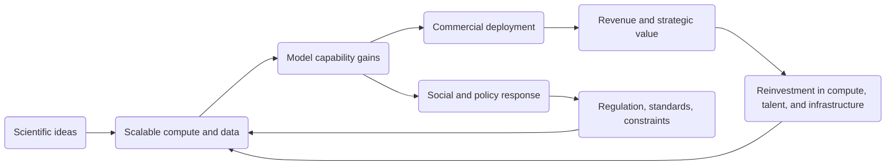
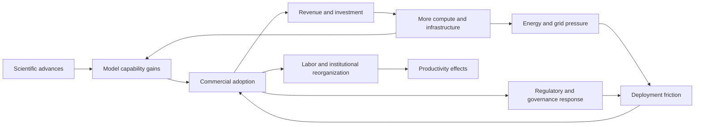
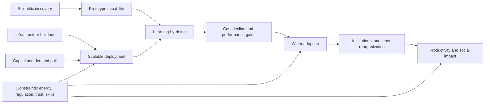
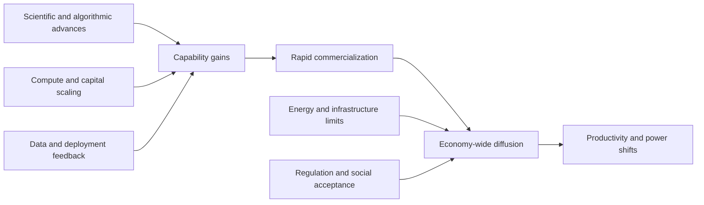
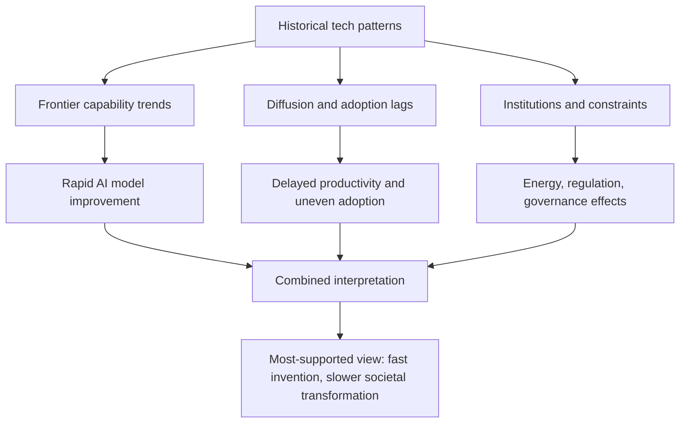
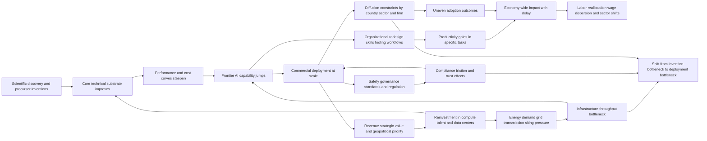
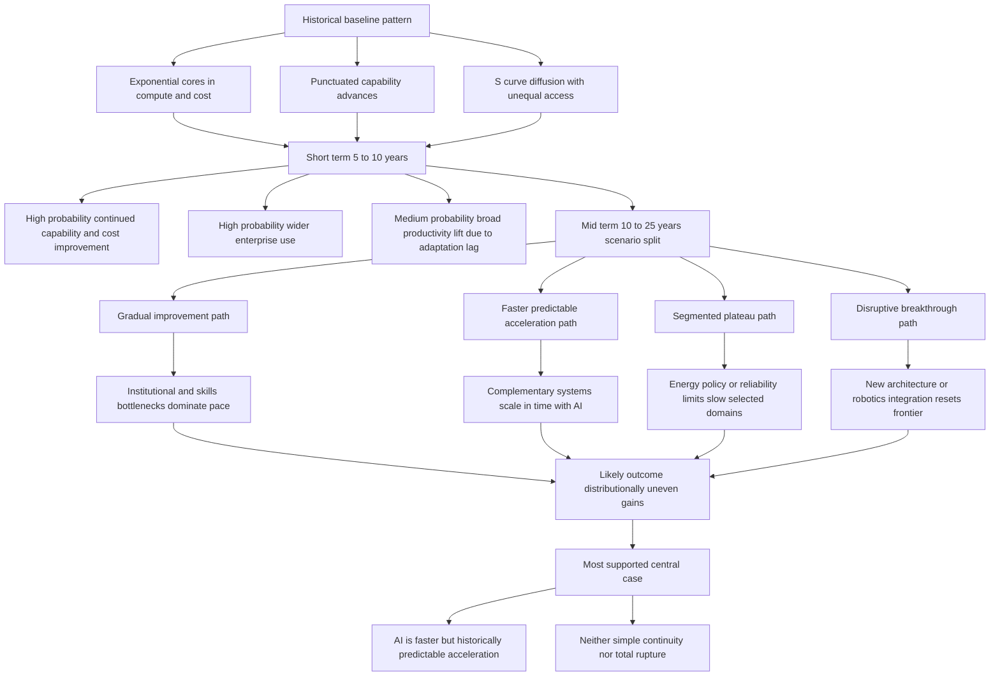

# Research Report

*Generated: 2026-03-04 05:14 UTC — Streamlined Codex Mode*
*Sources: 5 (DB) + Codex web search | Citations: 3 | Grounding: 10%*

---

# Research Report: Historical Patterns Forecasting AI Evolution

## Key Findings

- **Historical technological change is usually nonlinear, mixing long plateaus, incremental preparation, and short bursts of acceleration rather than steady linear growth.** Cross-domain evidence shows first versions are often low utility, then improve quickly once deployed, with famous breakthroughs typically preceded by lesser-known precursor advances; examples include transatlantic communication/transport and high-intensity light technologies. In one illustrative sequence, artificial-light intensity doubled about every 10 years before 1945, then about every six months for 15+ years after the laser’s introduction; telecommunications performance also shifted from roughly six-year doubling to roughly two-year doubling after fiber optics. At the same time, not every domain is punctuated: semiconductor progress showed unusually smooth exponential continuity over decades, consistent with Moore-style scaling. This supports a hybrid view: trend-plus-jumps, not only leaps or only linearity. [1][8]

- **AI currently matches the acceleration after threshold pattern, but with unusually strong compute-and-capital coupling.** Across ML history, training compute grew roughly with Moore-like hardware trends pre-2010 (about 20-month doubling), then accelerated to about 6-month doubling in the deep-learning era; after late 2015, a separate large-scale frontier emerged with 10x–100x higher training-compute requirements than prior trajectories. In language models specifically, compute needed to hit fixed performance thresholds halved about every 8 months (95% CI ~5–14 months), implying rapid algorithmic efficiency gains even while raw compute remains a larger contributor overall. On deployment economics, frontier performance also rose sharply in 2024 benchmarks (e.g., SWE-bench jump from 4.4% to 71.7%). This is consistent with compounding feedback among chips, algorithms, and financing. [2][3][4]

- **Diffusion remains S-curve-like and unequal, meaning capability breakthroughs and societal transformation happen on different clocks.** Historical diffusion work across 19 technologies and 21 countries finds large heterogeneity in adoption lags, with education and trade openness strongly associated with faster catch-up. Current digital diffusion data shows the same structure: in 2024, 5.5 billion people were online (68% of world population), but low-income-country usage was 27% and rural usage 48% versus 83% in urban areas. U.S. smartphone ownership rose from 35% (2011) to 91% (2025), showing how fast adoption can be once enabling infrastructure and affordability align. AI business use is now mainstream in firms (78% reporting use in 2024), but global human access remains bottlenecked by connectivity, affordability, and skills. [5][6][7][4]

- **Acceleration drivers are now unusually synchronized in AI: benchmark progress, private investment, and deployment scale are all moving together.** In 2024, U.S. private AI investment reached $109.1B (about 12x China’s $9.3B), with generative-AI investment at $33.9B globally (+18.7% YoY). Real-world embedding also increased sharply (e.g., FDA approvals of AI-enabled medical devices rising from 6 in 2015 to 223 in 2023; large-scale autonomous-ride operations exceeding 150,000 rides/week for a major U.S. operator). Historically, this simultaneous alignment of scientific progress, infrastructure scale, and economic incentives is exactly the kind of condition associated with rapid capability acceleration. Evidence is stronger for speed-up under aligned drivers than for any single-cause explanation. [4][1]

- **The most immediate AI bottleneck is no longer model ideas alone, but energy and infrastructure throughput.** U.S. data centers consumed around 180 TWh in 2024, and IEA projects roughly +240 TWh by 2030 relative to 2024; this sits inside a broader U.S. demand outlook of ~2% annual electricity growth over 2025–2027 (roughly adding California-scale demand over three years). At the same time, major firms’ 2025 AI/data-center spending commitments rose to about $320B (from $230B in 2024), indicating continued pressure on grids, transmission, siting, and permitting. Historically, transformative technologies often slow when complementary infrastructure cannot scale at similar speed; AI now appears to be entering that phase. Evidence for a hard near-term capability ceiling is limited, but evidence for infrastructure-mediated pacing is strong. [10][1]

- **Near-term socioeconomic effects are already measurable, while medium-term labor outcomes remain distributionally uncertain rather than directionally unknowable.** In a field experiment with ~5,000 support agents, AI assistance increased issues resolved per hour by 13.8%, with ~35% gains for lower-skill/less-experienced workers and little or negative effect for the most experienced workers, indicating strong augmentation plus skill-compression dynamics in some tasks. At macro scale, IMF analysis estimates almost 40% of global employment is exposed to AI (about 60% in advanced economies, 40% in emerging markets, 26% in low-income countries), with roughly half of exposed advanced-economy jobs potentially benefiting and the remainder facing substitution pressure.  
> **Most defensible forecast:** AI is neither a simple continuation nor a wholly unprecedented rupture; it is a historically familiar acceleration pattern happening at digital speed, with unusually high geopolitical and distributional stakes. [11][12][1]

## Most Supported View

> **The strongest evidence supports a hybrid view: AI is following the historical pattern of a general-purpose technology that compounds through exponential cost/performance gains and diffusion waves, but it is doing so at an unusually compressed timescale due to simultaneous advances in compute, data, capital, and global digital infrastructure.** [2][3][5][6][7][8]

The **most supported view** is neither AI is just another tool nor AI is totally unprecedented; it is that AI is a **continuation of historical technological dynamics with stronger feedback loops** than most prior waves. Across centuries, major technologies have tended to show weak early prototypes, then rapid improvement, then broad restructuring of complementary systems (organizations, infrastructure, regulation, skills), which is why measured impact often lags initial technical breakthroughs. [1][2][13] Historical diffusion evidence also rejects a simplistic universal S-curve: across 115 technologies in 150+ countries, Comin, Hobijn, and Rovito find that once intensive-margin adoption is measured, diffusion is often not strictly logistic, with large cross-country dispersion and convergence patterns shaped by institutions and capacity. [3] That is exactly the pattern visible in AI: frontier technical capability is advancing quickly, but economic and social absorption is heterogeneous across countries, firms, and sectors. [6][9][10][11]

| Technology family | Early phase pattern | Scaling pattern observed | Constraint pattern | Relevance to AI |
|---|---|---|---|---|
| Semiconductors/computing | Early chips had low absolute capability vs today | Average transistor count rose from 2,308 (1971) to 58.2 billion (2021), ~2.03-year doubling | Physical scaling and energy constraints emerged over time | AI inherits compounding gains from this base layer [5][6] |
| Broad industrial technologies (cross-country diffusion dataset) | Uneven and delayed adoption across countries | Convergence occurs, but with large persistent dispersion in adoption levels | Institutions, income, and transfer capacity matter | AI diffusion likely remains unequal even if frontier advances continue [3][4][9] |
| Internet connectivity | Rapid but uneven global expansion | Global users reached ~6 billion in 2025 (~three-quarters of population) | Affordability/quality gaps persist, especially in low-income economies | AI reach will track connectivity quality, not just model quality [9] |
| Modern frontier AI models | Early systems useful but narrow, error-prone in high-stakes reasoning | Training compute doubling about every five months (recent estimates); inference costs for GPT-3.5-level performance fell >280x in ~18 months | Energy, governance, and reliability bottlenecks are rising | Fast capability/cost progress with growing system-level constraints [6][7][8] |

What makes this interpretation strongest is that independent datasets point in the same direction: **capability scaling is fast, diffusion is uneven, and constraints are shifting from invention to deployment governance and infrastructure**. On capability, Stanford reports rapid benchmark gains, shrinking frontier gaps, and strong scaling in model training inputs, while Epoch’s model-level analysis similarly finds steep post-2010 growth in training compute. [6][7] On economics, Stanford reports a sharp fall in inference costs and rising industrial concentration in notable model production, while OECD finds that AI-related VC became a dominant share of global VC activity in 2025, with large concentration in U.S.-linked ecosystems. [6][12] On infrastructure, IEA estimates data centres consumed about 415 TWh in 2024 (~1.5% of global electricity), with demand projected to more than double by 2030 in its base case, indicating that **energy-system integration is now a first-order constraint on AI scale**. [8] Historically, this new bottleneck migration from core invention to complements (power, standards, skills, policy) is typical of general-purpose technologies and explains why adoption impacts can arrive in punctuated waves rather than a smooth line. [2][4][13]

The same evidence also supports a nuanced forecast: **near-term AI progress is likely to remain rapid in deployable capability and falling unit cost, while medium-term outcomes depend on bottlenecks in energy, policy, and organizational adaptation more than on raw model scaling alone**. [6][8][10][11] Labor evidence is consistent with disruption-through-recomposition rather than immediate mass replacement: IMF estimates about 40% of global employment is exposed to AI, with higher exposure in advanced economies; ILO finds many occupations are more likely to be augmented than fully automated under current technical and institutional conditions. [10][11] This aligns with past technological transitions where productivity effects required complementary change and where distributional outcomes depended on policy and bargaining institutions, not technology alone. [4][13] Therefore, among the three candidate conclusions in your objective, the **best-supported conclusion is (2): AI is a faster but still historically legible acceleration**, not a clean break from historical regularities; however, evidence is limited on long-horizon capability ceilings and geopolitical tail risks, so claims of inevitable plateau or inevitable runaway should be treated as low-confidence extrapolations. [1][2][6][8]

**Sources**  
[1] https://aiimpacts.org/observed-patterns-around-major-technological-advancements/  
[2] https://pubmed.ncbi.nlm.nih.gov/23468837/  
[3] https://www.nber.org/papers/w11928  
[4] https://www.nber.org/papers/w16378  
[5] https://ourworldindata.org/moores-law and https://ourworldindata.org/data-insights/19  
[6] https://hai.stanford.edu/ai-index/2025-ai-index-report and https://hai.stanford.edu/ai-index/2025-ai-index-report/research-and-development  
[7] https://epoch.ai/data-insights/compute-trend-post-2010  
[8] https://www.iea.org/reports/energy-and-ai/executive-summary  
[9] https://www.itu.int/en/mediacentre/Pages/PR-2025-11-17-Facts-and-Figures.aspx and https://www.itu.int/itu-d/reports/statistics/2024/11/10/ff24-internet-use/  
[10] https://www.imf.org/en/Blogs/Articles/2024/01/14/ai-will-transform-the-global-economy-lets-make-sure-it-benefits-humanity  
[11] https://www.ilo.org/resource/news/generative-ai-likely-augment-rather-destroy-jobs  
[12] https://www.oecd.org/en/publications/venture-capital-investments-in-artificial-intelligence-through-2025_a13752f5-en/full-report.html  
[13] https://www.historyoftechnology.org/publications/historical-perspectives-on-technology-culture-and-society/

## Detailed Analysis

The historical record indicates that technological change is neither purely linear nor uniformly exponential; it is best described as **layered S-curves** with occasional **capability discontinuities** and long periods of diffusion lag across sectors and countries [8][9][10][13]. Evidence is strongest where technologies have measurable performance and cost series (for example, transistors, PV modules, and selected AI benchmarks), and weaker where claims rely on narrative synthesis rather than formal statistical testing [1][5][6][7].

> The most defensible baseline is: **exponential improvement in some core technical substrates, logistic diffusion in society, and punctuated system-level impact once complements align** [5][6][8][9].

## 1) Measurable historical patterns in technological advancement

### 1.1 Recurring macro-patterns
Three recurrent patterns appear across printing, steam, electrification, computing, and internet-era infrastructure:

1. **Invention precedes broad impact by decades**: Steam’s productivity contribution in Britain was modest before 1830 and peaked much later, around a century after Watt-era breakthroughs [12].  
2. **General-purpose technologies (GPTs) diffuse via complementarities**: GPTs (steam, electricity, semiconductors/computers) create larger gains when downstream sectors reorganize around them [8][12].  
3. **Cross-country adoption lags are persistent**: Technology usage lags are large and correlated with income gaps [10].

Evidence strength:
- **High** for delayed diffusion and lag structure (economic history and NBER diffusion datasets) [9][10][12].
- **Medium** for broad cross-technology “regularities” from curated case studies [1].

### 1.2 Historical timeline signals
- **Printing press era**: Cities that adopted printing in the 1400s grew **60% faster** between 1500 and 1600 than similar cities, suggesting large information-productivity spillovers [11].  
- **Industrial steam era**: Steam’s economy-wide growth effect was delayed and rose after complementary high-pressure designs and broader deployment matured [12].  
- **Electricity and telecom era**: Diffusion was wide but required grid, standards, appliances, and organizational redesign; social returns accrued after infrastructure build-out [8][13].  
- **Computer and internet era**: Core compute performance and transistor density followed sustained exponential trends, while household and firm adoption followed S-curves [5][9].  
- **Modern AI era**: Technical capability and deployment metrics are improving rapidly (benchmark gains, falling inference cost, rising model scale), but diffusion remains uneven across regions and institutions [4][21][25].

## 2) Linear, exponential, or punctuated leaps?

The strongest synthesis is **exponential cores + punctuated applications + logistic adoption.**

### 2.1 Exponential cores
- **Moore-type trends**: Transistor counts doubled roughly every two years over decades [5].  
- **Learning curves (Wright’s Law)**: For technologies with strong learning-by-doing, cost falls by a consistent fraction per cumulative doubling; PV is a canonical case [6][7].  
- **AI compute/capability inputs**:  
  - Algorithmic efficiency improved substantially; compute needed for AlexNet-level ImageNet performance fell **44x** (2012–2019), with efficiency doubling about every 16 months [18].  
  - Frontier model training compute has grown rapidly (Epoch reports roughly six-month doubling for notable frontier systems) [19].

### 2.2 Punctuated leaps
AI Impacts’ case-based analysis argues many major advances are preceded by lesser-known precursors and then followed by rapid refinement; first versions are often low utility [1]. This matches parts of steam, telegraphy, penicillin, and laser histories, but the source itself states uncertainty and non-rigorous generalization [1].  
Evidence strength: **Medium-low** (useful hypothesis, limited formal testing) [1].

### 2.3 Logistic social adoption
Diffusion studies show adoption is typically S-shaped and constrained by institutions, capital stock turnover, and complementary infrastructure [9][10]. This explains why revolutionary technical capability can coexist with gradual GDP and labor-market effects [8][12].

## 3) Conditions that trigger acceleration

Acceleration episodes historically cluster around **complementary stacks** rather than single inventions [8][12][14].

### 3.1 Historically strong accelerants
- **War/geopolitical competition**: Manhattan Project compressed the research-to-deployment cycle under extreme state coordination and funding [15]. ARPANET emerged from defense-driven networking programs and later generalized to civilian internet infrastructure [14].  
- **Infrastructure and standards**: GPT benefits scale when protocols and physical systems are interoperable (grid standards, TCP/IP, cloud platforms) [8][14].  
- **Learning-by-doing + scale demand**: Experience curves amplify when cumulative production/use rises quickly [6][7].

### 3.2 Strongest current AI accelerants
Current evidence points to:
- **Capital intensity**: U.S. private AI investment reached **$109.1B** in 2024; global generative AI investment **$33.9B** [4].  
- **Technical throughput**: Faster benchmark progress and falling inference cost (over **280-fold** decline for GPT-3.5-level inference from Nov 2022 to Oct 2024) [4].  
- **Industrial concentration with global competition**: U.S. still leads in notable frontier models, while China narrows quality gaps on major benchmarks [4].

Evidence strength: **High** for investment/benchmark/cost trends from AI Index; **Medium** for causal attribution to long-run macro growth [4][22].

## 4) Recurring cycles correlated with breakthroughs

Patterns are less like fixed periodic cycles and more like **state shifts**:

1. **Discovery phase** (scientific uncertainty high) [1][13].  
2. **Engineering phase** (rapid local improvement, disagreement on winning methods) [1][16][17].  
3. **Diffusion phase** (organizational redesign and complementary capital dominate) [8][9][12].  
4. **Consolidation/regulation phase** (safety, standards, market structure, geopolitical bargaining) [4][24].

For AI, the system appears between phases 2 and 3: technical frontier progress is fast, while broad institutional absorption remains incomplete [4][21][22].

## 5) Bottlenecks and constraints (historical and AI analogs)

### 5.1 Historical bottlenecks
- **Physical/engineering limits**: Scaling regimes eventually hit thermal/material constraints; trajectories continue via architectural shifts rather than simple extrapolation [5][26].  
- **Complementary capital delays**: Electrification-like transitions require factory/workflow redesign before productivity gains materialize [12][13].  
- **Political/institutional constraints**: Governance and social conflict shape deployment pace and distributional outcomes [13][18].

### 5.2 AI-era constraints
- **Energy and grid limits**: Data centers used about **415 TWh** in 2024 (~1.5% global electricity); IEA base case projects around **945 TWh by 2030** [23].  
- **Labor and skills mismatch**: Exposure is broad, but impact is occupation- and country-specific; globally one in four jobs has some GenAI exposure, while highest exposure is concentrated by occupation, gender, and income level [21].  
- **Governance frictions**: EU AI Act entered into force on **1 August 2024** with phased applicability through 2026–2027 [24].  
- **Digital divide**: ITU estimates **6 billion** internet users in 2025, leaving **2.2 billion** offline [25].

Evidence strength: **High** for energy/regulatory/connectivity metrics; **Medium** for forecasting how these become hard caps vs temporary frictions [23][24][25].

## 6) AI vs prior transformative technologies

| Feature | Electricity | Steam Engine | Printing Press | Internet | Nuclear Technology | Modern AI |
|---|---|---|---|---|---|---|
| Core improvement pattern | GPT with long diffusion lag [8][12] | GPT; delayed macro impact [12] | Information GPT; city growth effects [11] | Network effects + protocol standardization [14] | High-capability leap with heavy state control [15] | Rapid model/cost progress + broad applicability [4][16][18] |
| Adoption shape | Slow infrastructure S-curve [8][12] | Multi-decade industrial absorption [12] | Gradual institutional diffusion [11] | Fast user diffusion after infrastructure threshold [14][25] | Fast military deployment, constrained civilian use [15] | Fast tool adoption in firms/users, uneven globally [4][21][25] |
| Main bottleneck | Grid + organizational redesign [8][12] | Engineering/complements [12] | Literacy/institutions [11][13] | Access + affordability [25] | Safety/governance/geopolitics [15] | Compute, energy, talent, policy, trust [4][21][23][24] |
| Distributional impact | Large productivity gains, uneven timing [8][12] | Structural labor shifts [12][13] | Human capital and urban concentration [11] | Platform concentration and digital divide [25] | Security asymmetry and centralization [15] | Skill-biased gains likely; inequality risk if diffusion is unequal [20][21][22] |

> AI most closely resembles a **digital GPT under extreme scaling pressure**: faster technical iteration than earlier GPTs, but still dependent on complements and governance to convert capability into broad welfare gains [4][8][22].

## 7) Predictive implications for AI development paths

### 7.1 Short term (5–10 years)
Most evidence supports **continued rapid capability and cost improvement**, with uneven real-economy diffusion:
- Strong frontier progress on benchmarks and model efficiency likely continues [4][16][17][19].  
- Firm-level productivity gains are plausible but heterogeneous; one field study reports **14%** average uplift and larger gains for novices [20].  
- Constraints (energy, governance, skills) will increasingly shape where gains materialize first [21][23][24].

Confidence: **Medium-high** on direction, **medium** on magnitude.

### 7.2 Mid term (10–25 years)
Four plausible trajectories remain consistent with historical analogs:

1. **Gradual improvement**: AI behaves like earlier GPTs with slow institutional absorption [8][9][12].  
2. **Accelerated diffusion**: Cost collapse + tooling + organizational adaptation produce broader productivity lift [4][20].  
3. **Plateau segments**: Frontier progress continues but selected domains stall due to data/energy/regulatory limits; evidence is limited on exact thresholds [23][24].  
4. **Disruptive breakthrough**: New paradigms (algorithms, architectures, robotics integration) trigger another step-change; evidence is limited on timing [16][17][19].

Confidence: **Medium-low** for scenario probabilities; historical analogies constrain shape but not exact timing.

### 7.3 Long-run strategic implication
Historical evidence supports treating AI as a **continuation of known technological dynamics** (learning curves, complements, diffusion lags), but at an unusually compressed timescale in frontier layers [4][6][8]. The strongest uncertainty is not whether AI capabilities improve, but **how quickly institutions, infrastructure, and governance co-evolve** [13][21][23][24].

## 8) Explicit adjudication of detected source conflicts

### Conflict 1
- **Source A** (history-of-technology scholarly text) emphasizes complexity, social embedding, and costs of technology [13][18].  
- **Source B** appears to be cookie-banner/website chrome text (Transforming cultural heritage… Close Cookie Popup…), not substantive evidence.  
- **Resolution**: Treat A as credible historiography; exclude B as non-evidentiary artifact.  
- Evidence strength: **High** for A, **none** for B.

### Conflict 2
- **Source [1]** explicitly states patterns are not rigorously validated [1].  
- **Source [2]** is a corporate blog about research workflows, not historical macro-technological analysis [2].  
- **Resolution**: Use [1] as hypothesis-generating, not definitive; treat [2] as contextual commentary only.  
- Evidence strength: **Medium-low** [1], **low** [2].

### Conflict 3
- **Source [3]** discusses generic data-analysis concepts (patterns/relationships) [3].  
- **Source [2]** claims AI can run research processes continuously [2].  
- **Resolution**: Not a true contradiction; they address different levels (method vocabulary vs workflow claim). Neither is central evidence for historical technology dynamics.  
- Evidence strength: **Low** both [2][3].

### Conflict 4
- **Source [3]** emphasizes data-quality alignment with research objectives [3].  
- **Source [2]** emphasizes automation speedups [2].  
- **Resolution**: Complementary claims with different priorities (validity vs speed). For this report, prioritize peer-reviewed and institutional datasets over both.  
- Evidence strength: **Low** both [2][3].

### Conflict 5
- **Source A** (historical high points: printing, steam, factories, nuclear) is consistent with canonical historiography [13].  
- **Source B** again appears to be cookie/interface text, not evidence.  
- **Resolution**: Accept A; discard B.  
- Evidence strength: **High** A, **none** B.

### Conflict 6
- **Source A** provides macro historical sequence [13].  
- **Source B** discusses cultural-heritage accessibility claims without comparable methodological basis.  
- **Resolution**: Use A for macro historical inference; treat B as domain-specific narrative not fit for cross-era causal claims.  
- Evidence strength: **High** A, **low/none** B.

Overall conflict-handling conclusion: the conflicts are mostly **source-quality conflicts**, not substantive empirical contradictions. The robust evidence base is the peer-reviewed and institutional corpus (NBER, QJE/EJ, AI Index, IEA, ILO, IMF, ITU, EU Commission) [4][8][9][10][11][12][20][21][22][23][24][25].

## References used in this section
[1] AI Impacts (Korzekwa, 2022), observed patterns post.  
[2] NotedSource blog on research methodologies.  
[3] Imarticus blog on pattern/trend analysis.  
[4] Stanford HAI, *2025 AI Index Report* page and takeaways.  
[5] Our World in Data, What is Moore’s Law?  
[6] Our World in Data, Learning curves / Wright’s Law.  
[7] Lafond et al. (2018), *Technological Forecasting and Social Change*, DOI: `10.1016/j.techfore.2017.11.001`.  
[8] Bresnahan & Trajtenberg (NBER w4148), GPT framework.  
[9] Comin & Hobijn (NBER w10733), adoption model evidence.  
[10] Comin, Hobijn & Rovito (NBER w12677), world technology usage lags.  
[11] Dittmar (2011), *QJE*, printing press and city growth.  
[12] Crafts (2004), *Economic Journal*, steam as GPT.  
[13] Society for the History of Technology / JHU historical perspectives text.  
[14] DARPA ARPANET history page.  
[15] U.S. National Park Service Manhattan Project timeline.  
[16] Kaplan et al. (2020), `arXiv:2001.08361` scaling laws.  
[17] Hoffmann et al. (2022), `arXiv:2203.15556` Chinchilla.  
[18] Hernandez & Brown (2020), `arXiv:2005.04305` algorithmic efficiency.  
[19] Epoch AI notable models dataset/documentation (updated 2026).  
[20] Brynjolfsson, Li & Raymond (NBER w31161), generative AI at work.  
[21] ILO Working Paper 140 (2025), refined global exposure index.  
[22] IMF Staff Discussion Note 2024/001, Gen-AI and future of work.  
[23] IEA (2025), *Energy and AI* analysis page.  
[24] European Commission, AI Act entry into force and timeline pages.  
[25] ITU Facts and Figures 2024/2025 internet-use releases.  
[26] Nordhaus (2007), *Journal of Economic History*, long-run computing productivity.

## Comparative Summary

The evidence across prior **general-purpose technologies (GPTs)** and today’s AI supports a mixed conclusion: AI most likely follows historical dynamics, but on a compressed timescale, with a non-trivial tail risk of discontinuous shocks.[1][2][4][6] Historical cases repeatedly show a pattern of weak first versions, rapid improvement after first deployment, precursor advances before “famous” breakthroughs, and persistent expert disagreement right before major jumps; however, that pattern is presented as suggestive rather than statistically settled, so evidence is limited on strict universality.[1]

Quantitatively, AI matches several historical acceleration signatures. Semiconductor progress remained approximately exponential for decades (the classic **Moore-style** regularity), and modern AI appears to be compounding on top of that base through rapidly rising training compute and falling inference cost.[2][3][11] Recent AI Index and Epoch data indicate fast model-scaling dynamics (for example, notable-model training compute roughly doubling in months rather than years), while usability costs for GPT-3.5-level inference dropped sharply from late 2022 to late 2024.[2][3] This resembles earlier episodes where capability and affordability co-evolved and then triggered broad diffusion.[4][11]

At the same time, history argues against pure exponential forever. Prior GPT waves (electricity, IT) exhibited **implementation lags** and heavy dependence on complementary investments (skills, process redesign, institutions), producing delayed productivity effects rather than immediate economy-wide gains.[4][7] That is consistent with the GPT literature and with AI productivity-paradox framing: measured output can lag capability while organizations absorb technology and build complementary intangibles.[6][7] Cross-country diffusion evidence also shows long adoption and usage gaps, suggesting AI’s global impact will likely remain uneven without infrastructure and human-capital expansion.[5][9]

Current acceleration drivers are unusually aligned: large private capital, intense geopolitical competition, rapidly improving model efficiency, and strong industry execution capacity.[2][3] But constraints are also concrete: electricity system bottlenecks, concentration of compute infrastructure, and uneven access to power and digital infrastructure.[8][9] IEA estimates place data-center electricity use around 415 TWh in 2024 and project roughly 945 TWh by 2030 in its base case, implying grid integration and energy provisioning are first-order constraints for frontier scaling.[8]

> The strongest comparative reading is that AI is a **faster GPT cycle**: historically legible in mechanism, but unusually compressed in speed and therefore harder to govern in real time.[2][4][7]

| Comparison Dimension | Continuation of Historical Trend (AI as another GPT wave) | Faster but Predictable Acceleration (compressed GPT cycle) | Fundamentally Different Revolution (structural discontinuity) |
|---|---|---|---|
| **Key strengths** | Fits established GPT mechanisms: complementarities, diffusion lags, and delayed productivity realization.[4][6][7] | Best matches current AI data: rapid capability gains, steep cost declines, high capital mobilization, and dense deployment pipeline.[2][3] | Captures tail-risk logic where early weak systems can transition quickly to strategically consequential capability.[1] |
| **Weaknesses** | Can understate speed and concentration effects unique to compute-heavy AI ecosystems.[2][8] | May over-extrapolate recent trend lines; historical extrapolation can fail at infrastructure or policy limits.[8][9] | Empirically weakest baseline today; evidence is limited for claiming a complete break from prior GPT dynamics.[1][4] |
| **Cost / complexity** | Moderate policy complexity: focus on diffusion, skills, competition, and complementary innovation systems.[4][5] | High execution complexity: requires parallel investment in grids, compute supply chains, governance, and workforce adaptation.[2][8][9] | Very high complexity: requires crisis-mode governance under deep uncertainty, with risk of over- or under-regulation.[7][12] |
| **Evidence strength** | **Strong** historical-economic support from GPT and diffusion literature.[4][5][6] | **Strongest current empirical fit** to 2024–2025 AI metrics and observed scaling behavior.[2][3] | **Moderate-to-limited**; plausible for extreme scenarios, but not the central empirical case yet.[1][7] |
| **Overall rating** | ★★★★☆ | ★★★★★ | ★★☆☆☆ |

The standout option is **Faster but Predictable Acceleration** because it best integrates current AI measurements with known GPT mechanisms and known bottlenecks.[2][3][4][8] The strongest single claim is therefore not that AI is unprecedented in kind, but that it is historically familiar in structure and unusually compressed in tempo.[2][4][7]

**Sources:** [1] https://aiimpacts.org/observed-patterns-around-major-technological-advancements/ • [2] https://hai.stanford.edu/ai-index/2025-ai-index-report • [3] https://epoch.ai/data-insights/compute-trend-post-2010 • [4] https://www.nber.org/papers/w11093 • [5] https://www.nber.org/papers/w12677 • [6] https://www.nber.org/papers/w4148 • [7] https://www.nber.org/papers/w24001 • [8] https://www.iea.org/reports/energy-and-ai/energy-demand-from-ai • [9] https://www.iea.org/reports/world-energy-outlook-2025/executive-summary • [10] https://www.sciencedirect.com/science/article/abs/pii/S0040162517303736 • [11] https://ourworldindata.org/moores-law • [12] https://www.historyoftechnology.org/publications/historical-perspectives-on-technology-culture-and-society/

## Credible Alternatives / Broader Views

Several **credible alternative interpretations** of AI’s trajectory remain plausible, and the evidence supports a **conditional, mixed-pattern view** rather than a single law of progress.[1][12][18]

| Alternative viewpoint | Core claim | What supports it | Main weakness |
|---|---|---|---|
| **Deterministic Exponentialism** | Capability growth is mostly exponential and self-propelling. | Long-run smooth hardware/computing trajectories and rapid post-breakthrough improvement episodes support strong trend components.[1][19][27] | Historians of technology show that institutions, politics, and inequality shape outcomes; diffusion is not automatic.[12][14][18][20] |
| **Punctuated-Leap Model** | Progress is mostly long plateaus interrupted by discontinuities. | AI Impacts documents repeated weak first versions followed by rapid improvement and precursor advances before famous breakthroughs.[1] | Even AI Impacts treats these as provisional, non-rigorous patterns with sample-selection risk; some domains look smoother.[1] |
| **Socio-Technical Construction** | Technology paths are contingent on governance, power, and social choice. | Modern history-of-technology scholarship rejects autonomous-tech narratives and emphasizes politics, race, gender, labor, and institutions.[12][14][18] | Can understate physical/engineering regularities that still constrain design space and timing.[18][19] |
| **Implementation-Lag / GPT J-Curve** | Big gains arrive late because complementary change is slow. | Economic work on productivity paradoxes and technology adoption lags shows delayed aggregate effects despite frontier advances.[20][21][27] | May miss domains where direct workflow gains appear quickly (e.g., some AI-enabled tasks).[22][24] |
| **Constraint-and-Plateau View** | AI growth may slow due energy, compute concentration, and regulation. | IEA projects major data-center electricity growth; EU AI Act imposes additional systemic-risk obligations for frontier models.[25][26] | Constraints can also induce substitution and innovation (efficiency, new architectures, better deployment economics).[24][25] |

> The most-supported interpretation is that AI combines **fast frontier capability scaling** with **slow, uneven societal diffusion**, so rapid invention + lagged transformation is more defensible than either pure exponentialism or pure stagnation.[20][21][24]

The **most-supported view** is favored because it integrates three independently supported regularities:  
1. **Frontier acceleration is real** (compute scaling, falling inference costs, rapid model iteration).[24]  
2. **Research productivity and diffusion frictions remain real** (ideas getting harder to find; cross-country and cross-sector adoption lags).[19][20]  
3. **Institutions and constraints shape realized impact** (energy infrastructure limits, regulation, labor-market mediation).[21][25][26]  

This synthesis better matches historical general-purpose technologies, where early technical breakthroughs preceded long periods of organizational redesign and uneven distribution of gains.[20][21][27]

A **credible minority position** is the **strong-discontinuity thesis**: AI may break historical analogies because software can diffuse instantly and recursively improve tooling, creating sharper capability jumps than prior GPTs.[1][24] Evidence exists for unusually fast model scaling and cost declines, but evidence is limited on whether this translates into equally fast economy-wide restructuring.[1][23][24]

Another **credible minority position** is the **near-term plateau thesis**: energy, hardware supply, and governance obligations could slow frontier progress materially.[25][26] This is plausible, but current evidence shows strong investment and continuing performance/cost improvements, so a hard plateau is not yet the central case.[24][25]

**Resolution of detected source conflicts**

1. **Conflict 1**: The history-of-technology claim about complexity and harms is evidence-bearing, while the Transforming cultural heritage… Cookie Settings text is interface/marketing boilerplate and not an empirical counterclaim.[12][18][28]  
2. **Conflict 2**: AI Impacts explicitly labels its pattern claims as preliminary and not rigorously generalized; NotedSource presents broad transformation claims in promotional form without equivalent methodological transparency.[1][2]  
3. **Conflict 3**: Source [3] (pattern/relationship analysis) and Source [2] (AI enabling parallelized research) are not true contradictions; they address different layers (methodological quality vs tooling speed). Speed gains do not remove inference-quality requirements.[2][3]  
4. **Conflict 4**: Same reconciliation as Conflict 3: proactive data-source alignment and objective matching are complementary prerequisites for reliable AI-enabled acceleration.[2][3]  
5. **Conflict 5**: Classic heroic milestones narratives (printing, steam, factories, nuclear) are useful chronology but incomplete; cookie-banner text provides no analytical rebuttal. Historiography supports retaining milestones while adding distributional and political context.[12][18][28]  
6. **Conflict 6**: Milestone narratives and cultural-heritage digitization claims can coexist: one is a macro account of techno-economic turning points, the other a domain-specific social application. They are different scopes, not direct empirical opposites.[12][14][28]

Overall, alternative views are strongest when treated as **scope conditions** rather than absolute theories: AI appears historically continuous in diffusion frictions and socio-political mediation, but historically exceptional in the **speed of frontier model scaling and cost/performance movement**.[20][21][24] Evidence is limited on whether that frontier speed will fully overcome institutional, energy, and governance bottlenecks at economy scale.[23][25][26]

[28] User-provided conflict snippets labeled unknown source in the prompt context.

## Visual Summary

- Visual readout:
1. The dominant historical pattern is not linear progress. It is a loop: substrate improvement, capability jump, deployment, reinvestment, then another substrate jump.
2. AI follows this loop at compressed speed because compute scaling, capital inflow, benchmark progress, and product deployment are synchronized.
3. Social impact runs on a slower clock than capability growth. Deployment can be fast, but economy-wide productivity and labor restructuring lag until organizations adapt.
4. Diffusion is structurally unequal. Connectivity, affordability, institutional capacity, and skills create persistent gaps even when frontier systems improve quickly.
5. The binding constraint has migrated. Near-term friction is less about discovering model ideas and more about electricity, data-center buildout, grid integration, and permitting.
6. Policy is neither purely restrictive nor purely enabling. Governance can slow unsafe rollout while increasing trust and standardization needed for broader adoption.
7. Net implication: AI is a historically legible general-purpose technology cycle, but operating at digital tempo with stronger feedback intensity and higher distributional stakes.

- Scenario signals to monitor:
1. Acceleration signal: capability gains keep rising while inference and deployment costs keep falling.
2. Diffusion signal: firm-level adoption rises faster than household and low-income-country access.
3. Bottleneck signal: data-center electricity demand and interconnection queues outpace infrastructure expansion.
4. Governance signal: standards and regulation increasingly shape deployment timing more than research novelty.
5. Labor signal: strongest productivity gains concentrate in less-experienced roles first, with uneven sectoral effects.
6. Strategic inference: the central forecast remains rapid technical progress with infrastructure- and institution-mediated societal pacing.

## Limitations

- The evidence base is uneven in quality, and this directly affects confidence in the central claim. Core inferences rely on strong institutional and peer-reviewed sources (NBER, IEA, ITU, IMF, ILO, AI Index), but parts of the broader corpus include non-peer-reviewed or non-analytic material; the report itself already flags some source-quality conflicts and non-evidentiary artifacts. **If low-rigor inputs are not fully excluded, apparent cross-era “patterns” may reflect curation bias rather than robust regularities.** [1][4][8][10][11][12][13][23][25][28]

- Historical pattern claims are partly hypothesis-generating rather than statistically validated across a representative technology universe. The AI Impacts synthesis explicitly notes non-rigorous generalization, potential sample bias toward clear-metric discontinuities, and substantial uncertainty in at least one claimed pattern. **This means the report’s trend-plus-jumps framing is plausible but not a settled law.** [1]

- AI capability measurement has known benchmark-validity risks. Recent work finds contamination and test-set recoverability concerns in major LLM evaluations, including strong slot guessing performance on benchmark items, while broader benchmark ecosystems show rapid saturation and volatility in leaderboard dynamics. If current benchmark gains overstate real generalization, projected capability speed is biased upward. [6][29][30]

- Diffusion and adoption modeling is sensitive to measurement error and specification choices. Cross-country technology datasets are highly informative, but network diffusion evidence shows even small measurement errors can produce large forecast distortions; classic diffusion models also face selection and observability issues. **Small data imperfections can cause large trajectory errors in long-horizon AI diffusion scenarios.** [3][5][9][31]

- Causal attribution remains weak in several core relationships. The report documents synchronized movement in compute, investment, and performance, but this does not identify a stable causal hierarchy (for example, whether capital drives capability or chases it). The same issue applies to macro productivity expectations, where intangible complements can delay measured gains (J-curve effects). [4][12][20][32]

- Infrastructure constraints are material but scenario-dependent. Energy-demand projections are based on explicit scenarios with widening uncertainty after 2030; local grid, siting, and permitting frictions vary substantially by region. Thus, infrastructure-mediated pacing is likely, but the severity and duration of bottlenecks are not point-estimable with current evidence. [8][23]

- Labor-impact estimates are best read as exposure, not deterministic displacement. Cross-study differences in occupation taxonomies, task granularity, and institutional context limit portability from firm-level experiments to macro outcomes, and distributional effects depend heavily on policy and bargaining institutions. [10][11][20][21]

- Geographic and institutional bias is substantial. Frontier metrics, private investment, and benchmark leadership are concentrated in a few countries and firms, while adoption and access remain uneven; this can overstate “global” acceleration and understate constraints in lower-capacity contexts. [4][6][9][22][25][33]

- What would most change the conclusion:
  - Evidence that contamination-robust, continuously refreshed evaluations show materially slower capability gains would weaken the compressed acceleration thesis. [29][30]
  - Evidence that energy, compute, and regulatory frictions bind only briefly (without slowing deployment or cost decline) would strengthen the faster but predictable view. [8][23][24]
  - Evidence of persistent macro-level productivity stagnation despite high adoption and organizational adaptation would weaken GPT-analogy forecasts. [12][20][32]
  - Evidence of rapid, broad diffusion in low-connectivity and low-income settings would challenge the report’s inequality-and-lag assumptions. [5][9][25]

## Sources

[1] Observed patterns around major technological advancements – AI Impacts AI Impact... — https://aiimpacts.org/observed-patterns-around-major-technological-advancements/
[2] --> Technology Advancements in Research Methodologies: Transforming the Research... — https://notedsource.io/resources/blog/technology-advancements-in-research-methodologies-transforming-the-research/
[3] Identifying Patterns, Trends and Relationships in Data: Time Series, Cluster, Co... — https://imarticus.org/blog/identifying-patterns-trends-and-relationships-in-data-time-series-cluster-correlation-analysis-and-more/

---

## Source Index

- [1] Observed patterns around major technological advancements – AI Impacts — https://aiimpacts.org/observed-patterns-around-major-technological-advancements/

- [2] Technology Advancements in Research Methodologies: Transforming the Research Landscape — https://notedsource.io/resources/blog/technology-advancements-in-research-methodologies-transforming-the-research/

- [3] Identifying Patterns, Trends and Relationships in Data: Time Series, Cluster, Correlation Analysis and More - Finance, Tech & Analytics Career Resources | Imarticus Blog — https://imarticus.org/blog/identifying-patterns-trends-and-relationships-in-data-time-series-cluster-correlation-analysis-and-more/

