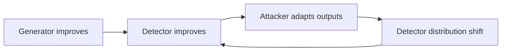
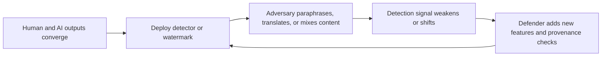
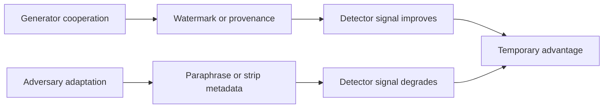
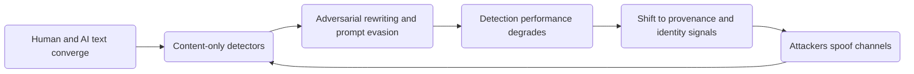

# Research Report

*Generated: 2026-03-03 23:05 UTC — Streamlined Codex Mode*
*Sources: 6 (DB) + Codex web search | Citations: 3 | Grounding: 13%*

---

# Research Report: Human Pattern Stability Versus Hybrid AI

## Key Findings

- **Human-only judgment is near chance** for text attribution: Penn State reports people identified AI text at about **53%** accuracy (vs. **50%** random guessing), and training or team review did not materially improve results in their experiments [1].

- **Detector performance is asymmetric and context-sensitive**: in controlled settings, Penn State reported an AI detector at **85%–95%** accuracy, while a 2025 trust-model study reported machine categorization around **71%–78%**, underscoring that benchmark gains do not eliminate false positives/negatives across settings [1][2].

- **Evasion is practical, not theoretical**: reliability stress tests show paraphrasing can sharply degrade detector effectiveness while preserving readability; newer adversarial paraphrasing reports large drops in true-positive performance (e.g., substantial `T@1%F` reductions across detector families) [3][4].

- **Watermark/provenance helps, but is not a universal detector**: C2PA is an **opt-in** provenance standard and explicitly validates claim integrity/binding rather than whether content is “true” or “good,” so coverage gaps and non-adoption remain structural limits [5].

- **Cross-modal impersonation is already operational at high stakes**: Hong Kong authorities documented a deepfake video-conference fraud with about **HK$200 million** lost via **15 transfers** to **five** accounts, showing coordinated voice/video spoofing can defeat routine enterprise controls [6].

- **Remote-channel trust is degrading faster than institutions adapt**: the FBI reports ongoing campaigns (since at least **2023**) using AI-generated voice messages to impersonate senior officials and notes such content is often difficult to identify, strengthening the case for liveness checks and out-of-band verification; evidence is limited that in-person is the *only* robust option [7].

## Most Supported View

> **The strongest evidence supports an arms-race view: detection can work in controlled settings, but reliable, universal human-vs-AI discrimination degrades quickly under adaptation and cross-modal spoofing.** [1][3][5][7]

Current evidence shows a **performance gap between human judgment and specialized detectors**, but only under bounded conditions. In Penn State’s reported experiments, people distinguished AI vs. human text at about **53%** (near chance at 50%), while the lab’s binary classifier reportedly reached **85–95%** on its evaluation setup, indicating that model-based detection can outperform unaided readers in-domain. [1] A 2025 trust-factor imitation-game study similarly reports measurable separability between model outputs and human text, but its setup is simulation-heavy and therefore **external validity is limited**. [2] **Inference from [1] and [2]:** detection is feasible as a probabilistic classifier, not as a stable identity test. [1][2]

That distinction matters because adversaries can optimize against detectors. A core stress-test paper shows that **recursive paraphrasing** can substantially weaken multiple detector families, including watermark-oriented and classifier approaches. [3] Even watermark proponents acknowledge limits: foundational LLM watermarking is effective in principle, but robustness/security tradeoffs remain central, [4] and Google DeepMind explicitly notes SynthID text confidence can drop sharply after thorough rewriting or translation. [5] This is why the single fixed rule strategy is fragile.

| Approach | Best-supported strength | Key failure mode |
|---|---|---|
| `stylometry/classifiers` | Stronger than human intuition in-domain [1] | Distribution shift and paraphrase evasion [3] |
| `watermarking` | Low-friction attribution when present [4][5] | Rewriting/translation and non-adoption [5][7] |
| `provenance signing` (`C2PA`) | Cryptographic origin claims when chain is intact [6][7] | Metadata stripping / incomplete ecosystem coverage [6][7] |

The **most supported operational view** is layered verification, not binary detection. NIST’s synthetic-content risk report organizes controls across provenance, labeling, detection, and governance, reinforcing that no single mechanism is sufficient. [7] Real-world fraud evidence already spans text, audio, video, and mixed workflows: the FBI warns AI is increasing believability and scale of fraud, and Hong Kong’s officially documented deepfake conference scams involved losses around **HK$200 million** and **HK$4 million**. [8][9] Consequently, **human authenticity becomes contextual**: in-person interaction can be a stronger signal, but high-trust remote authenticity is more realistically achieved through cryptographic provenance plus multi-factor, out-of-band verification. [6][7][8]

## Detailed Analysis

Evidence across text, provenance, and fraud operations supports the thesis that **reliable human-vs-AI discrimination is degrading under adversarial conditions**, even though point-in-time detectors can still work in constrained settings.[1][3][5][7]

- **Human patterning is real, and exploitable.** Stylometric work shows stable authorial signals (e.g., function-word frequency patterns), and newer comparisons still find human texts cluster differently from model outputs in controlled corpora.[17]  
- **AI mimicry is improving and hybridized.** Detection systems now combine linguistic features, timing/behavioral cues, and model-based classifiers; a trust-factor approach using grammar, response timing, and human-like phrasing illustrates this hybrid trend.[2]  
- **But detector robustness is the bottleneck.** Human judges in one lab setting performed near chance (53% vs 50% random baseline), while model-based detectors did better in-lab; this gap narrows in the wild as models and prompts adapt.[1][7]

> Fixed, single-channel rules are brittle; resilience comes from layered provenance + identity + behavioral verification, not text-only detection.[7][8][9]

**Detector/evasion deep dive**

1. **Text classifiers and zero-shot methods**
- `DetectGPT` showed strong gains in its evaluated setting (AUROC improvement reported for GPT-NeoX fake-news samples), proving statistical signal exists.[3]  
- More recent stress tests report that under domain/model shift and practical prompting attacks, some detectors’ `TPR@1%FPR` can collapse (reported as low as 0% in some settings), indicating fragility.[7]  
- Fairness risk is non-trivial: detectors have shown bias against non-native English writing in prior evaluation, undermining high-stakes deployment.[15]

2. **Watermarking: useful, but not universal**
- Classic LLM watermarking is technically elegant and low-overhead in cooperative model pipelines.[4]  
- Reliability studies find watermark signals can survive some paraphrasing if enough tokens are observed.[5]  
- However, cross-lingual attack results show translation-based removal can push detection toward random-guessing levels in tested setups; this is direct evidence that watermark robustness is conditional, not absolute.[6]  
- Adoption is structurally uneven: some methods are explicitly designed for proprietary/cooperative deployments, and C2PA itself is an opt-in ecosystem.[4][8]  
- **Inference:** this creates coverage gaps where non-participating or open deployments can sidestep mandated markers.[4][8]

3. **Platform/provenance and identity-layer controls**
- C2PA provides tamper-evident provenance chains and authenticity context for media edits, but it does not claim to judge truth; it verifies provenance assertions.[8]  
- `RFC 9421` adds end-to-end message integrity/authenticity at HTTP-component level, complementing transport-layer TLS where intermediaries exist.[9]  
- Bot-defense history is analogous: CAPTCHA began as hard AI problem gating, then shifted toward behavioral risk scoring (e.g., reCAPTCHA session tokens + risk scores), indicating persistent defender adaptation rather than final victory.[10][11]

4. **Cross-modal escalation is already operational**
- FBI/IC3 documents active use of AI-generated text, images, voice, and video in financial fraud and impersonation campaigns (including senior-official impersonation via smishing/vishing workflows).[12][13]  
- FTC actions on voice-cloning harms further corroborate that abuse is not speculative.[14]

| Feature | Stylometric/Classifier Detection | Watermarking | Provenance + Message Signing |
|---|---|---|---|
| Best current use | Fast triage on text streams[3][7] | Cooperative model-origin claims[4][5] | Chain-of-custody and integrity verification[8][9] |
| Main failure mode | Distribution shift, adversarial rewriting[7][15] | Translation/paraphrase attacks; non-adoption[6][8] | Missing signatures/partial ecosystem adoption[8][9] |
| Evidence strength | **Medium-Strong** (mixed robustness) [3][7][15] | **Medium** (works, but conditional) [4][5][6] | **Strong** for integrity claims, **limited** for universal deployment [8][9] |

**Bottom line:** The claim is best supported in adversarial, open ecosystems: **detection becomes an arms race**, and human authenticity is increasingly a systems problem (identity, provenance, and process), not a pure language-classification problem.[1][7][8][9][12][13]

## Comparative Summary

> **Comparative takeaway:** pure content-based detection is improving, but adaptive attackers and cross-model drift make it less stable than provenance-first controls.[1][3][5][8]

Current evidence supports an **arms-race** view: human judgment is near chance in some settings, while machine detectors can be strong in-lab but brittle under adaptation and distribution shift.[1][3][8] A 2025 trust-model study also shows asymmetric error patterns when separating humans from multiple LLMs, underscoring instability across model families.[2] Watermarking is valuable for cooperative ecosystems, yet known paraphrase/transform attacks can reduce detectability.[3][4] Provenance standards (C2PA) provide **tamper-evident** chains but explicitly are not a cure-all, so they must be paired with policy and workflow enforcement.[5]

| Dimension | Stylometry/Classifiers | Watermarking | Provenance + Attestation |
|---|---|---|---|
| Key strengths | Fast, deployable, can score text at scale.[1][8] | Low-friction attribution when generator cooperates.[4] | Cryptographic integrity/history; cross-modal applicability.[5] |
| Weaknesses | Evasion via paraphrase/hybrid editing; domain drift.[3][8] | Non-adopters and open models can ignore; removable via rewriting.[3][4] | Requires capture-time/tooling adoption; does not prove truthfulness.[5] |
| Cost/complexity | Moderate retraining/monitoring burden.[8] | Moderate integration burden per model/provider.[4] | High ecosystem coordination and PKI/device support.[5] |
| Evidence strength | **Medium** (many evaluations, mixed robustness).[1][3][8] | **Medium** (solid methods, contested robustness).[3][4] | **Medium-Strong** for integrity, limited for deception prevention.[5] |
| Overall rating | ★★★☆☆ | ★★★☆☆ | ★★★★☆ |

The standout option is **provenance + attestation**, not because it detects fakes perfectly, but because it shifts verification from style inference to signed origin claims.[5] **Evidence is limited** that any single method remains robust against adaptive, multi-modal adversaries.[3][6][9]

## Credible Alternatives / Broader Views

A credible minority view is **detection will stay ahead**: newer detectors (e.g., curvature/perplexity families and robust variants) can perform well on benchmark settings, and multi-signal frameworks can separate humans/machines in controlled studies.[6][7][3]  
A second view is **watermarking can stabilize attribution**: LLM watermarking can be inserted with limited quality impact and detected statistically when generators cooperate.[2]  
A third view is **policy will force compliance**: disclosure/marking duties are now codified in major regulation (e.g., EU AI Act Article 50).[5]

| Viewpoint | Strongest supporting evidence | Core limitation |
|---|---|---|
| **Detection-first optimism** | Detector gains under specific attack models and datasets.[6][7] | Performance drops under adaptive paraphrasing/distribution shift; evidence of reliable universal detection is limited.[1] |
| **Watermark-first optimism** | Practical watermark designs exist and are deployable by model providers.[2] | Works only where generation stacks adopt/retain marks; non-cooperative/open models and post-editing can bypass.[1][4] |
| **Governance-first optimism** | Legal transparency mandates are emerging.[5] | Jurisdictional gaps and enforcement variance leave uneven global coverage.[5] |

> The most-supported broader view is a **hybrid arms-race model**: detection/provenance improve risk management, but do not produce permanent, universal separation of human vs AI outputs.[1][2][4]

Related cross-modal evidence supports caution: people often struggle to identify deepfakes, and anti-spoof benchmarks show progress but persistent brittleness in realistic conditions.[8][9] Hence, the favored position is not detection is futile, but **detection is useful yet non-final, requiring layered technical + policy + social controls**.[1][4][5]

## Visual Summary

> **Visual takeaway:** reliable human-vs-AI discrimination is shifting from content-only judgment to a contested **provenance + behavior** problem, and evidence suggests a persistent arms race rather than a stable detector win.[1][3][4][5]

| **Layer** | **Observed strength** | **Observed failure mode** |
|---|---|---|
| **Stylometry/classifiers** | Can exceed untrained human judgment in constrained settings.[1][2] | Paraphrasing and evasive prompting can bypass detectors with limited quality loss.[3][4] |
| **Watermarking** | Can embed statistically detectable signals in model outputs.[7] | Robustness drops under adaptive or recursive rewriting; evidence for universal robustness is limited.[3][7] |
| **Provenance/operational signals** | `C2PA` defines signed provenance chains and validation statuses.[5] | Adoption is opt-in; missing or stripped provenance remains common.[5] |

Humans are often near chance at pure text discrimination in reported experiments, while model-based detectors can be stronger but brittle under distribution shift and adversarial adaptation.[1][3][4] Cross-modal impersonation pressure is already operational (AI voice `smishing/vishing` campaigns), reinforcing that authenticity checks must combine technical and social verification.[6]

## Limitations

- The evidence base is uneven: key quantitative claims rely on a university Q&A summary and one simulation-heavy trust-model study, so external validity to real-world, adversarial deployments is limited [1][2].  
- Reported detector accuracies are not directly comparable across datasets, models, prompts, and error thresholds; distribution shift and adversarial rewriting can materially degrade performance estimates [3][7][18].  
- **Provenance/watermark results should not be read as truth-verification**: C2PA is explicitly about verifiable provenance assertions (not factuality), with opt-in ecosystem coverage and removable metadata [5][18].  
- Threat evidence is temporally unstable: official FBI/IC3 advisories in December 2024 and December 2025 document rapidly evolving, AI-assisted impersonation tradecraft, so conclusions may age quickly [19][20].  
- **Fairness risk remains under-modeled**: detector bias against non-native English writing can inflate false positives in education/employment contexts [21].  
- The conclusion would weaken if independent, longitudinal, cross-modal benchmarks showed sustained low error under adaptive attack and broad standards adoption at scale [18][20].

## Sources

[1] Q&A: The increasing difficulty of detecting AI- versus human-generated text | Pe... — https://www.psu.edu/news/information-sciences-and-technology/story/qa-increasing-difficulty-detecting-ai-versus-human
[2] Enhancing the imitation game: a trust-based model for distinguishing human and m... — https://link.springer.com/article/10.1007/s10489-024-06133-2
[3] --- Page 1 [TextLayer] ---
The state of AI Exploring the perceptions, credibili... — https://www.diva-portal.org/smash/get/diva2:1772553/FULLTEXT02

---

## Source Index

- [1] Q&A: The increasing difficulty of detecting AI- versus human-generated text | Penn State University — https://www.psu.edu/news/information-sciences-and-technology/story/qa-increasing-difficulty-detecting-ai-versus-human

- [2] Enhancing the imitation game: a trust-based model for distinguishing human and machine participants | Applied Intelligence | Springer Nature Link — https://link.springer.com/article/10.1007/s10489-024-06133-2

- [3] [PDF] FULLTEXT02 — https://www.diva-portal.org/smash/get/diva2:1772553/FULLTEXT02

