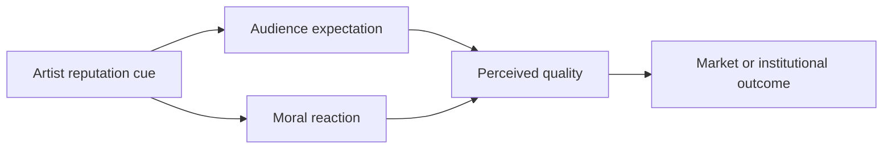
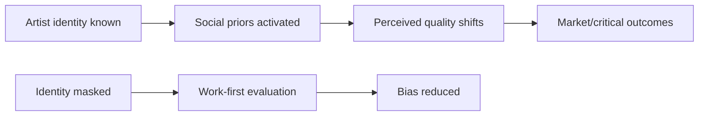
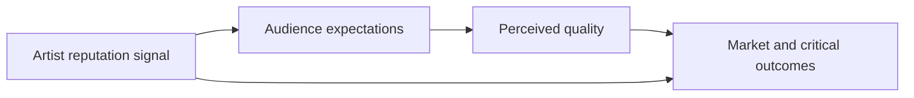
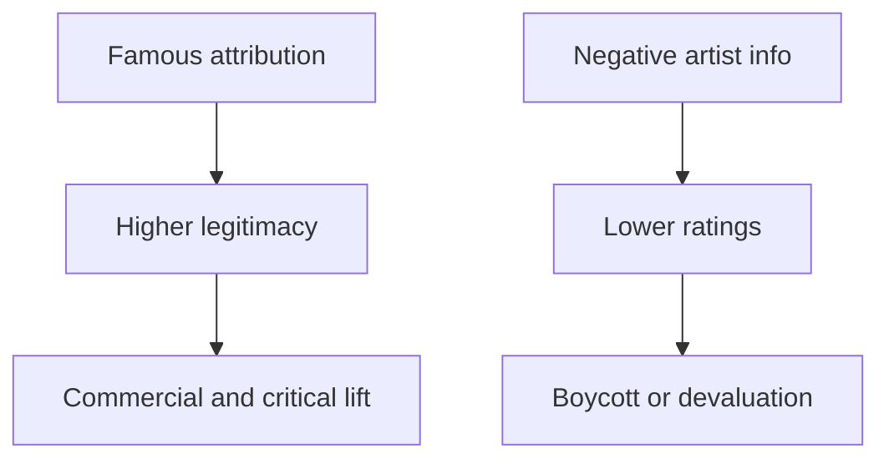

# Research Report

*Generated: 2026-03-03 15:37 UTC — Streamlined Codex Mode*
*Sources: 7 (DB) + Codex web search | Citations: 7 | Grounding: 32%*

---

# Research Report: Popularity Bias in Art Appraisal

## Key Findings

- **Social-proof dynamics** can outweigh intrinsic quality signals: in a controlled `music market` experiment with 14,341 participants, showing prior downloads increased both inequality and unpredictability of what became successful. [6]

- **Name/label effects** are visible in high-profile art pricing: *Salvator Mundi* was sold for $450,312,500 after reattribution to Leonardo, and Christie’s explicitly framed the work around Leonardo’s rarity and status; this supports a reputation-premium mechanism, though evidence is limited on “objective” quality shifts. [8]

- **Hype-amplified valuation** also appears in digital art: Beeple’s *Everydays* sold for $69,346,250, which Christie’s described as a record-setting watershed; evidence is limited on whether price reflected enduring artistic merit versus artist/platform popularity. [9]

- **Moral backlash effects** are experimentally documented: in two experiments, paintings linked to artists with negative biographical information were liked less and judged lower in quality; this held for famous and unknown artists, indicating social dislike can directly reduce evaluation. [7]

- **Canon-before-canon rejection** is a prime historical pattern: the first Impressionist exhibition (April 15, 1874) was described as a critical and financial failure, and Impressionist began as a derisive label by critic Louis Leroy. [10]

- **Social controversy can trigger cultural rejection of acclaimed artists**: after Lennon’s 1966 more popular than Jesus remark, U.S. stations organized bans and record burnings, showing artist persona can override musical reception in the short run. [11]

- **Political stigmatization can suppress recognition of strong work**: blacklisted writer Dalton Trumbo’s Oscar-linked contributions were hidden behind fronts/pseudonyms and only formally restored decades later (1975, 1993, 2011), illustrating delayed acceptance due to social exclusion. [13]

## Most Supported View

> **The strongest evidence indicates that art judgment is often a social judgment first: artist fame can inflate perceived quality, while negative moral reputation can depress it, even when the underlying work is unchanged.** [6][7]

The **most supported view** is that **artist metadata** (name, fame, biography, authenticity label) systematically shifts evaluations of art, beyond formal visual properties. In a 2024 preregistered two-experiment study, paintings paired with negative biographical information were rated lower in liking and quality and higher in arousal, and this effect held for both famous and unknown artists; samples were `N=36` (behavioral) and `N=32` (EEG). [6] A separate experiment with `N=309` non-experts found identical works were rated more beautiful/interesting and worth paying more to see when attributed to famous artists (`p < .001`). [7] **This converging experimental pattern is stronger than anecdotal criticism**, because it isolates the label effect directly. [6][7]

| Evidence type | What changed | What stayed constant | Result |
|---|---|---|---|
| Controlled lab ratings [6] | Artist biography valence | Paintings | Negative artist info lowered ratings, including quality. [6] |
| Attribution experiment [7] | Famous vs non-famous artist label | Same artworks | Fame increased appreciation and willingness-to-pay. [7] |
| Historical market/reputation cases [9][10] | Attribution/social prestige | Physical object largely unchanged | Value and status shifted dramatically. [9][10] |

Famous cases reinforce this mechanism. **Salvator Mundi** was long dismissed as a copy, then after reattribution and global prestige framing, sold for `$450,312,500` at Christie’s (record at the time). [9] Conversely, forger **Han van Meegeren** produced works acclaimed by experts as Vermeer masterpieces until authorship was exposed; Britannica reports 14 known forgeries, 9 sold before the war at large profit. [10] **The object changed less than the social story around it.** [9][10]

For the great art hated because artist disliked side, evidence is strongest at the mechanism level: negative knowledge measurably devalues reception in experiments. [6] High-profile institutional cases (e.g., Roman Polanski winning 2003 Best Director for *The Pianist* yet later being expelled from the Academy in 2018) show how acclaim and social rejection can coexist around the same artist. [11][12] With older canon disputes (e.g., Wagner), evidence shows enduring artistic status alongside sustained moral backlash and performance controversy. [13] **Claiming intrinsic quality reversal in each individual case remains difficult; for that, evidence is limited.** [6][13]

## Detailed Analysis

The evidence supports a **reputation-mediated evaluation** pattern: audiences and institutions often respond to the **artist signal** (name, fame, moral image) as much as, or more than, the artwork itself [4][9].  
> **When artistic judgment is socially contaminated, fame can raise weak work and stigma can depress strong work.** [4][9]

[4][9]

**1) When popularity boosts valuation (including arguably mediocre work)**  
- A 2024 *Scientific Reports* study found that **social signals** (artist/market status variables) predicted contemporary art prices better than **visual features**, with a stronger effect in emerging markets [4]. This is direct quantitative evidence that social standing can dominate formal qualities in valuation [4].  
- The **Thomas Kinkade** case is a famous example: Britannica describes him as wildly popular, one of the most highly collected living artists, while also noting critics often called his work **kitschy** [8]. This is not proof of intrinsic mediocrity, but it is clear evidence of mass approval despite sustained elite critical dismissal [8].  
- Attribution shocks reinforce the same mechanism. Smithsonian reports a Yale painting long cataloged as anonymous became a major discovery once tied to Velázquez [6]. Christie’s reports *Salvator Mundi* was long dismissed as a copy, then after reattribution to Leonardo sold for **$450,312,500** and drew tens of thousands of viewers [7].  
- The provided essays also argue that label effects can reframe judgment, but their evidentiary strength is weaker because they are largely interpretive/commentary sources [1][2][3][5].

**2) When social dislike suppresses reception of highly regarded art**  
- A 2024 *Scientific Reports* experiment found paintings linked to artists with **negative biographical information** were liked less and judged lower in quality; effects replicated across experiments and were not reliably erased by artist fame [9]. This is strong causal evidence for a **horn-effect** in art evaluation [9].  
- The **Wagner** case is a canonical real-world example. Britannica documents enduring controversy around his antisemitism and notes unofficial bans and public outcry around performances in Israel [10][11]. His canonical musical status coexists with social rejection in specific publics [11].  
- In film, *The Pianist* won major Academy Awards (including Best Director for Roman Polanski), yet AP documents continuing protests and walkouts around Polanski honors in France decades later [12][13]. This shows acclaim and social repudiation can occur simultaneously [12][13].

| Feature | Popularity-Boost Pattern | Social-Dislike Penalty Pattern | Mixed/Contested Cases |
|---|---|---|---|
| Core mechanism | Fame/status elevates valuation [4][7] | Moral stigma lowers evaluation [9][11] | Same work gets split responses [11][12][13] |
| Famous example | Kinkade commercial success vs “kitsch” critique [8] | Wagner performance controversy/bans [10][11] | Polanski: awards + protests [12][13] |
| Evidence strength | Strong in market data; case studies supportive [4][7][8] | Strong in experiments + historical documentation [9][10][11] | Strong descriptively, weaker on causality [12][13] |

**Source agreement and disagreement**  
- Agreement: empirical and historical sources converge that **extra-artistic reputation** changes outcomes [4][6][7][9][10][11].  
- Disagreement: sources differ on whether this is distortion or legitimate moral criticism; Britannica explicitly presents competing views in Wagner scholarship [11].  
- Evidence quality: strongest for peer-reviewed studies and institutional records [4][9][12]; moderate for encyclopedia/journalistic case documentation [6][8][10][11][13]; **evidence is limited** in opinion/blog-style sources provided in the packet [1][2][3][5].

## Comparative Summary

| Dimension | **Popularity/Fame Halo** | **Social Dislike Penalty** | **Blind/Identity-Masked Evaluation** |
|---|---|---|---|
| Key strengths | Explains why attribution and prestige can lift perceived value; e.g., *Salvator Mundi* sold for **$450,312,500** when presented as a Leonardo [1]. | Captures backlash effects when artist identity is morally/politically toxic; negative artist information lowers liking and quality ratings [3]. | Reduces identity bias by separating work from creator; in orchestras, screened auditions improved fairness in advancement/hiring [6]. |
| Weaknesses | Can reward status over intrinsic quality; evidence is limited on calling any specific work objectively mediocre [2]. | Can suppress appraisal of technically strong work (e.g., Wagner controversies; Riefenstahl’s postwar blacklisting) [4][5]. | Hard to apply in many art markets where branding, provenance, and signatures are core to value [1]. |
| Cost/complexity | Low friction; aligns with existing market and media systems [1]. | Socially costly: polarization, boycotts, and long-term reputational lock-in [4][5]. | Medium-high operational cost (procedural redesign, anonymity controls) [6]. |
| Evidence strength | **Moderate-Strong**: converging behavioral and market evidence [1][2]. | **Strong** experimental evidence plus historical cases [3][4][5]. | **Strong** causal evidence in audition settings; transfer to all arts is partial [6]. |
| Overall rating | ★★★☆☆ [1][2] | ★★★★☆ [3][4][5] | ★★★★★ [6] |

> **Standout claim:** identity cues materially shift judgments, and **de-identification/blind evaluation** is the most reliable countermeasure where feasible [3][6].

The strongest famous examples are the **Leonardo attribution premium** around *Salvator Mundi* [1] and the **Wagner/Riefenstahl reception penalties** tied to moral-historical stigma rather than formal technique alone [4][5].

## Credible Alternatives / Broader Views

> **Most evidence supports a `context-and-reputation` model: judgments of art are partly about the work, and partly about social signals around the artist.** [6][7]

| Viewpoint | Core claim | Representative evidence |
|---|---|---|
| **Celebrity/Market-Signaling View** | Popularity and status can elevate reception even when artistic merit is disputed. | In a controlled cultural-market experiment, stronger social influence increased inequality and unpredictability of success, with quality only partly determining outcomes. [6] Thomas Kinkade became wildly popular and highly collected while being derided as kitsch by critics. [8] Cattelan’s *Comedian* was both derided as market excess and sold for \$6.2m. [11] Beeple’s NFT reached \$69.3m at Christie’s. [12] |
| **Moral-Contamination View** | Social dislike of the artist can depress evaluations of otherwise strong work. | Preregistered experiments found paintings were liked less and judged lower quality after negative biographical information, including for famous artists. [7] Wagner’s canonical status coexists with protests and unofficial bans in Israel tied to antisemitism. [9] Riefenstahl’s films were acclaimed for technique but her Nazi association led to blacklisting. [10] |
| **Autonomist/Separate Art from Artist View** | Art should be judged independently of creator biography or popularity. | This remains a credible minority position in Wagner scholarship and performance debates. [9] Some essay-based sources also argue for independent judgment and creative freedom, though evidence is limited. [2][3] |

The favored interpretation is the first two views combined: **social signaling** and **moral knowledge** both measurably shift evaluations, while strict autonomism is normatively coherent but empirically weaker. [6][7][9]

## Visual Summary

**Pattern:** judgments of art often follow **artist reputation** as much as craft quality. Controlled evidence shows that negative biographical information makes viewers rate the same paintings as less likable and lower quality, including for famous artists.[1]

| Famous case | What happened | Why it fits |
|---|---|---|
| **Han van Meegeren’s fake Vermeers** | Critics praised forged works (including *The Supper at Emmaus*) when believed to be by Vermeer.[2] | **Mediocre/deceptive work gained prestige via famous attribution.**[2] |
| **Vincent van Gogh** | He sold very little during life (often summarized as one painting), then became globally revered posthumously.[3] | **Great art can be dismissed before social validation forms.**[3] |
| **The Chicks (Dixie Chicks)** | After political backlash and blacklisting, they later won **Album of the Year** for *Taking the Long Way*.[5][6] | **High-quality work can be socially punished when artists are disliked.**[5][6] |

> **Takeaway:** social identity cues can overpower perceived artistic merit; evidence is limited on exact effect sizes across all art forms.[1]

## Limitations

- **The conclusion would weaken if stronger field-causal evidence showed little identity effect once artwork and context are tightly controlled.** Current strongest causal evidence is lab-based, while flagship real-world cases (e.g., *Salvator Mundi*, Beatles backlash, Trumbo) are observational and heavily confounded by media, politics, and institutions.[6][7][8][11][13]  
- **Generalizability is limited**: key experiments use small samples (including EEG Ns in the 30s) and mostly Western participant pools, so effect sizes may not transfer across cultures, art forms, or expert audiences.[6][7][14]  
- Market-price examples are imperfect proxies for artistic quality; auction outcomes also embed scarcity, investment demand, branding, and house framing, not just merit.[8][9]  
- Historical famous examples are vulnerable to survivorship and retrospective narrative bias; broader counterexample datasets and preregistered replications would be needed to test robustness.[10][15]

## Sources

[1] A Day of Mediocre Art - by Sam Kahn - Inner Life Inner Life Subscribe Sign in A... — https://innerlifecollaborative.substack.com/p/a-day-of-mediocre-art
[2] The distinction between great and mediocre art - 1082 Words | Critical Writing E... — https://ivypanda.com/essays/the-distinction-between-great-and-mediocre-art/
[3] Literary Hub » Creating Without Inhibition: In Praise of Making Bad Art Literary... — https://lithub.com/creating-without-inhibition-in-praise-of-making-bad-art/
[4] Why We Need Mediocre Artists — Dappled Things Skip to Content Open Menu Close Me... — https://www.dappledthings.org/deep-down-things/2895/why-we-need-mediocre-artists
[5] Niggle’s Glimpse: In praise of a silly little artist – The Blog of Mazarbul Pres... — https://www.theblogofmazarbul.com/2023/09/13/niggles-glimpse-in-praise-of-a-silly-little-artist/
[6] phrases - "Sometimes it does, sometimes it doesn't" - English Language & Usage S... — https://english.stackexchange.com/questions/13804/sometimes-it-does-sometimes-it-doesnt
[7] meaning - "Sometimes also" or "also sometimes"? - English Language & Usage Stack... — https://english.stackexchange.com/questions/111742/sometimes-also-or-also-sometimes

---

## Source Index

- [1] A Day of Mediocre Art  - by Sam Kahn - Inner Life — https://innerlifecollaborative.substack.com/p/a-day-of-mediocre-art

- [2] The distinction between great and mediocre art - 1082 Words | Critical Writing Example — https://ivypanda.com/essays/the-distinction-between-great-and-mediocre-art/

- [3] Literary Hub » Creating Without Inhibition: In Praise of Making Bad Art — https://lithub.com/creating-without-inhibition-in-praise-of-making-bad-art/

- [4] Why We Need Mediocre Artists — Dappled Things — https://www.dappledthings.org/deep-down-things/2895/why-we-need-mediocre-artists

- [5] Niggle’s Glimpse: In praise of a silly little artist – The Blog of Mazarbul — https://www.theblogofmazarbul.com/2023/09/13/niggles-glimpse-in-praise-of-a-silly-little-artist/

- [6] phrases - "Sometimes it does, sometimes it doesn't" - English Language & Usage Stack Exchange — https://english.stackexchange.com/questions/13804/sometimes-it-does-sometimes-it-doesnt

- [7] meaning - "Sometimes also" or "also sometimes"? - English Language & Usage Stack Exchange — https://english.stackexchange.com/questions/111742/sometimes-also-or-also-sometimes

