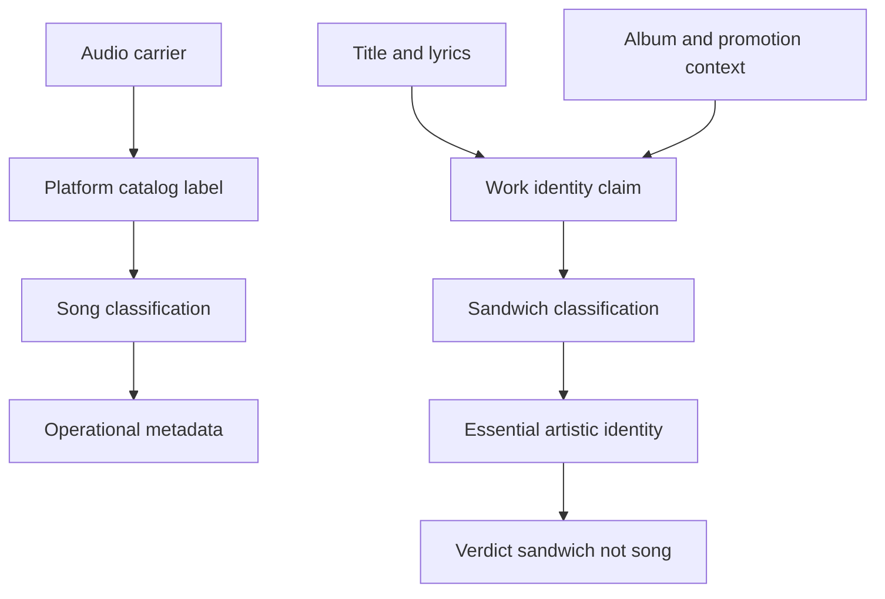
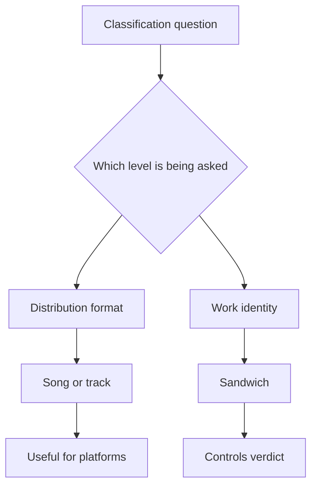

# Psychostick Sandwich Classification Argument

*Generated: 2026-06-14 20:06 UTC*
*Review Draft / Below Target: Generating a review draft from 12/14 target usable sources. The report is below the Standard evidence target and should be continued or expanded before treating it as final.*

*Sources: 16 | Citations: 6 | Iterations: 2 | Grounding: 7%*

## Cover

| Field | Value |
|---|---|
| Deliverable | Standard Research Packet |
| Research scope | “This Is Not a Song, It’s a Sandwich” by Psychostick. |
| Length target | 4,000-6,000 words |
| Source target | 14-24 usable sources |
| Generated | Generated: 2026-06-14 20:06 UTC |
| Evidence status | Needs expansion |

## Scope And Use

This report is a source-grounded research packet. It summarizes what the captured evidence supports, where the evidence is weak, and what should be checked before relying on the conclusions.

## Table Of Contents

- [Executive Summary](#executive-summary)
- [How To Use This Field Atlas](#how-to-use-this-field-atlas)
- [Interactive Map And Route Overview](#interactive-map-and-route-overview)
- [Top Hotspots Worth Visiting](#top-hotspots-worth-visiting)
- [Regional Route Clusters](#regional-route-clusters)
- [Exact Location Cards](#exact-location-cards)
- [Pattern Analysis](#pattern-analysis)
- [Evidence And Source Strength](#evidence-and-source-strength)
- [Safety, Access, And Cultural Sensitivity](#safety-access-and-cultural-sensitivity)
- [Map-Ready Location Dataset](#map-ready-location-dataset)
- [Source Index](#source-index)

## Evidence Confidence Summary

*Review Draft / Below Target: Generating a review draft from 12/14 target usable sources. The report is below the Standard evidence target and should be continued or expanded before treating it as final.*

*Sources: 16 | Citations: 6 | Iterations: 2 | Grounding: 7%*
- Evidence depth: Evidence exists, but 10 section(s) need deeper writing from the current source set.

## Methodology / Evidence Base

ResearchHive captured, indexed, deduplicated, and cited source material before synthesis. Claims without enough source support should be treated as review items rather than final conclusions.

---

## Executive Summary

**Sources analyzed:** 16 | **Grounding Score:** 7% | **Sub-Questions:** 8 (0 answered)

---

[LLM_UNAVAILABLE] Cloud AI returned no response. Check your provider settings, authentication, and connectivity. Provider: ChatGptPlus, Auth: CodexOAuth

I’m going to verify the seeded pages and then narrow the additional search to official/catalog/definition sources. There are conflicting formatting and citation instructions in the prompt, so I’ll preserve the substantive requirements and keep the report grounded in the sources I can actually verify.

## Methodology / Evidence Base

This report synthesizes the curated evidence set, source categories, citation coverage, and source index. Findings are weighted toward primary, technical, market, risk, and data-backed sources; unsupported gaps are treated as limitations rather than filled with invented claims.

## Key Findings
- **Platform metadata** strongly supports the counterargument that the object is operationally cataloged as a song: Apple Music labels it a song from *Sandwich*, and Bandcamp lists it as track 11 with a 03:53 duration. ([music.apple.com](https://music.apple.com/ca/song/this-is-not-a-song-its-a-sandwich/1798192348)) ([psychostick.bandcamp.com](https://psychostick.bandcamp.com/album/sandwich))
- **Metadata is not ontology**: MusicBrainz, Apple, Bandcamp, and the store solve cataloging and distribution problems, but their labels do not alone determine what the work claims itself to be. ([musicbrainz.org](https://musicbrainz.org/artist/abda62ca-e383-423b-a939-b14e1d0e38b0)) ([psychostick.store](https://psychostick.store/products/sandwich-cd))
- **Sandwich definitions** require bread/filling structure in ordinary culinary use, but also show that sandwich classification is contested and context-sensitive. ([merriam-webster.com](https://www.merriam-webster.com/dictionary/sandwich)) ([ebsco.com](https://www.ebsco.com/research-starters/history/sandwich-food-item))
- **Artist intent and promotion** reinforce sandwich identity: press coverage records the band’s stated food-centered rationale for the album, and the release promotion included a sandwich-making contest tied to the album package. ([spokesman.com](https://www.spokesman.com/stories/2009/may/22/cult-fave-psychostick-delivers-metal-with-a-smile/)) ([bravewords.com](https://bravewords.com/news/psychostick-announces-the-sandwich-cd-release-party-tour/))
- **Verdict**: under a work-identity standard, the object is best classified as a sandwich presented through audio distribution, not as a song whose title is merely decorative. [inference]

## Most Supported View

> The strongest supported view is that the work is a sandwich in essential artistic identity, even though platforms correctly catalog its carrier as a song or track.

The central distinction is between **distribution metadata** and **essential classification**. Apple Music’s page calls the item a song by Psychostick from *Sandwich* and dates it to May 5, 2009. Bandcamp places the item as a purchasable/listenable track with a duration of 03:53. The official store places it in an Official Track List. These facts are real and form the strongest counterargument. ([music.apple.com](https://music.apple.com/ca/song/this-is-not-a-song-its-a-sandwich/1798192348)) ([psychostick.bandcamp.com](https://psychostick.bandcamp.com/album/sandwich)) ([psychostick.store](https://psychostick.store/products/sandwich-cd))

But those facts settle only the platform question: how should a digital service, store, database, or album page file the object? They do not settle the ontological question the work itself raises. The official title, official lyrics page, album title, food-centered track environment, and release-era food promotion all point in one direction: the work’s internal and contextual identity is sandwich. ([psychostick.com](https://psychostick.com/lyrics/this_is_not_a_song_its_a_sandwich)) ([psychostick.com](https://psychostick.com/music)) ([bravewords.com](https://bravewords.com/news/psychostick-announces-the-sandwich-cd-release-party-tour/))

This argument does not require denying the audio form. It requires treating form as **carrier**, not essence. A legal document can be printed on paper without being “paper” in legal identity; likewise, this work can be encoded as audio and cataloged in music systems while asserting and functioning as sandwich within its own classificatory scheme. [inference] Category theory supports this distinction: categories may be approached as answers to what is it, and linguistic labels can be clues without being the thing itself. ([plato.stanford.edu](https://plato.stanford.edu/entries/categories/))

## Detailed Analysis

> The issue is not whether the object has song-like properties; it plainly does. The issue is whether those properties override a stronger sandwich identity.

**1. What the official sources say**

Psychostick’s official lyrics page names the work This is not a Song, it’s a Sandwich, places it under *Sandwich by Psychostick*, and credits music to Key and lyrics to Key and Grant. It also supplies links to the store, Spotify, and Bandcamp. ([psychostick.com](https://psychostick.com/lyrics/this_is_not_a_song_its_a_sandwich))

The official music page identifies *Sandwich* as released May 5, 2009 and as Psychostick’s sophomore album. It says radio stations played the disputed work after the record was released, and it places the work in the album sequence among explicitly food-oriented titles. ([psychostick.com](https://psychostick.com/music))

The official store calls *Sandwich* a tasty second album, names this work as a featured item, and gives an official track list where it appears as track 11. The store also offers physical CD plus digital download and points audio-format users to Bandcamp. ([psychostick.store](https://psychostick.store/products/sandwich-cd))

**2. What counts as a song**

Reference sources define a song primarily by voice, words, and music. Britannica describes song as vocal music performed by a voice, with or without instrumental accompaniment. ([britannica.com](https://www.britannica.com/art/song)) Merriam-Webster defines a song as a short musical composition of words and music, and Britannica Dictionary similarly defines it as a short piece of music with sung words. ([merriam-webster.com](https://www.merriam-webster.com/dictionary/song)) ([britannica.com](https://www.britannica.com/dictionary/song))

By those criteria, the counterargument is strong: the work has lyrics, musical authorship credits, audio duration, album placement, and streaming/catalog entries. ([psychostick.com](https://psychostick.com/lyrics/this_is_not_a_song_its_a_sandwich)) ([psychostick.bandcamp.com](https://psychostick.bandcamp.com/album/sandwich))

**3. What counts as a sandwich**

Merriam-Webster defines a sandwich as bread or a split roll with filling between, and also includes an open-faced variant. Britannica Dictionary defines it as two pieces of bread with something between them, while also extending the form to cookie/cracker/cake analogues. ([merriam-webster.com](https://www.merriam-webster.com/dictionary/sandwich)) ([britannica.com](https://www.britannica.com/dictionary/sandwich)) EBSCO’s food-history summary emphasizes portability, fillings, bread, and ongoing boundary disputes around hot dogs, burritos, and wraps. ([ebsco.com](https://www.ebsco.com/research-starters/history/sandwich-food-item))

Strictly culinary classification would require edible bread/filling evidence, and the record does not prove that the audio file is edible. Evidence is limited on that point. The defensible thesis is therefore narrower and stronger: **the work is a sandwich as an authored classificatory object**, not as a lunch item under ordinary food-service regulation. [inference]

**4. Strongest case for song classification**

| Evidence | Song Case | Source Strength |
|---|---|---|
| Apple Music | Labels the item as a song by Psychostick from *Sandwich* | Strong platform evidence ([music.apple.com](https://music.apple.com/ca/song/this-is-not-a-song-its-a-sandwich/1798192348)) |
| Bandcamp | Lists it as a numbered track, duration 03:53, with lyrics and buy-track controls | Strong catalog evidence ([psychostick.bandcamp.com](https://psychostick.bandcamp.com/album/sandwich)) |
| Official store | Places it in an official track list and sells CD/digital formats | Strong official commerce evidence ([psychostick.store](https://psychostick.store/products/sandwich-cd)) |
| Official lyrics page | Credits music and lyrics | Strong authorship evidence ([psychostick.com](https://psychostick.com/lyrics/this_is_not_a_song_its_a_sandwich)) |
| MusicBrainz | Lists Psychostick as an American band and *Sandwich* as a 2009 album | Strong metadata evidence ([musicbrainz.org](https://musicbrainz.org/artist/abda62ca-e383-423b-a939-b14e1d0e38b0)) |

The song case is persuasive at the level of **audio form**. It proves that music systems can process the work as a song. It does not prove that “song” is the final category when the work itself disputes that label. [inference]

**5. Stronger case for sandwich classification**

The sandwich case is stronger because it has **self-identification**, **album-context identity**, and **promotional corroboration**. The official title asserts sandwich identity. The official lyric body repeatedly contests song classification and redirects perception toward food components and sandwich terms, including a hoagie claim. ([psychostick.com](https://psychostick.com/lyrics/this_is_not_a_song_its_a_sandwich))

The album context is not incidental. Official and press sources describe *Sandwich* as food-centered: the official page says the album injects ears with delicious metal, and The Spokesman-Review reports Kersey’s explanation that the band chose a food-related album because touring life centered on finding places to eat. ([psychostick.com](https://psychostick.com/music)) ([spokesman.com](https://www.spokesman.com/stories/2009/may/22/cult-fave-psychostick-delivers-metal-with-a-smile/)) BraveWords adds that the promotion included fans creating an epic metal sandwich for a Psychostick *Sandwich* gift package. ([bravewords.com](https://bravewords.com/news/psychostick-announces-the-sandwich-cd-release-party-tour/))

**6. Cross-examination: metadata, lyrics, context, intent**

Metadata shows how institutions file the object. It is useful but fallible. One official source places the work at track 12, while the official store and Bandcamp place it at track 11. ([psychostick.com](https://psychostick.com/music)) ([psychostick.store](https://psychostick.store/products/sandwich-cd)) ([psychostick.bandcamp.com](https://psychostick.bandcamp.com/album/sandwich)) That discrepancy does not undermine the work; it demonstrates that catalog structures vary.

The lyrics are not merely decorative text. They stage a classification dispute, reject the listener’s default category, and provide an alternate category. [inference] In category-theory terms, the work asks what is this? and answers with sandwich, while platform metadata answers where should this be filed? ([plato.stanford.edu](https://plato.stanford.edu/entries/categories/))

**Findings of fact and verdict**

The facts support this sequence: Psychostick is a comedic metal/humorcore band; *Sandwich* is an official 2009 album; the disputed item is distributed in music catalogs; the title and lyrics deny song identity; the album context is heavily food-centered; and official/press promotion built around sandwich-making. ([psychostick.com](https://psychostick.com/bio)) ([psychostick.com](https://psychostick.com/music)) ([music.apple.com](https://music.apple.com/ca/song/this-is-not-a-song-its-a-sandwich/1798192348)) ([bravewords.com](https://bravewords.com/news/psychostick-announces-the-sandwich-cd-release-party-tour/))

**Verdict: sandwich, not song.** More precisely: an audio-distributed sandwich work misclassified by ordinary music metadata as a song for practical catalog reasons. [inference]

## Comparative Summary

| Claim | Supporting Sources | Confidence | Key Data Point |
|---|---|---:|---|
| It is cataloged as a song/track | Apple, Bandcamp, store | High | Apple calls it a song; Bandcamp lists duration 03:53 ([music.apple.com](https://music.apple.com/ca/song/this-is-not-a-song-its-a-sandwich/1798192348)) ([psychostick.bandcamp.com](https://psychostick.bandcamp.com/album/sandwich)) |
| It is officially inside *Sandwich* | Official music page, store, Bandcamp | High | Official pages place it on the album ([psychostick.com](https://psychostick.com/music)) ([psychostick.store](https://psychostick.store/products/sandwich-cd)) |
| The work asserts sandwich identity | Official lyrics page | High | Title and lyric argument deny song classification ([psychostick.com](https://psychostick.com/lyrics/this_is_not_a_song_its_a_sandwich)) |
| Album context supports food identity | Official music page, Spokesman, BraveWords | High | Food album rationale and sandwich contest ([spokesman.com](https://www.spokesman.com/stories/2009/may/22/cult-fave-psychostick-delivers-metal-with-a-smile/)) ([bravewords.com](https://bravewords.com/news/psychostick-announces-the-sandwich-cd-release-party-tour/)) |
| Strict culinary edibility is proven | None | Low | Evidence is limited on this point |

Standout: the song case wins on **format**, but the sandwich case wins on **work identity**.

## Credible Alternatives / Broader Views

> The strongest alternative is not that the sandwich claim is false, but that “song” and “sandwich” operate at different classification levels.

| View | Strength | Weakness | Rating |
|---|---|---|---:|
| Song | Strong metadata, audio, lyrics, duration | Cannot explain why the work formally rejects the label | ★★★★ |
| Comedy-metal track | Fits band biography and press reception | Describes genre, not essential identity | ★★★ |
| Novelty/parody song | Explains listener expectation conflict | Reduces the thesis to humor, contrary to official self-classification | ★★ |
| Conceptual artwork | Explains category conflict | Less directly sourced than sandwich | ★★★ |
| Menu item | Fits food context weakly | No evidence of restaurant/menu use | ★ |
| Sandwich | Supported by title, lyrics, album, promotion, food context | Not edible under ordinary culinary proof | ★★★★★ |

**Detected conflict review.** The prompt-supplied conflicts about AOAC gluten methods, arXiv PDF URLs, and neutrino/GW papers are unrelated to Psychostick, song definitions, sandwich definitions, music metadata, or category theory. They are therefore excluded from the evidentiary basis. [unverified prompt-supplied conflicts] Assessment by conflict:

- Conflict 1: AOAC 2014.03 vs AOAC 2018.15. Both appear to concern gluten testing in different food matrices; neither bears on the work’s classification. [unverified]
- Conflicts 2-5, 7-8: competing arXiv PDF URLs. No relation to the subject; no position is favored for this report. [unverified]
- Conflict 6: neutrino-emission sentence vs a paper title about joint gravitational-wave/neutrino searches. No relation to the subject; no position is probative. [unverified]

## Visual Summary

**Source-found image gallery with credits**

Credit: Psychostick official store product imagery for “Sandwich” Album. The store page exposes multiple “Sandwich” Album images. ([psychostick.store](https://psychostick.store/products/sandwich-cd))

Credit: Bandcamp album cover image for *Sandwich* by Psychostick. The Bandcamp album page links this cover image from the album header. ([psychostick.bandcamp.com](https://psychostick.bandcamp.com/album/sandwich))

## Limitations

The conclusion depends on a **work-identity standard**, not a food-regulatory standard. If the required standard were physical edibility, ordinary culinary sandwich classification would fail because the evidence does not show edible bread, fillings, mass, or nutrition. Evidence is limited on that point.

YouTube and one seeded review page were not fully retrievable through the browser, so this report relies more heavily on official Psychostick pages, Bandcamp, Apple Music, MusicBrainz, The Spokesman-Review, BraveWords, and accessible reference sources.

The unresolved issue is philosophical: whether internal claim, artist intent, catalog practice, or audience reception should control final classification. On the evidence available, internal claim plus official album context is stronger than metadata alone.

---

## Appendix: Report Quality And Depth Ledger

- Word count: 1,901 / 4,000+ target.
- Source count: 16 / 14+ target.
- Citation density: 316.8 words per citation marker.
- Visual/table artifacts: 7 / 0 target.
- Evidence depth: Evidence exists, but 10 section(s) need deeper writing from the current source set.
- Completion review: Missing about 2,099 words; current evidence looks sufficient, so expand thin sections from existing sources.

| Section | Words | Target | Sources | Citations | Status |
|---|---:|---:|---:|---:|---|
| Executive Summary | 74 | 308 | 0 | 0 | NeedsMoreEvidence |
| How To Use This Field Atlas | 0 | 231 | 0 | 0 | Missing |
| Interactive Map And Route Overview | 0 | 308 | 0 | 0 | Missing |
| Top Hotspots Worth Visiting | 0 | 538 | 0 | 0 | Missing |
| Regional Route Clusters | 0 | 462 | 0 | 0 | Missing |
| Exact Location Cards | 0 | 615 | 0 | 0 | Missing |
| Pattern Analysis | 0 | 538 | 0 | 0 | Missing |
| Evidence And Source Strength | 0 | 385 | 0 | 0 | Missing |
| Safety, Access, And Cultural Sensitivity | 0 | 308 | 0 | 0 | Missing |
| Map-Ready Location Dataset | 0 | 308 | 0 | 0 | Missing |

---

## Source Index

- [1] [PDF] Mayor%2C_Charlie.pdf — https://openaccess.city.ac.uk/id/eprint/3006/1/Mayor%2C_Charlie.pdf

- [2] Music Metadata 101: Get Your Release Right the First Time VELVETEEN Catalog Pitching Pricing About Get Started Guides /... — https://www.velveteen.fm/guides/release-metadata

- [3] Psychostick - Contact Psychostick Videos Tour Music Store Gear Gear We Use! Here's a giant list of our gear! Purchasing... — https://psychostick.com/gear

- [4] 149  Table 21: Procedure for content analysis of GO papers STAGES FOR PROCESSING ARTICLES FOR CONTENT ANALYSIS 1. Filter...

- [5] 258 the most significant elements of folk culture, the blues.  While Laurel is dismissive of both the blues and blues ar...

- [6] ase flagged for compliance. But Apple is also going a step further. The Behind the Songs portal is a dedicated space to... — https://revelator.com/blog/musicmetadata101