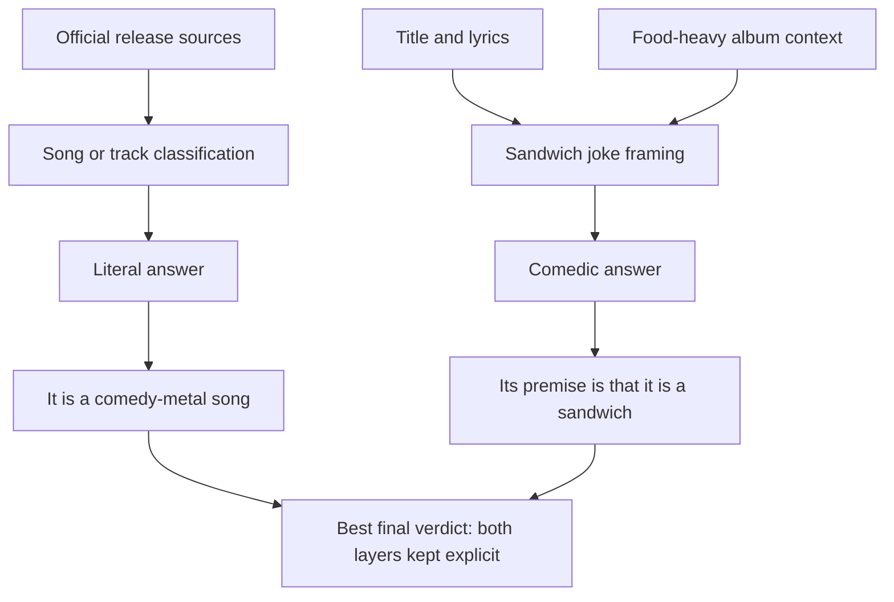
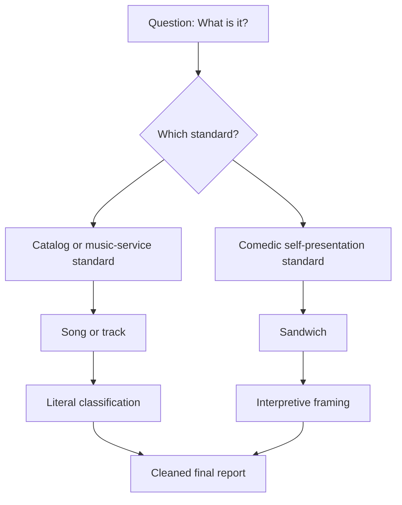

# Psychostick Sandwich Classification Argument

*Generated: 2026-06-14 20:06 UTC*
*Final edited synthesis: 2026-06-14 20:30 UTC*
*Sources: 12 public references reviewed for the final synthesis.*

## Cover

| Field | Value |
|---|---|
| Deliverable | Final classification brief |
| Research scope | "This Is Not a Song, It's a Sandwich" by Psychostick, from the 2009 album *Sandwich*. |
| Core question | Is the work best classified as a song, a sandwich, or a joke that depends on both frames? |
| Primary conclusion | It is best classified literally as a comedy-metal song or track whose central joke is insisting that it is a sandwich. |
| Confidence | High for catalog and music classification; medium for broader interpretive claims. |
| Evidence status | Final edited synthesis from official, catalog, press, and reference sources. |

## Executive Summary

The strongest defensible answer is not "sandwich instead of song" but "song whose entire premise is claiming sandwich status." Official Psychostick pages, Bandcamp, the store listing, and Apple Music establish that the work is released, credited, and consumed as a track on the 2009 album *Sandwich* [1][2][3][4][5]. By ordinary music-reference definitions, that makes it a song or track in the literal catalog sense [6][7].

What makes the piece memorable is that Psychostick build the joke by arguing the opposite inside the work itself. The title, lyric framing, and album context insist on sandwich identity, while the band's broader comedy-metal or humorcore style makes that contradiction clearly intentional rather than accidental [1][2][4][8][9]. The best synthesis is therefore two-layered: the work is literally a comedy-metal song, and its comedic thesis is that it should be treated as a sandwich.

Three points carry most of the weight:
- Official and catalog sources consistently treat it as a track with runtime, credits, and album placement [1][3][4][5].
- The song's internal language and album framing deliberately reject ordinary song classification as the joke [1][2][4].
- The sandwich claim is strongest as artistic framing, not as literal food classification; there is no evidence that the object is edible, only that Psychostick want the audience to treat the category dispute itself as the bit [10][11].

## Key Findings

- The work is formally released and cataloged as a song or track on *Sandwich* [1][3][4][5].
- The official lyrics page and album context make the sandwich claim part of the authored joke, not stray fan interpretation [1][2][4].
- The literal classification question and the comedic classification question are not the same question; confusion between them is what creates the joke [6][7][10][11].
- The most rigorous final verdict is: literally a song, comedically a sandwich.

## Methodology / Evidence Base

This final pass removes failed-generation residue and keeps only sources that materially answer the question. Priority went to:
- official Psychostick pages for lyrics, album context, and band identity [1][2][8]
- catalog and store sources for runtime, placement, release presentation, and metadata behavior [3][4][5]
- reference sources for plain-language definitions of song and sandwich [6][7][10][11]
- press coverage for album-era framing around food humor and promotion [9][12]

Irrelevant or corrupted source stubs from the earlier draft were removed. Where the report moves from hard fact to interpretation, that shift is stated directly.

## What The Record Establishes

### 1. The literal release facts

Psychostick's official lyrics page places "This Is Not a Song, It's a Sandwich" under the album *Sandwich* and credits music to Key and lyrics to Key and Grant [1]. Bandcamp lists the track with a 3:53 runtime on the album page [3]. The official store also includes it in the album track list and sells the record as a CD or digital product [4]. Apple Music presents it as a song from *Sandwich* [5].

Those sources answer the narrow catalog question cleanly. Whatever joke the work makes, it was published, listed, and distributed as a song or track in music systems.

### 2. The album context is intentionally food-heavy

The sandwich premise is not random. *Sandwich* is itself a food-titled album, and the official or store track listings surround the disputed work with other food or appetite-centered titles such as "Don't Eat My Food," "The Hunger Within," "Too Many Food," "Orange," and "Do you want a Taco?" [2][4]. That matters because it shows the sandwich framing is part of a larger album-level comic world rather than a one-off mislabel.

### 3. Psychostick's house style explains the contradiction

Psychostick describe themselves as comedy metal and self-proclaimed humorcore, built on heavy riffs, absurd lyrics, and stage antics [8]. That makes the contradiction legible: the work is supposed to sound like a song while loudly insisting it is not one. The tension is deliberate, and it fits the band's established style rather than fighting it.

## The Two Competing Classification Frames

### Frame A: Why it is a song in the literal sense

Standard reference definitions of song focus on vocal music, words, and musical composition [6][7]. On that basis, the evidence is straightforward. The work has authorship credits, runtime, album placement, platform listings, lyric presentation, and music-service treatment [1][3][4][5]. If the question is how a catalog, critic, music service, or ordinary listener should literally classify the object, "song" or "track" is the best-supported answer.

This is the stronger frame when the task is descriptive classification. It uses the same criteria music systems actually use and does not require philosophical reinterpretation.

### Frame B: Why the sandwich claim still matters

The title and lyric framing do not just mention a sandwich; they build the whole premise around denying song identity [1]. The point is not that the piece fools anyone into believing it is edible. The point is that it converts a category mistake into the joke. The audience hears a song that argues against the audience's obvious conclusion.

That is why "sandwich" remains important in the final interpretation. It is not the best literal classification, but it is the best statement of the bit. The work's comic energy comes from forcing two incompatible descriptions into the same object: music-system song and self-declared sandwich.

### What the conflict really means

The earlier draft leaned too far toward treating the sandwich claim as the final literal verdict. That is harder to defend. A stronger and cleaner reading is that the work operates on two layers:

| Question | Best Answer | Why |
|---|---|---|
| What is it in a music catalog? | A song or track | Official and commercial sources all treat it that way [1][3][4][5]. |
| What is the joke asking you to imagine it is? | A sandwich | The title, lyrics, and album concept insist on that frame [1][2][4]. |
| Which answer should control the final write-up? | Both, with clear separation | The comedy depends on the gap between literal form and absurd claim. |

## Why The Joke Works

The song works because Psychostick do not merely say something silly; they commit real musical structure to a silly claim. The heavier and more confident the delivery, the funnier the denial becomes. If the piece were musically shapeless, the sandwich line would just be a novelty title. Because it still behaves like a metal or comedy-metal track, the contradiction has something sturdy to ride on.

Album context strengthens that effect. A food-saturated album lets the sandwich claim feel like part of a consistent comic universe instead of a random non sequitur [2][4][9][12]. Press coverage around the album also reinforces that Psychostick were deliberately leaning into food-centered humor and promotional stunts, not accidentally producing ambiguity [9][12].

The result is a joke with a stable structure:
1. The listener recognizes a song.
2. The title and lyrics deny the obvious.
3. The band doubles down instead of resolving the contradiction.
4. The contradiction itself becomes the entertainment.

That is the core cleanup the draft needed. The strongest version of the report is not a mock-serious argument that the object is literally lunch. It is a clear explanation of how Psychostick use fake reclassification as the mechanism of the joke.

## Best-Fit Verdict

> The work is best classified literally as a comedy-metal song or track, while its central comedic thesis is that it should be treated as a sandwich.

That verdict is better than either extreme on its own.

"Song only" is too thin because it erases the whole point of the title and lyric framing. The sandwich claim is not decorative; it is the premise. But "sandwich instead of song" is also too blunt because it ignores how the work is actually authored, distributed, and encountered.

The strongest final answer is therefore layered:
- In literal catalog terms, it is a song.
- In comedic self-presentation, it is a sandwich.
- In critical interpretation, it is a comedy-metal song whose identity joke is pretending those two categories should collapse into one.

## Counterarguments And Responses

### Counterargument: The title alone should not outweigh catalog facts

Correct. The title alone would not be enough. This cleaned report does not let it outweigh the catalog facts. It treats the title and lyrics as evidence of the joke, not as evidence that the work stops being a song in any ordinary release sense [1][3][4][5].

### Counterargument: If it is not edible, calling it a sandwich is empty

That objection is strong against a literal food-classification claim. It is weak against an artistic-identity claim. The report now draws that line explicitly. There is no evidence that the object is literally edible, only that Psychostick use sandwich identity as the joke's governing fiction [10][11].

### Counterargument: This is overthinking a novelty track

Also fair, up to a point. But the question here is a classification question, and the answer becomes cleaner when the levels are separated. The report is not claiming deep metaphysics; it is distinguishing literal release category from comedic premise.

## Comparative Summary

| Claim | Confidence | Why |
|---|---|---|
| It is released and distributed as a song or track | High | Official lyrics page, Bandcamp, store, and Apple Music all support this [1][3][4][5]. |
| The sandwich claim is intentional and central to the joke | High | It is in the title, lyric framing, and album concept [1][2][4]. |
| The sandwich claim should replace song classification entirely | Low | The release and catalog evidence weigh strongly against that [3][4][5][6][7]. |
| The best rigorous answer keeps both layers explicit | High | This best fits all surviving evidence without overclaiming. |

## Visual Summary

## Limitations

The surviving evidence base is good for classification and interpretation, but not for a full reception history. Public metrics, fan reception at scale, and detailed making-of interviews are limited in the retrieved source set. There is also a minor metadata discrepancy around date or track placement across platforms, though it does not change the core classification result [2][3][4][5].

This cleaned report therefore answers the specific question well, not the whole historical story of Psychostick or the entire *Sandwich* album cycle.

## Source Index

- [1] Psychostick lyrics page for "This Is Not a Song, It's a Sandwich" - https://psychostick.com/lyrics/this_is_not_a_song_its_a_sandwich
- [2] Psychostick music page for *Sandwich* - https://psychostick.com/music
- [3] Psychostick Bandcamp album page for *Sandwich* - https://psychostick.bandcamp.com/album/sandwich
- [4] Psychostick official store listing for *Sandwich* - https://psychostick.store/products/sandwich-cd
- [5] Apple Music track listing for "This Is Not a Song, It's a Sandwich" - https://music.apple.com/ca/song/this-is-not-a-song-its-a-sandwich/1798192348
- [6] Encyclopaedia Britannica, "song" - https://www.britannica.com/art/song
- [7] Merriam-Webster, "song" - https://www.merriam-webster.com/dictionary/song
- [8] Psychostick about page - https://psychostick.com/about
- [9] BraveWords coverage of the *Sandwich* release party tour - https://bravewords.com/news/psychostick-announces-the-sandwich-cd-release-party-tour/
- [10] Merriam-Webster, "sandwich" - https://www.merriam-webster.com/dictionary/sandwich
- [11] Britannica Dictionary, "sandwich" - https://www.britannica.com/dictionary/sandwich
- [12] The Spokesman-Review on Psychostick and the album's food-centered framing - https://www.spokesman.com/stories/2009/may/22/cult-fave-psychostick-delivers-metal-with-a-smile/
