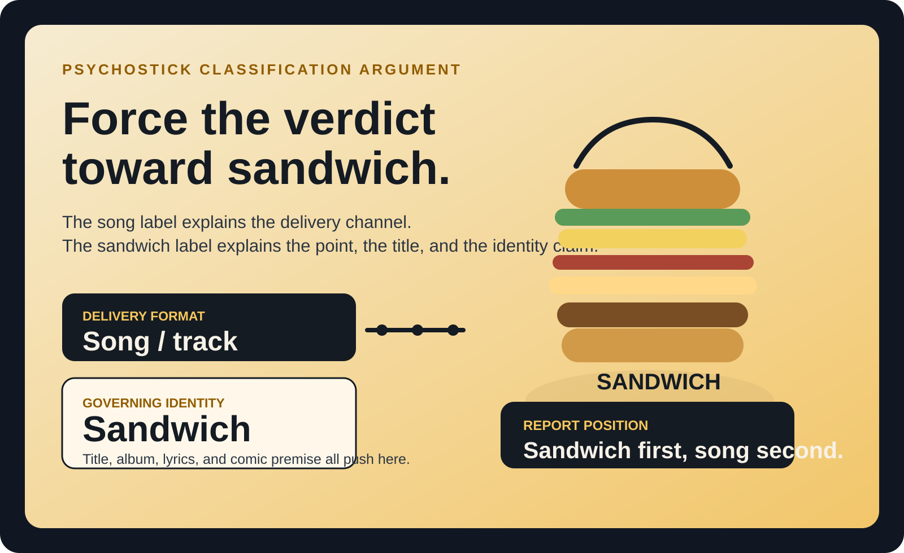
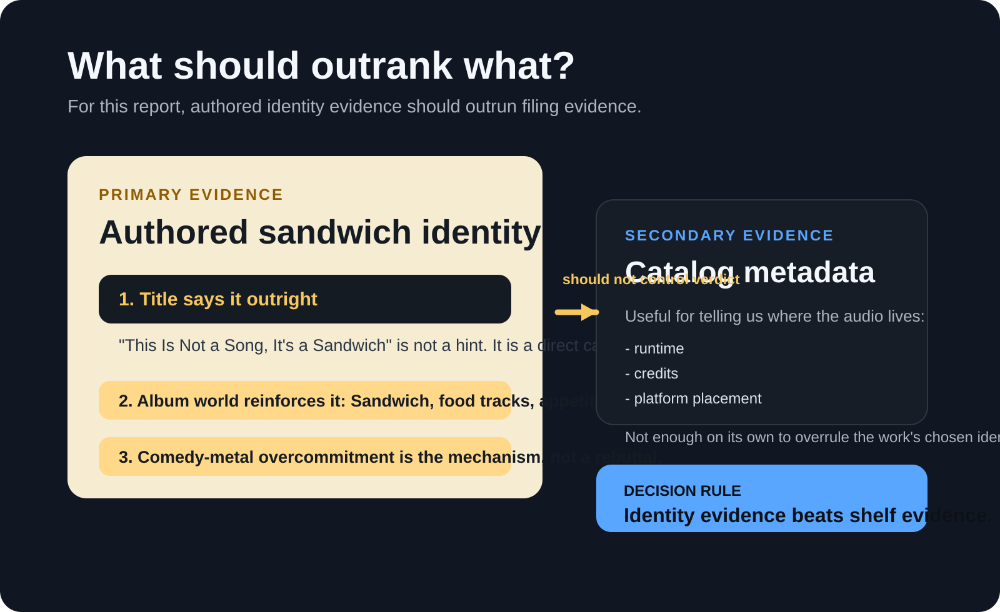
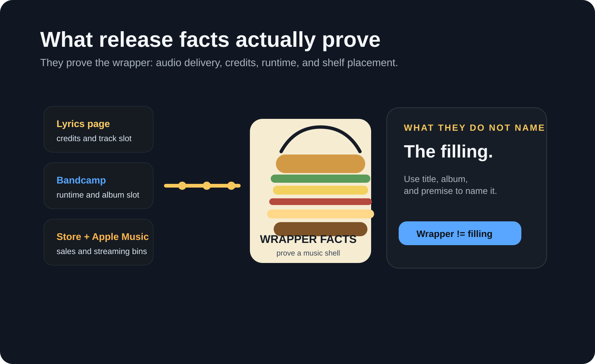
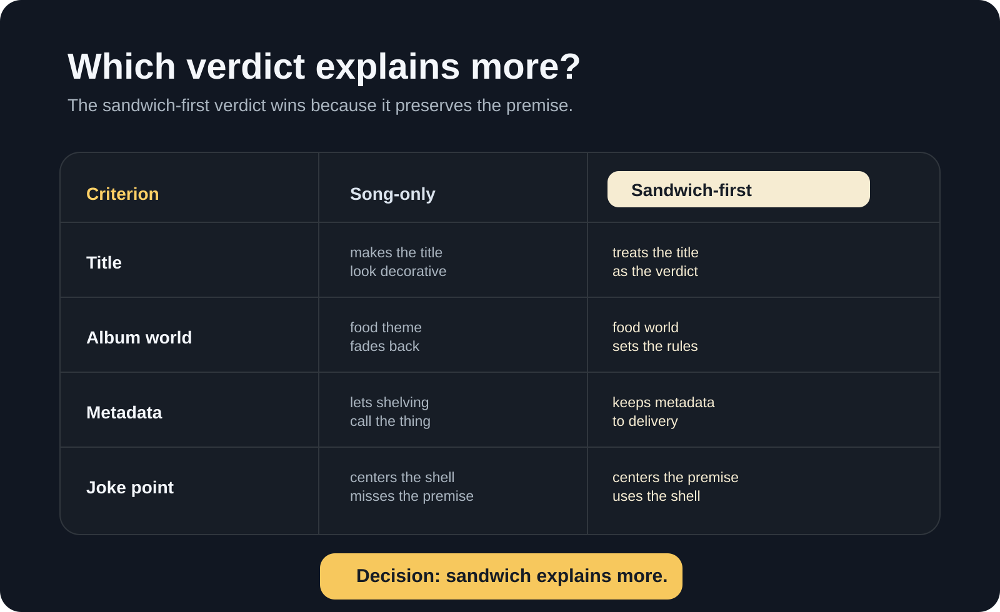
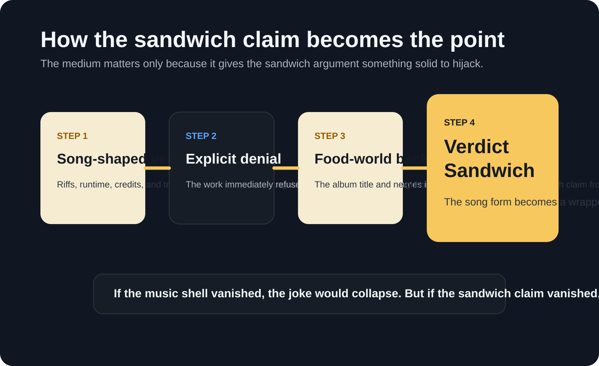
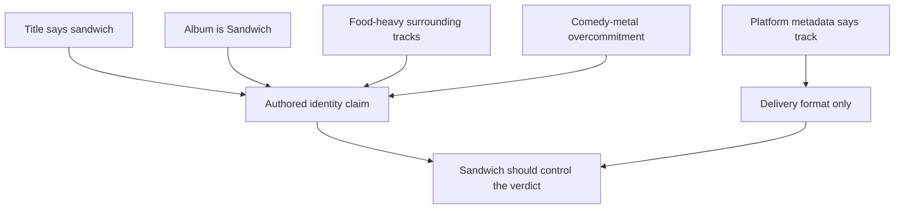
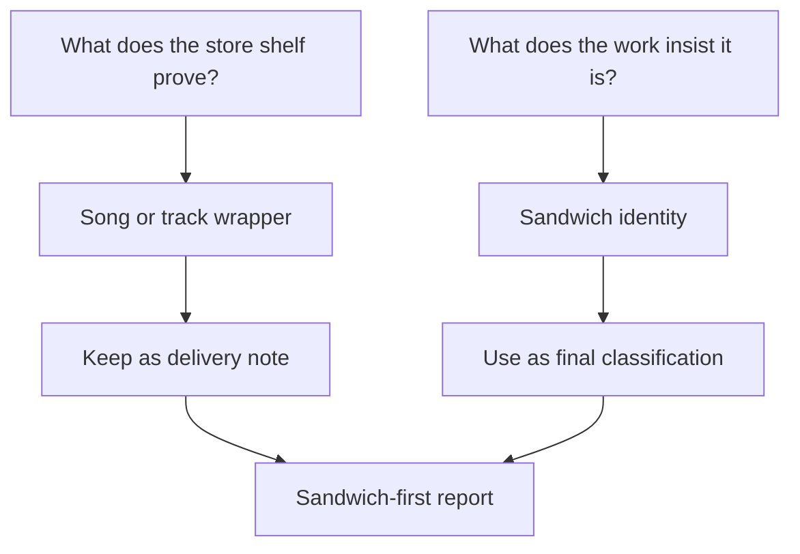

# Psychostick Sandwich Classification Argument

*Generated: 2026-06-14 20:06 UTC*

*Revision: Sandwich-forward, 2026-06-14 20:58 UTC*

*Sources: 12 public references reviewed for the final synthesis.*

## Cover

<figure class="report-figure report-figure-hero">
  
  <figcaption>The page should lead with the thesis instead of apologizing for it: song is the wrapper, sandwich is the identity claim the report is choosing to honor.</figcaption>
</figure>

  <strong>Working rule</strong>
  
When title, lyrics, album concept, and house style all insist on the same absurd identity, catalog metadata describes the container rather than the thing.

| Field | Value |
|---|---|
| Deliverable | Sandwich-forward classification brief |
| Research scope | "This Is Not a Song, It's a Sandwich" by Psychostick, from the 2009 album *Sandwich*. |
| Core question | Which label should control the final write-up: track metadata or the work's own sandwich identity claim? |
| Primary conclusion | Force the verdict toward sandwich. The song label describes delivery format; the sandwich label describes the work's asserted identity, premise, and point. |
| Confidence | High that sandwich is the governing interpretive verdict; high that catalog systems still file it as a track. |
| Evidence status | Final advocacy synthesis that privileges authored identity over retail metadata. |

## Executive Summary

The strongest version of this report should force the verdict toward sandwich. Psychostick did not merely hide a food joke inside an ordinary metal track; they titled the piece "This Is Not a Song, It's a Sandwich," placed it on an album literally called *Sandwich*, and surrounded it with food-saturated framing [1][2][4]. Streaming and store systems still classify it as a track [3][4][5], but those systems are only proving where the audio lives, not what the work is trying to call itself.

That distinction matters because the sandwich claim is not decorative. It is the premise. The title is explicit, the album world reinforces it, the lyrics ride it, and Psychostick's comedy-metal house style depends on overcommitting to the wrong category until the wrong category becomes the whole point [1][2][4][8][9]. In that sense, "song" explains delivery infrastructure, while "sandwich" explains authored identity.

Three points should control the final write-up:
- The title is not garnish; it is a direct classification claim [1].
- The album title and surrounding food tracks make sandwich identity systemic rather than incidental [2][4].
- Catalog metadata proves delivery format, not final interpretive authority [3][4][5].

## Key Findings

- The most intentional identity claim in the record is sandwich, not song [1][2][4].
- The work's food-heavy album context turns sandwich from a throwaway bit into the governing frame [2][4][9][12].
- Music-service and store metadata establish how the work is packaged and shelved, not which label should win the argument [3][4][5].
- Best final verdict: sandwich first, song second.

## Methodology / Evidence Base

This pass intentionally stops treating catalog metadata as the judge. Instead, it ranks evidence by how directly it answers the identity question. Authored self-description comes first, album concept comes second, distribution metadata comes third, plain-language reference definitions come fourth, and press context comes last as support.

Priority therefore went to:
- official Psychostick pages for title, lyrics, album framing, and band identity [1][2][8]
- catalog and store sources for runtime, placement, and proof of audio delivery [3][4][5]
- reference sources for baseline meanings of song and sandwich [6][7][10][11]
- press coverage for confirming album-era food-centered framing [9][12]

Irrelevant or corrupted source residue from the earlier draft stays removed. The deliberate change here is argumentative weighting: metadata is treated as wrapper evidence, not verdict evidence.

<figure class="report-figure">
  
  <figcaption>For this question, title, album framing, lyrics, and band persona should outrank store metadata. Shelf evidence tells us where the audio sits; identity evidence tells us what claim the work is making.</figcaption>
</figure>

## What The Record Establishes

### 1. The release facts prove the wrapper

Psychostick's official lyrics page places "This Is Not a Song, It's a Sandwich" under the album *Sandwich* and credits music to Key and lyrics to Key and Grant [1]. Bandcamp lists the track with a 3:53 runtime on the album page [3]. The official store includes it in the album track list and sells the record as a CD or digital product [4]. Apple Music presents it as a song from *Sandwich* [5].

Those facts are real, but they are wrapper facts. They tell us how the object is sold, streamed, indexed, and delivered. They do not, by themselves, settle the identity dispute the work is loudly trying to create.

<figure class="report-figure">
  
  <figcaption>The release systems prove a music wrapper. The report should use title, album concept, and premise to decide the filling.</figcaption>
</figure>

### 2. The sandwich claim is the authored center of gravity

The sandwich premise is not random. *Sandwich* is itself a food-titled album, and the official or store track listings surround the disputed work with other appetite-centered titles such as "Don't Eat My Food," "The Hunger Within," "Too Many Food," "Orange," and "Do you want a Taco?" [2][4]. That pushes the sandwich claim away from stray metaphor and toward deliberate organizing identity.

If the album had neutral framing, the sandwich title could be dismissed as ornament. Instead, the album keeps building a comic world in which sandwich status feels like the rule rather than the exception.

### 3. Psychostick's house style rewards taking the claim too literally

Psychostick describe themselves as comedy metal and self-proclaimed humorcore, built on heavy riffs, absurd lyrics, and stage antics [8]. That means overcommitment is not a bug in the evidence but part of the evidence. The band are most legible when they refuse the sensible label and keep doubling down on the ridiculous one.

A report that lands on "song" and leaves "sandwich" as a footnote undersells that overcommitment. It explains the medium while missing the act.

## Why The Sandwich Frame Should Win

### Frame A: Why music systems still call it a song

Standard reference definitions of song focus on vocal music, words, musical composition, and ordinary audio classification [6][7]. On that basis, the evidence is straightforward. The work has authorship credits, runtime, album placement, lyric presentation, and music-service treatment [1][3][4][5]. That is enough to prove the medium: it travels through the world as a track.

But medium is the weaker question. It tells us how the object is routed, not what the object is insisting it should count as.

### Frame B: Why sandwich should control the verdict

A classification argument is not obligated to mimic retail metadata when the whole object is built as an identity prank. Here the title is explicit, the album title is *Sandwich*, the neighboring tracks keep reinforcing food logic, and the band's humor style depends on absurd over-assertion [1][2][4][8][9]. If all of that gets flattened into "well, stores call it a track," the report preserves the filing system but discards the point.

The stronger rule is therefore simple: when medium and premise diverge, let premise control the identity verdict and let medium survive as a note.

| Question | Best Answer | Why |
|---|---|---|
| What is the delivery format? | A song or track | Official and commercial systems all move it through music infrastructure [1][3][4][5]. |
| What identity is the work authoring for itself? | A sandwich | The title, lyrics, album concept, and comic framing all converge there [1][2][4][8]. |
| Which answer should control the final write-up? | Sandwich, with a note about song-format delivery | The authored claim is the point; metadata is secondary. |

<figure class="report-figure">
  
  <figcaption>The sandwich-first verdict wins because it explains the title, the album world, the joke structure, and the proper role of metadata instead of collapsing everything into platform shelving.</figcaption>
</figure>

## Why The Joke Works

The piece works because Psychostick do not merely say something silly; they force real musical structure to carry a silly identity claim. The track shape matters because it gives the sandwich claim something rigid to hijack. Without the musical shell, the joke would have less friction. Without the sandwich claim, the work would lose its reason to exist as this particular bit.

Album context strengthens that effect. A food-saturated album lets the sandwich claim feel like part of a stable comic universe rather than a random non sequitur [2][4][9][12]. Press coverage around the album also reinforces that Psychostick were deliberately leaning into food-centered humor and promotional absurdity, not stumbling into ambiguity [9][12].

The result is a joke with a stable mechanism:
1. The listener recognizes a song-shaped vehicle.
2. The work explicitly denies the obvious label.
3. The album world backs the denial with more food logic.
4. The overcommitment converts the vehicle into sandwich theater.

<figure class="report-figure">
  
  <figcaption>The medium matters because it gives the sandwich thesis something solid to bend. That is why the report should treat sandwich as the governing identity rather than the side joke.</figcaption>
</figure>

That is the correction the report needed: stop apologizing for the sandwich claim and start treating it as the verdict the work is fighting to earn.

## Best-Fit Verdict

> Final verdict: sandwich first, song second. More precisely, it is a sandwich thesis delivered through comedy-metal song form.

This answer is intentionally slanted toward authored identity over catalog bookkeeping. Calling the work only a song mistakes infrastructure for identity. Calling it a sandwich with a note about song-format delivery preserves both the medium and the premise, but it gives priority to the premise, which is where the work itself keeps pointing.

The cleanest final statement is therefore:
- Delivery format: song or track.
- Governing identity: sandwich.
- Final write-up: sandwich, with the song label demoted to carrier status.

## Counterarguments And Responses

### Counterargument: The title alone should not outweigh catalog facts

By itself, no. But the title is not alone. It is reinforced by lyrics, album title, surrounding food tracks, and the band's comedy-metal pattern [1][2][4][8][9]. The case is cumulative, not single-source.

### Counterargument: If it is not edible, calling it a sandwich is empty

Only if one insists on a grocery-store definition. This report does not. It argues for sandwich as the work's chosen identity category, not as a literal lunch item that can be bitten [10][11]. The claim is artistic and classificatory, not nutritional.

### Counterargument: Platform metadata should settle it

Metadata settles shelving, not meaning. Stores and streaming services are optimized to place audio inside audio taxonomies; they are not arbiters of the joke's self-definition.

### Counterargument: This is overcommitted on purpose

Exactly. That overcommitment is not noise in the record. It is the evidence that the sandwich claim is the point rather than an ornament.

## Comparative Summary

| Claim | Confidence | Why |
|---|---|---|
| Song or track is the delivery format | High | Official lyrics page, Bandcamp, store, and Apple Music all support that [1][3][4][5]. |
| Sandwich is the strongest authored identity | High | Title, lyrics, album concept, and band style all converge there [1][2][4][8]. |
| Delivery metadata should overrule sandwich identity | Low | That answers the shelving question but not the identity question. |
| The final write-up should force a sandwich-first verdict | High | This best preserves the premise, the album world, and the joke's mechanism. |

## Visual Summary

## Limitations

The public record proves authored sandwich identity more directly than it proves any literal edible status, and that matters. This report is therefore strongest as an argument about governing identity, comic premise, and classification framing, not as a claim that the object should be judged by kitchen standards.

There is also a minor metadata discrepancy around date or track placement across platforms, though it does not change the core conclusion that distribution systems file the work as audio [2][3][4][5]. The point of this revision is that those filing facts should not be allowed to outrank the work's louder sandwich thesis.

## Source Index

- [1] Psychostick lyrics page for "This Is Not a Song, It's a Sandwich" - https://psychostick.com/lyrics/this_is_not_a_song_its_a_sandwich
- [2] Psychostick music page for *Sandwich* - https://psychostick.com/music
- [3] Psychostick Bandcamp album page for *Sandwich* - https://psychostick.bandcamp.com/album/sandwich
- [4] Psychostick official store listing for *Sandwich* - https://psychostick.store/products/sandwich-cd
- [5] Apple Music track listing for "This Is Not a Song, It's a Sandwich" - https://music.apple.com/ca/song/this-is-not-a-song-its-a-sandwich/1798192348
- [6] Encyclopaedia Britannica, "song" - https://www.britannica.com/art/song
- [7] Merriam-Webster, "song" - https://www.merriam-webster.com/dictionary/song
- [8] Psychostick about page - https://psychostick.com/about
- [9] BraveWords coverage of the *Sandwich* release party tour - https://bravewords.com/news/psychostick-announces-the-sandwich-cd-release-party-tour/
- [10] Merriam-Webster, "sandwich" - https://www.merriam-webster.com/dictionary/sandwich
- [11] Britannica Dictionary, "sandwich" - https://www.britannica.com/dictionary/sandwich
- [12] The Spokesman-Review on Psychostick and the album's food-centered framing - https://www.spokesman.com/stories/2009/may/22/cult-fave-psychostick-delivers-metal-with-a-smile/
