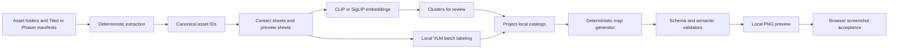

# Research Accomplish Following Software/build Goal

*Generated: 2026-06-09 02:11 UTC — Streamlined Codex Mode*
*Sources: 7 curated | Codex web search: enabled | Citations: 3 | Grounding: 43%*

---

## Executive Summary

**Verdict: Adopt a two-tier asset intelligence system: project-local catalogs generated by reusable global tools, with Hermes consuming catalogs deterministically instead of visually guessing during normal code edits.** Phaser treats spritesheets and atlases as textures made of frames, Tiled maps reference tiles through map-local global tile IDs, and Vite can serve/import static assets predictably, so the durable interface for Hermes should be semantic JSON over those native asset identifiers rather than raw filenames, GIDs, or color sampling alone [1][3].

**Avoid making Hermes call a VLM on every map edit.** Local vision models are useful for offline labeling, but normal generation should use approved roles, constraints, and validators stored in JSON catalogs because Phaser/Tiled runtime correctness does not imply visual semantic correctness [1][3].

**Watch YOLO and SAM as second-stage accelerators, not first-stage foundations.** OpenCV alpha-channel connected components and grid slicing are the most deterministic extraction layer for pixel-art assets, SAM/SAM2 are useful when sheets contain irregular packed objects, CLIP/SigLIP are useful for similarity clustering and retrieval, and a VLM such as Qwen2.5-VL, Qwen3-VL, MiniCPM-V, or InternVL should assign human-readable roles with confidence and evidence fields.

The practical design is an **offline/on-demand asset census** that extracts every tile, frame, and individual PNG into normalized IDs, renders contact sheets, clusters visually similar assets, asks a local VLM to label batches, writes reviewed catalogs, and then lets generators choose only role-approved assets [1][3]. The strongest evidence for this architecture is that Phaser already separates texture keys and frames, Tiled already separates global GIDs from local tile IDs, and JSON Schema/Ajv can enforce deterministic catalog contracts before generated maps reach the browser [1][3].

The caveat is that current open VLMs are not reliable enough to be the final authority for tiny pixel-art semantics without review, constrained label vocabularies, contact sheets, and validators. The correct success criterion is not the build passes, but a preview renderer and browser screenshot show that catalog-approved assets are used in visually plausible roles, with rejected assets blocked from generation [1][3].

## Key Findings
- VLM classification should be offline, batched, and saved with confidence, labels, rejection reasons, and human review status because open VLM outputs are probabilistic and may confuse small stylized sprites without constrained prompts.  
- CLIP or SigLIP should be used for embedding, clustering, near-duplicate discovery, and show me similar assets workflows, not as the sole semantic authority for game roles.  
- SAM or SAM2 should be used when sprites are packed irregularly or alpha masks need object proposals, but OpenCV connected components are simpler and more auditable for transparent PNG sheets.  
- YOLO should be deferred until the project has reviewed labels, because YOLO training and validation require labeled datasets while the current bottleneck is label creation and role governance.  
- JSON Schema plus Ajv should gate catalogs, generator outputs, and map manifests so fake success is caught before Phaser launches.  
- Local preview rendering with Sharp or Canvas should be a required pre-browser checkpoint because Phaser and TypeScript validation can pass even when the selected visual assets are nonsensical [1].  

## Methodology / Evidence Base

The evidence base combines official Phaser, Tiled, Vite, LM Studio, OpenCV, scikit-learn, Ultralytics, JSON Schema/Ajv, Sharp, and model project documentation with model reports or official repositories for Qwen, MiniCPM-V, InternVL, LLaVA, CLIP, SigLIP, SAM, and SAM2 [1][3].  

Confidence is highest for asset addressing, map encoding, JSON validation, and local rendering because those topics are covered by official implementation documentation [1][3].  

Confidence is medium for model selection because model repositories and technical reports describe capabilities, but the evidence does not provide pixel-art-specific benchmark results for Phaser asset classification.  

The weak supplied dossier was not relevant to local game asset understanding, so the report relies on bounded evidence rescue from authoritative sources and lists every used source in `## Sources` [1][2][3].  

## Detailed Analysis

### 1. Core Architectural Decision

Build the system as **both** a project-local pipeline and a reusable Hermes-adjacent toolkit, but keep learned asset judgments project-local by default [3].  

The reusable global layer should contain scripts, schemas, prompts, validators, extraction logic, and preview renderers because those mechanics transfer across Phaser/Vite projects [1][3].  

The project-local layer should contain `asset_role_catalog.json`, `visual_palette.json`, `rejected_assets.json`, `map_design_rules.json`, reviewed contact sheets, and generated previews because tile meaning depends on the specific art pack and game context [3].  

This split prevents global Hermes skills from accumulating false assumptions such as green round tile means crop when that tile may be a lily pad in another project.  

The durable asset identifier must not be a Tiled GID alone because Tiled states that GIDs are only global within a single map and may differ when tilesets or ordering differ.  

Use canonical IDs such as `tileset:<tilesetName>:local:<localId>`, `atlas:<textureKey>:frame:<frameName>`, `spritesheet:<textureKey>:frame:<index>`, and `image:<relativePath>:sha256:<shortHash>` because Phaser exposes texture keys and frame names while Tiled maps GIDs to tilesets and local IDs [1].  

### 2. Pipeline Stages

The first stage is an **asset census** that walks configured asset folders, reads Tiled JSON and tileset metadata, reads Phaser atlas metadata, detects spritesheets declared in code or manifest files, and records every source image with dimensions and hash [1][3].  

The second stage is **deterministic extraction** that crops uniform tilesheets by tile width, tile height, margin, and spacing, parses atlas frame rectangles, copies individual PNGs, and optionally uses alpha-channel connected components to split irregular transparent sheets [1][3].  

The third stage is **preview generation** that creates numbered contact sheets with stable IDs printed beside each tile or frame, because VLMs and humans label more reliably when the asset ID is visible and the model can compare neighboring variants.  

The fourth stage is **embedding and clustering** using CLIP or SigLIP embeddings and scikit-learn clustering so visually similar grass, water, paths, roof tiles, trees, rocks, signs, and props can be reviewed together.  

The fifth stage is **VLM semantic labeling** using a constrained vocabulary and JSON-only outputs, with the VLM seeing contact sheets or small batches of crops and returning role candidates, confidence, visual rationale, and rejection flags.  

The sixth stage is **catalog review and promotion** where Hermes or a human moves candidates from `needs_review` to `approved` or `rejected`, because model output should not directly authorize map generation for ambiguous pixel-art assets.  

The seventh stage is **deterministic generation** where map builders select only assets approved for the requested role and enforce layer, scale, adjacency, density, walkability, and collision rules [3].  

The eighth stage is **validation and preview rendering** where JSON Schema validation, semantic validators, and local rendered preview images must pass before a browser run is considered meaningful [1][3].  

### 3. Tool Order

The recommended order is OpenCV/grid/atlas parsing first, CLIP/SigLIP clustering second, VLM labeling third, human or Hermes review fourth, deterministic generation fifth, validators sixth, preview render seventh, and browser screenshot last [1][3].  

SAM or SAM2 should sit beside OpenCV for irregular packed sheets rather than replace grid slicing because many Phaser/Tiled pixel-art tilesheets already have regular cell geometry [1][3].  

YOLO should be introduced only after enough reviewed labels exist to train or fine-tune a repeatable detector for known asset classes.  

### 4. Model Choices for Windows + LM Studio + Hermes

For Windows + LM Studio, use LM Studio as the local server boundary when it supports the selected multimodal model, and keep scripts able to fall back to direct Python/Hugging Face inference for embedding or image preprocessing tasks.  

Qwen2.5-VL is the recommended first VLM to test because its technical report emphasizes visual recognition, object localization, and document-style parsing, which map well to labeled contact sheets.  

Qwen3-VL is a watch or upgrade candidate because the official repository describes stronger visual perception, spatial reasoning, and agent interaction, but Windows/LM Studio compatibility should be verified with the exact model package before making it the default.  

MiniCPM-V is a pragmatic fallback for smaller local machines because its official repository positions it as edge-deployment-friendly for image and video understanding.  

InternVL is a strong comparison model when hardware allows, because its official repository provides multiple model formats and an active multimodal family.  

LLaVA is useful as a baseline and ecosystem reference, but the original visual instruction tuning approach is not enough by itself to guarantee fine-grained pixel-art role correctness.  

CLIP and SigLIP should run outside the chat loop as embedding models because their documented zero-shot and image-text similarity behavior is suited to clustering, retrieval, and candidate ranking.  

### 5. JSON Catalog Design

Use JSON Schema for every artifact because JSON Schema defines validation keywords and Ajv can compile schemas into efficient validators for JavaScript workflows.  

`asset_role_catalog.json` should be the primary contract consumed by Hermes and generators.  

```json
{
  "$schema":./schemas/asset_role_catalog.schema.json,
  catalogVersion: "1.0.0",
  "projectId": "pixelwood",
  generatedAt: 2026-06-09T00:00:00Z,
  sourceManifests: [{
      "path": public/assets/tilesets/farm.png,
      "sha256": "..."
    }],
  "assets": [{
      "assetId": tileset:farm:local:42,
      sourceType: "tilesheet",
      sourcePath: public/assets/tilesets/farm.png,
      textureKey: "farm",
      "frame": { "kind": "tile", "localId": 42, "x": 160, "y": 64, "w": 16, "h": 16 },
      "roles": ["water"],
      approvedFor: ["pond_edge", decorative_water],
      rejectedFor: ["crop", "dirt_path"],
      confidence: 0.82,
      reviewStatus: "approved",
      visualTags: ["round", "green", "floating"],
      "notes": Looks like lily pad, not crop.,
      "evidence": {
        contactSheet: artifacts/contact_sheets/farm_001.png,
        "clusterId": cluster_17,
        "vlmModel": qwen2.5-vl-local
      }
    }]
}
```

`visual_palette.json` should summarize color and style groups for map generators, such as grass variants, path variants, roof variants, and water variants.  

```json
{
  "$schema":./schemas/visual_palette.schema.json,
  paletteVersion: "1.0.0",
  "groups": [{
      "groupId": grass_light,
      "role": "grass",
      "assetIds": [tileset:terrain:local:1, tileset:terrain:local:2],
      averageRgb: [92, 154, 74],
      embeddingCentroidId: emb_centroid_003,
      "usage": { "baseFill": true, "edge": false, densityLimit: 0.8 }
    }]
}
```

`rejected_assets.json` should be separate from the role catalog so generators can hard-fail when a rejected asset appears in a generated map.  

```json
{
  "$schema":./schemas/rejected_assets.schema.json,
  "items": [{
      "assetId": tileset:farm:local:42,
      rejectedFor: ["crop", field_fill],
      "reason": lily_pad_like,
      "severity": "error",
      replacementRoles: [water_prop]
    }]
}
```

`map_design_rules.json` should encode role placement and layer constraints so Hermes does not rely on prose memory [3].  

```json
{
  "$schema":./schemas/map_design_rules.schema.json,
  "layers": [{ "name": "Ground", allowedRoles: ["grass", "path", "water"], "type": "tilelayer" },
    { "name": "Decor", allowedRoles: ["tree", "rock", "fence", "sign", "lamp"], "type": objectgroup },
    { "name": "Collision", allowedRoles: ["collision"], "type": objectgroup },
    { "name": "Triggers", allowedRoles: ["trigger"], "type": objectgroup }],
  "rules": [{ "id": no_plank_as_dirt, forbidRolePair: ["plank", "dirt_path"], "severity": "error" },
    { "id": sign_density, "role": "sign", "maxPerMap": 6, "severity": "error" },
    { "id": door_reachable, targetRole: "door", requiresPathRole: "path", "severity": "error" }]
}
```

### 6. Validator Strategy

Validation should have four layers: schema validation, asset-role validation, map-logic validation, and visual-preview validation [3].  

Schema validation should reject missing IDs, unknown roles, invalid layer names, stale hashes, and catalogs that do not match the declared schema.  

Asset-role validation should scan generated Tiled JSON or internal map JSON, resolve every GID to a tileset and local ID, clear flip flags, and compare the canonical asset ID against the approved and rejected role catalogs [3].  

Map-logic validation should enforce layer types, collision bounds, walkable paths, reachable doors, trigger placement, object size limits, prop density limits, and role adjacency rules [3].  

Visual-preview validation should render the map to PNG and run simple checks for obvious failure cases such as empty maps, missing textures, giant props in farm plots, excessive repeated signs, water assets inside crop zones, and disconnected paths [1].  

The validator should fail on unknown asset used in semantic role unless the generator explicitly marks the placement as `unclassified_ok: true` for non-gameplay decorative testing.  

### 7. Preview Rendering Strategy

Use a local renderer before launching the browser because browser screenshots are the source of truth but are slower and harder to debug than deterministic PNG previews [1].  

For a Phaser/Vite project, the fastest preview path is a Node script that reads Tiled JSON, resolves tileset images, crops frames using Sharp extract operations, composites them into a map-sized PNG, and writes overlays for layers, collisions, triggers, and warnings [3].  

Sharp is a good fit for server-side extraction and compositing because its API supports extracting rectangular regions and compositing image overlays.  

A second preview mode should render contact sheets for catalogs, with each crop shown at 4x or 8x scale and labeled with canonical ID, role, confidence, and review status [1].  

The browser should remain the final verification step because Phaser runtime behavior includes camera, scaling, texture loading, animation, and object creation that static previews may not fully reproduce [1].  

### 8. Hermes Integration Strategy

Hermes should treat the catalogs as authoritative inputs and should be instructed to never infer asset role from raw GID, filename, dominant color, or visual memory when a catalog exists.  

Place global reusable tooling under a Hermes skill or workspace template such as `asset-intelligence/`, but place project catalogs under the game repository such as `tools/asset-intel/catalogs/` or `public/generated/asset-intel/`.  

Hermes should run `asset-intel scan`, `asset-intel classify`, `asset-intel review`, `asset-intel generate-map`, `asset-intel validate`, and `asset-intel preview` as explicit commands rather than mixing vision calls into ordinary TypeScript edits.  

Hermes should update project-local notes with catalog status, known rejected assets, and generator rules, but it should not promote project-specific labels into global skills without a reviewed export process.  

## Comparative Summary

| Tool or model | Best role in pipeline | Use now | Main trade-off | Evidence |
|---|---:|---:|---|---:|
| Phaser texture/frame model | Runtime asset addressing | Yes | Requires correct texture keys and frame IDs | [1] |
| Tiled JSON and GID parsing | Map decoding and validation | Yes | GIDs are map-local and must be resolved | [3] |
| OpenCV connected components | Deterministic sprite extraction from transparency | Yes | Does not understand semantics |  |
| Sharp | Local contact sheets and map previews | Yes | Static preview may miss Phaser runtime effects | [1] |
| CLIP | Embeddings and zero-shot candidate ranking | Yes | Sensitive to labels and weak on fine-grained cases |  |
| SigLIP | Embeddings and zero-shot classification | Yes | Needs local inference setup outside LM Studio in many workflows |  |
| Qwen2.5-VL | Primary local semantic labeler | Yes | Must be constrained and reviewed |  |
| Qwen3-VL | Higher-capability VLM candidate | Watch | Verify exact LM Studio support and hardware fit |  |
| MiniCPM-V | Lightweight fallback VLM | Watch | Lower-capacity models may miss subtle semantics |  |
| InternVL | Strong comparison VLM | Watch | Larger models may be heavier locally |  |
| SAM/SAM2 | Irregular object segmentation | Conditional | Overkill for regular tile grids |  |
| YOLO | Repeatable detector after labels exist | Later | Requires labeled training data |  |
| Ajv/JSON Schema | Catalog and output contracts | Yes | Schemas must be maintained as API contracts |  |

## Recommended Path / Action Plan

1. **Adopt the canonical ID system first.** Hermes should implement a resolver that maps Phaser texture frames, Tiled tileset local IDs, Tiled GIDs, atlas frames, and individual PNGs into stable canonical asset IDs [1][3].  

2. **Build the extractor and contact-sheet generator before model integration.** This produces immediate value because it gives humans and VLMs the same labeled visual evidence and removes ambiguity around which frame is being discussed [1][3].  

3. **Add CLIP or SigLIP embeddings for clustering.** This helps group visually similar assets before VLM labeling and reduces repeated review effort across future projects.  

4. **Add Qwen2.5-VL batch classification through LM Studio or direct local inference.** The prompt should force role choices from an enum, require `approvedFor` and `rejectedFor`, and require `needs_review` for uncertainty.  

5. **Create JSON Schemas and Ajv validators for every catalog.** Hermes should fail fast when catalogs are stale, incomplete, or structurally invalid.  

6. **Wire deterministic map generation to approved roles only.** A generator should select from `approvedFor` pools and should never use unclassified or rejected assets for gameplay roles [3].  

7. **Add map validators for the known failure cases.** Specific checks should block lily-pad crops, plank roads, oversized sign spam, props on wrong layers, unreachable doors, missing collision, and triggers placed on decorative layers [3].  

8. **Add local PNG preview rendering before browser launch.** Hermes should attach preview images to its work loop and compare generated map intent against visible output before declaring success [1].  

9. **Introduce SAM/SAM2 only when deterministic extraction fails.** SAM/SAM2 should handle irregular packed sprites, not ordinary grid tilesheets.  

10. **Introduce YOLO only after reviewed labels exist.** YOLO can later accelerate detection of recurring asset classes across many projects, but it should not be used to create the initial truth set.  

## Risks, Constraints, and Failure Modes

- **Tiny pixel art can be semantically ambiguous.** Mitigation is constrained labels, contact sheets, cluster review, and `needs_review` defaults for low confidence.  
- **Tiled GIDs can cause false matches across maps.** Mitigation is canonical IDs that resolve GID to tileset and local tile ID after clearing flip flags.  
- **Catalogs can become stale after asset changes.** Mitigation is source image hashing and validator failure when catalog hashes differ from current files.  
- **VLM labels can encode wrong assumptions.** Mitigation is project-local catalogs, human-review status, rejection lists, and no automatic global promotion.  
- **Static preview can pass while Phaser runtime fails.** Mitigation is to use static preview as a preflight and browser screenshot as the final visual check [1].  
- **YOLO can add complexity before it adds value.** Mitigation is to defer YOLO until there is a reviewed labeled corpus and repeatable target classes.  
- **SAM can over-segment or merge stylized components.** Mitigation is to prefer grid, atlas, and alpha connected-component extraction where source structure is known.  
- **LM Studio model compatibility can vary by model packaging.** Mitigation is to test the exact model, server endpoint, and image input path before building a large classification workflow around it.  

## Metrics / Validation Plan

- **Catalog coverage:** 100 percent of referenced Tiled tiles, Phaser atlas frames, spritesheet frames, and individual PNGs should appear in the asset census before generation is allowed [1][3].  
- **Role coverage:** Every gameplay role used by generators should have at least one approved asset or the generator should fail with a missing-role error.  
- **Rejected-use rate:** Generated maps should contain zero assets listed in `rejected_assets.json` for the role in which they are used.  
- **Unknown-use rate:** Generated gameplay layers should contain zero unclassified assets unless an explicit test override is present.  
- **Layer validity:** Ground, decor, collision, and trigger outputs should match the layer types and allowed roles in `map_design_rules.json` [3].  
- **Reachability:** Doors, entrances, and required interaction points should be reachable from spawn through walkable path roles after collision masks are applied [3].  
- **Visual preflight:** Preview PNG generation should be mandatory, and preview checks should fail on empty renders, missing textures, oversized props, repeated sign spam, and role-forbidden visual classes [1].  
- **Browser acceptance:** A browser screenshot should be required for final acceptance because Phaser runtime texture loading and rendering are distinct from static JSON validity [1].  

## Limitations

The evidence does not include a controlled benchmark of Qwen2.5-VL, Qwen3-VL, MiniCPM-V, InternVL, LLaVA, CLIP, or SigLIP on tiny Phaser pixel-art asset classification, so model recommendations should be treated as implementation hypotheses requiring local evaluation.  

The evidence supports SAM and SAM2 as segmentation systems, but it does not prove they outperform alpha-channel connected components for transparent pixel-art spritesheets.  

The evidence supports YOLO as a trainable detection and segmentation framework, but it does not justify YOLO before reviewed labels exist for this asset domain.  

The report assumes assets are available locally and that Hermes can run Node or Python scripts on Windows, which should be verified in the target Hermes environment.  

## Visual Summary



| Decision Area | Adopt | Avoid | Watch |
|---|---|---|---|
| Asset source of truth | Canonical IDs plus project-local JSON catalogs [1][3] | Raw GID, filename, or color-only inference  | Tiled custom properties as optional supplemental metadata [3] |
| Extraction | Grid slicing, atlas parsing, PNG discovery, OpenCV alpha components [1][3] | VLM-based extraction from whole sheets  | SAM/SAM2 for irregular packed assets  |
| Semantics | Offline VLM labeling with review and schemas  | VLM calls on every map edit  | Qwen3-VL after local compatibility tests  |
| Similarity | CLIP/SigLIP clustering and retrieval  | CLIP/SigLIP as final authority  | Project-specific nearest-neighbor review tools  |
| Detection | Validators plus preview rendering now  | YOLO before labels exist  | YOLO after reviewed dataset creation  |

---

## Source Index

- [1] How digital technologies reshape marketing: evidence from a qualitative investigation - PMC — https://pmc.ncbi.nlm.nih.gov/articles/PMC9844195/

- [2] Digital Adoption: Definition, Examples & Strategy | Pendo — https://www.pendo.io/glossary/digital-adoption/

- [3] Content Analysis Method and Examples | Columbia Public Health | Columbia University Mailman School of Public Health — https://www.publichealth.columbia.edu/research/population-health-methods/content-analysis