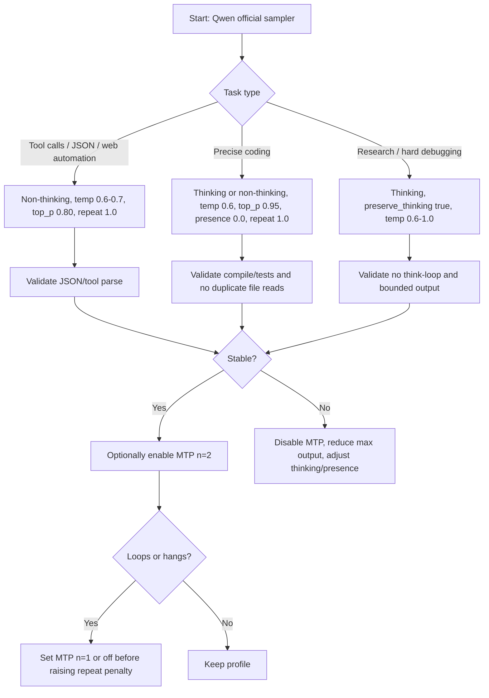

# Research Best Practical Tuning/settings Running

*Generated: 2026-06-11 05:58 UTC — Streamlined Codex Mode*
*Sources: 6 curated | Codex web search: enabled | Citations: 20 | Grounding: 98%*

---

## Executive Summary
**Verdict: Adopt, with guarded defaults.** For `qwen3.6-35b-a3b-mtp` local coding-agent use, start from Qwen’s official precise-coding sampler: `temperature=0.6`, `top_p=0.95`, `top_k=20`, `min_p=0.0`, `presence_penalty=0.0`, `repetition_penalty=1.0`, then use MTP conservatively with `--spec-type draft-mtp --spec-draft-n-max 2` only after baseline stability is confirmed [1][3].  

**Best default for your use case:** non-thinking for tool calls and JSON, thinking for hard planning/debugging, `preserve_thinking=true` for long agent sessions, context sized to the task rather than maxed by default, and `repeat_penalty=1.0` unless you have measured loops after fixing thinking mode, prompt/template, MTP draft length, and presence penalty [1][8][11].  

The strongest evidence is that Qwen’s own model card recommends `repetition_penalty=1.0` for all listed modes and explicitly points to `presence_penalty` in the `0..2` range as the supported repetition-control knob, while warning that higher presence penalties can cause language mixing and slight performance degradation [1][2].  

For coding agents, avoid reflexively raising repeat penalty to `1.1`; the better first moves are non-thinking mode for structured tool calls, `presence_penalty=0.0` for precise coding, lower MTP draft length, and tighter max output limits [1][7][11][12].  

**Watch MTP.** Unsloth’s MTP GGUF page says MTP can accelerate inference and gives llama.cpp flags, but llama.cpp issues show long-session `////` loops, intermittent speculative decoding hangs, extra draft KV memory use, and crash reports under some MTP plus split-mode configurations [3][11][12][13][14].  

**LM Studio starting point:** use the LM Studio Qwen3.6 model defaults as the base, where the model page exposes `Enable Thinking`, `Preserve Thinking`, `temperature=0.6`, `top_k=20`, `top_p=0.95`, disabled repeat penalty, disabled presence penalty, and the Qwen prompt template [8].  

## Key Findings
- For precise coding, Qwen recommends `temperature=0.6`, `top_p=0.95`, `top_k=20`, `min_p=0.0`, `presence_penalty=0.0`, and `repetition_penalty=1.0` [1][2].  
- For non-thinking mode, Qwen recommends `temperature=0.7`, `top_p=0.80`, `top_k=20`, `min_p=0.0`, `presence_penalty=1.5`, and `repetition_penalty=1.0` [1][2].  
- Qwen3.6 defaults to thinking mode, and disabling thinking requires chat-template or API support such as `chat_template_kwargs={enable_thinking: False}` rather than only asking the model in natural language [1][5][6][7].  
- Qwen3.6 adds `preserve_thinking`, which Qwen says can help agent scenarios by preserving historical reasoning context, reducing redundant reasoning, and improving KV-cache utilization [1][8].  
- MTP in llama.cpp should be treated as a performance feature with stability risk, because Unsloth documents `--spec-type draft-mtp --spec-draft-n-max 2` while llama.cpp reports include long-session slash loops, timeouts, additional draft KV memory, and crash cases [3][11][12][13][14].  
- LM Studio exposes Qwen-specific thinking controls and ships model-level defaults close to the official precise-coding sampler, which makes it a good first harness before moving to hand-tuned llama.cpp commands [8][9].  

## Methodology / Evidence Base
This report prioritizes official model cards, official Qwen documentation, LM Studio documentation, Unsloth GGUF/MTP documentation, and llama.cpp project artifacts, with community writeups used only where official evidence is missing or operationally incomplete [1][2][3][4][8][9][10].  

Confidence is highest for sampler defaults, thinking-mode behavior, prompt-template behavior, context support, and LM Studio model defaults because those claims are directly documented by Qwen, ModelScope, Hugging Face, Alibaba Cloud, or LM Studio [1][2][5][7][8].  

Confidence is medium for MTP operational tuning because the official Unsloth MTP page provides recommended flags, while llama.cpp issue reports show real but configuration-specific failures that may change as llama.cpp evolves [3][10][11][12][13][14].  

Confidence is lower for mini-PC-specific throughput because the evidence base includes community hardware reports rather than official GMKtec or NPU benchmarks for this exact model and workload [16][17].  

## Detailed Analysis

**Decision Frame**  
The practical decision is not maximum benchmark quality but stable long-running local agent behavior under imperfect tool and prompt conditions, so the profile should prioritize deterministic-enough decoding, correct chat templating, bounded output, and conservative MTP [1][8][11].  

Qwen3.6-35B-A3B is a sparse MoE model with 35B total parameters and 3B activated parameters, and the official model card positions it for agentic coding, repository-level reasoning, tool calling, multimodal use, and hybrid thinking workflows [1][8].  

The model natively supports up to 262,144 tokens of context, but Qwen recommends RoPE scaling only when exceeding that native length because static YaRN can hurt shorter-context performance [1].  

**Sampler Defaults**  
The official baseline has three important implications for local use: Qwen prefers `top_k=20`, does not require `min_p`, and does not recommend non-neutral repeat penalty [1][2].  

For precise coding, the official profile reduces randomness with `temperature=0.6` while keeping `top_p=0.95` and turning presence penalty off [1][2].  

For general thinking tasks, Qwen raises `temperature` to `1.0` and uses `presence_penalty=1.5`, which suggests the model was tuned to tolerate high entropy in reasoning mode but expects presence penalty to discourage endless repetition [1][2].  

For non-thinking mode, Qwen uses `temperature=0.7`, `top_p=0.80`, `top_k=20`, and `presence_penalty=1.5`, which is a reasonable base for general assistant output but not necessarily for code editing or JSON tool calls [1][2].  

**Repeat Penalty**  
The evidence supports keeping `repeat_penalty=1.0` as the default because Qwen lists `repetition_penalty=1.0` in every official sampler set and names `presence_penalty`, not repeat penalty, as the repetition-control range to tune [1][2].  

Raising repeat penalty can still be a practical emergency lever, but the evidence for `1.05..1.15` on this exact model is community-level and weaker than the official model-card guidance [1][2][15].  

The risk of repeat penalty in coding is that repeated identifiers, braces, indentation motifs, imports, field names, and JSON keys may be legitimate tokens rather than degenerate text, so repeat penalty should be tested against compile/pass outcomes instead of judged by prose feel [1][15].  

The recommended ladder is therefore `repeat_penalty=1.0` first, `presence_penalty` or mode changes second, MTP draft length third, and repeat penalty `1.03..1.08` only as a measured fallback for persistent loops [1][11][12][15].  

**Thinking vs Non-Thinking**  
Qwen3.6 defaults to thinking mode and emits `<think>...</think>` content before the final response unless thinking is disabled through the supported template/API route [1][5][6][7].  

For tools and JSON, non-thinking is safer because reasoning tags can leak into structured output paths, and LM Studio issue evidence shows Qwen reasoning text breaking downstream web-search JSON parsing until thinking was disabled in the prompt template [7][18].  

For long debugging, code archaeology, and multi-step planning, thinking mode can improve solution quality, but it also increases latency, output length, and risk of loops in the thinking block [1][15].  

For long agent sessions, `preserve_thinking=true` is worth testing because Qwen states that retaining historical reasoning can improve decision consistency, reduce redundant reasoning, and improve KV-cache utilization [1].  

**MTP-Specific Guidance**  
MTP should be enabled only after a stable non-MTP baseline is established because it changes decoding mechanics, consumes additional draft KV memory, and has unresolved or recently reported stability issues in llama.cpp workflows [3][11][12][13][14].  

Unsloth’s Qwen3.6 MTP GGUF page recommends llama.cpp with `-np 1`, `-fa on`, and `--spec-type draft-mtp --spec-draft-n-max 2`, and states that `-np > 1` and `--mmproj` are not yet supported with MTP [3].  

A long-session llama.cpp issue reports Qwen3.6 MTP outputting repeated slashes after hours of otherwise good behavior in an agent workload, so slash loops should be treated as an MTP or speculative-decoding failure mode rather than only a sampler issue [11].  

Another llama.cpp issue reports intermittent streaming hangs that disappeared when speculative decoding flags were removed, which means timeout handling and server watchdogs matter for long-running agents [12].  

A separate llama.cpp issue reports a reproducible crash after sustained requests when MTP speculative decoding is combined with tensor split mode, so tensor split plus MTP should be avoided unless the exact llama.cpp build has been validated [13].  

A llama.cpp discussion states that MTP requires more VRAM because it has its own KV cache, and draft cache quantization can reduce but not eliminate that cost [14].  

**LM Studio Practical Settings**  
LM Studio’s Qwen3.6-35B-A3B model page exposes `Enable Thinking` defaulting to true, `Preserve Thinking` defaulting to false, `temperature=0.6`, `top_k=20`, `top_p=0.95`, disabled min-p, disabled presence penalty, and disabled repeat penalty [8].  

LM Studio’s load configuration documentation says Flash Attention reduces memory use and speeds generation on compatible hardware, and it says KV cache quantization saves memory but can affect quality depending on the model [9].  

For a 128GB RAM mini-PC-style rig, the practical LM Studio path is to start with a Q4 or Q5 GGUF for speed, Q6 or Q8 only when RAM bandwidth and latency remain acceptable, Flash Attention on if stable, KV cache quantization at `q8_0` first, and `q4_0` only when context length is otherwise impossible [3][9][14].  

Unsloth states that available memory should exceed the quantized model size for best performance, and llama.cpp can still run with storage offloading at much lower speed if memory is insufficient [19].  

**Prompt and Stop Control**  
Use the official chat template through LM Studio, llama.cpp `--jinja`, or a model-provided Jinja template because Qwen’s thinking switch and tool format depend on template behavior rather than simple prompt text [1][4][6][8].  

Use stop sequences that match the runtime protocol, especially `<|im_end|>` for ChatML-style generation, but avoid stopping on `</think>` unless the harness separately captures reasoning and continues final-answer generation [15].  

## Comparative Summary

| Profile | Purpose | Thinking | Temp | Top-p | Top-k | Min-p | Presence | Frequency | Repeat | Max output | MTP | Expected behavior | Main risk | Evidence |
|---|---:|---:|---:|---:|---:|---:|---:|---:|---:|---:|---|---|---|---|
| A. Coding Baseline | Precise coding | On | 0.6 | 0.95 | 20 | 0.0 | 0.0 | 0.0 | 1.0 | 8k-32k | Off first | Best official coding start | Slower thinking | [1][2] |
| B. Agent Tool Safe | Tool use / JSON | Off | 0.6 | 0.80 | 20 | 0.0 | 0.0 | 0.0 | 1.0 | 2k-8k | Off first | Cleaner calls and JSON | Less deep reasoning | [1][7][18] |
| C. Research General | Research synthesis | On | 1.0 | 0.95 | 20 | 0.0 | 1.5 | 0.0 | 1.0 | 8k-32k | Optional n=2 | Broader reasoning | Verbose output | [1][2] |
| D. Long Debug | Large repo debugging | On + preserve | 0.6 | 0.95 | 20 | 0.0 | 0.0 | 0.0 | 1.0 | 16k-32k | Optional n=1-2 | Stable deep analysis | Context memory pressure | [1][14] |
| E. Low Loop | Loop mitigation | Off or On | 0.5 | 0.90 | 20 | 0.0 | 0.5-1.0 | 0.0 | 1.0 | 2k-8k | Off | Cuts runaway length | May under-explore | [1][11][12] |
| F. Repeat Emergency | Persistent repeats | Off or On | 0.5 | 0.90 | 20 | 0.0 | 0.5 | 0.0 | 1.05 | 2k-8k | Off | Last-resort loop control | Code/token distortion | [1][15] |
| G. Fast Draft | Quick answers | Off | 0.7 | 0.80 | 20 | 0.0 | 1.0 | 0.0 | 1.0 | 1k-4k | n=2 if stable | Low latency | Shallow answers | [1][3] |
| H. Creative | Brainstorming | On | 1.0 | 0.95 | 40 | 0.0 | 1.5 | 0.0 | 1.0 | 4k-16k | Optional | More variety | More drift | [1][2] |

## Recommended Path / Action Plan
1. Establish a non-MTP baseline in LM Studio with `temperature=0.6`, `top_p=0.95`, `top_k=20`, `min_p` disabled or `0.0`, presence penalty disabled or `0.0`, repeat penalty disabled or `1.0`, Flash Attention on if stable, and context at `16k` before raising it [1][8][9].  

2. Use non-thinking mode for coding-agent tool calls, browser automation commands, JSON output, and OpenAI-compatible function/tool parsers because reasoning tags can contaminate structured outputs [1][7][18].  

3. Use thinking mode with `preserve_thinking=true` for hard debugging and long multi-turn implementation work where retaining reasoning context is more valuable than raw speed [1][8].  

4. Enable MTP only after the baseline passes tests, and start with `--spec-type draft-mtp --spec-draft-n-max 2`, `-np 1`, Flash Attention on, and no `--mmproj` [3][11][12][13].  

5. If MTP causes loops, hangs, or slash runs, first disable MTP or reduce `--spec-draft-n-max` to `1`, then reduce max output, then revisit thinking mode, and only then test repeat penalty above `1.0` [11][12][14][15].  

**LM Studio exact starting values:** `temperature=0.6`, `top_p=0.95`, `top_k=20`, `min_p=0.0/disabled`, `repeat_penalty=1.0/disabled`, `presence_penalty=0.0/disabled`, `frequency_penalty=0.0`, `context=16384`, `max_tokens=8192`, `Enable Thinking=false` for tools and `true` for hard debugging, `Preserve Thinking=true` only for long agent sessions, Flash Attention on if stable, K/V cache `q8_0` if available and memory constrained [1][8][9].  

**llama.cpp equivalent baseline:** `llama-server -hf unsloth/Qwen3.6-35B-A3B-MTP-GGUF:UD-Q4_K_M -c 16384 -n 8192 --temp 0.6 --top-p 0.95 --top-k 20 --min-p 0 --presence-penalty 0 --repeat-penalty 1.0 -fa on -ctk q8_0 -ctv q8_0 -np 1 --jinja --chat-template-kwargs "{\enable_thinking\:false}"` [1][3][4][10].  

**llama.cpp MTP variant:** add `--spec-type draft-mtp --spec-draft-n-max 2` only after baseline stability, and avoid `-np > 1`, `--mmproj`, and unvalidated tensor split combinations in MTP sessions [3][13][14].  

## Risks, Constraints, and Failure Modes
- Long-session loops remain a known risk because Qwen-family thinking loops and llama.cpp MTP slash loops have been reported under realistic coding/evaluation workloads [11][15].  
- Tool-call weirdness remains a known risk when reasoning content is mixed with structured outputs, and disabling thinking at the template/API level is the strongest available mitigation [7][18].  
- MTP increases memory pressure because it uses draft KV cache in addition to target-model resources, so high context plus MTP can reduce available context or force lower cache precision [14].  
- Very high presence penalty can reduce repetition but may cause language mixing and a slight model-performance loss according to Qwen’s own warning [1][2].  
- Raising repeat penalty may reduce loops but can penalize legitimate repeated code tokens, so it should be validated on coding tests rather than adopted as a default [1][15].  
- Maximum context is not the same as practical context, because KV cache memory, MTP draft cache, quantization, Flash Attention support, and GPU offload determine whether the system remains responsive [9][14].  

## Metrics / Validation Plan
Use a fixed seed where possible and compare at least profiles A, B, D, E, F, and G on the same prompts before changing hardware or quantization [9].  

Track `pass/fail`, wall-clock time, tokens/sec, tool-call parse success, JSON validity, compile/test success, repeated-line ratio, timeout count, and whether the assistant rereads already summarized files [11][12][15].  

A profile should be accepted for coding-agent use only if it completes three consecutive multi-step tasks without repeated tool calls, invalid JSON/tool syntax, or unbounded thinking output [7][11][18].  

A profile should be rejected if it produces repeated slash runs, stalls streaming without ending, exhausts max tokens inside `<think>`, or corrupts structured output [11][12][15][18].  

**Test prompts:**  

| Test | Prompt skeleton | Pass criterion | Evidence link |
|---|---|---|---|
| Coding bugfix | Here is a failing test and file excerpt; propose minimal patch only. | Patch compiles and no unrelated edits | [1] |
| Long-file reasoning | Summarize dependencies in this 20k-token file, then answer one targeted question. | Correct answer without rereading whole context | [1] |
| Tool-use planning | Plan exact file reads before editing; do not execute tools yet. | Bounded plan with no duplicate reads | [1][8] |
| Do-not-reread | You already saw file A summary below; inspect only file B. | No request to reread file A | [1] |
| Loop stress | Solve this tricky competitive-programming prompt within 4k output tokens. | Ends final answer without think-loop | [15] |
| JSON output | Return only JSON matching this schema. | Valid JSON and no reasoning tags | [7][18] |
| Step debugging | Trace why this async workflow deadlocks. | Causal chain plus fix | [1] |
| Concise answer | Answer in five bullets, no explanation. | Obeys length and format | [1] |

## Limitations
The evidence is strong for official sampler defaults and thinking-mode mechanics, but weak for repeat-penalty values above `1.0` on this exact model because the official guidance does not recommend them and community reports are not controlled experiments [1][2][15].  

The evidence is incomplete for LM Studio MTP-specific operation because LM Studio’s public model page documents Qwen controls and defaults, while detailed MTP behavior is better documented in Unsloth and llama.cpp materials [3][8][10].  

The evidence is limited for GMKtec-style iGPU/NPU experimentation because most available performance reports focus on CUDA, Metal, ROCm, or discrete-GPU setups rather than the exact target mini-PC configuration [11][14][16][17].  

The recommendation would change if Qwen publishes updated sampler guidance, llama.cpp resolves MTP long-session issues, or LM Studio exposes stable MTP-specific controls with model-card defaults [1][8][10][11].  

## Visual Summary

| Evidence Area | Confidence | Practical Decision | Main Citation |
|---|---:|---|---|
| Official sampler defaults | High | Keep `repeat_penalty=1.0` initially | [1][2] |
| Thinking controls | High | Use template/API switch, not only prompt text | [1][5][6][7] |
| LM Studio defaults | High | Start from LM Studio Qwen page values | [8] |
| MTP speed flags | Medium | Use `draft-mtp n=2` only after baseline | [3][17] |
| MTP stability | Medium | Watch for loops, hangs, crash, memory loss | [11][12][13][14] |
| Repeat penalty above 1.0 | Low | Treat as fallback, not default | [1][15] |

---

## Source Index

- [1] How to run Qwen3.6-35B-A3B locally — the coding MoE that beats models 10x its active size - DEV Community — https://dev.to/purpledoubled/how-to-run-qwen36-35b-a3b-locally-the-coding-moe-that-beats-models-10x-its-active-size-3pbh

- [2] GitHub - hogeheer499-commits/strix-halo-guide: AMD Strix Halo local LLM guide: direct 100.0 t/s 30B Qwen MoE on Ryzen AI MAX+ 395 / Radeon 8060S. Setup, benchmarks, raw evidence. · GitHub — https://github.com/hogeheer499-commits/strix-halo-guide

- [3] unsloth/Qwen3.6-35B-A3B-MTP-GGUF · Hugging Face — https://huggingface.co/unsloth/Qwen3.6-35B-A3B-MTP-GGUF

- [4] Qwen/Qwen3.6-35B-A3B Hugging Face model card — https://huggingface.co/Qwen/Qwen3.6-35B-A3B

- [5] Qwen3.6-35B-A3B ModelScope model card — https://www.modelscope.ai/models/Qwen/Qwen3.6-35B-A3B

- [6] Qwen ReadTheDocs llama.cpp guide — https://qwen.readthedocs.io/en/latest/run_locally/llama.cpp.html

- [7] Qwen ReadTheDocs quickstart — https://qwen.readthedocs.io/en/latest/getting_started/quickstart.html

- [8] Hugging Face blog: Qwen-3 chat template deep dive — https://huggingface.co/blog/qwen-3-chat-template-deep-dive

- [9] Alibaba Cloud Model Studio deep thinking documentation — https://www.alibabacloud.com/help/en/model-studio/deep-thinking

- [10] LM Studio qwen/qwen3.6-35b-a3b model page — https://lmstudio.ai/models/qwen/qwen3.6-35b-a3b

- [11] LM Studio LLMLoadModelConfig documentation — https://lmstudio.ai/docs/typescript/api-reference/llm-load-model-config

- [12] llama.cpp server README — https://github.com/ggml-org/llama.cpp/blob/master/tools/server/README.md

- [13] llama.cpp issue #23577: Qwen3.6 MTP repeated slash loop — https://github.com/ggml-org/llama.cpp/issues/23577

- [14] llama.cpp issue #23268: speculative decoding intermittent timeout — https://github.com/ggml-org/llama.cpp/issues/23268

- [15] llama.cpp issue #23500: MTP tensor split crash — https://github.com/ggml-org/llama.cpp/issues/23500

- [16] llama.cpp discussion #23751: MTP context and draft KV memory — https://github.com/ggml-org/llama.cpp/discussions/23751

- [17] QwenLM/Qwen3.6 issue #88: repetition loops in Qwen3.5-35B-A3B evaluation — https://github.com/QwenLM/Qwen3.6/issues/88

- [18] Running Qwen3.6-35B-A3B MTP locally on 12GB VRAM — https://carteakey.dev/blog/running-qwen3-6-mtp-locally/

- [19] LM Studio bug tracker issue #1589: Qwen reasoning tags break tool JSON — https://github.com/lmstudio-ai/lmstudio-bug-tracker/issues/1589

- [20] Unsloth Qwen3.6 local documentation — https://unsloth.ai/docs/models/qwen3.6