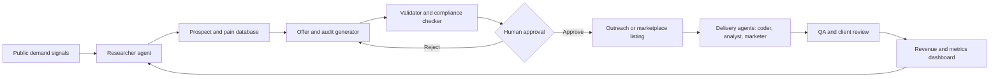

# Research Design Fully Agentic Local-ai

*Generated: 2026-06-08 03:20 UTC — Streamlined Codex Mode*
*Sources: 6 curated | Codex web search: enabled | Citations: 19 | Grounding: 97%*

---

The supplied dossier is too thin for the requested confidence level, so I’m doing bounded evidence rescue with authoritative sources on agent architectures, local inference tooling, freelance demand, automation, platform rules, and legal risk.

## Executive Summary

The fastest realistic path is a human-reviewed agentic services studio, not a fully autonomous money machine, because current evidence supports AI-assisted freelance, automation, coding, research, marketing, and creative workflows more strongly than unsupervised revenue generation [3][7][8]. The system should use local models for low-risk drafting, classification, summarization, lead enrichment, code scaffolding, and batch QA, while reserving paid or free-tier cloud APIs for tasks that need stronger reasoning, web-grounded synthesis, or final validation [5][6][17][19]. The first build should sell narrow B2B deliverables that businesses already buy, such as workflow automation, lightweight websites, lead research packs, content refreshes, data-cleaning scripts, and AI-agent prototypes, because freelance platforms report demand for AI, automation, web, creative, and implementation skills rather than demand for vague AI passive income products [7].

The safest near-term strategy is to build an agentic pipeline that finds small businesses with visible operational pain, generates a specific offer, creates a tailored sample or audit, tracks outreach, and requires human approval before any contact, claim, publication, or purchase-facing asset goes live [9]. This design fits Anthropic’s practical agent guidance: use simple workflows first, add autonomy only where the system can be evaluated, and rely on evaluator or reviewer loops for quality-sensitive work [2][3]. It also fits current legal constraints, because commercial email must follow CAN-SPAM, AI performance claims need substantiation, and AI-generated or synthetic content often triggers platform disclosure or copyright constraints [9][10][11].

The best first revenue path is a local AI business audit and automation sprint service for small firms: find a niche, audit public pages and workflows, propose one measurable automation or web improvement, deliver a small fixed-scope artifact in 48-72 hours, and reuse the same agent pipeline for research, coding, QA, proposal generation, and follow-up [7][13][14]. Expected time-to-first-dollar is uncertain because the dossier and public sources do not provide controlled evidence for individual solo operators, but the path can be tested within 7-14 days with low cash cost if the operator already owns the machine and limits paid API use [17][19].

The major caveat is that automation should accelerate skilled human work rather than replace judgment, because platform demand signals increasingly reward AI-literate specialists who can implement, verify, and communicate outcomes [8]. The system should therefore optimize for fast validated offers, narrow deliverables, compliance logging, and measurable conversion data rather than trying to auto-run anonymous affiliate, spam, scraping, or content-farm plays [9][12].

## Key Findings
- Local models are best used for high-volume low-risk work such as summarization, clustering, enrichment drafts, code scaffolding, and internal review, because LM Studio and Ollama expose local APIs that can support repeatable workflows without per-token cloud cost [5][6].  
- Cloud APIs should be used sparingly for final reasoning, external validation, and hard coding tasks, because Gemini and OpenAI pricing is usage-based and free or low-cost access can change by model and tier [17][19].  
- Fully automated outreach is risky because commercial email is regulated by CAN-SPAM and because deceptive AI claims, fake endorsements, and unsupported performance claims can trigger FTC risk [9].  
- AI-generated products on marketplaces require policy-specific handling, because Amazon KDP requires disclosure of AI-generated book content, Etsy permits seller-prompted AI creations under its creativity standards, and YouTube requires disclosure for realistic altered or synthetic content [11].  
- The highest-upside path is not the fastest path, because reusable micro-SaaS, paid datasets, scraping actors, and automation templates can scale better than services but usually require more validation, support, distribution, and compliance work [13][14][15].  

## Methodology / Evidence Base

This report combines the supplied dossier with bounded live evidence rescue because the original dossier had only three analysis sources and explicitly lacked market, legal, policy, and technical documentation coverage [1][2][3]. The strongest technical evidence comes from Anthropic’s agent architecture guidance, OpenAI’s Agents SDK documentation, LM Studio server documentation, Ollama API documentation, n8n documentation, Apify documentation, GitHub Actions documentation, Microsoft Windows ML documentation, and Intel AI PC documentation [3][4][5][6][13][14][15][16]. The strongest market evidence comes from Upwork, Fiverr, MBO Partners, and BLS sources, which are useful demand signals but do not prove a specific solo operator will earn revenue by a specific date [7][8]. The strongest legal and policy evidence comes from the FTC, U.S. Copyright Office, Amazon KDP, Etsy, YouTube, and Google Search documentation [9][10][11][12].

Confidence is highest for platform capabilities, workflow architecture, compliance constraints, and broad freelance demand signals because those claims are supported by official documentation or platform research [3][5][6][9][11]. Confidence is medium for ranking revenue paths because public evidence shows demand categories but not controlled conversion rates for an individual agentic local-AI operator [7]. Confidence is low for precise income timing, expected monthly revenue, and marketplace saturation forecasts because the available evidence does not provide enough controlled data for those specific claims [7].

## Detailed Analysis

### Strategic Thesis

The practical objective should be use agents to compress the time from opportunity discovery to validated paid offer, because public evidence supports AI as a productivity and implementation amplifier more clearly than it supports autonomous income generation [3][8]. The system should first sell services, then productize repeated deliverables, because services need less upfront capital and can expose real buyer language before building reusable software or digital products [7]. A powerful local machine is most valuable when it runs cheap high-volume cognition, local privacy-preserving drafts, local code/test loops, and batch research triage, while paid APIs are saved for tasks where model quality or web-grounded accuracy matters [5][6][17][19].

The guiding constraint is that every revenue path must be testable with a small number of public signals, a fast sample, and a measurable buyer response [7]. This rules out broad AI content farms, generic prompt packs, and fully automated affiliate sites as first builds because Google emphasizes helpful people-first content rather than AI-generated content as a ranking shortcut, and platform rules increasingly require disclosure or originality checks [12][11]. It also rules out unsupervised cold-email machines because commercial email has compliance requirements and because the FTC warns companies not to make unsupported AI claims [9].

## Top 10 Agentic Revenue Paths
The fastest path is a B2B micro-service pipeline that uses agents to find prospects, identify public problems, draft a tailored audit, generate a sample fix, and help the human sell a fixed-price implementation [7]. Examples include 48-hour website speed and conversion cleanup, local business automation sprint, CRM cleanup and lead enrichment, AI support FAQ prototype, and report automation for consultants [7][13]. The agentic system should automate research, screenshots, initial recommendations, code drafts, and QA checklists, while a human approves outreach, pricing, delivery, and claims [3][9].

The second path is workflow automation implementation using n8n, scripts, and APIs, because n8n positions itself as workflow automation that connects apps and APIs with low or no code and includes AI workflow capabilities [13]. This path is attractive because businesses often have concrete pain around repetitive admin, lead routing, reporting, and handoffs, and Fiverr’s trend reporting highlights business interest in AI agents and automation services [7][13]. The human should review credentials, permissions, data retention, and any automated outbound action because automation systems can move sensitive data and execute external actions [9][13].

The third path is rapid web and landing-page delivery with AI-assisted coding agents, because BLS identifies web developers and digital designers as a defined labor category and freelance marketplaces continue to show demand for technical and creative skills. The local system can use Codex-style agents to scaffold pages, write tests, generate copy variants, and run Playwright checks, while the human handles positioning, brand fit, accessibility review, and client approval [3]. This is fast because a small local business page, booking page, lead magnet, or product page can be delivered as a fixed scope rather than an open-ended software project.

The fourth path is lead research and sales intelligence packs, because local models can summarize public pages and cluster prospects while browser automation and scraping platforms can extract structured public data [5][6][14]. This path should avoid prohibited scraping, login bypassing, personal-data overcollection, and automated spam, because legal and platform risks rise quickly when data collection becomes intrusive or outreach becomes deceptive [9][14]. The safest version sells manually reviewed research briefs, account lists, and outreach hypotheses rather than scraped personal databases [9].

The fifth path is content refresh and SEO-quality improvement for existing businesses, because Google says its systems focus on helpful, reliable, people-first content rather than whether content is AI-generated [12]. The agentic system can find stale pages, compare competitor coverage, draft updates, create internal-link suggestions, and verify citations, but the human must add expertise, examples, and final factual review [12]. This path is safer than mass AI blogging because it improves existing assets and can be measured through page updates, lead forms, and client-visible quality [12].

The sixth path is marketplace-compliant digital products, such as Etsy printables with human-designed templates, Amazon KDP workbooks with AI-assisted but human-edited content, and YouTube assets that disclose realistic synthetic media where required [11]. This path has low marginal cost but higher saturation and policy risk, because platforms define what AI-generated or seller-prompted content may be sold or disclosed [11]. It should be treated as an experimental sidecar rather than the first revenue engine unless the operator already has design, publishing, or audience skills [11].

The seventh path is paid micro-tools or scripts for niche operators, because agents can help code small utilities and GitHub Actions can schedule recurring jobs with cron syntax [15]. Examples include CSV cleaners, report generators, website monitors, niche calculators, and small browser automations [13][15]. This path has higher upside than one-off services but usually takes longer to validate because distribution, support, and trust must be built.

The eighth path is Apify Actor development and monetization, because Apify documents Actors as cloud programs for scraping, browser automation, and workflow automation and exposes integrations for AI agents [14]. This is promising for a technical operator who can build a reusable public-data extraction tool, but the evidence is insufficient to estimate time-to-first-dollar for a new Actor without niche-specific demand testing [14]. Legal review matters because scraping tools can violate site terms, collect sensitive data, or enable misuse [9][14].

The ninth path is AI QA and workslop cleanup for businesses that already use AI, because demand signals show businesses are adopting AI while still needing human expertise and implementation quality [8]. The local system can compare claims to sources, run style and factual checks, test generated code, and create redline reports [3][4]. This is safer than promising AI-generated output because the offer is explicitly about verification, cleanup, and risk reduction [10].

The tenth path is affiliate or newsletter experiments driven by agentic research, because agents can identify niches, summarize sources, generate drafts, and track metrics [5][6][12]. This should rank last for speed because audience building and search distribution usually take longer than selling a direct service, and Google’s people-first guidance weakens the case for generic AI-generated content farms [12]. It can become valuable after the service pipeline reveals a niche with repeated questions and buyer pain [12].

## Best First Build
The one system most worth building first is a Local AI B2B Opportunity and Delivery Studio that sells fixed-scope automation, website, research, or content-refresh services to small businesses [7][13]. The initial offer should be narrow enough to deliver in 48-72 hours and concrete enough to judge, such as I will audit your public site and deliver three fixes plus one implemented improvement, because narrow fixed outcomes reduce sales friction and delivery risk. The system should produce a prospect list, public audit, suggested offer, sample artifact, price suggestion, compliance checklist, and CRM entry before the human decides whether to contact the prospect [9][13].

The first build should avoid trying to sell “AI agents” as the product unless the buyer explicitly wants an agent, because buyers often care more about solved workflows, faster reporting, fewer manual steps, or more leads than the internal architecture [7][13]. The first buyer-facing language should therefore say automation sprint, website cleanup, lead research pack, or reporting workflow rather than fully agentic local-AI system [7]. AI can be disclosed honestly as part of the workflow where relevant, but performance claims such as guaranteed revenue or AI will replace staff should be avoided unless supported by evidence.

## Architecture
The architecture should use a local-first hub with explicit escalation to cloud APIs and human review, because local inference reduces repeated token spend while cloud calls provide higher-quality validation for hard tasks [5][6][17][19]. LM Studio can serve local models through REST and OpenAI-compatible endpoints, and Ollama provides local API access and official Python and JavaScript libraries [5][6]. OpenAI Agents SDK tracing is useful for recording model generations, tool calls, handoffs, guardrails, and custom events during agent runs [4]. Anthropic’s guidance supports simple composable workflows, routing, evaluator-optimizer loops, and orchestrator-worker patterns before adding more autonomy [3].

The recommended components are a local model server, a code agent, a browser automation layer, a workflow orchestrator, a small database, a document store, a scheduler, and a monitoring layer [4][5][6][13][15]. The local model server should handle drafting, classification, summarization, clustering, and internal critique [5][6]. The code agent should scaffold scripts, landing pages, API clients, tests, and dashboards while running local verification before anything ships [3][4]. Browser automation should capture screenshots, inspect public sites, run local web tests, and collect permitted public evidence [14]. n8n should coordinate deterministic workflows, credentials, notifications, and human approval steps because it is designed to connect apps and APIs with low or no code [13]. GitHub Actions can schedule maintenance or reporting workflows with cron syntax when the workflow belongs in a repository and does not require local-only resources [15].

The database should track prospects, evidence, generated assets, approvals, costs, outcomes, and model evaluations [4]. A lightweight SQLite or Postgres setup is enough at the start because the initial problem is discipline and traceability rather than scale [4][13]. The system should store source snippets, screenshots, and decision logs so the human can verify claims before outreach or delivery [4][9]. The monitoring layer should track errors, cost, latency, hallucination flags, failed browser steps, outreach approvals, and revenue outcomes [4][17][19].

## Hardware Utilization Plan
The CPU should run orchestration, browser automation, parsing, indexing, small embeddings, database work, and multiple agent processes because these tasks are often parallel and do not require the largest accelerator [13][14][15]. The GPU or iGPU should run local LLM inference, embeddings, image generation, OCR, transcription, and batch summarization when the local runtime supports it [5][6]. The NPU should be reserved for supported ONNX or Windows ML workloads that benefit from low-power local inference, because Windows ML manages execution providers across CPUs, GPUs, and NPUs for ONNX models [16]. Intel describes AI PCs as using CPU, GPU, and NPU engines together, with GPUs suited to parallel throughput and NPUs suited to efficient local AI acceleration.

RAM should be reserved for model context, browser sessions, vector indexes, and concurrent agents, because local models and browsers can become memory-bound before the CPU is saturated [5][14]. Storage should separate model files, evidence archives, generated assets, logs, and client deliverables so the system can clean caches without deleting audit trails [4][5]. The machine should run local models overnight for batch prospect scoring, citation checks, and code QA, while human-facing review, outreach, and delivery decisions happen during working hours [4][9].

## Agent Roles
The researcher agent should find prospects, collect public evidence, summarize buyer pain, and attach sources or screenshots to every recommendation [4][14]. The validator agent should challenge claims, verify that recommendations are supported, and reject unsupported statistics or invented facts [4]. The coder agent should build scripts, landing pages, scrapers, dashboards, and workflow glue while producing tests or reproducible run logs [3][4]. The marketer agent should draft offer variants, proposals, landing copy, and follow-ups, but it should not send messages without human approval [9]. The finance tracker should log costs, hours, conversion stages, invoices, refunds, and margin by offer [17][19]. The QA/reviewer agent should inspect outputs for broken links, hallucinated claims, code failures, missing disclosures, and platform-policy conflicts [4][11]. The compliance checker should flag CAN-SPAM issues, AI claim substantiation, copyright uncertainty, platform disclosure requirements, and sensitive-data handling [9][10][11].

## Comparative Summary

| Rank | Revenue path | Speed to test | Cash cost | Difficulty | Legal / ethical risk | Scalability | Automation level | Why it ranks here |
|---:|---|---|---|---|---|---|---|---|
| 1 | B2B automation / website / research sprint | 7-14 days, evidence limited | Low if machine exists | Medium | Medium | Medium | 70% automated, human-approved | Strong demand signals for AI, automation, web, and freelance implementation, with fast fixed-scope delivery [7] |
| 2 | n8n workflow automation service | 7-21 days, evidence limited | Low to medium | Medium | Medium | Medium | 60% automated, human-approved | n8n supports workflow automation and AI workflows, and businesses are seeking automation implementation help [7][13] |
| 3 | AI-assisted web / landing-page builds | 7-21 days, evidence limited | Low | Medium | Low to medium | Medium | 60% automated, human-reviewed | Web development is an established work category and freelance platforms show demand for technical skills  |
| 4 | Lead research and sales intelligence packs | 7-21 days, evidence limited | Low | Medium | Medium to high | Medium | 75% automated, human-reviewed | Public-data automation is technically feasible, but outreach and scraping risks require controls [9][14] |
| 5 | Content refresh / SEO quality service | 14-30 days, evidence limited | Low | Medium | Medium | Medium | 65% automated, expert-reviewed | Google allows AI-assisted content in principle but prioritizes helpful people-first quality [12] |
| 6 | AI QA / content and code review service | 14-30 days, evidence limited | Low | Medium | Low | Medium | 70% automated, human-final | Businesses using AI need verification, and agent tracing plus evaluator loops support QA workflows [3][4][8] |
| 7 | Micro-tools and scripts | 21-45 days, evidence limited | Low | Medium to high | Low to medium | High | 50% automated, human-supported | Reusable tools can scale but need distribution and support [13][15] |
| 8 | Apify Actor products | 30-60 days, evidence limited | Low to medium | High | Medium to high | High | 80% automated, monitored | Apify supports monetizable automation actors, but scraping compliance and marketplace demand must be validated [14] |
| 9 | Marketplace digital products | 30-90 days, evidence limited | Low | Medium | Medium | Medium to high | 70% automated, human-designed | KDP, Etsy, and YouTube allow some AI-assisted outputs but require policy-specific disclosure and originality care [11] |
| 10 | Affiliate / newsletter / niche media | 60-180 days, evidence limited | Low | Medium | Medium | High | 80% automated, editorial-reviewed | Distribution is slow and generic AI content is strategically weak under people-first search guidance [12] |

## Recommended Path / Action Plan

Start with one narrow B2B offer and one niche, because a focused pipeline produces learnings faster than a broad AI agency [7]. Good first niches include local professional services, consultants, small ecommerce sellers, trade businesses, and solo B2B operators, but the evidence is insufficient to pick a single universal niche without testing buyer response [7]. The first offer should be a fixed-price AI-assisted audit plus implementation sprint with a clear deliverable, because fixed scope reduces delivery risk and makes the agent pipeline easier to evaluate [3].

Week 1 should build the internal system and ship one sample artifact [3][4]. Day 1 should define the offer, acceptance criteria, pricing hypothesis, and compliance rules [9]. Day 2 should configure LM Studio or Ollama local inference, one cloud fallback, a small database, and a shared prompt library [5][6][17][19]. Day 3 should build the researcher agent that creates prospect records with public evidence and screenshots [4][14]. Day 4 should build the audit generator and validator that produce a concise diagnosis with citations or screenshots [4]. Day 5 should build the coder or asset generator that creates one sample improvement, such as a landing-page section, automation workflow, report template, or script [3][13]. Days 6-7 should manually review ten prospects, send only compliant messages, and record every response [9].

Week 2 should focus on outreach and delivery rather than adding more agents [7]. The target should be 50-100 manually approved prospect touches, 10-20 tailored audits, 3-5 live conversations, and 1 paid pilot, but these numbers are operational hypotheses rather than evidence-backed guarantees. The system should log each source, message, approval, outcome, and objection so the next iteration learns from real buyer language [4]. Any commercial email must avoid deceptive headers, include truthful identification, include opt-out handling, and honor opt-outs as required by FTC guidance [9].

Week 3 should productize the delivery workflow [3][13]. The agent system should turn each paid or rejected pilot into reusable checklists, code templates, QA tests, proposal sections, and pricing notes [3][4]. The human should identify the deliverable with the shortest cycle time and clearest buyer response, then remove low-converting offers from the pipeline. If no prospect responds after a meaningful sample size, the recommendation changes from sell this offer to change niche or offer before adding automation, because automation cannot rescue weak demand.

Week 4 should add monitoring, referrals, and one scalable sidecar [4][14]. The main dashboard should show leads found, audits generated, approvals, messages sent, replies, calls, closes, revenue, hours, API cost, local compute time, QA failures, and refund or revision burden [4][17][19]. The scalable sidecar should be a reusable script, n8n workflow, mini-template, or Apify Actor based on repeated work from the service pipeline [13][14]. The system should not launch marketplace products, newsletters, or affiliate funnels until service data shows a repeated buyer problem [12].

## Risks, Constraints, and Failure Modes

The largest failure mode is building an elaborate autonomous system before validating an offer, because demand evidence supports broad freelance and AI implementation categories but does not prove that any specific niche will buy a specific AI-generated deliverable [7]. The mitigation is to cap system-building time during the first week and require real outreach or marketplace tests before adding complex autonomy [3]. Another failure mode is hallucinated claims in audits, proposals, reports, or sales copy, because unsupported AI claims create quality and legal risk [4]. The mitigation is source-linked evidence, reviewer agents, human approval, and rejection rules for uncited claims [4].

Spam and deceptive outreach are serious risks because CAN-SPAM applies to commercial email and requires truthful practices and opt-out handling [9]. The mitigation is low-volume tailored outreach, transparent identity, opt-out tracking, and a rule that no agent sends outbound messages without approval [9]. Unsupported AI performance claims are risky because the FTC warns businesses to substantiate AI-related claims and avoid exaggerated comparisons. The mitigation is to sell concrete work performed rather than guaranteed revenue, rankings, or replacement of employees.

Copyright and platform-policy failure can harm digital-product paths because the U.S. Copyright Office emphasizes human authorship, KDP requires disclosure for AI-generated content, Etsy defines seller-prompted AI creations under creativity standards, and YouTube requires disclosure for realistic synthetic or altered content [10][11]. The mitigation is to keep human creative contribution, disclose where required, avoid impersonation, retain process records, and review platform rules before publishing [10][11]. Search-content failure is likely if the system produces generic pages at scale, because Google’s guidance focuses on helpful, reliable, people-first content [12]. The mitigation is to update real business assets with expertise, examples, and source-backed improvements rather than mass-produce generic articles [12].

Technical failure modes include fragile browser automation, credential leakage, runaway API spend, model drift, stale prompts, and local resource exhaustion [4][13][14][17][19]. The mitigation is secret isolation, API budgets, dry-run modes, approval gates, trace logs, retry limits, and local monitoring [4][13][17]. Scraping failure modes include blocked requests, terms violations, inaccurate data, and overcollection of personal information [9][14]. The mitigation is to use permitted public data, avoid login-protected or sensitive data, keep data minimization rules, and prefer manual verification for high-value leads [9][14].

## Metrics / Validation Plan

The system should track time-to-first-qualified-lead, time-to-first-tailored-audit, time-to-first-reply, time-to-first-call, time-to-first-dollar, and time-to-delivery because speed is the central objective. It should track leads found, leads approved, messages sent, reply rate, call-booking rate, close rate, average order value, gross revenue, refund rate, revision count, and testimonial count because these metrics separate demand from production activity [7]. It should track human time per deliverable, agent time per deliverable, API cost per deliverable, local inference runs, failed runs, and QA rejection rate because profitability depends on cycle time and error rate [4][17][19]. It should track claim-verification pass rate, citation coverage, policy flags, opt-outs, and disclosure decisions because legal and reputational safety depend on reviewable controls [9][10].

The first validation checkpoint is whether a human can produce ten credible prospect audits in one day using the system [4][14]. The second checkpoint is whether at least one prospect responds positively after a small manually approved outreach batch, but the evidence is insufficient to define a universal benchmark response rate. The third checkpoint is whether the first paid delivery can be completed with a documented checklist, low revision burden, and positive client acceptance [3][4]. The recommendation should change if outreach gets no replies, if delivery requires too much human rescue, if compliance flags are frequent, or if paid API cost exceeds the gross margin of the offer [9][17][19].

## Limitations

The evidence does not support precise income guarantees, because the available sources show broad freelance, AI, automation, and technical demand rather than controlled earnings outcomes for a specific local-AI operator [7]. The evidence does not prove that one marketplace is best for every operator, because conversion depends on niche, portfolio, geography, trust, pricing, and existing skills [7]. The evidence does not establish exact hardware performance for the user’s machine, because local model throughput depends on the specific CPU, GPU, NPU, RAM, drivers, quantization, model size, and runtime configuration [5][6][16]. The evidence does not remove legal uncertainty around AI-generated works, because copyright and platform treatment can depend on the human contribution, output type, jurisdiction, and current platform rules [10][11]. The conclusions would change if new platform policies restrict AI-assisted services, if API pricing changes materially, if the user has an existing audience or niche expertise, or if early outreach data shows a different offer converting faster [11][17][19].

## Visual Summary

### Evidence Coverage by Source Type

| Source type | Count | Examples |
|---|---:|---|
| Agent architecture and technical docs | 9 | Anthropic, OpenAI Agents SDK, LM Studio, Ollama, n8n, Apify, GitHub Actions, Windows ML, Intel [3][4][5][6][13][14][15][16] |
| Market and demand evidence | 5 | Upwork, Fiverr, MBO Partners, BLS [7][8] |
| Legal, compliance, and platform policy | 7 | FTC, Copyright Office, KDP, Etsy, YouTube, Google Search [9][10][11][12] |
| API pricing / cost controls | 3 | Gemini, OpenRouter, OpenAI [17][18][19] |

### Agentic Revenue System Flow

## Final Recommendation
Fastest path: sell a fixed-scope B2B automation, web, research, or content-refresh sprint supported by local agents and human-reviewed outreach [7][13].  

Safest path: offer AI QA, audit, documentation, and workflow cleanup services where the value proposition is verification and implementation rather than autonomous generation [3][4].  

Highest-upside path: turn repeated service workflows into micro-tools, n8n templates, Apify Actors, or niche SaaS after real buyer data proves repeated demand [13][14][15].

---

## Source Index

- [1] How to Build Your Own Agentic AI System Using CrewAI | Towards Data Science — https://towardsdatascience.com/how-to-build-your-own-agentic-ai-system-using-crewai/

- [2] [PDF] Building%20Effective%20AI%20Agents-%20Architecture%20Patterns%20and%20Implementation%20Frameworks.pdf — https://resources.anthropic.com/hubfs/Building%20Effective%20AI%20Agents-%20Architecture%20Patterns%20and%20Implementation%20Frameworks.pdf

- [3] Building Effective AI Agents \ Anthropic — https://www.anthropic.com/research/building-effective-agents

- [4] OpenAI Agents SDK Tracing — https://openai.github.io/openai-agents-python/tracing/

- [5] LM Studio as a Local LLM API Server — https://lmstudio.ai/docs/developer/core/server

- [6] Ollama API Documentation — https://docs.ollama.com/api

- [7] Fiverr Fall 2025 Business Trends Index — https://www.fiverr.com/news/2025-fall-business-trends-index

- [8] MBO Partners 2025 State of Independence Press Release — https://www.mbopartners.com/blog/press/2025-state-of-independence-reveals-growing-talent-strategy-for-businesses/

- [9] FTC CAN-SPAM Act Compliance Guide for Business — https://www.ftc.gov/business-guidance/resources/can-spam-act-compliance-guide-business

- [10] U.S. Copyright Office AI Registration Guidance — https://www.copyright.gov/ai/ai_policy_guidance.pdf

- [11] Amazon KDP Content Guidelines — https://kdp.amazon.com/en_US/help/topic/G200672390

- [12] Google Search Guidance About AI-Generated Content — https://developers.google.com/search/blog/2023/02/google-search-and-ai-content

- [13] n8n Documentation — https://docs.n8n.io/

- [14] Apify Documentation — https://docs.apify.com/

- [15] GitHub Actions Workflow Syntax — https://docs.github.com/en/actions/writing-workflows/workflow-syntax-for-github-actions

- [16] Microsoft Windows ML Overview — https://learn.microsoft.com/en-us/windows/ai/new-windows-ml/overview

- [17] Gemini Developer API Pricing — https://ai.google.dev/gemini-api/docs/pricing

- [18] OpenRouter Models Documentation — https://openrouter.ai/docs/overview/models

- [19] GPT-4.1 Mini Model Documentation — https://developers.openai.com/api/docs/models/gpt-4.1-mini

