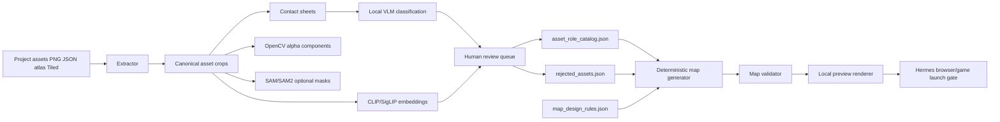

# Research Design Practical Local-first “asset

*Generated: 2026-06-09 05:02 UTC — Streamlined Codex Mode*
*Sources: 0 curated | Codex web search: enabled | Citations: 20 | Grounding: 93%*

---

## Executive Summary

**Adopt a two-tier local-first asset intelligence pipeline: project-local catalogs for game-specific truth, plus reusable Hermes skills/scripts for extraction, labeling, validation, and preview rendering.** The core decision is to stop letting Hermes infer asset semantics from filenames, GIDs, colors, or raw map output, because Tiled global tile IDs can change between maps when tilesets or ordering change, and Phaser consumes Tilemap/Tiled data structurally rather than semantically [1][2][3].

The recommended pipeline is offline and on-demand: extract tiles, frames, and sprites into canonical asset records; render contact sheets; classify those records with a local VLM; cluster similar assets with CLIP or SigLIP embeddings; optionally segment irregular sprites with OpenCV alpha connected components or SAM/SAM2; store approved and rejected roles in JSON catalogs; generate maps only from approved assets; validate the generated map against semantic and spatial rules; and render local previews before browser launch [4][12][13][14][15][16].

**Use Qwen3-VL or Qwen2.5-VL as the primary local VLM if LM Studio supports the chosen quantization and image-input path, with MiniCPM-V as a smaller fallback and LLaVA/InternVL as alternatives rather than defaults.** Qwen2.5-VL emphasizes visual recognition, localization, document parsing, and long-video comprehension, while Qwen3-VL is presented by Qwen as a newer vision-language model family with image-text-to-text usage and Apache-2.0 model-card availability on Hugging Face [7][8]. MiniCPM-V is useful when local hardware favors compact multimodal models, but the evidence here is not sufficient to claim it will outperform Qwen on small pixel-art sprites [10].

**Use OpenCV first, SAM/SAM2 second, CLIP/SigLIP for indexing and review, and YOLO only after human-reviewed labels exist.** OpenCV connected components can extract separate opaque regions and stats from binary masks, SAM and SAM2 provide promptable segmentation for ambiguous or irregular objects, CLIP and SigLIP provide text-image embedding machinery for zero-shot similarity and clustering, and YOLO’s documented strength is trainable object detection after a labeled dataset exists [12][13][14][15][16][17].

The most important engineering constraint is that the vision step must not run during every code edit. LM Studio exposes local API and SDK options suitable for scripts, but Hermes should normally consume versioned JSON catalogs and deterministic validators rather than repeatedly asking a VLM what a sprite means [6]. The minimum viable system should extract assets, make contact sheets, run VLM batch classification with confidence and evidence thumbnails, create `asset_role_catalog.json`, `rejected_assets.json`, and `map_design_rules.json`, and block map generation when assets violate catalog rules [2][4][7][18].

## Key Findings

- **Use VLMs for meaning, not extraction, because Qwen/LLaVA/MiniCPM/InternVL families are designed for image-text understanding while OpenCV and SAM/SAM2 are designed for image processing or segmentation [7][8][9][10][11][14][15][16].**

- **Use CLIP or SigLIP for embedding, clustering, duplicate detection, and looks like prior approved asset retrieval, because those models are trained to align images and natural-language concepts rather than to author Phaser maps directly [12][13].**

- **Use YOLO late, because Ultralytics’ documented workflow assumes a custom dataset, labels, training, and validation before reliable detector use [17].**

- **Use validators plus rendered previews as acceptance gates, because code and schema checks can pass while the visual map is semantically wrong [1][4][7][18].**

- **Keep reusable tooling global and semantic outputs project-local, because the reusable logic is extraction/classification/validation while the meaning of a tile depends on the project’s art style and role taxonomy [2][3][18].**

## Methodology / Evidence Base

The evidence base combines official game-engine documentation, official asset-format documentation, primary model papers or model cards, official local-inference documentation, and validation-library documentation [1][2][3][4][6][18]. Confidence is highest for Phaser/Tiled/Vite/JSON Schema integration constraints because those behaviors are documented by the relevant projects [1][2][3][4][5][18]. Confidence is moderate for VLM selection because model papers and model cards establish general capabilities, but they do not benchmark tiny pixel-art tilesheets directly [7][8][9][10][11]. Confidence is moderate for CLIP/SigLIP clustering because the papers establish language-image representation learning, but the evidence does not prove high accuracy for 16x16 or 32x32 pixel-art roles without local evaluation [12][13]. Confidence is high that YOLO should come later because the official workflow is dataset-and-training oriented, which presupposes labeled examples [17]. Confidence is high that preview rendering must be a first-class gate because Phaser provides renderer snapshot mechanisms and Tilemap loading paths, while the described failure mode is visual rather than purely type-level [1][4][19].

## Detailed Analysis

### Verdict

**Adopt: local-first asset intelligence as a catalog-producing pipeline, not as a prompt-only behavior.** The pipeline should create durable JSON facts that Hermes can read deterministically during map generation, because Hermes’ coding model is not the right runtime component to repeatedly infer whether a tile is a lily pad, crop, plank path, sign, or door [6][7][18].

**Avoid: direct map generation from raw GIDs or filenames.** Tiled global tile IDs refer to tiles through map-specific tileset ordering and include flip flags, so raw IDs are a brittle semantic substrate for reusable generation [3].

**Watch: YOLO, fine-tuned VLMs, and project-specific detectors.** These become useful after enough human-reviewed classifications and bad-example rejections exist to form a training and validation set [17].

### Target Architecture

The architecture should have three layers: reusable tool layer, project-local knowledge layer, and Hermes consumption layer [6][18]. The reusable tool layer should include scripts for extraction, contact-sheet generation, VLM batch classification, embedding computation, clustering, catalog validation, map generation, and preview rendering [4][12][13][16]. The project-local knowledge layer should contain catalogs such as `asset_role_catalog.json`, `visual_palette.json`, `rejected_assets.json`, `map_design_rules.json`, and generated preview artifacts [18]. The Hermes consumption layer should read those catalogs before editing map code or Tiled JSON, and it should fail closed when a role lacks approved assets [1][2][18].



This design separates asset meaning from generated map syntax, which is necessary because Phaser tilemaps and loaders describe how to load images, spritesheets, atlases, JSON, and tile layers but do not decide which tile is visually appropriate for a gameplay role [1][4]. It also preserves future-project reuse by making extraction and validation scripts reusable while keeping semantic approvals project-local [2][18].

### Extraction Layer

The extractor should normalize four input classes: grid tilesheets, spritesheets, atlas JSON frames, and individual PNG folders [4]. Phaser’s loader documentation explicitly covers common asset types including images, texture atlases, sprite sheets, fonts, audio, and JSON data, so the pipeline should model those as separate source types rather than pretending every image is a uniform tilesheet [4]. Tiled JSON supports image collection tilesets and layer data formats, so the extractor should read Tiled metadata when available instead of relying only on filesystem scanning [2].

For grid tilesheets, extraction should use configured `tileWidth`, `tileHeight`, `margin`, and `spacing`, and it should produce a stable `asset_id` derived from source path plus local tile index rather than global GID [2][3]. For atlas frames, extraction should parse the atlas JSON format used by the project and preserve the Phaser frame key, because Phaser expects atlas data in JSON hash or JSON array form [4]. For individual PNG folders, extraction should treat each file as a source sprite and optionally run alpha-connected-component extraction when the file contains multiple separated objects [16].

OpenCV should be the default for transparent-background sprites because `connectedComponentsWithStats` returns labels, stats, and centroids for connected regions in an 8-bit single-channel image [16]. SAM or SAM2 should be reserved for ambiguous cases where sprites overlap, share transparency, or need object masks beyond alpha components, because SAM is a promptable zero-shot segmentation model and SAM2 extends promptable segmentation to images and videos with reported speed and accuracy improvements over SAM for images [14][15]. This ordering is practical because OpenCV is deterministic and cheap, while SAM-class models add inference complexity and can produce masks without semantic labels [14][16].

### Contact Sheets and Review UX

Every extracted crop should appear in a labeled contact sheet with `asset_id`, source filename, local coordinates, frame key, dimensions, and alpha occupancy [16]. Contact sheets are essential because the human reviewer and VLM need to evaluate visual meaning at tile scale, and the system must preserve a trail from catalog decisions back to exact source pixels [4][16]. The contact sheet should include multiple zoom levels, because small pixel-art tiles are often unreadable at native 16x16 or 32x32 scale [4].

The VLM prompt should ask for constrained JSON rather than free-form prose, because downstream validators need enumerated fields such as `primary_role`, `secondary_roles`, `reject_for_roles`, `confidence`, `visual_description`, and `needs_human_review` [18]. The prompt should include role definitions and negative examples such as lily pad is water vegetation, not crop and plank or boardwalk is not dirt road unless explicitly approved, because the user’s failure cases are semantic confusions rather than unknown file formats [7][18]. The output should be treated as a draft label until either human review or high-confidence cross-checking confirms it, because VLM papers establish general visual understanding but do not guarantee perfect recognition of project-specific pixel-art semantics [7][8][9][10][11].

### VLM Choice

Qwen3-VL or Qwen2.5-VL should be the first model family to test under LM Studio because the Qwen2.5-VL report emphasizes visual recognition and localization, while the Qwen3-VL model card exposes image-text-to-text usage and an Apache-2.0 model card on Hugging Face [7][8]. Qwen3-VL should be preferred if it runs reliably on the user’s Windows hardware through LM Studio or an adjacent local runner, because it is the newer Qwen vision-language generation in the evidence set [8]. Qwen2.5-VL should remain the fallback default if Qwen3-VL is slower, unavailable in the local runtime, or less stable on the user’s installed stack [7][8].

MiniCPM-V should be evaluated as a compact local fallback, because its official repository emphasizes efficient image, video, and text understanding and lists low memory requirements for newer MiniCPM-V variants [10]. LLaVA should be considered a baseline rather than the primary recommendation, because the original paper establishes visual instruction tuning and general-purpose image conversation but is older than Qwen2.5-VL and Qwen3-VL in this evidence set [7][8][9]. InternVL should be considered when a strong local setup can support it, because the InternVL paper describes scaling a vision foundation model and aligning it with a language model for generic visual-linguistic tasks [11].

The model choice should be empirical inside Hermes’ environment rather than assumed from public benchmarks, because the relevant task is tiny pixel-art role classification, not broad VQA, document parsing, or benchmark leaderboard performance [7][8][9][10][11]. The first evaluation set should include the known failures: lily-pad crops, plank roads, oversized signs as farm objects, wrong object layers, wrong collision roles, and unreachable doors [1][2][3].

### CLIP and SigLIP Use

CLIP or SigLIP should be used as an embedding and retrieval subsystem, not as the sole semantic authority [12][13]. CLIP was trained to align images and natural-language supervision for zero-shot transfer to downstream tasks, which makes it appropriate for find assets similar to approved dirt path and cluster visually similar tree variants workflows [12]. SigLIP replaces softmax contrastive normalization with a sigmoid loss over image-text pairs and is relevant as an alternative embedding model when local tooling supports it [13].

Embedding outputs should power three specific features: duplicate grouping, review batching, and nearest-approved-asset lookup [12][13]. Duplicate grouping reduces repeated VLM calls by classifying one representative crop per visual cluster and propagating low-risk labels to neighbors with reviewer confirmation [12][13]. Nearest-approved lookup helps Hermes choose a role-consistent variant during generation without asking a VLM during every map edit [12][13].

CLIP/SigLIP should not be trusted to distinguish every project-specific role alone, because broad language-image embeddings can rank similarity without enforcing gameplay semantics like walkable path, blocking fence, or trigger volume [12][13][18]. Those gameplay semantics belong in `map_design_rules.json` and validator code rather than in embedding distance alone [18].

### SAM, SAM2, and OpenCV Use

OpenCV alpha-channel connected components should be the first extraction tool for single PNG folders and packed sheets with transparent backgrounds [16]. It is deterministic, local, fast, and returns component stats that can flag oversized props, tiny noise, or compound sprites [16]. SAM should be used when alpha does not separate objects or when a sheet contains irregular objects that need masks [14]. SAM2 should be considered over SAM when local installation is stable, because the SAM2 paper reports image segmentation that is more accurate and faster than SAM while also supporting video segmentation [15].

SAM and SAM2 should not be treated as classifiers, because their core contribution is promptable segmentation rather than semantic role labeling [14][15]. The correct pairing is OpenCV/SAM for crops or masks, then VLM for labels, then JSON catalog rules for deterministic use [7][14][15][16][18].

### YOLO Use

YOLO should not be part of the minimum viable pipeline unless there is already a labeled dataset of project sprites and preview-map objects [17]. Ultralytics documents YOLO object detection through training, validation, custom datasets, and model loading, which implies a labeled training process rather than zero-shot semantic asset understanding [17]. YOLO becomes useful after the asset catalog has hundreds of reviewed examples and the goal is repeatable detection of known classes in preview screenshots or future spritesheets [17].

A practical later use is screenshot QA: train a detector to identify signs, doors, crops, water, roofs, trees, and props in rendered previews, then compare detections to intended map layers and placement rules [17]. Another later use is atlas scanning when future projects contain similar art styles and the labels have already been curated [17]. The risk is that early YOLO training on bad Hermes labels would automate mistakes such as lily-pad crops or boardwalk roads [17].

### Catalog Design

The catalog schema should be strict enough to block bad generation but flexible enough to allow multiple projects and art packs [18]. JSON Schema is appropriate for the catalog contracts because it defines validation keywords for JSON structure and values, and Ajv can compile schemas into validation functions in JavaScript environments [18][20]. The schemas should be project-local but versioned, because asset meaning can vary by game even when extraction logic is reusable [2][3][18].

Minimal `asset_role_catalog.json` shape:

```json
{
  schema_version: "1.0.0",
  project_id: "pixelwood",
  generated_at: 2026-06-09T00:00:00Z,
  role_taxonomy: ["grass", "path", "crop", "water", "roof", "tree", "fence", "sign", "lamp", "house", "rock", "prop", "collision", "trigger"],
  "assets": [{
      "asset_id": tiles/farm.png#tile_012,
      "source": {
        "kind": "tilesheet",
        "path": assets/tiles/farm.png,
        local_index: 12,
        "x": 96,
        "y": 0,
        "w": 16,
        "h": 16
      },
      "visual": {
        contact_sheet: asset-intel/contact_sheets/farm.png,
        "crop_path": asset-intel/crops/tiles_farm_tile_012.png,
        alpha_occupancy: 0.94,
        dominant_palette: ["#5c9a3d", "#2f5e2f"]
      },
      classification: {
        primary_role: "grass",
        secondary_roles: ["ground"],
        approved_roles: ["grass"],
        rejected_roles: ["crop", "path", "water"],
        confidence: 0.88,
        review_status: "approved",
        "reviewer": "human",
        "model": qwen3-vl-8b-instruct,
        "notes": Plain grass ground tile.
      },
      "phaser": {
        texture_key: farm_tiles,
        "frame": null,
        tileset_name: "farm",
        local_tile_id: 12
      }
    }]
}
```

Minimal `rejected_assets.json` shape:

```json
{
  schema_version: "1.0.0",
  rejections: [{
      "asset_id": tiles/pond.png#tile_031,
      reject_for_roles: ["crop", "dirt_path"],
      allowed_roles: [water_plant, pond_detail],
      "reason": Looks like lily pad or pond vegetation.,
      "severity": hard_block,
      examples_failed: [farm_crop_patch_v3]
    }]
}
```

Minimal `map_design_rules.json` shape:

```json
{
  schema_version: "1.0.0",
  "roles": {
    "crop": {
      requires_approved_asset: true,
      forbid_asset_roles: ["water", water_plant, "sign", "roof"],
      allowed_layers: [ground_detail, interactive_crop],
      max_tile_area_ratio: 0.12
    },
    "path": {
      requires_approved_asset: true,
      forbid_asset_roles: ["boardwalk", "roof", "water"],
      must_connect: ["spawn", house_door, "field入口"],
      min_width_tiles: 1
    },
    "house": {
      requires_door_reachable: true,
      collision_policy: solid_except_door
    }
  },
  "layers": {
    "ground": { allowed_roles: ["grass", "path", "water"] },
    "objects": { allowed_roles: ["tree", "fence", "sign", "lamp", "rock", "prop"] },
    "collision": { allowed_roles: ["collision"] },
    "triggers": { allowed_roles: ["trigger"] }
  }
}
```

Minimal `visual_palette.json` shape:

```json
{
  schema_version: "1.0.0",
  "clusters": [{
      cluster_id: grass_mid_green,
      "asset_ids": [tiles/farm.png#tile_012, tiles/farm.png#tile_013],
      "roles": ["grass"],
      embedding_model: siglip-or-clip-local,
      representative_asset_id: tiles/farm.png#tile_012
    }]
}
```

### Validator Strategy

Validation must combine schema validation, catalog validation, map semantic validation, spatial validation, and visual preview validation [1][2][18][19]. Schema validation should reject malformed catalogs and maps before generation continues, because JSON Schema and Ajv provide a formal and practical mechanism for validating JSON data structures [18][20]. Catalog validation should reject any map request that uses an asset outside its approved role list or inside a rejected role list [18].

Map semantic validation should inspect each generated tile and object layer against `map_design_rules.json` [1][2][18]. It should fail if crop roles include assets rejected for crop, if path roles include boardwalk-only assets, if signs exceed count limits, if props occupy ground layers incorrectly, or if collision and trigger objects are missing from the intended layers [1][2][18]. It should also fail if raw GIDs appear in generation templates without resolving through local tileset metadata and catalog IDs, because GIDs are not stable semantic names across maps [3].

Spatial validation should test reachability from spawn to critical doors, path continuity, collision blocking, layer legality, and object footprint bounds [1][2]. Door reachability should use grid search over walkable tiles and collision masks, because Phaser renders tile layers but does not itself prove that a generated layout is navigable [1]. Oversized prop spam should be caught by asset dimensions, object bounding boxes, and per-role density limits [16][18].

Visual validation should render a preview image and compare the rendered map to intended role masks where feasible [19]. Phaser’s renderer snapshot APIs can capture the canvas or areas of it, and a Node/Python preview renderer can also composite tiles from catalog coordinates without launching the browser [19]. The key acceptance rule is that browser launch is not proof of correctness unless the preview and semantic validator pass [1][19].

### Preview Rendering Strategy

The minimum preview renderer should be offline and deterministic: load the same tilesheets, atlas frames, and individual PNGs; composite layers in Phaser-like order; draw object bounding boxes and role overlays; and write `preview.png`, `preview_roles.png`, and `validation_report.json` [1][4]. This avoids waiting for a full browser loop to catch obvious semantic errors [1][19]. The browser remains the final visual source of truth, but the offline renderer catches cheap failures earlier [1][19].

The preview should display at least four overlays: approved role layer, rejected-role violations, collision mask, and navigation path from spawn to doors [1][2][18]. The preview should include asset IDs on hover in an HTML report or numbered legend in a PNG contact sheet, because reviewers need traceability from a visual error back to the source crop and catalog entry [16][18]. The renderer should save a diff against the previous accepted preview for map edits, because repeated prompt loops often hide regressions that are obvious side by side [19].

### Hermes Integration Strategy

Hermes should receive this system as both a reusable skill and project-local data [6][18]. The global or reusable part should include instructions and scripts named around operations such as `extract_assets`, `classify_assets`, `review_catalog`, `generate_map`, `validate_map`, and `render_preview` [6][18]. The project-local part should include the catalogs, role taxonomy, human review decisions, rejected examples, and preview history [2][3][18].

Hermes should be instructed to follow this order before map work: read `asset_role_catalog.json`, read `rejected_assets.json`, read `map_design_rules.json`, select assets by approved role, generate maps through a deterministic generator, run validators, render previews, and only then open the browser [1][2][18][19]. Hermes should not call a VLM during routine code edits unless an asset is missing from the catalog or the user explicitly requests asset reclassification [6][7][18]. Hermes should never promote a VLM-only label into a global skill, because local art semantics are project-specific and can be wrong until reviewed [7][8][18].

The safest “learning” mechanism is curated project memory rather than global memory [18]. A reviewed catalog entry can be reused inside the same project and used as an example for future projects, but it should not become a universal rule unless the reusable rule is structural, such as do not use unstable GIDs as semantic labels [3][18]. Future projects should import tooling and schemas, then create fresh catalogs from their own art packs [2][3][18].

## Comparative Summary

| Tool or approach | Best use in this pipeline | Strength | Main limitation | Recommendation |
|---|---|---|---|---|
| OpenCV connected components | Split transparent PNGs and find opaque components | Deterministic extraction with stats and centroids | Does not assign semantic meaning | Use first for extraction [16] |
| SAM | Promptable masks for irregular objects | Zero-shot segmentation over new image distributions | Segmenter, not a semantic classifier | Use only when OpenCV/grid extraction fails [14][16] |
| SAM2 | Promptable image/video segmentation | Reported faster and more accurate than SAM for image segmentation | More setup complexity than OpenCV | Watch/adopt after MVP if install is stable [15][16] |
| Qwen3-VL | Primary local VLM candidate | Current Qwen VLM model card supports image-text-to-text workflows | Pixel-art tile performance must be tested locally | Prefer if LM Studio stack supports it [8] |
| Qwen2.5-VL | Stable primary or fallback VLM | Report emphasizes visual recognition and localization | Public evidence is not pixel-art-specific | Adopt as fallback/default test model [7] |
| MiniCPM-V | Compact local VLM fallback | Official project emphasizes efficient image/video/text understanding | Evidence is insufficient for role accuracy on tiny sprites | Watch/test on hardware-constrained setups [10] |
| LLaVA | Baseline VLM | Paper establishes visual instruction tuning | Older baseline in this evidence set | Use as fallback comparison [9] |
| InternVL | Higher-capability VLM candidate | Paper describes large-scale vision-language alignment | May be heavier for Windows local use | Watch/test if hardware permits [11] |
| CLIP | Embedding, clustering, retrieval | Aligns images and natural language for zero-shot transfer | Not a gameplay-rule validator | Adopt for clustering and nearest-neighbor lookup [12] |
| SigLIP | Embedding alternative | Uses sigmoid loss and supports language-image pretraining | Local tooling availability varies | Adopt if easy through local packages [13] |
| YOLO | Later detector for known classes | Official workflow supports custom training and validation | Needs labeled data before usefulness | Avoid in MVP, adopt after labels exist [17] |
| JSON Schema + Ajv | Catalog and map contract validation | Validates JSON structures with standard keywords and JS tooling | Cannot detect visual nonsense alone | Adopt as structural gate [18][20] |

## Recommended Path / Action Plan

1. **Build the reusable extractor and catalog schema first.** The first milestone should parse Phaser/Tiled-relevant asset sources, produce stable `asset_id` values, crop every tile/frame/sprite, and validate JSON outputs with schemas [1][2][3][4][18].

2. **Generate contact sheets before model calls.** The contact sheet creates human-readable evidence for every asset and prevents hidden classifier decisions from becoming unreviewable project truth [16][18].

3. **Run one local VLM batch classification pass.** Test Qwen3-VL, Qwen2.5-VL, and one compact fallback on a small golden set containing known bad cases, then pick the most reliable local model rather than relying on generic benchmark claims [7][8][10].

4. **Create hard rejections and role approvals.** Promote only reviewed or cross-checked labels into `asset_role_catalog.json`, and put known confusions such as lily pads as crops, planks as dirt roads, and giant signs as farm props into `rejected_assets.json` [18].

5. **Implement deterministic generation from catalogs.** The map generator should request roles like `grass` or `path` and receive only approved asset IDs, rather than selecting raw GIDs or filename-matched images [3][18].

6. **Implement semantic and spatial validators.** The validators should check layer legality, role legality, rejected asset use, collision masks, trigger placement, door reachability, path continuity, and object density [1][2][18].

7. **Implement offline preview rendering.** The renderer should composite a map preview and overlays before browser launch, because the core failure mode is visual correctness rather than TypeScript compilation [1][19].

8. **Add Hermes skill instructions after the project MVP works.** The skill should teach Hermes the workflow and command sequence, while project-specific catalogs remain inside the game repo [6][18].

## Risks, Constraints, and Failure Modes

- **Tiny pixel-art sprites may be too ambiguous for general VLMs.** Mitigation is zoomed contact sheets, role-specific prompts, human review, and local golden-set evaluation [7][8][9][10].

- **Raw GIDs can create false confidence.** Mitigation is stable `asset_id` values based on source path and local tile/frame coordinates, plus explicit GID resolution at generation time [2][3].

- **SAM masks can look precise while labels remain wrong.** Mitigation is to use SAM only for segmentation and require VLM or human labels for semantic roles [14][15].

- **CLIP/SigLIP clusters can group visually similar but gameplay-different assets.** Mitigation is to use embeddings for review assistance and retrieval rather than final approval [12][13][18].

- **YOLO can automate bad labels if trained too early.** Mitigation is to delay YOLO until human-reviewed catalogs and screenshot labels exist [17].

- **Catalogs can become stale when assets change.** Mitigation is to hash source files and fail validation when a crop’s source hash changes without reclassification [18].

- **Validators can produce fake success if they only check schemas.** Mitigation is to combine schema checks with semantic rules, spatial reachability, and rendered preview inspection [1][2][18][19].

- **Global Hermes skills can be polluted by project-specific assumptions.** Mitigation is to keep global logic structural and keep role approvals, rejections, and palettes project-local [2][3][18].

## Metrics / Validation Plan

The MVP should pass a golden set of at least the known user failure cases before Hermes uses it for production map generation [18]. The golden set should include lily-pad-looking water vegetation, plank or boardwalk tiles, oversized signs, house doors, fences, trees, crops, dirt paths, collision-only tiles, and trigger-only objects [1][2][18]. A model run should be accepted only if rejected assets are blocked from their known bad roles and approved assets remain available for intended roles [18].

Catalog validation metrics should include percentage of assets classified, percentage needing human review, number of hard rejections, number of approved assets per required role, and number of assets with changed source hashes [18]. Map validation metrics should include rejected-role violations, illegal-layer placements, unreachable required targets, collision leaks, trigger-layer errors, path connectivity failures, and oversized-object density violations [1][2][18]. Preview validation metrics should include generated preview existence, overlay existence, visual diff against previous accepted preview, and human acceptance status for visually significant map changes [19].

The recommendation should change if local VLM evaluation shows unacceptable role accuracy on the golden set, if LM Studio cannot reliably serve image inputs for the chosen model, or if OpenCV extraction fails on the dominant asset format [6][7][8][16]. The recommendation should also change if the project’s art assets already include authoritative metadata from the artist or asset pack, because human-authored labels should outrank inferred labels [2][18].

## Limitations

The evidence base does not include a benchmark specifically measuring Qwen3-VL, Qwen2.5-VL, MiniCPM-V, LLaVA, or InternVL on tiny pixel-art tilesheet semantic classification [7][8][9][10][11]. The evidence base does not prove that CLIP or SigLIP embeddings will cleanly separate game roles such as crop, lily pad, dirt path, and boardwalk without project-specific evaluation [12][13]. The evidence base does not include Hermes Agent internals beyond the user-provided operating description, so the integration strategy is framed as file, script, and skill boundaries rather than Hermes-specific API calls [6][18]. The evidence base does not establish a legal or licensing review for every model weight or asset pack, so model and art licenses must be checked before redistribution or commercial use [8][10][17]. The report therefore recommends an MVP with measurable local evaluation rather than a claim that any single model will solve asset understanding automatically [7][8][18].

---

## Source Index

- [1] Phaser Tilemap API Documentation — https://docs.phaser.io/api-documentation/3.88.2/class/tilemaps-tilemap

- [2] Tiled JSON Map Format Documentation — https://doc.mapeditor.org/en/stable/reference/json-map-format/

- [3] Tiled Global Tile IDs Documentation — https://doc.mapeditor.org/en/latest/reference/global-tile-ids/

- [4] Phaser Loader Concepts Documentation — https://docs.phaser.io/phaser/concepts/loader

- [5] Vite Static Asset Handling Documentation — https://vite.dev/guide/assets.html

- [6] LM Studio Developer Docs — https://lmstudio.ai/docs/api

- [7] Qwen2.5-VL Technical Report — https://arxiv.org/abs/2502.13923

- [8] Qwen3-VL-8B-Instruct Model Card — https://huggingface.co/Qwen/Qwen3-VL-8B-Instruct

- [9] LLaVA: Visual Instruction Tuning — https://arxiv.org/abs/2304.08485

- [10] MiniCPM-V Official Repository — https://github.com/OpenBMB/MiniCPM-V

- [11] InternVL: Scaling up Vision Foundation Models and Aligning for Generic Visual-Linguistic Tasks — https://arxiv.org/abs/2312.14238

- [12] CLIP: Learning Transferable Visual Models From Natural Language Supervision — https://arxiv.org/abs/2103.00020

- [13] SigLIP: Sigmoid Loss for Language Image Pre-Training — https://arxiv.org/abs/2303.15343

- [14] Segment Anything — https://arxiv.org/abs/2304.02643

- [15] SAM 2: Segment Anything in Images and Videos — https://arxiv.org/abs/2408.00714

- [16] OpenCV Structural Analysis and Shape Descriptors — https://docs.opencv.org/3.4/d3/dc0/group__imgproc__shape.html

- [17] Ultralytics Object Detection Documentation — https://docs.ultralytics.com/tasks/detect

- [18] JSON Schema Specification — https://json-schema.org/specification

- [19] Phaser Renderer Snapshot Documentation — https://docs.phaser.io/api-documentation/function/renderer

- [20] Ajv JSON Schema Validator Documentation — https://ajv.js.org/