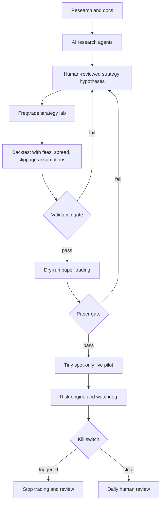

# Senior Systems Researcher, Quant Trading

*Generated: 2026-06-09 14:52 UTC — Streamlined Codex Mode*
*Sources: 4 curated | Codex web search: enabled | Citations: 24 | Grounding: 90%*

---

I’m going to rescue the weak dossier with a bounded source pass focused on primary docs, official repos, and regulator/tax pages so the brief can support current tool and risk claims with citations.

## Executive Summary
**Verdict: Adopt Freqtrade-first, Watch Hummingbot, Avoid autonomous LLM trade execution.** The fastest realistic path is a boring, evidence-gated spot-only system built on Freqtrade for data download, backtesting, dry-run paper trading, hyperparameter experiments, analysis exports, and eventual tiny live trades, with AI agents restricted to research, code generation, test writing, log analysis, and risk review rather than final order decisions [4][5][16].  

The strongest engineering reason to start with Freqtrade is that it already covers the MVP loop that matters: strategy code, historical OHLCV data, backtesting with fees, dry-run wallet simulation, hyperopt, lookahead analysis, recursive analysis, plotting, and live mode from the same Python strategy surface [4][5]. Hummingbot is more suitable if the first strategy is market making or cross-exchange market making, because its docs emphasize connector abstraction, Gateway, Strategy V2, arbitrage controllers, and DEX/CEX market-making patterns [6][7]. CCXT is valuable as a connector layer or for custom research tools, but a custom CCXT bot should not be the first live-money engine because it forces the builder to reimplement risk controls, order-state reconciliation, persistence, and execution edge cases [9].  

The most plausible fastest-to-profit path is not a magic AI trader but a disciplined search over simple spot strategies with realistic costs, spread assumptions, walk-forward splits, out-of-sample validation, and paper trading that must survive live exchange latency and partial-fill behavior. For a small account, begin with liquid BTC/ETH/SOL or major USDC/USDT pairs, no leverage, no martingale, strict max daily loss, small fixed stake, exchange-level API permissions, and a kill switch [4][12][14].  

AI agents help most where the cost of being wrong is low and reviewable: literature triage, exchange documentation comparison, strategy ideation, feature engineering candidates, backtest report generation, code review, test generation, anomaly explanations, and post-trade analysis [2][3][16]. AI should not directly place live orders or override risk limits, because regulators explicitly warn that AI trading bots are being used to sell unrealistic or guaranteed-return schemes, and LLM trading-agent evidence remains mostly benchmark, simulation, or framework-level rather than durable live crypto profitability evidence [13][16].  

The Ryzen AI Max+ 395-class rig is strong enough for local research agents, embeddings, vector search, batch backtests, and local coding assistance, but NPU optimization is not on the critical path because trading profitability will be constrained by data quality, market microstructure, exchange behavior, and validation discipline rather than token throughput [10][11]. Use CPU/iGPU/local LM Studio or Ollama for low-cost support tasks, use Codex/ChatGPT Pro for hard engineering and reviews, and use cloud APIs only when local models fail at reasoning or code reliability [10][17].  

## Key Findings
- **Avoid first-principles CCXT live trading for the MVP** because CCXT provides unified exchange APIs but does not provide a complete trading system with backtesting, dry-run parity, risk engine, dashboard, and audit trail by itself [9].  
- **Use AI agents as research and engineering accelerators** because multi-agent trading frameworks show useful role separation, memory, and analysis patterns, but this evidence does not prove reliable autonomous live profitability [3][16].  
- **Do not trust AI for final live trade decisions** because AI trading bot marketing is a known fraud vector and LLM systems can hallucinate, overfit, or rationalize weak signals [13][16].  
- **Prioritize realistic backtesting over model sophistication** because backtest overfitting, lookahead bias, selection bias, OHLC fill ambiguity, spread, fees, and slippage can turn attractive simulations into losing live systems.  
- **Treat NPU use as optional optimization** because AMD’s Ryzen AI stack supports NPU/iGPU inference through ONNX Runtime and Windows ML, but local trading success depends more on validation, execution safety, and data quality than NPU acceleration [10][11].  
- **Start spot-only with tiny live size after paper validation** because no-leverage spot trading reduces liquidation risk, operational complexity, tax confusion, and exchange/API failure blast radius [4][12][14].  

## Methodology / Evidence Base
This brief uses a rescue evidence base because the initial dossier contained only three sources and did not cover framework maintenance, exchange APIs, hardware, legal/tax risk, or backtesting failure modes adequately [1][2][3].  

The source set prioritizes primary documentation for Freqtrade, Hummingbot, CCXT, Binance Spot API, Kraken API, AMD Ryzen AI, LM Studio, OpenRouter, OpenAI Codex, IRS, CFTC, and FinCEN, with academic or preprint sources used for backtest overfitting and LLM trading-agent context [4][6][9][10][12][13][14][16][17].  

Confidence is high for framework capabilities that are directly documented by project or vendor docs, medium for current open-source ecosystem comparisons because GitHub activity and docs quality change quickly, and low for claims that any strategy class will be profitable in live crypto markets [4][5][6][8][9].  

Confidence is also low that OpenClaw should be relied on for this project, because available evidence describes powerful local automation and notable safety concerns, but it does not establish trading-system reliability or a mature financial workflow boundary [18][19].  

## Detailed Analysis
**Decision Brief: Adopt Freqtrade-first MVP.** Freqtrade is the best first framework because it gives the user a direct loop from strategy code to downloaded exchange data, backtesting, fee-inclusive profit calculations, dry-run wallet configuration, hyperopt, plotting, and live trading commands [4][5].  

Freqtrade’s strongest practical advantage is not that it will make money, but that it reduces the number of infrastructure pieces the builder must get right before testing whether a strategy has any edge [4][5].  

The fastest legitimate path is to create a small strategy lab around Freqtrade, add a separate research-agent layer for ideas and reports, and use strict promotion gates before any live trade is allowed [4][16].  

The first live system should use spot markets only, fixed stake sizing, max open trades, pair whitelist controls, a daily loss stop, an exchange API key without withdrawal permission, and a manual approval gate before enabling live mode [4][12][14].  

**Decision Brief: Watch Hummingbot for market making.** Hummingbot is a better fit than Freqtrade for market making, cross-exchange market making, and connector-heavy arbitrage experiments because its docs emphasize Gateway connectors, standardized trading schemas, Strategy V2, and arbitrage controllers [6][7].  

Hummingbot should become the second framework only if the early research indicates that maker rebates, spread capture, inventory skew, or cross-market execution are the preferred strategy class [6][7].  

Hummingbot is not the fastest beginner path if the first objective is simple OHLCV strategy discovery, because Freqtrade has a clearer backtest/dry-run loop for Python signal strategies [4][5][6].  

**Decision Brief: Avoid custom CCXT live bot first.** CCXT is excellent for market data collection, exchange capability inspection, and small custom scripts because it exposes a unified API over many crypto exchange REST APIs [9].  

A custom CCXT bot is a poor first live-money engine because the user would need to implement portfolio accounting, state recovery, idempotent order placement, reconciliation, fee modeling, retry logic, rate-limit handling, and kill-switch behavior before validating any strategy edge [9][12].  

A custom CCXT service can still be useful as a sidecar for data ingestion, exchange comparison, or paper-trading experiments that are not yet promoted to the live engine [9].  

**Framework notes.** Jesse is a serious trading framework with a backtesting surface that reports net profit, win rate, drawdown, Sharpe, Calmar, Sortino, benchmark comparisons, trade exports, and visual trade inspection [8].  

Jesse is worth watching for discretionary-style strategy research and richer backtest inspection, but Freqtrade has broader visible documentation around the full bot lifecycle and operational commands [4][5][8].  

OctoBot is a user-friendly open-source bot aimed at automating grid, DCA, AI, and TradingView-style strategies across multiple exchanges, but that convenience orientation is less ideal for a principal-engineer MVP where auditability and test discipline matter more than turnkey automation [15].  

OpenCode is useful as a local terminal coding agent if the user wants a second coding harness beyond Codex, but it should be treated as an engineering assistant rather than a trading component [17].  

OpenClaw should be watched, not adopted for live trading, because agent platforms with browser, filesystem, shell, and service access create real operational power and real safety risk when connected to money-moving accounts [18][19].  

**AI agents: where they help.** AI helps research by turning exchange docs, strategy papers, release notes, and backtest logs into structured hypotheses that a human can inspect [2][16].  

AI helps strategy discovery by generating candidate rules, parameter grids, feature transformations, and falsification tests, but each candidate must be validated with deterministic backtests and out-of-sample paper trading [16].  

AI helps feature engineering by suggesting volatility filters, liquidity filters, regime classifiers, funding features, volume imbalance features, and sentiment features, but generated features should be treated as hypotheses rather than signals [16].  

AI helps backtest analysis by explaining drawdown clusters, trade distributions, exposure concentration, cost sensitivity, and parameter fragility, but the numeric report must come from reproducible code rather than a model answer [4].  

AI helps code generation and review because Codex is built for coding tasks such as implementing features, fixing bugs, reviewing diffs, and running tests in developer workflows.  

AI helps anomaly detection by summarizing deviations between expected and observed fills, API errors, latency spikes, stale data, and unusual P&L, but the watchdog rules should be deterministic and enforceable without model approval [12][13].  

**AI agents: where they should not be trusted.** AI should not directly decide live entries, exits, position sizes, leverage, or risk-limit overrides because current evidence supports agents as analysis frameworks rather than proven live crypto alpha generators [13][16].  

AI should not be allowed to change strategy code and deploy it to live mode without tests, backtests, human review, and a paper-trading probation period.  

AI should not scrape logged-in exchange UIs or browser sessions for trading unless a human explicitly isolates credentials and confirms the action, because browser-capable agents can take high-impact actions outside the intended scope [18][19].  

**Strategy ranking.** For speed to measurable edge, the best first strategies are simple spot mean reversion, volatility breakout or momentum filters, and constrained grid experiments on liquid pairs, because they can be prototyped in Freqtrade and tested with OHLCV plus realistic fees [4][5].  

Funding-rate arbitrage can be attractive conceptually, but it requires derivatives venues, funding schedules, borrow or hedge mechanics, basis risk controls, and more operational complexity than a spot-only MVP should accept [12][14].  

Market making can be profitable in some conditions, but it requires order book awareness, fee tier understanding, adverse selection controls, inventory management, and strong execution monitoring [6][7].  

Cross-exchange and triangular arbitrage are usually poor beginner targets because competition, fees, transfer latency, stale quotes, API limits, and partial fills erase naïve apparent edge [9][12].  

Event-driven and sentiment-driven trading are interesting research layers, but they are risky first live strategies because news latency, source quality, hallucinated summaries, and market reaction ambiguity make validation difficult [13][16].  

**Hardware utilization.** The GMKtec EVO-X2 / Ryzen AI Max+ 395-class rig is well suited for local backtesting, data processing, SQLite/Postgres storage, vector indexing, local LLM serving, and multiple coding-agent sessions because it has high RAM and SSD capacity [10][11].  

AMD’s Ryzen AI software supports pre-trained PyTorch or TensorFlow models deployed to integrated GPU or NPU, and AMD documents ONNX Runtime and Windows ML flows for Ryzen AI NPUs [10][11].  

NPU work should be postponed until the bot has profitable paper-trading evidence, because NPU acceleration will not fix weak strategy logic, bad fills, overfitting, or poor risk controls [10].  

LM Studio is the simplest Windows-friendly local model server because it exposes REST, Python and TypeScript SDKs, OpenAI-compatible endpoints, and Anthropic-compatible endpoints [17].  

OpenRouter is useful as a low-friction cloud model router when a local model fails a coding, summarization, or reasoning task, because its docs describe standardized model metadata and API routing [20].  

**Recommended local AI stack.** Use Codex/ChatGPT Pro for hard code changes, architecture review, test generation, and debugging because it is the highest-leverage tool already available to the user and is explicitly designed for coding workflows.  

Use LM Studio as the default local GUI/server for experimenting with Qwen, DeepSeek, Llama, Gemma, and embedding models, because its OpenAI-compatible local API makes it easy to swap into agent scripts [17].  

Use Ollama only if CLI-first model management is preferred, because it provides a local HTTP API and embedding endpoints but is less GUI-oriented than LM Studio [21].  

Use SQLite first for MVP metadata, trades, configs, and backtest reports, and move to Postgres plus TimescaleDB only after data volume or concurrent services justify the operational cost [4][9].  

Use Chroma, LanceDB, or SQLite-vec for the research vector store only after plain file storage and markdown reports become limiting, because retrieval adds complexity before the first edge is proven [17].  

**Exchange path.** Use Binance Spot Test Network or framework dry-run for API mechanics, because Binance’s official Spot API repository states that Spot Testnet can be used to practice spot trading and supports API endpoints beginning with `/api/*` [12].  

Use Kraken or Coinbase Advanced Trade as eventual US-friendly exchange candidates depending on account availability, fees, API access, and regional support, because Kraken documents REST, WebSocket, Futures, and FIX APIs while Coinbase documents REST and WebSocket for Advanced Trade [22][23].  

Dry-run and paper trading should use real market data and simulated fills where possible, because testnet order books may not represent live liquidity even when they are useful for API integration testing [12].  

**Legal, tax, and compliance.** US taxpayers must treat digital asset activity as reportable, and IRS guidance requires taxpayers to answer the digital asset question on federal returns [14].  

Any bot that trades for other people, pools funds, sells signals, or transmits value can create regulatory exposure, and FinCEN guidance treats administrators or exchangers that accept and transmit convertible virtual currency as money transmitters unless a limitation or exemption applies [24].  

The CFTC warns that AI trading bots are often marketed with unreasonable or guaranteed-return claims, so the project should never advertise returns or accept third-party capital [13].  

## Comparative Summary
| Option | Verdict | Best use | Main drawback | MVP fit |
|---|---|---|---|---|
| Freqtrade | Adopt | OHLCV strategies, backtesting, hyperopt, dry-run, live spot bot [4][5] | Less specialized for market making than Hummingbot [6] | Best first choice [4] |
| Hummingbot | Watch | Market making, Gateway, arbitrage controllers, connector-heavy strategies [6][7] | More complex first path for simple signal research [6] | Second-stage if market making is chosen [6] |
| Jesse | Watch | Backtest analysis, metrics, trade inspection, strategy research [8] | Less central to the recommended dry-run/live workflow than Freqtrade [4][8] | Good research alternative [8] |
| OctoBot | Watch | User-friendly automation, grid, DCA, TradingView-style workflows [15] | Less ideal for rigorous custom validation and audit-first engineering [15] | Not first choice [15] |
| CCXT custom bot | Avoid first | Data ingestion and exchange abstraction scripts [9] | Requires building the whole trading runtime and risk system [9] | Use as sidecar, not live MVP [9] |
| Codex-built custom system | Watch | Engineering review, tests, dashboards, sidecars, reports  | Custom live execution is expensive to harden  | Build around Freqtrade first [4] |
| OpenCode | Watch | Local terminal coding assistant and secondary code review [17] | Not a trading framework [17] | Optional engineering tool [17] |
| OpenClaw | Avoid live trading | Browser/file/shell automation in isolated non-money workflows [18][19] | System-level autonomy creates safety and credential risk [18][19] | Do not connect to exchange keys [19] |

| Strategy class | Speed to prototype | Profitability plausibility | Capital need | Risk | API complexity | Beginner fit | Small-account fit | Verdict |
|---|---:|---:|---:|---:|---:|---:|---:|---|
| Spot mean reversion | High [4] | Medium-low until proven  | Low [4] | Medium  | Low [4] | High [4] | High [4] | Build first [4] |
| Spot momentum / breakout | High [4] | Medium-low until proven  | Low [4] | Medium  | Low [4] | High [4] | High [4] | Build first [4] |
| Grid trading | High [15] | Regime-dependent  | Medium [15] | Medium-high  | Low-medium [15] | Medium [15] | Medium [15] | Test only with drawdown caps  |
| Market making | Medium [6] | Medium if fees/spread/inventory work [6] | Medium-high  | High  | High [6] | Low-medium [6] | Low-medium  | Second-stage [6] |
| Statistical arbitrage | Medium  | Medium if robust  | Medium  | Medium-high  | Medium [9] | Medium  | Medium  | Research after MVP  |
| Funding arbitrage | Medium [12] | Medium but venue-dependent [12] | Medium-high [12] | High [12] | High [12] | Low [12] | Low-medium [12] | Later only [12] |
| News/event trading | Medium [16] | Low without latency/data edge [16] | Low-medium [16] | High [13] | Medium [16] | Low [16] | Low [16] | Research only [16] |
| Sentiment trading | Medium [16] | Low until proven [16] | Low [16] | High [13] | Medium [16] | Low-medium [16] | Low [16] | Research only [16] |
| Cross-exchange arbitrage | Low-medium [9] | Low for beginners  | High  | High  | High [9] | Low [9] | Low  | Avoid first  |
| Triangular arbitrage | Medium [9] | Low for beginners  | Medium  | High  | High [9] | Low [9] | Low  | Avoid first  |

## Recommended Path / Action Plan
1. Build a Freqtrade strategy lab with one baseline mean-reversion strategy, one momentum strategy, static pairlists, downloaded historical data, fee-inclusive backtests, and exported reports [4][5].  
2. Add deterministic risk controls before optimization, including max stake, max open trades, stoploss, cooldowns, daily loss stop, exchange outage stop, and no leverage [4][13].  
3. Add a research-agent layer that writes markdown hypotheses and backtest summaries but cannot modify live config or submit orders [2][16].  
4. Run hyperopt only after a simple hand-written baseline exists, and reject any parameter set that fails out-of-sample, walk-forward, cost-sensitivity, or lookahead checks [5].  
5. Paper trade for at least 2-4 weeks on real-time data and require the paper system to match expected fills, latency assumptions, fee assumptions, and drawdown limits before live mode [4].  
6. Start live trading only with tiny spot size, no withdrawals on API keys, no leverage, one exchange, one or two liquid pairs, and a manual daily review [12][13][14].  
7. Promote Hummingbot only if the evidence indicates the edge depends on maker behavior, inventory control, or cross-market execution that Freqtrade cannot model adequately [6][7].  

**7-day build plan.** Day 1 should create the repo, install Freqtrade in Docker or a Python venv, create `.env.example`, configure dry-run, and download BTC/ETH/SOL OHLCV data [4].  

Day 2 should implement baseline strategies with fixed stake, stoploss, cooldowns, max open trades, and static pairlists [4].  

Day 3 should run backtests with fees, export results, and generate a markdown report template that records assumptions and parameter values [4].  

Day 4 should add lookahead and recursive analysis checks, plus unit tests for indicators and signal boundaries [5].  

Day 5 should add a risk configuration file, kill-switch script, Telegram/Discord/email alert stub, and API-key permission checklist [4][12].  

Day 6 should run first paper trading in dry-run mode and capture logs, trades, rejected orders, and latency observations [4].  

Day 7 should review results with Codex, freeze the first baseline, and reject any strategy that only works after aggressive hyperopt.  

**14-day build plan.** Days 8-10 should add hyperopt with constrained parameter spaces, cost-sensitivity tests, and walk-forward splits [5].  

Days 11-12 should add a local research RAG store for exchange docs, strategy notes, and backtest reports using LM Studio embeddings or Ollama embeddings [17][21].  

Days 13-14 should add a dashboard with equity curve, drawdown, open trades, daily loss, recent errors, and kill-switch status [4].  

**30-day build plan.** Week 3 should paper trade continuously, compare expected versus observed fills, tune risk limits downward, and remove strategies that fail cost or drawdown assumptions [4].  

Week 4 should run a tiny live pilot only if paper trading clears go/no-go criteria, and the live pilot should use minimum viable stake sizes with daily human approval [13][14].  

## Risks, Constraints, and Failure Modes
Backtest overfitting is the largest technical risk because repeated parameter search can produce attractive historical curves with poor out-of-sample performance.  

OHLCV backtests can misrepresent intrabar path, limit-order fills, scalping behavior, spreads, and slippage, so strategies that depend on tiny edges require more granular data or conservative fill assumptions.  

Exchange API failures can create duplicate orders, stale balances, missed cancels, and unhandled partial fills, so the bot must reconcile state before every trading cycle [9][12].  

Crypto markets run continuously, so monitoring, alerting, outage handling, and kill switches are required even for a small bot [12][22].  

AI hallucinations can produce false citations, invalid exchange assumptions, broken code, or overconfident strategy explanations, so all AI output must be treated as draft material until verified by tests or primary docs [13][16].  

Regulatory and tax mistakes can become expensive even if the bot loses money, because digital asset transactions remain reportable and third-party money handling can trigger money-transmission concerns [14][24].  

The evidence is insufficient to claim that OpenClaw is reliable enough for money-moving workflows, and the available safety literature argues for isolation and strict action validation around powerful local agents [18][19].  

## Metrics / Validation Plan
A strategy may enter paper trading only if it passes reproducible backtests, static pairlist tests, fee-inclusive results, lookahead analysis, recursive analysis, and out-of-sample validation [4][5].  

A strategy may enter tiny live trading only if it completes at least 2-4 weeks of paper trading with positive expectancy after modeled fees and slippage, max drawdown below the configured threshold, no unresolved order-state bugs, and no risk-limit violations [4].  

The MVP should track CAGR only as secondary context because short crypto tests can exaggerate annualized returns.  

The MVP should track net profit, max drawdown, profit factor, Sharpe or Sortino, win rate, average win/loss, exposure time, turnover, fees paid, slippage estimate, rejected orders, stale-data incidents, and API errors [4][8].  

The recommendation changes from Freqtrade-first to Hummingbot-first if the only validated edge comes from maker spreads, rebate economics, inventory skew, or cross-exchange market making [6][7].  

The recommendation changes from local-model-first to cloud-model-first if local models repeatedly fail code review, strategy analysis, or report consistency tasks that Codex or a routed cloud model handles correctly [20].  

## Limitations
The report cannot prove any crypto strategy will be profitable because public documentation and backtests do not establish persistent live edge after fees, spreads, slippage, latency, and competition.  

The report uses current documentation snapshots and search results, so exchange support, framework maintenance, model availability, and AI-agent tool behavior should be rechecked before implementation [4][6][9][10].  

The report does not provide legal or tax advice, and a US trader should consult a qualified professional before scaling, trading derivatives, handling third-party funds, or selling signals [14][24].  

The evidence on OpenClaw is especially uncertain for this use case because public material emphasizes broad automation and safety issues rather than audited trading workflows [18][19].  

## Visual Summary


```text
Exact repo structure:
crypto-agent-bot/
  README.md.env.example
  docker-compose.yml
  configs/
    freqtrade.dryrun.json
    freqtrade.live.tiny.json
    risk_limits.yaml
    pairlists/
  strategies/
    MeanReversionBaseline.py
    MomentumBaseline.py
  data/
    raw/
    processed/
    backtest_results/
  notebooks/
    research.ipynb
    backtest_review.ipynb
  agents/
    research_agent/
    strategy_builder_agent/
    backtest_agent/
    risk_review_agent/
    pnl_analyst_agent/
  reports/
    hypotheses/
    backtests/
    paper_trading/
    live_reviews/
  services/
    dashboard/
    alerts/
    kill_switch/
    data_ingestion/
  tests/
    unit/
    integration/
    strategy/
  scripts/
    download_data.ps1
    run_backtest.ps1
    run_dryrun.ps1
    emergency_stop.ps1
```

Build this first: **Freqtrade spot-only strategy lab with two simple baseline strategies, strict risk limits, dry-run paper trading, Codex-assisted tests and reports, and no AI-controlled live execution** [4][5][13].

---

## Source Index

- [1] What You Need to Build an Automated AI Crypto Trading Bot - DEV Community — https://dev.to/daltonic/what-you-need-to-build-an-automated-ai-crypto-trading-bot-47fa

- [2] [PDF] Building%20Effective%20AI%20Agents-%20Architecture%20Patterns%20and%20Implementation%20Frameworks.pdf — https://resources.anthropic.com/hubfs/Building%20Effective%20AI%20Agents-%20Architecture%20Patterns%20and%20Implementation%20Frameworks.pdf

- [3] GitHub - TauricResearch/TradingAgents: TradingAgents: Multi-Agents LLM Financial Trading Framework · GitHub — https://github.com/tauricresearch/tradingagents

- [4] Freqtrade Backtesting — https://docs.freqtrade.io/en/latest/backtesting/

- [5] Freqtrade Bot Usage and Hyperopt — https://docs.freqtrade.io/en/latest/bot-usage/

- [6] Hummingbot Documentation — https://hummingbot.org/docs/

- [7] Hummingbot Gateway Strategies — https://hummingbot.org/gateway/strategies/

- [8] Jesse Backtest Documentation — https://docs.jesse.trade/docs/backtest/

- [9] CCXT Manual — https://github.com/ccxt/ccxt/wiki/manual

- [10] AMD Ryzen AI Software — https://www.amd.com/en/products/software/ryzen-ai-software.html

- [11] AMD AI Model Deployment Using Windows ML on AMD NPU — https://www.amd.com/en/developer/resources/technical-articles/2026/ai-model-deployment-using-windows-ml-on-amd-npu.html

- [12] Binance Spot API Docs GitHub — https://github.com/binance/binance-spot-api-docs

- [13] CFTC Customer Advisory: AI Won’t Turn Trading Bots into Money Machines — https://www.cftc.gov/LearnAndProtect/AdvisoriesAndArticles/AITradingBots.html

- [14] IRS Digital Assets — https://www.irs.gov/digitalassets

- [15] OctoBot GitHub — https://github.com/drakkar-software/octobot

- [16] TradingAgents: Multi-Agents LLM Financial Trading Framework — https://arxiv.org/abs/2412.20138

- [17] LM Studio Developer Docs — https://lmstudio.ai/docs/api

- [18] OpenClaw Browser Documentation — https://docs.openclaw.ai/tools/browser

- [19] Your Agent, Their Asset: A Real-World Safety Analysis of OpenClaw — https://arxiv.org/abs/2604.04759

- [20] OpenRouter Models Documentation — https://openrouter.ai/docs/guides/overview/models

- [21] Ollama API Documentation — https://docs.ollama.com/api

- [22] Kraken API Center — https://docs.kraken.com/

- [23] Coinbase Advanced Trade API Documentation — https://docs.cdp.coinbase.com/api-reference/advanced-trade-api/rest-api/introduction

- [24] FinCEN Virtual Currency Guidance — https://www.fincen.gov/resources/statutes-regulations/guidance/application-fincens-regulations-persons-administering