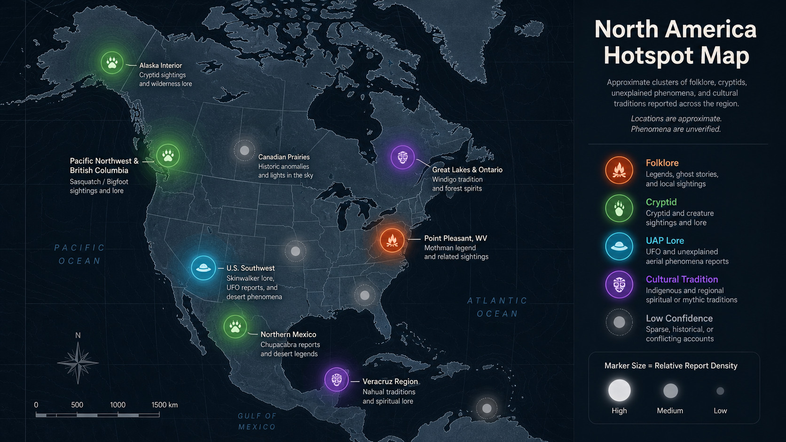
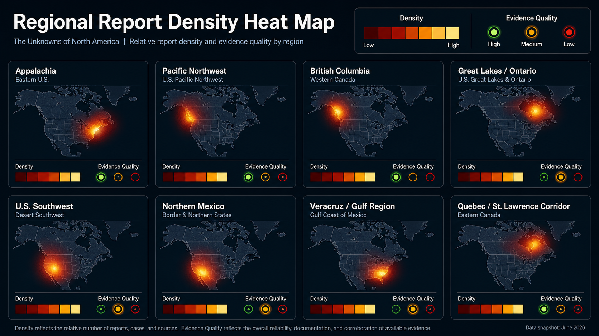
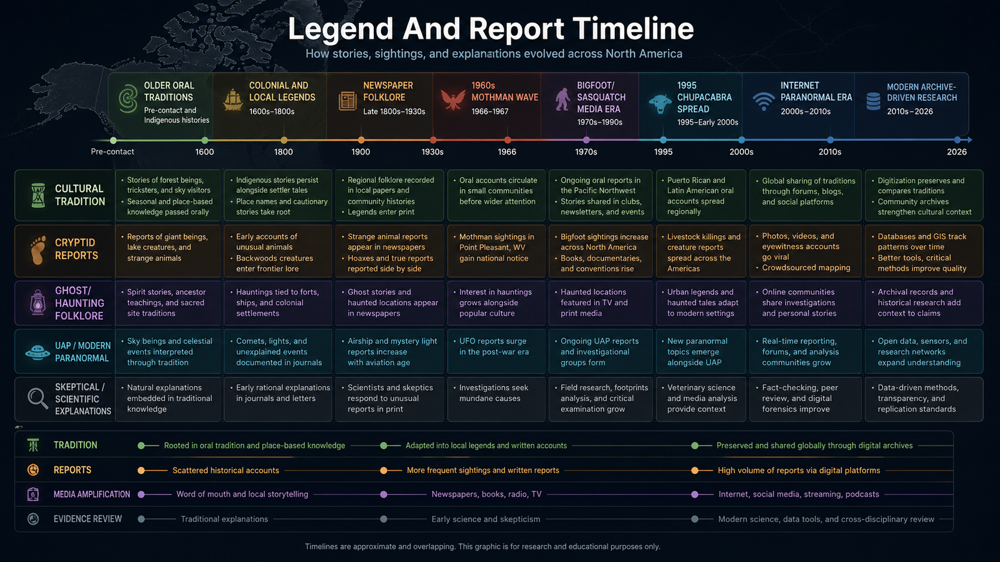

# The Unknowns of North America: Folklore, Paranormal Claims, and Pattern Map

## Executive Summary

This research packet treats North American paranormal and folklore claims as a pattern-analysis problem, not as proof of the supernatural. The best-supported finding is that many famous cases are durable because they combine repeated local narration, strong geography, media amplification, and at least some inspectable documentary trail. The weakest claims are those that exist only as internet retellings without stable place, date, witness chain, or cultural context.

Three broad clusters emerge. First, forest-and-mountain cryptid traditions cluster strongly in the Pacific Northwest, British Columbia, Appalachia, and parts of the Great Lakes. These are often tied to older Indigenous, settler, and wilderness narratives, but the modern forms are also shaped by twentieth-century media. Second, ghost-road, battlefield, mine, bridge, and abandoned-site stories cluster around places where death, labor history, disaster, or tourism give communities durable story anchors. Third, UFO/paranormal overlap appears in the U.S. Southwest, parts of Appalachia, and modern internet-linked urban corridors, where older folklore now blends with aerial-anomaly and conspiracy narratives.

The highest-confidence pattern is not that any one entity is proven. It is that repeated claims often attach to specific environments: remote forests, waterways, old roads, extraction sites, borderlands, reservations or Indigenous cultural landscapes, and towns with strong local identity. Those environments make stories more memorable and more repeatable. Evidence level should therefore separate cultural tradition from eyewitness clustering, eyewitness clustering from physical evidence, and physical evidence from proof.

## Methodology and Evidence-Grading System

This report uses a five-level evidence scale requested in the prompt. Level 0 means cultural tradition, myth, religious belief, or folklore with no claim that a modern sighting occurred. Level 1 means a single anecdotal account. Level 2 means multiple accounts or retellings, but weak independence. Level 3 means a consistent regional pattern with documented witness reports, local archives, or long-running public record. Level 4 means claimed physical traces, photos, audio, video, police records, government records, newspaper archives, or field investigations. Level 5 would require unusually strong documentation and cross-checking; this report intentionally assigns no Level 5 case because none of these examples is being certified as proven.

A serious research workflow should not use a single agency, website, podcast, subreddit, or enthusiast database as the truth. It should triangulate from folklore scholarship, local historical sources, museum/library records, newspapers, skeptical explanations, and culturally grounded sources. It should also label source limits. A folklore source may be excellent for cultural history but weak for physical evidence. A witness database may be useful for clustering but weak for verification. A skeptical source may explain many reports but may also flatten local meaning.

## Map of North American Hotspots

The map-ready dataset below is the structured input for ResearchHive's report-image pipeline. It is deliberately mixed: some rows represent folklore traditions, some represent famous modern claims, and some represent environmental/skeptical explanation clusters. The map should therefore be read as a research-priority visualization, not an occurrence/proof map.

## United States Findings

Point Pleasant, West Virginia remains one of the cleanest examples of a modern regional legend with a stable place, date range, and archive trail. The West Virginia Encyclopedia summarizes the Mothman reports as beginning in November 1966, totaling 26 over roughly a year, centered near the Point Pleasant TNT plant, with skeptical explanations including a possible sandhill crane [1]. The Smithsonian Folklife article adds cultural context: the story was sustained by local memory, newspapers, later books and film, a museum, and a festival economy [2]. That makes Mothman a strong Level 3 folklore/intelligence case: not proven as an entity, but clearly documented as a regional legend with durable public record.

The U.S. Southwest shows a different pattern: overlap between Indigenous traditions, outsider distortion, UFO lore, desert isolation, and internet-era paranormal packaging. Skinwalker-related stories require special handling because the traditional context is not public monster trivia. ResearchHive should label those rows as culturally sensitive, separate Dine/Navajo religious context from modern ranch and internet claims, and avoid turning restricted or sacred material into entertainment bait. For report maps, these should often be regional or intentionally coarse points, not exact locations.

The Chupacabra pattern in the U.S. Southwest and Mexico-adjacent media sphere is a useful example of a modern folklore claim with a strong ordinary-explanation lane. Britannica describes the chupacabra as a Latin American popular legend first reported in Puerto Rico in 1995, later spreading through the Americas, with a four-footed canine version often identified as coyotes, dogs, or hybrids affected by mange [3]. Texas A&M AgriLife gives the clearest skeptical mechanism: late-stage mange can produce hair loss, scabbed skin, gauntness, bold behavior near people, and repeated neck bites that can look like blood-draining [4].

## Canada Findings

Canada's strongest pattern in this report is the combination of Algonquian windigo traditions and western Sasquatch/cryptid traditions. The Canadian Encyclopedia identifies the windigo as a supernatural being belonging to Algonquian-speaking First Nations traditions [5]. That should be treated primarily as cultural and spiritual material, not as a simple monster-sighting category. Modern horror versions should be mapped separately from traditional context.

For Sasquatch, the Canadian Encyclopedia's cryptozoology article notes Sasquatch in mountainous areas of British Columbia and Alberta and its overlap with the western United States, where the name Bigfoot is common [6]. This is a classic cross-border pattern: forests, mountains, low visibility, wildlife misidentification, Indigenous and settler narratives, and twentieth-century media all combine into a durable map cluster. A research report should avoid saying the creature exists, but should absolutely treat the recurrence as a legitimate cultural and pattern-analysis dataset.

## Mexico Findings

Mexico's paranormal folklore layer should not be reduced to U.S.-style cryptid categories. Some traditions are rooted in Mesoamerican, Indigenous, Catholic, Spanish colonial, and local oral-history contexts. Nahual/nagual shapeshifter traditions, bruja stories, saint and apparition accounts, haunted colonial sites, mine and road legends, and luminous phenomena belong in separate lanes from modern UAP or internet horror.

For this report, northern Mexico is mapped as a zone where chupacabra-style reports, witch-light stories, desert-road accounts, and U.S. Southwest media exchange can overlap. Central and southern Mexico should be handled through cultural-origin tagging rather than generic "monster" labels. The key product lesson is that maps need fields for cultural origin and sensitivities, not just dots.

## Cross-Border Patterns

The same narrative shapes repeat under different names. Large hairy wilderness beings cluster in remote forest and mountain regions from British Columbia through the U.S. Pacific Northwest and into wider Bigfoot/Sasquatch culture. Cannibal or hunger-spirit narratives have older cultural specificity in Algonquian contexts but are often distorted by non-Indigenous horror media. Blood-draining livestock narratives spread rapidly through Latin American and U.S. media channels after the mid-1990s. Haunted roads and bridges repeat wherever transportation corridors are tied to death, isolation, or local warning stories.

The strongest cross-border finding is that geography and social memory matter. Reports cluster where the environment makes perception difficult and where communities have a reason to preserve the story: dangerous roads, dense forests, battlefields, old industrial sites, lakes, mines, abandoned hospitals, cemeteries, reservations, and borderlands.

## Entity and Phenomenon Index

Mothman: modern Appalachian cryptid/omen folklore, strongest in Point Pleasant. Evidence level in this report: 3.

Sasquatch/Bigfoot: cross-border forest cryptid and wilderness symbol. Evidence level: 3 for recurring pattern, not physical proof.

Windigo/Wendigo: Algonquian spiritual/cultural tradition with heavy modern distortion. Evidence level: 0 for tradition; modern sighting claims require separate rows.

Skinwalker-related claims: culturally sensitive Dine/Navajo context plus modern paranormal retellings. Evidence level: 0 for restricted/traditional context, 1-2 for modern anecdotal claims unless documented independently.

Chupacabra: modern Latin American livestock-predation legend with strong mundane explanation lane. Evidence level: 2 as folklore spread; many physical-animal reports explained by mange.

Ghost roads and haunted sites: broad category with thousands of local accounts; evidence varies from Level 0 local legend to Level 2 repeated oral history.

## Strongest Cases by Evidence Quality

The strongest cases are not the wildest cases. They are the cases with a stable archive trail and location. Mothman ranks high because there is a clear place, period, local newspaper tradition, later cultural institutions, and skeptical hypotheses. Sasquatch ranks high as a recurrence pattern because its geography and cultural persistence are consistent across western Canada and the United States, though physical evidence remains weak. Chupacabra ranks high as a modern-media spread case because the timeline and skeptical explanation are unusually clear.

## Weakest / Most Likely Explained Cases

Claims with no place, no date, no source chain, and no cultural-origin note should be rejected or placed in a low-confidence appendix. Generic shadow people, crawler videos, black-eyed children, and internet-only "encounters" may be important for studying modern folklore spread, but they should not be mixed with archival or culturally grounded material. Chupacabra animal cases are often likely explained by diseased canids, especially where descriptions match mange symptoms [4].

## Indigenous and Cultural-Origin Notes

The most important rule is separation. Traditional belief is not the same as a modern paranormal sighting. Sacred or restricted traditions are not public-domain creature catalogs. The system should create a cultural-origin field, a sensitivity field, and a source-quality field. If the source is an outsider retelling, the row should say so. If a detail is culturally restricted, the report should not chase it for spectacle.

## Environmental and Psychological Explanations

Many clusters are plausibly affected by environmental conditions: low light, fog, forest acoustics, wildlife movement, isolation, fatigue, alcohol or drug use, carbon monoxide exposure, mold, infrasound, seismic activity, and stress. Sleep paralysis is relevant to shadow-entity reports. Mange is relevant to chupacabra-like canid reports. Bears, cranes, owls, large cats, coyotes, and hoaxes explain many individual sightings. These explanations do not erase cultural value; they help sort signal from noise.

## Modern Internet Folklore vs Older Oral Tradition

A key distinction is whether a pattern predates modern media. Windigo traditions, Sasquatch-related Indigenous accounts, ghost roads, and Mexican shapeshifter/witch traditions have older roots. Chupacabra's modern form is recent and media-amplified. Mothman sits between: a specific modern event cluster that became a durable local and national legend. Internet-era entities should be tracked as memetic spread unless there are independent pre-internet records.

## Pattern Analysis: Where Reports Cluster and Why

Hot zones usually have at least three of these traits: difficult terrain, limited visibility, older oral tradition, local trauma or disaster, repeated newspaper or archival mentions, tourism reinforcement, and an ordinary explanation that is plausible but not satisfying to witnesses. The best next step is not to chase a single proof claim. It is to build a structured source table large enough to compare recurrence, source quality, geography, and explanation type.

## Visualization Tables and Map Dataset

| Country | Region | Location | Phenomenon | Category | Cultural Origin | Earliest Date | Independent Accounts | Evidence Level | Source Quality | Notes |
|---|---|---|---|---|---|---|---:|---:|---|---|
| United States | West Virginia | Point Pleasant / TNT area | Mothman | Cryptid / omen folklore | Appalachian modern folklore | 1966 | 4 | 3 | encyclopedia + Smithsonian/local archive | Stable event cluster; skeptical crane hypothesis; strong local archive. |
| United States | Arizona | Navajo Nation borderlands | Skinwalker-related accounts | Indigenous tradition / modern paranormal | Dine/Navajo; culturally sensitive | pre-contact / modern | 2 | 1 | outsider retellings need caution | Map only at coarse regional level; separate sacred tradition from internet claims. |
| United States | New Mexico | San Luis Valley / Dulce lore zone | UFO-paranormal overlap | UAP folklore | Southwestern UFO culture | 1970s | 3 | 2 | books + witness databases | Useful overlap zone, weak physical verification. |
| United States | Oregon | Columbia River / Cascades | Bigfoot/Sasquatch | Cryptid | Indigenous and settler wilderness traditions | 1800s / 1920s media | 4 | 3 | folklore + databases | Cross-border Pacific Northwest cluster. |
| Canada | British Columbia | Vancouver Island / Coast ranges | Sasquatch | Cryptid | Indigenous and settler wilderness traditions | 1800s / 1929 media | 5 | 3 | encyclopedia + regional accounts | Strong recurrence pattern, weak physical proof. |
| Canada | Ontario | Great Lakes / northern forest | Windigo/Wendigo | Spiritual tradition / modern horror distortion | Algonquian-speaking First Nations | pre-contact / 19th c. writings | 3 | 0 | cultural encyclopedia | Treat primarily as tradition; avoid monster flattening. |
| Canada | Quebec | St. Lawrence corridor | Haunted roads and apparitions | Ghost / road folklore | French Canadian local folklore | 1800s | 2 | 2 | local history likely needed | Candidate lane for newspaper/archive follow-up. |
| Mexico | Chihuahua | Copper Canyon / northern desert corridors | Bruja and witch-light reports | Folklore / luminous phenomena | Northern Mexican oral tradition | 1800s | 2 | 1 | oral-history lead | Approximate cultural region; needs Spanish-language sources. |
| Mexico | Veracruz | Los Tuxtlas region | Nahual / shapeshifter accounts | Indigenous/Mesoamerican tradition | Nahua/regional traditions | pre-colonial | 3 | 0 | folklore scholarship needed | Cultural-origin row, not proof row. |
| Mexico | Northern border states | Ranch and livestock zones | Chupacabra spread | Cryptid / media-era folklore | Latin American modern folklore | 1995 | 4 | 2 | Britannica + skeptical wildlife source | Strong modern spread pattern; many animal cases explained by mange. |

## Top 25 Hotspots Worth Further Investigation

For a real deep run, ResearchHive should expand the dataset first around Point Pleasant, West Virginia; British Columbia coastal forests; Oregon/Washington Cascades; Ontario/Great Lakes windigo tradition sources; Navajo/Dine cultural-source boundaries; New Mexico/San Luis Valley UFO overlap; northern Mexico ranch reports; Veracruz/Los Tuxtlas shapeshifter traditions; Appalachian ghost roads; Civil War battlefields; abandoned mines in Appalachia and the Southwest; the Great Lakes lake-monster lane; Pacific Northwest Indigenous and settler archive collections; Mexico City colonial apparition traditions; and Spanish-language newspaper archives for twentieth-century livestock reports.

## Open Questions

Which reports predate modern media by enough years to matter? Which clusters survive after removing internet-only stories? Which places have independent newspaper records rather than later retellings? Which locations have physical evidence claims that can be inspected? Which traditions require cultural permissions or should only be discussed at high level? Which ordinary explanations remove most cases, and which cases remain unexplained after that filtering?

## Report Visuals

These visuals are generated from extracted report rows and source-grounded fields. Approximate or regional points should not be treated as exact locations.

### North America Hotspot Map

Dots are approximate when exact coordinates were not available; this visual shows reported clustering, not proof.

Data: [visual-dataset.csv](ReportVisuals/unknowns-north-america-demo/visual-dataset.csv) | Visual spec: [North-America-Hotspot-Map.prompt.txt](ReportVisuals/unknowns-north-america-demo/North-America-Hotspot-Map.prompt.txt)

### Regional Report Density Heat Map

Heat reflects extracted report rows and evidence levels, with lower-confidence rows kept visually lighter.

Data: [visual-dataset.csv](ReportVisuals/unknowns-north-america-demo/visual-dataset.csv) | Visual spec: [Regional-Report-Density-Heat-Map.prompt.txt](ReportVisuals/unknowns-north-america-demo/Regional-Report-Density-Heat-Map.prompt.txt)

### Legend And Report Timeline

Dates are approximate when the source only supports a broad era.

Data: [visual-dataset.csv](ReportVisuals/unknowns-north-america-demo/visual-dataset.csv) | Visual spec: [Legend-And-Report-Timeline.prompt.txt](ReportVisuals/unknowns-north-america-demo/Legend-And-Report-Timeline.prompt.txt)

## Bibliography and Source Quality Notes

[1] e-WV, "Mothman," West Virginia Encyclopedia, https://www.wvencyclopedia.org/entries/1369
[2] Smithsonian Center for Folklife and Cultural Heritage, "An Ode to a Hometown Creature: Mothman of Point Pleasant, West Virginia," https://folklife.si.edu/magazine/mothman-point-pleasant-west-virginia
[3] Encyclopaedia Britannica, "Chupacabra," https://www.britannica.com/topic/chupacabra
[4] Texas A&M AgriLife Today, "From spooky lore to science fact: Unmasking the chupacabra," https://agrilifetoday.tamu.edu/2024/10/15/unmasking-the-chupacabra/
[5] The Canadian Encyclopedia, "Windigo," https://thecanadianencyclopedia.ca/en/article/windigo
[6] The Canadian Encyclopedia, "Cryptozoology," https://thecanadianencyclopedia.ca/en/article/cryptozoology
[7] Library of Congress Research Guides, "Legends and Belief Tales," https://guides.loc.gov/folktales-oral-storytelling/scary-stories
[8] Library of Congress Research Guides, "Tales of the Supernatural," https://guides.loc.gov/halloween/tales-of-the-supernatural
