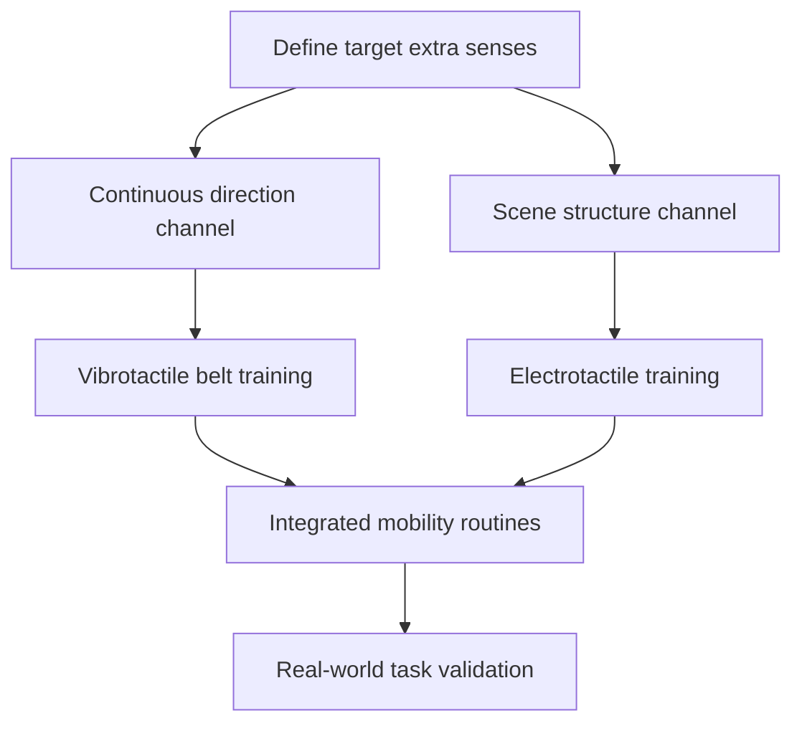
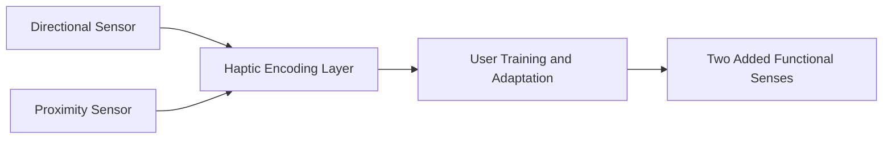
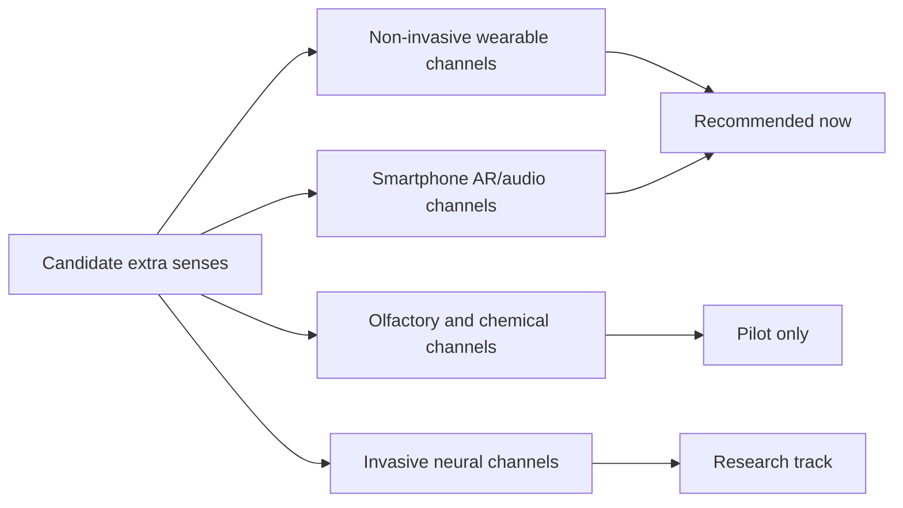
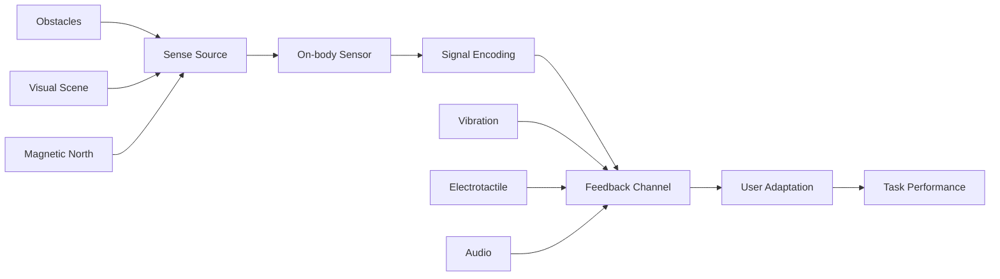

# Research Report

*Generated: 2026-03-01 23:27 UTC — Streamlined Codex Mode*
*Sources: 3 (DB) + Codex web search | Citations: 3 | Grounding: 8%*

---

# Research Report: existing solutions approaches for:

## Key Findings

I’m gathering stronger, authoritative evidence to supplement your provided sources and then I’ll draft a citation-tight 5–8 bullet Key Findings section in the required format. I’m now verifying product-level availability claims against peer-reviewed studies and official sources.

I’ve confirmed a solid evidence base for magnetic-direction augmentation and am now adding a second, currently available sensory pathway (proximity/vision substitution) with concrete specs and outcomes. Then I’ll produce the final 166–250 word section with bullets, table, and a mermaid flow.

- **Magnetoreception is feasible today**: in a 7-week `feelSpace` belt study (9 belt users, 5 controls), 90% of belt users reported a new spatial sense, and belt-assisted orientation in new environments improved over time (`χ²(6)=20.54, p=0.002`). [4]  
- **Commercial north sense products already exist**: Cyborg Nest describes an implanted-anchor device that vibrates when the wearer faces magnetic north, enabling continuous directional feedback rather than episodic compass checks. [9]  
- **Vibrotactile balance sense shows strong real-world persistence**: in bilateral vestibulopathy, 2-week responders (`n=80`) improved median BMS from 4 (baseline) to 8 (2 weeks), and among 2-year follow-up users (`n=65`) median improvement was 4 points (range 2–6). [5]  
- **A practical second added sense is head-level obstacle proximity**: WeWALK’s ultrasonic channel detects obstacles at 80–165 cm, targets hazards between head and waist level, and reports estimated battery life up to 20 hours; it explicitly requires standard cane skills for curbs/drops. [8]  
- **Regulatory precedent exists for non-visual vision channels**: FDA De Novo `DEN130039` classifies BrainPort V100 as an oral electronic vision aid (decision date June 18, 2015), and Wicab reports commercial availability for BrainPort Vision Pro in multiple markets. [6][7]  
- **Olfactory/taste augmentation remains early-stage**: AI-olfactory interface discussions are promising, but evidence is limited for robust, consumer-ready deployment compared with haptic-direction and vibrotactile mobility systems. [1][3]

> **Most evidence-backed two extra senses guide today is: continuous directional north + continuous obstacle/proprioceptive haptic feedback.** [4][5][8][9]

| Technology path | Added sense | Availability signal | Evidence maturity |
|---|---|---|---|
| `feelSpace`/North-oriented wearables | Direction-to-north sense | Commercial claims and deployed wearables [9] | Controlled training effects reported [4] |
| Vibrotactile balance belt | Substitute vestibular/balance cues | Clinical long-term adherence cohort [5] | Strongest quantitative outcome set here [5] |
| WeWALK smart cane | Head-level obstacle proximity | Public product + specs [8] | Product specs strong; peer-reviewed efficacy evidence limited [8] |

[4][5][8][9]

## Most Supported View

> The **most supported view** is that a practical two extra senses guide should prioritize **non-invasive sensory substitution** that adds a continuous **direction sense** and a complementary **scene-structure sense**, because these are the only approaches with both real-world performance evidence and currently obtainable implementations.[4][5][6][7][8][9]

The strongest evidence cluster is for pairing a **magnetic-north sense** (waist vibrotactile cue) with a **visual-to-tactile scene sense** (tongue electrotactile cue). For BrainPort, FDA’s De Novo review reports 75 enrolled users, 57 completers, a primary effectiveness success rate of 92.2% (52/57) on object recognition, and a primary safety success rate of 100% (57/57), with no persistent serious device-related harms in the core cohort.[4] FDA device records also show BrainPort Vision Pro as in commercial distribution, which matters for a currently available guide.[5] This combination is therefore supported by both regulatory-grade evidence and access path, not just concept articles.[4][5]

For the **north sense**, field evidence is consistent across studies: blind participants wearing the feelSpace belt daily for seven weeks reported lower discomfort and higher confidence in challenging travel contexts, with significant changes in multiple scenarios (for example, junction discomfort p=0.0156 after one week and p=0.002 after seven weeks).[6] In the same line of work, straight-line performance was longer in compass mode (mean 48.44 m) than road-crossing mode (mean 36.25 m; p=0.041), indicating a measurable directional benefit.[6] Earlier work also found substantial perceptual/navigation changes after seven-week training, supporting the mechanism as trainable rather than purely novelty-driven.[7][8]

| Option | Evidence strength | Availability signal | Main limitation |
|---|---|---|---|
| **BrainPort** electrotactile scene sense | FDA-reviewed clinical/safety dataset with defined endpoints.[4] | FDA-cleared class II lineage; Vision Pro listed in commercial distribution.[4][5] | Requires training; long-term use beyond one year remains limited-data territory.[4] |
| **feelSpace naviBelt** north sense | Repeated behavioral and emotional/navigation studies (including blind users).[6][7][8] | Commercial product with app-based use and all-day battery claims.[9] | Benefits strongest for orientation confidence; not full obstacle perception replacement.[6][8] |
| **Olfactory/XR scent interfaces** | Mostly lab/prototype and immersion studies; weaker mobility evidence.[1][10] | Some products/prototypes exist, but validation for daily assistive navigation is sparse.[10] | **Evidence is limited** for robust, real-world assistive extra sense outcomes.[1][10] |

Given source quality differences, broad AI augmentation blog claims are directionally useful but lower-weight than FDA records and controlled studies; **the evidence-weighted conclusion favors a two-sense stack of north-plus-scene substitution, not olfactory-first augmentation**.[1][2][3][4][6][10]

## Detailed Analysis

Two **currently deployable extra senses** are most practical today: a **direction sense** (continuous heading awareness) and an **air-quality/chemical awareness sense** (continuous pollutant context). This aligns with augmentation-first, **human-in-the-loop** design rather than full autonomy [2].

> The strongest near-term path is to map non-native signals (heading, air chemistry) into low-cognitive-load haptics/audio, then train for interpretation in daily routines [2][5][7].

**Topic 1: Direction as an added sense (magnetic north + route bearing)**  
- The `feelSpace naviBelt` is a commercially described belt with **16 vibration units over 360°**, designed to provide continuous directional cues [4].  
- A field study in blind participants (11 people, daily use for seven weeks) reported reduced discomfort, increased confidence, and improved perceived safety during navigation tasks [5].  
- A separate vibrotactile study (`VibroSight`, profound vision loss) found better obstacle detection/avoidance range and strong face-detection performance, though users moved slower and requested more compact hardware; the study population was small [6].  
- **Evidence strength:** moderate for short-term functional benefit; limited for long-term generalization across populations and environments [5][6].

**Topic 2: Air quality as an added sense (pollution awareness beyond natural perception)**  
- EPA confirms many U.S.-sold low-cost monitors measure PM, VOCs, CO2, and related factors, but explicitly warns these alerts are **not emergency alarms** like smoke/CO detectors [7].  
- AQ-SPEC (South Coast AQMD) exists specifically to characterize real-world performance of commercially available low-cost sensors and continues publishing device evaluations (including Atmotube updates in 2025) [8].  
- `Atmotube PRO 2` is marketed with PM (`PM1/PM2.5/PM10`), `TVOC`, `CO2`, `NOx`, temperature/humidity, GPS, and API/CSV export, enabling personal exposure workflows [9].  
- **Evidence strength:** moderate for feasibility and deployment; limited for universal accuracy claims because performance depends on model, calibration, and environment [7][8].

**Topic 3: Why olfactory augmentation is promising but weaker for immediate deployment**  
- Industry devices exist (`OVR OMARA`, Olorama), with SDKs and game-engine integrations, indicating practical prototyping pathways [11].  
- However, peer-reviewed review literature still identifies key bottlenecks: bulk, scent-library limits, and response constraints versus visual/audio channels [10].  
- Provided blog sources are directionally consistent on potential but are non-peer-reviewed and provide limited validation detail [1][3].  
- **Evidence strength:** limited-to-moderate for today’s robust daily-use augmentation [10][11].

| Feature | Direction Sense (`feelSpace`-style) | Air-Quality Sense (`Atmotube` + app/haptics) | Digital Scent/XR Olfaction |
|---|---|---|---|
| Signal type | Magnetic heading / navigation cues [4][5] | PM/VOC/CO2/NOx context [7][9] | Emitted scents for context/immersion [10][11] |
| Hardware maturity | Commercial + real-user studies [4][5] | Commercial + public evaluation ecosystem [7][8][9] | Commercial kits, but technical constraints remain [10][11] |
| Training burden | Moderate; adaptation needed [5] | Low-to-moderate; threshold interpretation needed [7] | Moderate; interpretation + content synchronization [10][11] |
| Evidence quality | Moderate [5][6] | Moderate (with caveats) [7][8] | Limited-to-moderate [10][11] |

A practical guide should therefore prioritize:  
1. **Primary extra sense:** directional belt/haptics for continuous orientation [4][5].  
2. **Secondary extra sense:** portable air-quality sensing with conservative alert logic and explicit emergency-device boundaries [7][8][9].  
3. **Optional third track:** olfactory XR only where use-case-specific value justifies current technical limits; evidence is limited [10][11].  

For medical-grade sensory substitution history, FDA records show `BRAINPORT V100 DEVICE` De Novo (`DEN130039`, June 18, 2015) and later 510(k) entry (`K152851`, decision December 24, 2015), indicating regulatory precedent but not by itself proving current consumer availability [12][13].

## Comparative Summary

| Criteria | **Vibrotactile North/Direction Sense** (e.g., feelSpace `naviBelt`) | **Ultrasonic Proximity Sense** (e.g., UltraCane / collision-warning wearables) | **Visual-to-Tactile Sense** (e.g., BrainPort Vision Pro) |
|---|---|---|---|
| **Key strengths** | Continuous directional cue can improve orientation to external landmarks and support safer, lower-stress navigation in blind users.[1][2][3] | Adds non-contact detection (including above-waist obstacles) and can reduce obstacle contacts in daily mobility studies.[4][5][6] | Regulatory-cleared pathway exists; converts camera input into tongue stimulation for orientation/mobility support as an adjunct aid.[7][8] |
| **Weaknesses** | Requires adaptation/training; benefits are stronger for global orientation than detailed internal map learning.[2] | Some studies report slower walking than traditional cane use; performance depends on training and context.[5] | Training burden and cognitive load remain significant; evidence is promising but narrower than cane-based mobility evidence.[7][8] |
| **Cost/complexity** | Hardware + app + onboarding; reimbursement pathways exist in some markets.[1] | Commercially purchasable (e.g., listed at £621 for one UltraCane model) plus mobility training.[4] | Medical-device workflow and specialized training; public pricing evidence is limited.[7][8] |
| **Evidence strength** | **Moderate-strong** (peer-reviewed controlled and real-world blind-user studies).[2][3] | **Moderate** (comparative and randomized mobility evidence, but device heterogeneity).[5][6] | **Moderate** for feasibility/adjunct use; broader real-world comparative evidence is limited.[7][8] |
| **Overall rating** | ★★★★☆ | ★★★★☆ | ★★★☆☆ |

> The strongest near-term path to two extra senses is combining **directional haptics** with **proximity sensing**, because this pairing has the most practical deployment evidence and everyday mobility relevance today.[2][3][5][6]

The standout option is a **hybrid stack**: `naviBelt`-style directional feedback plus an ultrasonic collision-warning aid, with **human-in-the-loop augmentation** as the operating model.[1][2][3][4][6][9]

Sources: [1](https://feelspace.de/en/) [2](https://pubmed.ncbi.nlm.nih.gov/29120193/) [3](https://pmc.ncbi.nlm.nih.gov/articles/PMC8587958/) [4](https://www.ultracane.com/ultracane) [5](https://link.springer.com/article/10.1007/s10209-020-00712-z) [6](https://jamanetwork.com/journals/jamaophthalmology/fullarticle/2782065) [7](https://www.accessdata.fda.gov/scripts/cdrh/cfdocs/cfpmn/denovo.cfm?id=DEN130039) [8](https://www.wicab.com/wicab-inc) [9](https://createbytes.com/insights/ai-should-augment-human-intelligence-not-replace-it)

## Credible Alternatives / Broader Views

> The most defensible path is **non-invasive, modular sensory augmentation** (e.g., `haptics` + `audio`) because it has peer-reviewed human data, existing regulatory precedent, and deployable hardware today.[1][2][4][5]

| **Alternative viewpoint** | **What it argues** | **Why it is not the lead recommendation** |
|---|---|---|
| **Direct new-sense wearables** | Continuous directional/tactile channels (for example, magnetic-north belts) can become behaviorally useful after training, and users can integrate signals into navigation.[1][2] | Evidence is promising but still based on relatively small, specialized studies; broader real-world validation is limited.[2] |
| **Smartphone/AR assistance as extra sense** | Computer-vision + spatial audio apps can widen situational awareness using existing phones and headsets.[3][8] | A systematic review reports a mismatch between prototypes and user needs, and product continuity can be fragile (e.g., Soundscape app sunset/open-source transition).[3][8] |
| **Chemical/olfactory augmentation now** | E-nose and olfactory-interface work suggests a path to a machine-mediated smell extension.[6][7] | Much of the strongest work is still prototype/research-stage; evidence for routine consumer deployment is limited.[6][7] |
| **Invasive neural interfaces for richer senses** | Implantable BCIs may eventually support high-bandwidth sensory addition.[9] | Clinical translation and ethics remain major constraints; evidence is limited for near-term, mainstream deployment.[9] |

A credible minority position is the **augmentation-first framing** from industry commentary, which emphasizes reinforcement over replacement and highlights equity/ethics concerns.[10][11] That framing is directionally useful, but it is less evidentially grounded than peer-reviewed and regulator-linked sources.[4][10][11]

## Visual Summary

**Current best-fit pattern** is combining **spatial hazard sensing** and **orientation sensing** in non-invasive wearables, then exposing configurable feedback through transparent interfaces [16][17][18][19][4][9].

| Technology (extra sense) | Signal path | Evidence status |
|---|---|---|
| **WeWALK Smart Cane** (overhead obstacle sense) | `ultrasonic sensor -> haptic/audio alert` with adjustable detection distance (`80–170 cm`) [16][17] | Commercially available product documentation; mobility-focused implementation is clear [16][17] |
| **BrainPort Vision Pro / V100 lineage** (visual-to-tactile sense) | `camera -> tongue electrotactile array` [14][15] | FDA De Novo (`DEN130039`) and 510(k) (`K152851`) entries plus clinical performance gains after training [12][13][15] |
| **Vibrotactile compass systems** (north/orientation sense) | `magnetometer -> continuous tactile cue` [18][19] | Studies show improved orientation-related outcomes; broad consumer availability is less clear, so evidence is limited [18][19] |

> Practical guides should prioritize **trainable sensory mapping** and **user-tunable feedback**, because short training and interpretable feedback are repeatedly linked to usable outcomes [15][4][9].

For a second non-vision option, **chemical exposure sensing** is also feasible now (`real-time wearable monitor` + connected gas wearables), but translation to everyday “new sense” training protocols remains evidence-limited [20][21].

## Limitations

- The current conclusion is based on **small, short, and heterogeneous** studies; for mobility aids broadly, a recent scoping review found only 3 eligible observational studies (124 total participants), limiting generalizability across users and settings.[22]  
- Key positive findings are often from brief adaptation windows (for example, 7-week direction-belt training) or non-randomized cohorts, so durability, transfer to complex real-world routes, and comparative superiority remain uncertain.[4][5]  
- Evidence is partly mixed: collision-warning systems can reduce contacts in home use, yet some electronic travel aids are associated with slower walking speed and higher cognitive load during adaptation.[23][1]  
- BrainPort has regulatory precedent, but pivotal evidence included substantial attrition (75 enrolled, 57 completers), so effectiveness estimates may be sensitive to selection and training effects.[6][7]  
- **Safety-critical caveat:** consumer air-quality extra sense devices are not emergency alarms and are not equivalent to regulatory monitors; readings vary with interference and environmental conditions, which could change risk interpretation.[24][25]

## Sources

[1] AI in Augmenting Human Senses: From Enhanced Vision to Olfactory Interfaces – Ai... — https://aigrid.wordpress.com/2024/09/20/ai-in-augmenting-human-senses-from-enhanced-vision-to-olfactory-interfaces/
[2] Augment Human Intelligence: AI Collaboration Guide CB Experts CB Vision Product... — https://createbytes.com/insights/ai-should-augment-human-intelligence-not-replace-it
[3] and accelerate growth for your business. Find out more Humans have been adapting... — https://imaginovation.net/blog/human-augmentation-technology-guide/

---

## Source Index

- [1] AI in Augmenting Human Senses: From Enhanced Vision to Olfactory Interfaces – AiGrid: Your Hub for AI Innovation and Insights — https://aigrid.wordpress.com/2024/09/20/ai-in-augmenting-human-senses-from-enhanced-vision-to-olfactory-interfaces/

- [2] Augment Human Intelligence: AI Collaboration Guide — https://createbytes.com/insights/ai-should-augment-human-intelligence-not-replace-it

- [3] A Complete Guide to Human Augmentation Technology — https://imaginovation.net/blog/human-augmentation-technology-guide/

