# North American Unknowns Atlas: Haunted, Folklore, UAP, and Anomalous Hotspots - Informational / Research Packet Summary

- Packet type: Informational / Research
- Domain: General Research
- Trust status: Usable With Review
- Blockers: 0
- Warnings: 1
- Sources: 16 available, 0 blocked
- Citations: 21 saved, 742 markers
- Grounding: 87%
- Primary report: Full Report - North American Anomaly Field Atlas

## Executive Answer

The strongest North American anomaly hotspots are visitable places where documented history, repeated public narrative, and clear sources overlap. Rank sites by sourceability, separating verified events from folklore and treating legends or sacred traditions as cultural evidence rather than paranormal proof. Methodology / Evidence Base This report synthesizes the curated evidence set, source categories, citation coverage, and source index. Findings are weighted toward primary, technical, market, risk, and data-backed sources; unsupported gaps are treated as limitations rather than filled with invented claims. Key Findings > 💡 Key Takeaway: The strongest North American “unknowns” hotspots are not the places with the most dramatic claims, but the places where visitable geography, documented history, repeated public narrative, and transparent source trails overlap [1][4][5]. - Documented trauma sites form the strongest haunted-location tier because their supernatural reputations are anchored to identifiable places and historical events rather than free-floating rumor [1]. Salem, Massachusetts is a prime example: National Geographic ties its haunting narrative to the 1692 witch trials, the execution of accused residents, and the burial association of Giles Corey at Howard Street Cemetery [1]. The Trans-Allegheny Lunatic Asylum in Weston, West Virginia similarly matters because it is a real, visitable institution whose ghost-tour identity is layered over the documented history of confinement and institutional care [1]. > ✅ Validated recommendation: Rank these as documented place + repeated accounts, not as proven paranormal events [1][4]. - The best field-guide entries separate what happened from what is claimed. Primary-source standards require original or near-contemporary records such as court proceedings, government records, newspapers, diaries, letters, photographs, reports, and organizational records [4][5]. For haunted or anomalous sites, that means a Salem entry can document the 1692 trials as history while treating reports of lingering spirits as later legend or tourism narrative [1][4]. This distinction lets a reader visit Howard Street Cemetery, LaLaurie Mansion, or Trans-Allegheny Asylum without confusing historical suffering with verified supernatural causation [1][5]. > ⚠️ Caveat: A real tragedy at a real site does not validate a paranormal interpretation of that site [1][5]. - Folklore and legend are evidence of cultural transmission, not automatically evidence of the literal event described. Folklore research has long used systematic collection categories for legends and narratives, supernatural beings, and beliefs about natural phenomena, showing that anomalous traditions can be studied comparatively when records are standardized [10]. Modern digital folklore research reaches a similar conclusion: “Reddit legends” can be analyzed as folklore when they show consistent form, cultural significance, and spontaneous transmission [3]. This supports treating cryptid, ghost, UAP, and sacred-anomaly narratives as analyzable cultural data while keeping their ontological status unresolved [3][10]. > 💡 Key insight: The report should preserve belief, transmission, and place meaning without converting tradition into unsupported proof [3][10]. - A production atlas should privilege row-level sourceability over notoriety when mapping clusters. The available strange-places dataset is described as containing 354K mysterious-phenomena records worldwide, including UFOs, caves, megaliths, ghost towns, meteorites, earthquakes, volcanoes, bigfoot, and haunted places [2]. That scale makes it useful for building hotspot maps only if each plotted point remains tied to an extracted record, category, and source trail rather than to reputation alone [2][4]. Regional density claims should therefore be based on counted rows from the curated inventory, while famous sites such as Salem or LaLaurie Mansion should be treated as high-recognition anchors rather than automatic evidence of regional intensity [1][2]. > 📊 Metric-heavy takeaway: The defensible quantitative base is the dataset’s stated 354K worldwide records, but North American density findings require counted North America rows from the extracted atlas table [2]. - The strongest visitable hotspots are category hybrids: historic site, tourism destination, archive subject, and legend node. National Geographic’s haunted-place examples show that public paranormal geography often grows around locations with ordinary civic identities: cemeteries, mansions, former institutions, and historic towns [1]. Salem is simultaneously a municipality, a witch-trial memory landscape, a cemetery network, and a tourism destination; LaLaurie Mansion is both a French Quarter property and a legend site tied to accounts of abuse by Madame Delphine LaLaurie [1]. These hybrids are especially useful for a field guide because access, interpretation, and ethical cautions can be grounded in the site’s public history even where paranormal evidence is limited [1][4]. - Evidence ranking should be explicit because different categories produce different kinds of records. | Evidence Level | Strongest Fit | Example Use | |---|---|---| | Official/public records | Trials, government files, institutional records, congressional/UAP records | Establishes that an event, place, agency, or proceeding existed [4][5] | | Documented place | Museums, cemeteries, historic buildings, parks | Establishes visitability and geographic reality [1][4] | | Folklore/oral tradition | Sacred narratives, legends, supernatural beings, cryptids | Establishes cultural transmission and meaning [3][10] | | Weak/speculative claim | Unsourced apparitions, viral posts, tourism embellishment | Requires caveat language and should not drive conclusions [3][5] | This ranking reflects historical-method guidance that primary sources are the raw materials of historical research, while later interpretation and popular retelling must be distinguished from those raw materials [4][5]. It also reflects folklore-method guidance that narratives can be systematically collected and compared without being treated as literal documentation of the described entity or event [3][10]. - The main interpretive pattern is amplification: traumatic history, repeated retelling, and safe fear-seeking reinforce hotspot status. National Geographic explicitly frames haunted tourism as linked to real and traumatizing histories, and it cites sociological and psychological explanations for why people seek frightening experiences when they know they are safe [1]. This helps explain why places such as Salem, Trans-Allegheny, and LaLaurie Mansion remain durable public hotspots: the locations combine strong story structure, emotional charge, and visitable settings [1]. The finding does not disprove individual reports, but it shows why memory, tourism, media repetition, and expectation must be considered as alternative explanations [1][5]. > ⚠️ Risk/caveat: Emotional force and narrative durability can make a site feel evidentially stronger than its documentation actually supports [1][5]. - Cultural and sacred anomaly traditions require a different ethical standard than ghost tourism. Folklore archives historically converted living vernacular culture into categorized folklore items, including beliefs about supernatural beings and nature phenomena, through collector questionnaires and classification systems [10]. That history is useful methodologically, but it also shows the risk of extracting traditions from communities and re-framing them as curiosities for outsiders [10]. For Indigenous, sacred, or culturally restricted traditions, the defensible field-guide approach is to cite public cultural centers, archives, or community-approved sources and to avoid giving directions to sensitive places unless access is explicitly public [10][4]. - The unresolved core is evidentiary asymmetry: places are often well documented, while the anomaly claims attached to them are unevenly documented. Historical methods can establish the existence of court records, newspapers, institutional sites, and contemporaneous accounts, but they cannot by themselves verify ghosts, cryptids, sacred beings, or UAP interpretations [4][5]. Folklore methods can establish transmission, stability, and cultural significance, but they do not convert repeated narrative into physical proof [3][10]. The strongest atlas therefore treats North America’s “unknowns” as layered records: geography first, history second, claim type third, evidentiary status always visible [1][3][4][5]. Most Supported View > 💡 Key Takeaway: The most supported view is that North America’s strongest “unknowns” are best treated as documented cultural-location clusters rather than proof of paranormal events, because the reliable evidence most often anchors places, histories, archives, repeated narratives, and visitability, not the supernatural claims themselves [1][4][5]. The evidence supports a conservative atlas model: rank places first by documented location, historical anchoring, public access, and source quality, then separately describe the haunting, cryptid, UAP, sacred, or anomalous claim attached to that place [4][5]. National Geographic’s haunted-place coverage is useful here because it does not prove ghosts; it shows that many famous “haunted” destinations are attached to real sites with traumatic or well-documented histories, such as Salem’s 1692 witch trials, Howard Street Cemetery, the LaLaurie Mansion, and the Trans-Allegheny Lunatic Asylum [1]. The historical-research guides make the same methodological point from another direction: primary sources include original records, government documents, trial transcripts, newspapers from the period, photographs, interviews, letters, and organizational records, while secondary sources interpret those materials [4][5]. Therefore, the most defensible field guide should distinguish the place is real and historically documented from the paranormal interpretation is verified, because those are different evidentiary claims [1][4][5]. The strongest hotspot entries are likely to be those where a reader can triangulate across public history, geography, tourism access, archives, and narrative persistence [1][4][5]. Salem is a model case because the 1692 witch-trial history is anchored in a specific town, named victims, cemeteries, court history, and enduring public memory, while claims that spirits still roam Salem remain folklore or belief rather than demonstrated fact [1]. The LaLaurie Mansion similarly matters because the site’s French Quarter identity and nineteenth-century history make it a durable visitable narrative location, even though the haunting layer must be treated as legend attached to a documented urban site [1]. Trans-Allegheny Lunatic Asylum is also strong for an atlas because it is a named place in Weston, West Virginia, with public visitation and ghost-tour attention, but its evidentiary core is the documented institution and its history rather than the claimed “spectral forms” sought by visitors [1]. | Evidence tier | What it can support | Best use in the atlas | Key caution | |---|---|---|---| | Primary records | Dates, people, institutional history, legal events, contemporary reporting, official actions [4][5] | Establish the real historical backbone of a hotspot [4][5] | Does not by itself validate paranormal interpretation [4][5] | | Secondary synthesis | Contextual interpretation and source comparison [5] | Explain why a place became culturally important [5] | Must remain anchored in primary evidence [5] | | Tourism or magazine coverage | Public prominence, visitability, narrative persistence [1] | Identify widely recognized, visitable hotspots [1] | Often emphasizes atmosphere and story over proof [1] | | Folklore archives and typologies | Recurring motifs, transmission patterns, cultural categories [10] | Classify legends and compare regions [10] | Requires respect for context and tradition bearers [10] | | Large datasets | Candidate discovery at scale [2] | Generate leads for mapping and density counts [2] | Must be cleaned, geocoded, and source-checked before analysis [2] | A rigorous North America atlas should also treat folklore as evidence of cultural transmission, not as failed eyewitness testimony [3][10]. The folklore-method evidence shows that traditions can be systematically collected, classified, and compared: Christiansen’s questionnaire organized material into categories including life events, daily life, seasonal customs, legends and narratives, supernatural practices, beliefs about natural phenomena, and prose folklore [10]. That matters because North American anomaly narratives often blend place, memory, landscape, danger, tourism, and identity, so the atlas needs categories that can preserve meaning without collapsing everything into a single true or false column [10]. The Reddit folklore study reinforces the same methodological point in a modern setting by arguing that online legends can have consistent form, cultural significance, spontaneous transmission, and systematic text-based study, which supports using narrative recurrence as evidence of circulation rather than evidence of literal occurrence [3]. The strongest practical view is therefore a two-layer evidence model: one layer documents the location and its historical or cultural record, while the second layer classifies the unexplained claim by strength and type [1][4][5][10]. In that model, documented place is often strong, repeated accounts may be meaningful but not conclusive, official/public records can confirm investigations or events without confirming extraordinary explanations, folklore/oral tradition can be culturally authoritative without being reducible to laboratory proof, and weak/speculative claims should remain clearly labeled [3][4][5][10]. This approach is especially important for sacred or culturally significant anomaly traditions, because archival classification systems show that beliefs about nature phenomena and supernatural beings are part of organized cultural recordkeeping, not disposable curiosities [10]. The most supported interpretation is that North America’s unknown-location narratives are historically and socially real even when their paranormal mechanisms remain unproven [1][3][4][5][10]. > ⚠️ Risk/Caveat: Evidence that a legend is widespread, old, or attached to a real place is not evidence that its supernatural explanation is true [1][3][4][5]. The available evidence also supports building maps and route guides from verified rows, not from impressionistic spooky geography [2][4][5]. A dataset described as containing 354,000 worldwide mysterious-phenomena records could be useful for candidate discovery, category counts, and density mapping, but only after records are filtered to North America, deduplicated, geocoded, source-checked, and separated by category [2]. The historical-source guidance requires that each mapped point be traceable to original or well-contextualized sources where possible, such as government records, court proceedings, contemporary newspapers, archival collections, photographs, interviews, or institutional records [4][5]. Density maps should count documented report rows, not estimate cultural intensity, because the rules of historical evidence do not allow invented statistics or unsourced regional weightings [2][4][5]. The best-supported regional synthesis would consequently prioritize clusters where place documentation, narrative persistence, and visitor access intersect, while leaving room for unresolved debates [1][2][4][5]. New England is strongly represented by Salem because the witch-trial history is concrete and internationally recognized, but the ghostly interpretation remains a later belief tradition layered onto documented persecution and death [1]. The Lower Mississippi and Gulf South are represented by New Orleans’s LaLaurie Mansion because its public notoriety depends on a named urban site and historical social context, while the haunting narrative should be handled as legend and tourism memory rather than established fact [1]. Appalachia is represented by Trans-Allegheny Lunatic Asylum because the site’s institutional history and present-day ghost-hunting tourism make it visitable and sourceable, while claimed apparitions remain accounts rather than confirmed phenomena [1]. For field use, the most defensible recommendation is to make each hotspot card answer three separate questions: What can be verified? What is claimed? What should a visitor do ethically and safely? [1][4][5][10]. Verifiable fields should include place name, jurisdiction, coordinates when sourceable, access status, official website or best source, historical context, and the evidence tier supporting the entry [4][5]. Claim fields should describe the haunting, folklore, cryptid, UAP, sacred, or anomalous-landscape narrative without overstating it, and cultural fields should flag oral-tradition sensitivity, sacred-site restrictions, community consent issues, and the difference between public legend and living belief [3][10]. A production-ready report should be curious but disciplined: it should help readers visit and understand North America’s unknowns while making clear that the strongest evidence usually supports the history of the place and the persistence of the story, not paranormal proof [1][3][4][5][10]. Detailed Analysis > 💡 Key Takeaway: The strongest evidence in the supplied corpus supports a cautious field-guide model: treat haunted and anomalous-location narratives as place-based cultural records anchored by documented sites, public memory, archival methods, and tourism access, while separating those anchors from claims of supernatural causation, which remain unverified or unevenly documented [1], [4], [5]. Evidence-Ranked Hotspots and Visitability The supplied evidence most directly supports a small but important set of visitable haunted-place anchors in the United States: Salem, Massachusetts; Howard Street Cemetery; the Trans-Allegheny Lunatic Asylum in Weston, West Virginia; and the LaLaurie Mansion in New Orleans, Louisiana [1]. These sites matter because their reputations are attached to documented historical settings rather than free-floating rumor: Salem is tied to the 1692 witch trials, Howard Street Cemetery to the burial tradition around Giles Corey, Trans-Allegheny to the history of institutional confinement, and LaLaurie Mansion to early nineteenth-century New Orleans elite society and cruelty narratives [1]. The evidence supports a distinction between documented place and paranormal proof [1]. National Geographic frames the haunted locations as destinations where haunting lore is often rooted in very real and traumatizing histories, which validates the historical-place layer but does not establish the literal survival of spirits or spectral activity [1]. For a production field guide, this means the location can be ranked as strong for public documentation and visitability, but its supernatural claim should be ranked as folklore, repeated account, or weak claim unless corroborated by primary records of the alleged phenomena [1], [4], [5]. The strongest site-specific historical anchor in the evidence is Salem because the claim package includes a specific year, a named historical episode, a named person, and a specific associated cemetery [1]. The evidence states that in spring 1692, accusations of possession and witchcraft led to executions, and that Giles Corey was crushed to death after challenging the accusers’ motives [1]. That makes Salem and Howard Street Cemetery highly useful for a reader route because the visitor can separate the documented public history from the later haunting narrative in one walkable landscape [1]. The Trans-Allegheny Lunatic Asylum is similarly strong as a field-guide stop because the evidence identifies it by place, city, state, and present-day visitor audience: ghost hunters seeking spectral forms [1]. Its importance lies in the convergence of architecture, institutional history, trauma, and tourism, all of which create a durable hotspot even when evidence for apparitions remains anecdotal in the supplied corpus [1]. Its evidence level should therefore be listed as documented place plus repeated paranormal reputation, not as verified paranormal evidence [1], [4], [5]. The LaLaurie Mansion is useful but ethically sensitive because the evidence identifies the site through the history of Madame Marie Delphine LaLaurie and the French Quarter mansion’s association with social status and violence [1]. A field guide should avoid turning suffering into spectacle and should foreground the historical context before describing ghost claims [1]. The proper ranking is documented place with trauma-linked folklore, while access must be handled cautiously because the evidence does not establish public interior access [1]. | Feature | Salem / Howard Street Cemetery | Trans-Allegheny Lunatic Asylum | LaLaurie Mansion | |---|---|---|---| | Best-supported category | Haunted history / folklore | Haunted institution | Haunted house / trauma folklore | | Historical anchor | 1692 witch trials and Giles Corey | Historic asylum in Weston, West Virginia | Early nineteenth-century French Quarter mansion | | Evidence level | Documented place plus folklore | Documented place plus repeated accounts | Documented place plus folklore | | Visitability signal | Cemetery and town landscape are identifiable | Public-facing ghost-hunter destination is identified | Exterior location is identifiable, interior access not established | | Main caution | Avoid trivializing executions | Avoid exploiting institutional suffering | Avoid sensationalizing racialized and domestic violence | | Citation | [1] | [1] | [1] | > ⚠️ Risk/Caveat: The evidence supports visiting historically documented places, but it does not verify ghosts, apparitions, cryptids, or supernatural causation at those places [1], [4], [5]. Historical Anchors, Primary Sources, and Source Hierarchy A rigorous atlas of “unknowns” should use primary sources as the first evidentiary tier wherever possible because primary sources are original accounts or records from the period being studied [4]. The supplied library guidance defines primary sources as original records of historical events, including diaries, speeches, interviews, correspondence, government records, organizational records, photographs, sound recordings, and newspapers or journals written at the time of the event [4]. Berkeley’s history guidance similarly describes primary sources as the raw material of historical research and lists diaries, memoirs, letters, court proceedings, legislative debates, newspapers, magazines, film, music, and art as examples [5]. This hierarchy matters because unexplained-location narratives often combine verifiable history with later interpretation [1], [4], [5]. A battlefield, asylum, cemetery, or mansion may be objectively documented, while the ghost story attached to it may come from later tourism literature, oral tradition, guidebooks, or digital repetition [1], [4], [5]. The report should therefore cite separately for the place, the historical event, the earliest known legend, modern visitor access, and any official public records [4], [5]. The evidence also supports a careful distinction between secondary interpretation and raw historical record [5]. Berkeley’s guide defines secondary sources as historical writing produced by historians and anchored in primary sources, not simply chronologies of names, dates, and places [5]. That distinction is useful for haunted and folklore locations because a later article can responsibly summarize Salem’s history, but claims about apparitions at Howard Street Cemetery still need their own provenance [1], [5]. For UAP-related locations, cryptid reports, and anomalous landscapes, the same source hierarchy should apply even though the supplied evidence does not contain specific North American UAP, cryptid, Canadian, or Mexican case files [2], [4], [5]. The strange-places dataset is relevant as a discovery layer because it describes a large worldwide collection covering UFOs, caves, megaliths, ghost towns, meteorites, earthquakes, volcanoes, bigfoot, and haunted places [2]. However, the evidence excerpt does not provide rows, coordinates, categories, or source provenance from that dataset, so it cannot by itself establish individual hotspot rankings [2]. | Evidence Type | What It Can Support | What It Cannot Support Alone | |---|---|---| | Government or court records | Existence of events, investigations, deaths, hearings, property records | Supernatural causation | | Contemporary newspapers | Period reactions, early reports, public rumor circulation | Truth of extraordinary claims | | Archival folklore records | Transmission, motif stability, community context | Literal existence of beings or spirits | | Official tourism or museum pages | Visitability, access, interpretive framing | Independent verification of legends | | Large anomaly datasets | Discovery, clustering, candidate locations | Accuracy of individual claims without row-level audit | > ✅ Validated Recommendation: Rank each hotspot twice: once for the documented location and once for the extraordinary claim attached to it, because those two evidence questions are not the same [1], [4], [5]. Folklore, Oral Tradition, and Digital Transmission The evidence supports treating folklore as a structured cultural record rather than as random rumor [3], [10]. The folklore-method source describes a standardized questionnaire that organized records into categories including life events, daily life, seasonal customs, supernatural practices, legends and narratives, beliefs about natural phenomena, and prose folklore [10]. That framework is directly relevant to North American anomaly research because haunted places, cryptid sightings, sacred landscape traditions, and anomalous nature stories often sit at the boundary between legends and narratives and belief and narratives about nature phenomena [10]. The same evidence shows that folklore archives depend on classification, collector judgment, and editorial order [10]. The example of Rigmor Frimannslund’s organized folklore collection demonstrates how fieldnotes can be arranged under a preexisting nomenclature, with one record placed under proposals and marriage, another under daily life, and another under Christmas traditions [10]. For a North American atlas, that implies that legends should be tagged by theme, place, informant community, date of recording, and collection method rather than reduced to a binary true-or-false label [10]. Digital folklore complicates the field guide because online narratives can become culturally significant even when they are not tied to archival institutions [3]. Armstrong and Ruths argue that “Reddit legends” can be considered folklore when they show consistent form, cultural significance, and spontaneous transmission [3]. That finding is useful for modern haunted and cryptid narratives because a story’s spread may be evidence of cultural salience, but not evidence that the reported entity or event occurred [3]. The supplied sources agree that folklore can be studied systematically [3], [10]. The older archival model emphasizes questionnaires, categories, and collector discipline, while the Reddit study emphasizes typology, references, textual characteristics, and transmission behavior [3], [10]. Together, they support a methodology in which legends are analyzed as repeatable cultural forms, with location, motif, retelling pathway, and community meaning recorded separately from questions of physical evidence [3], [10]. > 💡 Key Insight: A legend can be culturally real, geographically stable, and historically important even when the extraordinary event it describes remains unverified [3], [10]. Regional Clusters and Density Claims The evidence allows only limited regional density conclusions because the supplied corpus does not include a row-level North America hotspot table, extracted coordinates, or counted regional reports [2]. The GitHub dataset is described as containing 354K mysterious phenomena worldwide across categories such as UFOs, caves, megaliths, ghost towns, meteorites, earthquakes, volcanoes, bigfoot, and haunted places [2]. That makes it promising for later density mapping, but the excerpt does not show how many entries are in North America, how they are geocoded, or how categories are distributed by region [2]. The strongest cluster visible in the evidence is not a numerical cluster but a narrative-infrastructure cluster in the United States: New England witch-trial memory, Appalachian institutional haunting tourism, and Gulf Coast urban haunted-house lore [1]. Salem, Weston, and New Orleans are not adjacent, but they illustrate three repeatable hotspot types: trial-and-execution landscape, asylum or institutional trauma landscape, and elite urban mansion with violence-linked legend [1]. These are strong interpretive categories, not statistically counted clusters [1], [2]. No supplied source provides enough evidence to count or compare the Southwest, Appalachia, New England, the Great Lakes, the Pacific Northwest, northern Canada, or central and southern Mexico as report-density regions [1], [2]. A responsible report should therefore avoid claims such as the Southwest has the most UAP sites or Appalachia has the highest haunting density unless those claims are generated from audited rows [2], [4], [5]. The current evidence supports identifying candidate clusters, not ranking them quantitatively [1], [2]. A density map should be built only from counted records with location coordinates, category labels, and deduplication rules [2], [4], [5]. The report instruction’s requirement to create a heat map from counted rows is methodologically sound because large folklore and anomaly datasets can overrepresent places with tourism marketing, media attention, or repeated duplicate reports [2], [3]. Without row-level data, any apparent density would risk measuring documentation intensity rather than anomalous activity [2], [3], [4]. | Cluster Type | Evidence Present Here | What Can Be Said | What Cannot Be Said | |---|---|---|---| | New England haunted history | Salem and Howard Street Cemetery are identified | Strong documented-history anchor | No full regional count | | Appalachia haunted institution | Trans-Allegheny is identified | Strong visitable haunted-site anchor | No Appalachian density ranking | | Gulf Coast urban haunting | LaLaurie Mansion is identified | Strong urban folklore anchor | No New Orleans-wide count | | North America cryptid reports | Dataset category exists globally | Candidate category for extraction | No case-specific ranking | | UAP locations | Dataset category exists globally | Candidate category for extraction | No official-location analysis from supplied evidence | | Mexico / Canada sacred sites | Not supplied in row-level form | Evidence is limited | No hotspot list can be validated here | > 📊 Metric-Heavy Takeaway: The only numerical anomaly-dataset claim in the supplied corpus is the dataset’s stated worldwide scale of 354K mysterious-phenomena records; no North America-specific count, category count, or regional density count is provided in the evidence [2]. Category Analysis Across Haunted Sites, Folklore, Cryptids, UAPs, Sacred Sites, and Anomalous Landscapes The haunting category is the best-supported category in the supplied evidence because National Geographic provides named places, historical context, and a public-travel framing [1]. Salem, Howard Street Cemetery, Trans-Allegheny, and LaLaurie Mansion can be evaluated as real locations with layered cultural narratives [1]. The strongest conclusion is that haunting lore often attaches to traumatic or morally charged history, but the evidence does not prove paranormal activity [1]. The folklore and legend category is supported by both archival and digital-folklore evidence [3], [10]. The archival source shows that legends, supernatural beings, and beliefs about natural phenomena can be systematically classified, while the Reddit study shows that modern online legends can also meet criteria for folklore through consistent form, cultural significance, and spontaneous transmission [3], [10]. This supports including oral tradition and digital tradition in the atlas, provided the report labels each as tradition, transmission, or belief rather than confirmed event [3], [10]. The cryptid and UAP categories are present only as dataset categories in the supplied evidence [2]. The strange-places dataset explicitly includes UFOs and bigfoot among its worldwide phenomena categories, which justifies treating them as extractable classes for mapping and comparison [2]. However, because the evidence excerpt does not provide individual sightings, coordinates, official records, or archives, evidence is limited for ranking specific cryptid or UAP hotspots in this Detailed Analysis [2], [4], [5]. The sacred or culturally significant anomaly tradition category requires special caution because the supplied sacred-landscape evidence concerns Cusco in Inka times, which is outside North America [6]. The source is still methodologically relevant because it describes a sacred landscape in which religion and astronomy were intimately connected and interpreted through cosmographic design [6]. It cannot be used as direct evidence for North American sacred sites, but it supports the broader analytical principle that sacred landscapes may encode astronomy, cosmology, ritual geography, and cultural memory rather than “mystery” in a paranormal sense [6]. The anomalous landscape category is implied by dataset categories such as caves, megaliths, meteorites, earthquakes, and volcanoes [2]. These categories show that unexplained-place atlases can mix cultural claims with geological or environmental features [2]. A careful field guide should therefore distinguish between an anomalous narrative attached to a landscape and a measurable natural feature such as a meteorite site, earthquake zone, cave system, or volcano [2], [4], [5]. | Category | Best Current Support | Evidence Level in Supplied Corpus | Main Analytical Caution | |---|---|---|---| | Hauntings | Named U.S. places and histories | Documented place plus folklore | Do not infer paranormal proof | | Folklore / legends | Archival and digital folklore methods | Strong for transmission analysis | Do not flatten living traditions | | Cryptids | Dataset category only | Evidence limited | Need row-level case audit | | UAPs | Dataset category only | Evidence limited | Need official records and event files | | Sacred traditions | Cusco methodological analogy | Indirect only for North America | Avoid cultural appropriation | | Anomalous landscapes | Dataset categories | Discovery-level support | Separate natural features from legends | Historical Patterns and Possible Connections The strongest historical pattern is that unexplained-location narratives often cluster around sites where public memory has already marked the landscape as traumatic, morally charged, or culturally important [1]. Salem’s witch-trial memory, Howard Street Cemetery’s association with Giles Corey, Trans-Allegheny’s asylum history, and LaLaurie Mansion’s violence-linked reputation all show how haunting narratives attach to documented human suffering [1]. This does not validate the supernatural claim, but it explains why the sites remain narratively powerful [1]. A second pattern is classification pressure: once collectors, archivists, tourism writers, or online communities create categories, stories become easier to compare, circulate, and preserve [3], [10]. Christiansen’s taxonomy standardized folklore collection through categories and checklists, while Reddit legends show how digital communities can maintain recognizable story forms through spontaneous transmission [3], [10]. For the atlas, this means category labels are not neutral; they shape what gets noticed, archived, and counted [3], [10]. A third pattern is media amplification, especially where modern travel writing, online datasets, and social platforms make older narratives more discoverable [1], [2], [3]. National Geographic’s haunted-travel framing turns selected sites into a national itinerary, while large datasets can aggregate heterogeneous records into searchable anomaly geographies [1], [2]. Reddit folklore research shows that digital repetition can preserve cultural significance but can also detach narratives from their original context [3]. A fourth pattern is that sacred or cosmological landscapes should not be collapsed into the same interpretive category as haunted hotels or cryptid sightings [6]. Magli’s Cusco paper describes a landscape organized through religion, astronomy, and cosmography, showing that “anomalous” meaning may arise from worldview, ritual order, and sky-ground correspondence [6]. Applied cautiously, this warns against treating Indigenous or sacred traditions as entertainment content or paranormal curiosities [6]. > ⚠️ Risk/Caveat: The evidence supports historical and cultural connections among place, memory, classification, and transmission, but it does not support a single unified theory linking hauntings, cryptids, UAPs, sacred sites, and anomalous landscapes as one phenomenon [1], [2], [3], [6], [10]. Skeptical and Alternative Explanations The strongest skeptical explanation in the evidence is historical-trauma anchoring: places associated with death, confinement, violence, or accusation become plausible settings for haunting narratives because visitors already interpret them through fear, grief, or moral unease [1]. National Geographic explicitly notes that haunted lore is often rooted in real and traumatizing histories, which supports a psychological and cultural explanation for why the locations endure [1]. This does not disprove individual experiences, but it means the site’s emotional charge can precede and shape the reported anomaly [1]. A second explanation is safe fear and expectation, because the evidence cites sociologist Margee Kerr’s view that terror experienced under safe conditions can produce euphoria and confidence [1]. This helps explain why ghost tours, abandoned-asylum visits, and cemetery walks can be compelling even without verified paranormal events [1]. It also suggests that visitor expectation may influence perception, memory, and later retelling [1], [3]. A third explanation is belief in survival after death, because the evidence cites psychologist Christopher French’s observation that some people interpret ghosts and spirits as proof that the soul can survive bodily death [1]. This is important for field interpretation because visitors may approach the same site with very different assumptions: one may seek history, another entertainment, another spiritual confirmation, and another anomalous evidence [1]. A serious atlas should make room for those motivations while keeping evidentiary claims distinct [1], [4], [5]. A fourth explanation is archival and platform selection bias [2], [3], [10]. Folklore archives preserve what collectors asked about and classified, while digital folklore studies examine what communities repeat and reference [3], [10]. Large anomaly datasets may reveal patterns, but without row-level provenance they may also concentrate records from media-rich, tourism-heavy, or English-language regions [2], [3], [4]. | Skeptical Factor | Applies Most Strongly To | Evidence-Based Interpretation | |---|---|---| | Historical trauma | Haunted sites | Trauma can make places narratively charged [1] | | Safe fear | Ghost tourism | Visitors may enjoy fear when they feel protected [1] | | Survival belief | Ghost reports | Spiritual interpretation may shape claim meaning [1] | | Classification bias | Folklore archives | Taxonomies influence what is collected [10] | | Platform amplification | Digital legends | Online repetition can stabilize legends [3] | | Dataset bias | Mapped anomaly records | Row-level provenance is needed before density claims [2], [4], [5] | Visitability, Safety, Access, and Ethics A visitable field guide should prioritize locations where the public can legally access the site or an official interpretive center, while treating private property and sacred places with restraint [1], [4], [5]. The evidence supports public-travel framing for haunted U.S. places but does not provide full access rules for every named location [1]. Therefore, each card should separate visitable exterior, public tours, museum or archive access, and restricted or private property as different access states [1], [4], [5]. Safety guidance should be tied to the type of place rather than to the legend [1], [2]. Asylums, cemeteries, old mansions, caves, volcanoes, ghost towns, and remote landscapes may present risks from trespass law, unstable structures, terrain, weather, darkness, and inadequate communications [1], [2]. The evidence does not provide site-specific hazard records, so the report should avoid dramatic warnings and instead specify practical precautions based on official access information when available [4], [5]. Ethics are especially important where the narrative involves executions, confinement, slavery, abuse, sacred geography, or living communities [1], [6]. Salem and LaLaurie Mansion should be interpreted as histories of accusation, death, violence, and public memory before they are treated as haunted attractions [1]. Sacred-landscape material should be handled through cultural authorities and contextual scholarship, because the Cusco example shows that sacred geography may encode cosmology and astronomy rather than a mystery to be consumed by outsiders [6]. The best visitor recommendation is to treat each stop as a layered site: documented history first, community memory second, legend transmission third, and extraordinary claim last [1], [3], [4], [5], [10]. That order protects the report from sensationalism and helps readers understand why the place matters even when evidence for the anomaly is limited [1], [4], [5]. It also makes the atlas useful to both researchers and curious travelers [1], [4], [5]. > ✅ Validated Recommendation: For every field card, use a fixed evidence line: Documented place, Historical anchor, Claim type, Claim evidence, Visitability, Access risk, and Ethical caution [1], [4], [5]. Route Logic and Roadmap Priorities The evidence supports a route model organized by interpretive clusters rather than claimed paranormal intensity [1], [2]. A historically grounded eastern route could begin in Salem and Howard Street Cemetery for witch-trial memory, continue to Weston for institutional haunting tourism, and end in New Orleans for urban mansion folklore [1]. This route is evidence-backed at the level of named places and documented historical associations, but it should not be described as a statistically densest corridor without counted rows [1], [2]. A second route model would use datasets as a candidate generator and then require source verification before publication [2], [4], [5]. The strange-places dataset can surface UFO, bigfoot, haunted-place, cave, megalith, meteorite, earthquake, volcano, and ghost-town candidates, but every extracted row should be checked against official records, archives, local historical societies, park pages, or reputable newspapers before being promoted to a field-guide hotspot [2], [4], [5]. This keeps the atlas from confusing aggregation with verification [2], [4], [5]. A third route model should reserve sacred and culturally significant sites for context-led visitation [6]. The Cusco evidence, although outside North America, shows that sacred landscapes can involve cosmographic and astronomical meaning, so the roadmap should prioritize cultural centers, museums, authorized guides, and public interpretation rather than intrusive site-seeking [6]. Evidence is limited in the supplied corpus for North American sacred-site cards, so any route through such places would need additional authorized sources before being considered production-ready [6]. The route guide should also distinguish between field visit, archive visit, and remote research destinations [4], [5]. Some claims are best studied on site, while others are best studied through court records, newspapers, government records, oral-history archives, or digitized collections [4], [5]. This is especially important for UAP and cryptid cases, where the alleged event site may be less informative than the archive, investigation file, witness interview, or newspaper sequence [2], [4], [5]. Source Conflicts and Resolution The detected source conflicts appear to be metadata and corpus-contamination conflicts, not substantive disagreements about North American haunted, folklore, cryptid, UAP, or sacred-location evidence [3], [4], [6]. Conflicts 1, 2, and 7 compare publication timestamps from unknown sources against other unknown or known publication dates, including the 2004 publication timestamp for Magli’s Cusco paper [6]. Because the unknown sources are not included in the evidence packet, those timestamp conflicts cannot be adjudicated beyond noting that the known Cusco source is dated 2004-08-09 in the supplied metadata [6]. Conflicts 3, 5, and 6 compare an AI risk-mitigation taxonomy claim against either publication metadata or a Civil War newspaper-source description [4]. Those topics are outside the report scope and should not be used as evidence for North American anomaly locations [4]. The Civil War research-guide material is relevant only as a source-method reference because it explains primary-source categories and historical newspapers, not because it documents any anomaly hotspot [4]. Conflict 4 compares two arXiv PDF URLs, one unknown and one known: the supplied Reddit folklore paper is http://arxiv.org/abs/2007.00750v1 with PDF URL https://arxiv.org/pdf/2007.00750v1 and publication date 2020-07-01 [3]. The unknown 2512.11931v1 PDF cannot be validated from the supplied evidence and should be excluded from this section unless separately provided [3]. This matters because source-index hygiene is essential when every claim must map to a specific cited record [3], [4], [5]. Conflict 8 compares journal: Sacred Sites, Sacred Places with A Sacred Space on a Hilltop in Harwinton, Connecticut, but the referenced source label is not included in the supplied evidence packet. Because the label and source text are absent, evidence is limited and the conflict should not affect the analysis. The only supplied sacred-landscape source is Magli’s Cusco paper, which is methodologically relevant but geographically outside North America [6]. > ⚠️ Conflict Resolution: Unknown-source metadata, AI-risk text, and absent source labels should be treated as excluded or non-operational for this Detailed Analysis; the usable evidence base is the cited haunted-place article, strange-places dataset page, folklore study, primary-source guides, and Cusco sacred-landscape paper [1], [2], [3], [4], [5], [6], [10]. Comparative Summary > 💡 Key Takeaway: The strongest field-guide candidates are documented, visitable historic or cultural places where claims can be separated from the underlying record; the weakest are large aggregated mystery listings unless each entry is re-anchored to primary sources, access data, and local context [4][5]. | Comparison Factor | Haunted Historic Sites | Folklore / Cryptid Traditions | UAP / Anomaly Datasets | Sacred / Cultural Landscapes | |---|---|---|---|---| | Key strengths | Often tied to identifiable places, dates, deaths, institutions, or traumatic histories; Salem, Howard Street Cemetery, LaLaurie Mansion, and Trans-Allegheny show how haunting narratives attach to real historic sites [1]. | Can preserve community memory, recurring motifs, and regional identity; folklore can be organized comparatively through systematic categories for life events, supernatural beings, nature phenomena, and narratives [10]. | Large datasets can help identify candidate clusters and map mysterious phenomena at scale; one public repository describes a worldwide dataset covering UFOs, caves, megaliths, ghost towns, meteorites, earthquakes, volcanoes, Bigfoot, and haunted places [2]. | Best handled as cultural-historical landscapes rather than mystery attractions; scholarship on Cusco shows sacred geography can involve religion, astronomy, and cosmography in integrated ways [6]. | | Weaknesses | Ghost claims themselves are usually not demonstrated by the historical record; the stronger evidence is for the place and history, not for spirits [1][4][5]. | Oral or online transmission can mutate, amplify, or detach from original context; systematic study is possible, but cultural significance and transmission do not equal factual verification of a creature or event [3][10]. | Aggregated rows can mix verified places, weak claims, natural features, and user-contributed labels; dataset presence alone should be treated as a lead, not confirmation [2][4][5]. | High risk of misinterpretation or appropriation if living traditions are reduced to “anomalies”; sacred-landscape interpretation requires cultural, astronomical, and historical grounding [6]. | | Cost / complexity for fieldwork | Moderate: many sites are museums, cemeteries, hotels, parks, or tour districts, but access rules and preservation limits vary by site [1]. | Moderate to high: strong work requires local archives, oral-history care, motif comparison, and attention to community consent [10]. | High: useful mapping requires deduplication, source tracing, coordinates, category normalization, and verification against primary or official records [2][4][5]. | High: requires consultation with cultural authorities, careful language, access restrictions, and avoidance of extractive framing [6]. | | Evidence strength | Strongest for documented place + repeated public narrative; weaker for paranormal causation because the cited source frames haunted lore as rooted in real histories rather than proof [1]. | Strong for folklore/oral tradition when collected systematically; weaker for empirical claims unless supported by independent records [3][10]. | Variable: potentially useful for density maps, but each entry needs verification through original accounts, government records, newspapers, archives, or site documentation [2][4][5]. | Strong when supported by cultural scholarship and landscape analysis; weak when sacred meanings are asserted without community or historical grounding [6]. | | Overall rating | ★★★★☆ for visitable field-guide value, because many sites combine public access, historical documentation, and durable narratives [1]. | ★★★☆☆ for interpretive value, because traditions can be systematic and meaningful but often require careful evidence grading [3][10]. | ★★☆☆☆ as standalone evidence, but ★★★★☆ as a discovery layer once entries are independently sourced [2][4][5]. | ★★★★☆ for cultural depth when handled ethically; ★★☆☆☆ if framed as paranormal spectacle rather than living or historical tradition [6]. | > 📊 The decisive comparison is source type: primary records, archival materials, government records, contemporary newspapers, photographs, and documented institutional histories carry more evidentiary weight than later retellings or unsourced database rows [4][5]. Across categories, the best report entries are not simply the strangest stories; they are the places where a reader can verify that the location exists, understand what is historically documented, and then see how unexplained claims accumulated around that record [1][4][5]. This favors visitable historic hotspots such as cemeteries, asylums, houses, districts, and museums, because the “unknown” narrative can be placed beside a concrete institutional or civic history [1]. Folklore, cryptid, and legend material should be ranked differently from archival event evidence because its value often lies in pattern, transmission, and cultural function, not in proving a literal encounter [3][10]. The strongest folklore entries therefore need source trails: who recorded the account, where it circulated, how stable the motif is, and whether the account belongs to a living community tradition or later entertainment media [3][10]. UAP and broad anomaly datasets are useful mainly for triage and mapping, not final interpretation [2]. They can point researchers toward clusters and candidate rows, but production-ready entries must still be reconciled with primary sources, official records, local archives, or contemporary reporting before they deserve high confidence [2][4][5]. Sacred and culturally significant landscapes require the most restraint because their meanings may be embedded in cosmology, ritual geography, astronomy, and community authority rather than in tourist-facing mystery narratives [6]. The comparative takeaway is that a credible atlas should make visitability secondary to evidence quality and ethics: some locations can be visited easily, but not every meaningful place should be treated as an attraction [4][6]. Credible Alternatives / Broader Views > 💡 Key Takeaway: The strongest broader view is that “unknowns” hotspots are best read as layered cultural landscapes, where documented history, folklore transmission, tourism, archives, sacred geography, environmental ambiguity, and media circulation interact; this does not prove paranormal causes, but it does explain why certain places repeatedly become durable anomaly sites [1][3][4][5][6][10]. Alternative 1: Trauma-Heritage Interpretation The trauma-heritage interpretation argues that many haunting hotspots persist because they are attached to documented histories of violence, confinement, death, persecution, or social rupture, rather than because paranormal activity has been independently verified [1][4][5]. National Geographic’s treatment of Salem and the Trans-Allegheny Lunatic Asylum explicitly frames U.S. haunting lore as often rooted in very real and traumatizing histories, while still presenting ghost claims as belief traditions rather than proof [1]. This view is especially useful for visitable haunted sites because it prioritizes verifiable anchors: court records, newspapers, institutional histories, cemeteries, buildings, and public memory [4][5]. For example, Salem’s witch-trial landscape has stronger historical documentation than any specific apparition claim, and the historical record should therefore carry more evidentiary weight than later ghost-tour elaborations [1][4][5]. The most-supported view remains broader than trauma heritage alone because not all anomaly traditions arise from traumatic events [6][10]. Sacred landscapes, astronomical alignments, cryptid lore, and online legend transmission may be structured by cosmology, environment, genre, or communal storytelling rather than by traumatic memory alone [3][6][10]. > ✅ Trauma history is a strong evidentiary anchor, but it should rank claims as documented place plus folklore, not as verified paranormal evidence [1][4][5]. Alternative 2: Folklore-Transmission Interpretation The folklore-transmission interpretation treats cryptids, hauntings, weird roads, and recurring local legends as traditions that spread, stabilize, mutate, and gain authority through repeated retelling [3][10]. Folklore scholarship has long used collection systems and typologies to standardize vernacular narratives for comparison, including categories for supernatural beings, nature phenomena, legends, narratives, and prose folklore [10]. This approach is credible because it explains why similar story types recur across regions without requiring identical causes at every site [3][10]. The Reddit folklore study shows that even digital “legends” can have consistent form, cultural significance, spontaneous transmission, and systematic textual patterns, which supports treating modern anomaly reports as folklore data when the evidence base is mainly narrative [3]. The most-supported view is still not it is only folklore, because some hotspots combine folklore with physical sites, official records, primary-source documentation, or long-standing public institutions [1][4][5]. A battlefield, asylum, cemetery, sacred hill, lake, or archived newspaper account may be historically real even when the extraordinary interpretation attached to it remains unverified [1][4][5][6]. > 💡 Folklore analysis does not debunk a location; it clarifies what kind of evidence the location actually has: repeated narrative, cultural salience, archival trace, or public record [3][4][5][10]. Alternative 3: Archival-Historicist Interpretation The archival-historicist interpretation argues that the atlas should privilege claims that can be tied to primary sources, contemporaneous reports, institutional archives, official documents, and historically bounded records [4][5]. Library and university guidance define primary sources as original accounts or records from the relevant period, including diaries, letters, trial transcripts, government records, newspapers, photographs, interviews, and organizational records [4][5]. This view strengthens the field guide because it separates a visitable site’s documented history from later interpretive layers [4][5]. It also supports a tiered evidence scale: a government record, court proceeding, historical newspaper, or archival collection should rank differently from a modern tourism blurb, unsourced social-media claim, or copied list entry [4][5]. The limitation is that archival survival is uneven, and traditions held orally or ritually may not be reducible to written documentation [6][10]. The most-supported view therefore uses archival standards where applicable, but does not treat absence of written records as automatic absence of cultural significance, especially for sacred or community-held traditions [6][10]. | Viewpoint | Strongest Evidence Type | Useful For | Main Limitation | |---|---:|---|---| | Trauma heritage | Historical sites, public records, newspapers | Haunted places and dark-tourism routes | Can over-focus on tragedy [1][4][5] | | Folklore transmission | Repeated narratives, typologies, oral/digital circulation | Cryptids, legends, recurring motifs | Does not verify extraordinary events [3][10] | | Archival historicism | Primary sources, official records, contemporaneous accounts | Evidence ranking and source control | Can miss oral or sacred knowledge [4][5][6] | | Sacred-landscape reading | Cosmology, ritual geography, astronomical interpretation | Culturally significant anomaly traditions | Requires ethical caution and context [6] | Alternative 4: Sacred-Landscape and Cultural-Cosmology Interpretation The sacred-landscape interpretation holds that some “anomalous” places are not mysteries in the entertainment sense, but culturally meaningful landscapes organized through religion, cosmology, astronomy, ceremony, or community memory [6]. The Cusco study argues that the Inka capital’s sacred landscape reflected a complex cosmographic view in which religion and astronomy were closely connected, showing that landscape meaning can be structured by sophisticated cultural systems rather than by “weirdness” alone [6]. This matters for North American fieldwork because sacred and culturally significant anomaly traditions should not be flattened into ghost, cryptid, or tourist categories without community context [6][10]. Folklore collection history also shows that scholars have often transformed vernacular culture into standardized “items,” which can make living traditions look detached from their communities and purposes [10]. The most-supported view prefers a cultural-context model because it prevents category errors [6][10]. A sacred place may be visitable, but visitability does not imply permission to extract stories, publish precise locations, photograph restricted sites, or reinterpret traditions as paranormal entertainment [6][10]. > ⚠️ For sacred or living traditions, the ethical question is not only is the claim true? but also who has authority to interpret, share, visit, or map this place? [6][10]. Alternative 5: Dataset and Media-Amplification Interpretation The dataset/media-amplification interpretation argues that apparent hotspot density can reflect collection bias, platform visibility, tourism marketing, or aggregation methods rather than true geographic concentration [2][3]. The strange-places dataset advertises a large worldwide compilation of mysterious phenomena categories, which makes it useful for discovery but not automatically reliable as evidence for any single claim [2]. This view is supported by the Reddit folklore study, which shows that cultural prominence and repeated reference can be studied systematically, but also implies that visibility and transmission are part of the phenomenon being measured [3]. A place may appear “hot” because it is repeatedly indexed, posted, toured, or copied, not because it has stronger underlying evidence [2][3]. The most-supported view should therefore separate report density from evidence strength [2][3][4][5]. Counted rows can support a density or route map, but only source evaluation can determine whether a hotspot is anchored in primary records, official documentation, oral tradition, tourism narrative, or weak repetition [2][4][5]. Source-Conflict Resolution Several detected conflicts appear to mix unrelated metadata with the present research topic, so they should be quarantined from the argument rather than harmonized into the report [3][4][6]. The 2025 publication timestamps in Conflicts 1, 2, and 7 do not match the provided numbered arXiv records, which identify one folklore paper published in 2020 and one sacred-landscape paper published in 2004 [3][6]. Conflict 3 compares an AI-risk taxonomy statement with a publication timestamp, and Conflicts 5 and 6 compare the same AI-risk taxonomy statement with a Civil War primary-source guide entry [4]. Those items concern different subjects and should not be treated as a factual disagreement about North American anomaly hotspots [4]. Conflict 4 is resolvable by scope: the provided numbered source [3] is the Reddit folklore article with pdfUrl 2007.00750v1, while the competing 2512.11931v1 URL is not supported by the evidence packet [3]. Conflict 8 cannot be resolved from the supplied numbered evidence because the available sacred-landscape source concerns Cusco and Inka cosmography, not Harwinton, Connecticut [6]. > 📊 Bottom line: source conflicts should lower confidence only where they concern the same claim, same object, and same evidentiary layer; unrelated metadata collisions should be excluded from hotspot interpretation [3][4][6]. Ranked Hotspot Atlas I’ll verify the location/source anchors first so the atlas can stay concrete and cited rather than leaning on unsourced lore. > Rank priority reflects visitability plus documentation strength, not paranormal proof; folklore rows remain valuable when anchored in archives, oral tradition, public sites, or repeated local reporting [3][4][5][10]. | Rank | Exact location | City/region/country | Phenomenon | Why it matters | Evidence level | Visit priority | Route cluster | Best cited source | |---:|---|---|---|---|---|---|---|---| | 1 | Chaco Culture NHP, approx. 36.06, -107.96 | New Mexico, USA | Sacred/cultural landscape, archaeoastronomy | Ancestral Pueblo center from 850-1250 CE; NPS stresses it remains sacred to many Indigenous peoples (https://www.nps.gov/chcu/index.htm). | Documented place; cultural tradition | High; visit respectfully | Southwest sacred/UAP route | (https://www.nps.gov/chcu/index.htm) | | 2 | Roswell UFO Museum, 114 N. Main St. | Roswell, New Mexico, USA | UAP crash narrative | Public-facing archive for the 1947 Roswell incident, while NARA says Air Force research found recovered material consistent with a classified balloon project (https://www.roswellufomuseum.com/) (https://www.archives.gov/research/military/air-force/ufos). | Official/public records plus disputed lore | High | Southwest UAP route | (https://www.archives.gov/research/military/air-force/ufos) | | 3 | Shag Harbour Interpretive Centre and UFO Gazebo | Shag Harbour, Nova Scotia, Canada | UAP water-impact report | Canada’s best visitable UAP case: the centre preserves articles and viewing access for the 1967 ocean-impact narrative (https://shagharbourincident.wordpress.com/museum/). | Official/public records; repeated accounts | High | Atlantic Canada route | (https://shagharbourincident.wordpress.com/museum/) | | 4 | Gettysburg National Military Park, 1195 Baltimore Pike | Gettysburg, Pennsylvania, USA | Battlefield haunting tradition | The haunted reputation rests on a documented Civil War battlefield and major public interpretation infrastructure, not on verified apparitions (https://www.nps.gov/gett/index.htm). | Documented place; folklore overlay | High | Mid-Atlantic/Appalachia | (https://www.nps.gov/gett/index.htm) | | 5 | Salem Witch Trials sites, incl. Howard Street Cemetery | Salem, Massachusetts, USA | Witch-trial hauntings | The haunting lore is tied to the 1692 trials and Giles Corey tradition, with National Geographic treating Salem as a major haunted-history destination [1]. | Documented place; repeated folklore | High | New England route | [1] | | 6 | Trans-Allegheny Lunatic Asylum | Weston, West Virginia, USA | Institutional haunting | A documented asylum-turned-tour site; National Geographic notes ghost-hunting interest there [1]. | Documented place; repeated accounts | High | Appalachia route | [1] | | 7 | Mothman Museum, 400 Main St. | Point Pleasant, West Virginia, USA | Cryptid/UAP-adjacent folklore | The museum anchors the 1966 Mothman cycle with a visitable town archive and festival economy (https://www.mothmanmuseum.com/). | Repeated accounts; folklore | High | Appalachia cryptid route | (https://www.mothmanmuseum.com/) | | 8 | Chichen-Itza / Sacred Cenote, 20.6827, -88.5687 | Yucatan, Mexico | Sacred Maya anomaly tradition | UNESCO identifies Chichen-Itza as a sacred Maya-Toltec center with El Castillo and El Caracol preserved (https://whc.unesco.org/en/list/483/). | Documented place; sacred tradition | High; cultural caution | Maya/Yucatan route | (https://whc.unesco.org/en/list/483/) | | 9 | Teotihuacan, approx. 19.6925, -98.8438 | Mexico State, Mexico | Sacred monumental landscape | UNESCO describes Teotihuacan as the “holy city” where gods were created, built on geometric and symbolic principles (https://whc.unesco.org/en/list/414/). | Documented place; sacred tradition | High; cultural caution | Central Mexico route | (https://whc.unesco.org/en/list/414/) | | 10 | Cahokia Mounds, 30 Ramey St. | Collinsville, Illinois, USA | Sacred/archaeological landscape | The site preserves the largest pre-Columbian city north of Mexico and remains open dawn to dusk while museum work continues (https://cahokiamounds.org/). | Documented place | High | Mississippi Valley route | (https://cahokiamounds.org/) | | 11 | Serpent Mound, 3850 State Route 73 | Peebles, Ohio, USA | Effigy mound, sacred landscape | Ohio History Connection calls it an internationally known National Historic Landmark and restricts after-hours access and drones (https://www.ohiohistory.org/visit/browse-historical-sites/serpent-mound/). | Documented place | High; strict ethics | Ohio Valley route | (https://www.ohiohistory.org/visit/browse-historical-sites/serpent-mound/) | | 12 | Winchester Mystery House, 525 S. Winchester Blvd. | San Jose, California, USA | Haunted architecture | Official tours frame the 160-room mansion through history, unusual architecture, and reported paranormal activity (https://winchestermysteryhouse.com/). | Documented place; repeated accounts | High | California route | (https://winchestermysteryhouse.com/) | | 13 | Eastern State Penitentiary | Philadelphia, Pennsylvania, USA | Prison haunting | A National Historic Landmark museum whose Halloween programming grew from true crime and prison history (https://easternstate.org/). | Documented place; staged folklore | High | Mid-Atlantic route | (https://easternstate.org/) | | 14 | Alcatraz Island | San Francisco, California, USA | Prison hauntings, Indigenous occupation memory | NPS interpretation foregrounds prison history, preservation, incarceration exhibits, and 1969 Native activism (https://www.nps.gov/alca/index.htm). | Documented place; folklore secondary | High; ferry access | California route | (https://www.nps.gov/alca/index.htm) | | 15 | Marfa Lights Viewing Area | Marfa, Texas, USA | Anomalous lights | The lights are a longstanding optical-phenomenon destination; evidence includes skeptical headlight/atmospheric explanations (https://en.wikipedia.org/wiki/Marfalights). | Repeated accounts; contested | Medium-high | Southwest desert route | (https://en.wikipedia.org/wiki/Marfalights) | | 16 | Bell Witch Cave | Adams, Tennessee, USA | Poltergeist folklore | The cave is visitable, but evidence is limited and later cave stories may postdate the original Bell Witch cycle (https://en.wikipedia.org/wiki/BellWitchCave). | Folklore/oral tradition | Medium | Appalachia route | (https://en.wikipedia.org/wiki/BellWitchCave) | | 17 | Island of the Dolls, Xochimilco canals | Mexico City, Mexico | Haunted folk-art island | A dark-tourism site within Xochimilco’s canal landscape; evidence is limited to oral tradition and site display (https://en.wikipedia.org/wiki/IslandoftheDolls). | Folklore/oral tradition | Medium; use local boats | Central Mexico route | (https://en.wikipedia.org/wiki/IslandoftheDolls) | | 18 | International Cryptozoology Museum, 490 Broadway | Bangor, Maine, USA | Cryptid archive | A visitable museum preserving cryptozoology specimens, souvenirs, and folk traditions rather than proving unknown animals (https://cryptozoologymuseum.com/). | Documented place; research archive | Medium-high | New England route | (https://cryptozoologymuseum.com/) | | 19 | Okanagan Lake / Kelowna waterfront | British Columbia, Canada | Ogopogo/Nxaxaitkw lake tradition | The lake-monster story blends Syilx water-spirit traditions, tourism symbolism, and modern misidentification debates (https://en.wikipedia.org/wiki/Ogopogo). | Folklore/oral tradition; repeated accounts | Research-only near sensitive tradition | Pacific Northwest/BC route | (https://en.wikipedia.org/wiki/Ogopogo) | | 20 | Blue Ridge Parkway overlooks | NC/VA, USA | Brown Mountain/ghost-light cluster | The parkway is the safest public access corridor for Appalachian light folklore, but specific light claims need separate case documentation (https://www.nps.gov/blri/index.htm). | Documented place; weak claim | Medium; weather/road closures | Appalachia route | (https://www.nps.gov/blri/index.htm) | Exact Location Field Guide I’ll verify the visitable location details from official or primary sources before writing the field-guide cards, since access notes and exact addresses can change and need current source support. > Field use: treat these stops as documented places with layered narratives, not as proof sites; the strongest work is comparing place records, oral tradition, tourism framing, and mundane explanations on-site [4][5][10]. | Stop | Field-Guide Card | |---|---| | Trans-Allegheny Lunatic Asylum | 71 Asylum Drive, Weston, West Virginia, USA. Official/source URL: https://trans-alleghenylunaticasylum.com/. The site markets both heritage/history tours and ghost hunts/paranormal tours, and the building is presented by its operators as a National Historic Landmark with Civil War, medical-history, and asylum-era stories [11]. A visitor should examine the building interpretation, patient-history exhibits, tour scripts, and how trauma, architecture, and darkness shape perception [1][11]. Evidence level: documented place plus repeated paranormal-tour accounts [1][11]. Skeptical frame: the strongest support is historical, not paranormal; haunting claims sit on top of a real institutional past [1]. Access: official site lists walk-in/tour information, office hours, waiver links, and a no-drone rule; verify schedule before travel [11]. Safety/ethics: respect patient history and avoid treating mental illness as spectacle [1][11]. | | Salem Witch-Trials Landscape | Howard Street Cemetery / witch-trials memorial landscape, Salem, Massachusetts, USA. Official/source URL: https://www.nationalgeographic.com/travel/article/the-most-haunted-places-in-the-united-states. The attached narrative centers on the 1692 Salem witch trials, including Giles Corey, who was pressed to death after refusing to plead and is associated in popular haunting lore with Howard Street Cemetery [1]. A researcher should compare tourism interpretation with court records, trial transcripts, and contemporary newspapers, because primary sources are the raw records closest to historical events [4][5]. Evidence level: documented place and public historical record; haunting component is folklore/tourism tradition [1][4]. Access: cemetery and memorial access should be verified locally before visiting [1]. Safety/ethics: keep the focus on wrongful prosecution, mass accusation, and memorial conduct rather than costume spectacle [1]. | | Mothman Museum / Point Pleasant TNT Area | 400 Main Street, Point Pleasant, West Virginia, USA; wider field area includes the former TNT-area landscape. Official/source URL: https://www.mothmanmuseum.com/. The museum anchors the November 1966 Point Pleasant Mothman cycle, described by the museum as involving strange sky lights, men in black, and a flying red-eyed creature. A visitor should examine newspaper clippings, museum material culture, Silver Bridge-era local memory, and how a cryptid became civic identity. Evidence level: repeated accounts and folklore, with a documented museum and town tourism infrastructure. Skeptical frame: reported avian features have been plausibly compared with misidentified large birds such as cranes or herons [9]. Access: museum hours and admission are published, but holiday closures should be checked. Safety: do not trespass in restricted industrial or wildlife areas around the TNT landscape. | | International UFO Museum & Research Center | 114 N. Main St., Roswell, New Mexico, USA. Official/source URL: https://www.roswellufomuseum.com/. The museum is built around the 1947 Roswell incident and presents exhibits, witness accounts, and research materials on UFO narratives. A researcher should distinguish museum interpretation, witness testimony, declassified records, newspaper chronology, and later commercialization [4][5]. Evidence level: documented public institution and repeated accounts; extraordinary claims remain debated. Access: the official site lists location, admission, hours, and visitor parking information. Safety/ethics: treat witnesses and skeptics symmetrically; the museum is an archive-like stop, not a crash-site proof claim [4]. | | Chaco Culture National Historical Park | Near Nageezi, northwestern New Mexico, USA; mailing address PO Box 220, Nageezi, NM 87037. Official/source URL: https://www.nps.gov/chcu/. Chaco preserves monumental Ancestral Pueblo structures from 850-1250 CE and is explicitly described by the National Park Service as sacred and deeply personal to many Indigenous peoples. A visitor should examine architecture, landscape alignment claims, night-sky programming, and current Indigenous consultation context. Evidence level: documented place, official/public records, sacred/cultural tradition. Skeptical frame: archaeoastronomical interpretation should be separated from unsourced mystery civilization claims. Access: NPS warns that access requires dirt roads, some GPS routes are unsafe or private, and road conditions should be checked before travel. Ethics: visit with respect and avoid removing, climbing, or staging content at cultural features. | | Serpent Mound | 3850 State Route 73, Peebles, Ohio, USA. Official/source URL: https://www.ohiohistory.org/visit/browse-historical-sites/serpent-mound/. The site is an American Indian effigy mound shaped as a serpent, with nearby burial mounds and unresolved dating debates between Adena and Fort Ancient interpretations. A visitor should examine the observation tower, museum interpretation, earthwork geometry, and how “mystery” claims interact with archaeology. Evidence level: documented place, official/public records, sacred/cultural landscape. Skeptical frame: the most responsible unresolved question is archaeological chronology, not supernatural energy. Access: Ohio History Connection lists hours, parking fee, gate closure, no after-hours access, and no drones. Ethics: do not walk on mounds or add objects. | | Nahanni National Park Reserve | Fort Simpson / Nahanni Butte access area, Northwest Territories, Canada. Official/source URL: https://parks.canada.ca/pn-np/nt/nahanni. Nahanni is a remote UNESCO World Heritage wilderness and Dehcho First Nations welcome visitors to Nahʔą Dehé; Parks Canada notes Indigenous use of the lands for up to 10,000 years. Popular Headless Valley narratives are secondary folklore layered onto a dangerous northern wilderness, not Parks Canada’s core interpretive frame. Evidence level: documented place plus folklore/oral-tradition-adjacent legend. Access: overnight trips require reservation, drones are prohibited, and remote river, bear, wildfire, and rescue risks are explicit. Ethics: center Dehcho stewardship rather than sensational cursed valley framing. | | Isla de las Muñecas | Xochimilco canals, Mexico City, Mexico; approximate area Laguna de Teshuilo / chinampa zone. Best source URL: https://en.wikipedia.org/wiki/IslandoftheDolls; official access verification still needed. The island narrative centers on Don Julián Santana Barrera hanging dolls after a drowning legend, making the chinampa a dark-tourism folklore stop. A visitor should examine oral accounts, family stewardship, doll additions, canal-tour mediation, and environmental pressures on Xochimilco. Evidence level: folklore/oral tradition plus visitable tourist site; evidence for haunting is limited. Access: travel is by trajinera, and route, price, and permission should be confirmed with official Xochimilco operators before departure. Safety/ethics: use licensed boat operators, avoid removing dolls, and treat the chinampa as lived cultural landscape, not a prop. | Route / Trail Roadmap > Route logic: prioritize places where a visitor can compare a public site, a durable legend, and a traceable historical record, because historical claims are strongest when anchored in primary records such as newspapers, trial transcripts, government records, photographs, or contemporaneous accounts [4][5]. | Route | Core Stops | Status | Evidence Question | |---|---|---:|---| | Northeast Witch-Trial Memory Route | Salem, Massachusetts; Howard Street Cemetery | Must-see | How does a documented traumatic history become a persistent haunting landscape? [1] | | Appalachian Institutional-Haunting Route | Weston, West Virginia; Trans-Allegheny Lunatic Asylum | Must-see | How do abandoned medical institutions convert documented suffering into ghost-tour narratives? [1] | | Lower Mississippi / Gulf Urban Legend Route | New Orleans, Louisiana; LaLaurie Mansion exterior/French Quarter context | Must-see, exterior-only | How do elite-house, violence, and urban-tourism narratives preserve and amplify haunting claims? [1] | | Folklore Archive Route | Local historical societies, university archives, newspaper repositories | Research-only | Which claims survive when tested against primary-source standards rather than retellings? [4][5] | | Digital Legend / Dataset Route | Aggregated anomaly datasets and online folklore corpora | Research-only | Which clusters are repeated cultural transmission, and which are database artifacts or internet folklore? [2][3] | 1. Northeast Witch-Trial Memory Route: Salem, Massachusetts. Begin with Salem’s witch-trial landscape, using the town as a walking archive rather than as proof of supernatural activity, because the cited record grounds the route in the 1692 accusations, executions, and later haunting claims rather than in an evidentiary demonstration of ghosts [1]. Howard Street Cemetery is a must-see stop because National Geographic identifies it with Giles Corey, the accused farmer reportedly crushed to death after challenging the proceedings, and because the site ties haunting lore to a named historical victim and burial tradition [1]. The route tests whether repeated ghost claims are best understood as paranormal reports, trauma memory, civic commemoration, or tourism mythmaking, and visitors should treat cemetery access as a quiet historical visit rather than entertainment [1][4][5]. 2. Appalachian Institutional-Haunting Route: Weston, West Virginia. The Trans-Allegheny Lunatic Asylum is the strongest Appalachian stop in the supplied evidence because it is a real, visitable institutional site that National Geographic says draws ghost hunters seeking spectral forms [1]. Its value is not that the haunting is proven, but that the location lets researchers compare architecture, institutional history, visitor expectation, and commercial ghost-tour framing at a single public site [1][5]. Treat it as must-see for the route, but evaluate claims against primary-source categories such as institutional records, newspapers, photographs, and contemporaneous documents before accepting later apparition narratives [4][5]. 3. Lower Mississippi / Gulf Urban Legend Route: New Orleans, Louisiana. The LaLaurie Mansion in the French Quarter is a must-see exterior stop because the cited account connects the mansion to Marie Delphine LaLaurie, an early nineteenth-century New Orleans socialite, and to a haunting tradition rooted in alleged violence and elite domestic history [1]. The route’s research question is how an urban building becomes a legend node through architecture, scandal, retelling, and tourism circulation, not whether the building proves a supernatural claim [1][3]. Access should be handled cautiously because the cited material supports the site’s notoriety, but evidence is limited here for interior access, ownership conditions, and any current public-entry rights [1]. 4. Folklore Archive Route: libraries, newspapers, and local-history collections. This is a research-only route that pairs field visits with archives, because primary-source guides define original records as diaries, correspondence, trial transcripts, government files, newspapers, photographs, and other contemporaneous materials [4][5]. Use this route after visiting Salem, Weston, or New Orleans to separate documented place-history from later legend layers, since historians build interpretation from primary evidence and secondary scholarship rather than from chronology alone [5]. Folklore should not be dismissed when it lacks legal or scientific documentation, because systematic folklore collection has long used structured categories for legends, supernatural beings, nature phenomena, and prose traditions [10]. 5. Digital Legend and Density-Map Route. Treat aggregated anomaly datasets and online legend corpora as research-only, because the cited strange places dataset presents itself as a large collection of worldwide mysterious phenomena categories, including UFOs, caves, megaliths, ghost towns, meteorites, earthquakes, volcanoes, bigfoot, and haunted places, but the excerpt does not validate individual North American rows [2]. Digital folklore can still be analyzed seriously, since research on Reddit legends argues that online legends can show consistent form, cultural significance, spontaneous transmission, and systematic text-based study potential [3]. Use this route to generate candidate clusters, then require each stop to pass the archive-and-access test before it becomes a field-guide stop [3][4][5]. Map-Ready Location Dataset I’m checking official/public sources for exact coordinates and access notes, because the supplied evidence supports methodology and examples but not enough row-level map data for a production table. > Map rows are limited to source-backed, visitable anchors; where coordinates are address-geocoded or regional, confidence is stated rather than implied as survey-grade [4][5]. | Rank | Country | Region | Exact location | Address/Area | Phenomenon | Category | Evidence Level | Visit Priority | Visit Type | Best For | Access Notes | Route Cluster | Route Stop | Official URL | Latitude | Longitude | Coordinate Confidence | Source Quality | |---:|---|---|---|---|---|---|---|---|---|---|---|---|---|---|---:|---:|---|---| | 1 | USA | New England | The Witch House, Salem, MA | 310 1/2 Essex St. | Salem witch-trial memory; haunting folklore nearby | Haunted / folklore | Documented place + folklore | High | Museum | Witch-trial history | Public house museum; respect memorial tone | New England | Salem | [The Witch House](https://www.thewitchhouse.org/) [7] | 42.5213 | -70.8995 | Address-geocoded | Official site; National Geographic anchors Salem haunting context [1][7] | | 2 | USA | Appalachia | Trans-Allegheny Lunatic Asylum, Weston, WV | 71 Asylum Dr. | Historic asylum; ghost tours | Haunted | Documented place + repeated accounts | High | Guided historic/paranormal tour | Dark history, architecture | No drones; interior temperature varies; book tours | Appalachia | Weston | [TALA](https://trans-alleghenylunaticasylum.com/) [8] | 39.0365 | -80.4675 | Address-geocoded | Official site; National Geographic identifies it as a major haunted destination [1][8] | | 3 | USA | Ohio Valley | Mothman Museum, Point Pleasant, WV | 400 Main St. | 1966 Mothman sightings and archive culture | Cryptid | Repeated accounts + local archive | High | Museum / town walk | Cryptid folklore | Open public hours; separate folklore from proof | Appalachia / Ohio River | Point Pleasant | [Mothman Museum](https://www.mothmanmuseum.com/) [9] | 38.8443 | -82.1371 | Address-geocoded | Official museum plus WV tourism listing [9] | | 4 | USA | Southwest | International UFO Museum, Roswell, NM | 114 N. Main St. | 1947 Roswell incident interpretation | UAP | Public records + weak extraordinary claim | High | Museum / archive | UAP historiography | Downtown museum; treat alien claims as contested | Southwest UAP Loop | Roswell | [Roswell UFO Museum](https://www.roswellufomuseum.com/) [11] | 33.3943 | -104.5230 | Address-geocoded | Official museum; best used with government-record review standards [4][5][11] | | 5 | USA | Four Corners | Chaco Culture NHP, NM | Chaco Canyon, Nageezi area | Sacred landscape, archaeoastronomy, anomalous-landscape narratives | Sacred / anomalous landscape | Official/public records + living cultural significance | High | National park | Archaeoastronomy, Puebloan history | Dirt-road access; avoid unsafe/private routes; tribal-land respect required | Southwest Sacred Landscape | Chaco | [NPS Chaco](https://www.nps.gov/chcu/planyourvisit/directions.htm) | 36.0606 | -107.9610 | Regional park centroid | NPS access/history; UNESCO cultural listing | | 6 | USA | Ohio River / Midwest | Serpent Mound, Peebles, OH | 3850 State Route 73 | Effigy mound, sacred landscape, debated dating | Sacred / folklore | Official/public records + debated interpretation | High | Historic site | Earthworks, Indigenous history | Limited hours; no trespass after gates close; drones prohibited | Great Lakes / Ohio Valley | Peebles | [Ohio History](https://www.ohiohistory.org/visit/browse-historical-sites/serpent-mound/) | 39.0256 | -83.4307 | Address-geocoded | Official heritage operator; age attribution remains debated | | 7 | Canada | Northwest Territories | Nahanni National Park Reserve | South Nahanni River; Fort Simpson access office | Dene oral history, disappearance traditions, remote landscape lore | Folklore / anomalous landscape | Oral tradition + official/public records | Medium | Remote park expedition | Wilderness folklore, geology | No public roads; air or hike-in access; Indigenous co-management context | Northern Canada | Nahanni | [Parks Canada](https://parks.canada.ca/pn-np/nt/nahanni/visit) | 61.5472 | -125.5894 | UNESCO property coordinate | Parks Canada + UNESCO; high access risk | | 8 | Mexico | Central Mexico | Teotihuacan, Estado de México | Archaeological zone NE of Mexico City | Sacred city, symbolic geometry, later sacred-place traditions | Sacred / anomalous landscape | Official/public records + folklore/oral tradition | High | Archaeological site | Mesoamerican cosmology | Protected archaeological zone; use official paths and preservation rules | Central Mexico | Teotihuacan | [UNESCO](https://whc.unesco.org/en/list/414/) | 19.6917 | -98.8417 | UNESCO coordinate | UNESCO gives mapped coordinates and sacred-city context | Source Images And Visual Evidence > Visual evidence should document places, records, and transmission contexts; it should not be presented as proof of paranormal, cryptid, or UAP claims. [4][5] | Visual Asset | Type / Reuse Guidance | What It Helps Readers Understand | |---|---|---| | Trans-Allegheny Lunatic Asylum, Weston, West Virginia | Sourced photograph/link preferred: National Geographic identifies a photograph by Mario Dennis and describes the asylum as a destination for ghost hunters seeking “spectral forms”; use a licensed image or link to the article rather than copying restricted media. [1] | Shows the scale, institutional architecture, and trauma-linked setting behind one of the report’s strongest haunted-place entries, while keeping the visual separate from claims of apparition evidence. [1] | | Salem, Massachusetts / Howard Street Cemetery | Sourced or field photograph: use public-domain, locally sourced, or newly taken cemetery/townscape photos where permissions allow. [1][4] | Grounds the Salem hotspot in documented 1692 witch-trial history and the later haunting tradition around Giles Corey and Howard Street Cemetery. [1] | | LaLaurie Mansion, New Orleans, Louisiana | Exterior-only sourced photograph or original field image; avoid copying commercial travel images without permission. [1][4] | Helps readers distinguish the visitable French Quarter landmark and its documented historical setting from later paranormal elaboration. [1] | | Primary-source montage | Archival images/media leads: photographs, newspapers, government records, trial transcripts, letters, and sound recordings qualify as primary-source categories when they are original accounts or records. [4][5] | Provides a visual audit trail for claims anchored in records rather than retellings, especially for court, newspaper, and institutional-history entries. [4][5] | | Folklore transmission card | Generated explanatory graphic, clearly labeled illustrative | Can show how folklore records are categorized and standardized, since folklore questionnaires have historically organized legends, supernatural beings, nature phenomena, seasonal customs, and daily-life traditions for comparative study. [10] | | Digital-folklore evidence card | Generated explanatory graphic, not evidentiary | Can explain how online legends may be studied through typology, references, textual features, spontaneous transmission, and cultural significance without treating viral posts as field verification. [3] | | North America hotspot map | Data visualization, not photograph: plot only extracted report rows; the strange places dataset is useful as a locator/reference lead because it describes a large collection of mysterious-phenomena place records, but rows still require source checking before inclusion. [2][4] | Helps readers see geography, clustering, and visitability while preserving the distinction between dataset presence and verified historical evidence. [2][4] | For generated illustrations, use them only for route cards, category icons, archive-workflow diagrams, or respectful context panels; they should be labeled illustrative because primary-source standards privilege original records such as photographs, newspapers, government records, and contemporaneous accounts. [4][5] Safety, Access, And Cultural Sensitivity > Public access is not permission to enter ruins, private land, closed areas, or culturally restricted spaces. [1][3][10] For field use, treat each hotspot as a documented place first and a claim-site second: prioritize official tours, museums, parks, archives, visitor centers, and public roads over informal entry, especially where the story involves abandoned asylums, cemeteries, mansions, battlefields, or trauma-linked historic sites. [1][4][5] Haunted-location tourism is often rooted in real deaths, prosecutions, confinement, violence, or community trauma, so access notes should distinguish respectful visitation from spectacle-seeking. [1] | Risk Area | Practical Rule | Evidence Basis | |---|---|---| | Private property / trespass | Do not enter houses, ruins, closed roads, mines, hospitals, or ranch land without explicit permission; use public viewpoints or official tours where available. | Haunted narratives often attach to real buildings and abandoned institutions, but source-backed history does not equal public access. [1][4][5] | | Dangerous ruins | Treat unstable floors, tunnels, old hospitals, caves, mines, cliffs, and night travel as safety hazards, not atmospheric props. | The report’s strongest evidence standard favors records, archives, and documented places over risky direct exploration. [4][5] | | Protected lands / closures | Follow park, tribal, municipal, cemetery, and museum rules, including seasonal closures, permits, trail limits, and photography restrictions. | Government records, organizational records, and contemporary site documentation are primary sources for lawful access conditions. [4][5] | | Folklore and oral tradition | Record the tradition, source community, and transmission context; avoid treating oral narratives as coordinates to exploit. | Folklore can be culturally significant, transmitted socially, and organized for comparative research without reducing it to a tourist target. [3][10] | | Sacred or Indigenous traditions | Use coarse regional mapping when exact sites, ceremonies, names, or restricted knowledge could expose communities to intrusion or appropriation. | Folklore and belief traditions are embedded in social categories, lifeways, seasonal practices, and local knowledge systems, not merely “claims.” [10] | The route guide should therefore mark some places as research-only even when a legend is well known, because source strength and visitability are separate judgments. [4][5] A congressional record, newspaper account, archive item, or public tourism page can support historical relevance, but it does not by itself establish paranormal truth or authorize field access. [4][5] Digital folklore and repeated online accounts may show circulation and cultural salience, but they require extra caution before being converted into pins, itineraries, or “hotspot” rankings. [2][3] For culturally sensitive entries, the atlas should favor community-facing institutions, cultural centers, published tribal or local-history materials, and consent-based interpretation over exact coordinates. [3][10] Where evidence is limited, the guide should say so plainly and avoid filling gaps with invented access claims, folklore embellishment, or unverified safety assurances. [4][5] Limitations > ⚠️ Caution: This atlas can identify credible visitable leads and explain why they matter, but it cannot prove paranormal, cryptid, or UAP causation from the cited evidence alone; the strongest defensible conclusions are about documented places, reported traditions, public records, and patterns of circulation. [1][2][3][4][5][10] - Uneven Source Types Across Categories. The cited base combines a travel feature on haunted sites, a large public strange places dataset, a computational folklore paper, and research-method guidance on primary and secondary sources, so the evidence is stronger for access ethics and source classification than for confirming specific anomalous events. [1][2][3][4][5] If more category-specific primary records were available for each hotspot, some entries would likely move from folklore/oral tradition or repeated accounts into official/public records, while others would remain cultural narratives rather than evidentiary cases. [4][5][10] - Dataset Presence Is Not Event Verification. The large strange-places dataset is useful as a locator and clustering lead, but a row in such a dataset does not by itself establish that an event happened, that coordinates are exact, or that the linked claim has been independently checked. [2][4][5] If every dataset row were reconciled against official records, archives, newspapers, or site documentation, the hotspot map and density map could change substantially because duplicate, weak, misplaced, or folklore-only records might be removed or reclassified. [2][4][5] - Conflicting Location And Access Information. Haunted and anomalous-location narratives often attach to real buildings, cemeteries, roads, battlefields, parks, and abandoned institutions, but a documented historical place is not the same thing as a lawful or safe visitor destination. [1][4][5] If current land ownership, seasonal closures, tribal rules, municipal ordinances, and site-specific visitor policies were resolved for every entry, some “visitable” places would need to be downgraded to public-viewpoint, guided-tour-only, permit-only, or research-only status. [4][5][10] - Folklore Transmission Can Be Mistaken For Corroboration. Digital repetition can show that a legend is culturally active, memorable, and systematically traceable, but repeated online references do not necessarily add independent evidence for the underlying event. [3] If transmission chains were mapped more rigorously, the report’s conclusions about regional clusters might separate genuine multi-source traditions from a smaller number of viral stories that have been copied, localized, or amplified across platforms. [3][10] - Primary-Source Coverage Is Incomplete. The methodological standard used here gives priority to contemporaneous newspapers, government records, organization records, photographs, correspondence, court files, legislative materials, and archives, but the cited evidence does not supply that depth for every hotspot. [4][5] If fuller primary-source coverage were assembled, the historical-pattern section could distinguish more confidently between events documented near the time, later retrospective interpretation, tourism retelling, and modern legend formation. [4][5] - Cultural And Sacred Traditions Require Deliberate Under-Mapping. Some culturally significant anomaly traditions cannot be treated like ordinary tourist pins because folklore and belief traditions are embedded in local knowledge systems, seasonal practices, social categories, and community contexts. [10] If community-approved interpretation were available for more sites, the report could identify stronger cultural geography without exposing restricted locations, ceremonies, names, or knowledge to inappropriate visitation. [10] - Tourism Sources Can Compress Trauma Into Attraction. Haunted-place coverage often foregrounds compelling visitor narratives while also pointing to real histories of death, confinement, violence, prosecutions, or institutional suffering. [1] If each haunted hotspot were paired with deeper local archival and community history, the conclusions might shift away from most haunted rankings and toward a clearer account of how trauma, memory, architecture, and tourism shape persistent place narratives. [1][4][5] - Cross-Border Comparability Is Limited. The evidence cited here is not evenly distributed across the United States, Canada, and Mexico, and the available examples do not establish equivalent archival depth, public access data, or folklore documentation standards across all three countries. [1][2][4][5][10] If comparable national and regional source sets were available, the atlas could make firmer claims about North American patterning rather than treating some clusters as better-documented because their records are easier to locate. [2][4][5] > 💡 Key integrity point: the most reliable finding is not that these places are proven anomalous, but that certain documented locations, traditions, public narratives, and visitor infrastructures repeatedly organize unexplained-location claims in ways that can be mapped, sourced, and ethically visited with caution. [1][2][3][4][5][10] --- Appendix: Report Quality And Depth Ledger - Word count: 13,622 / 7,500+ target. - Source count: 26 / 24+ target. - Citation density: 18.5 words per citation marker. - Visual/table artifacts: 15 / 0 target. - Evidence depth: Evidence coverage is thin: 26/24 useful source(s); targeted source rescue is recommended. - Completion review: The report has enough words but evidence coverage is still thin; fetch about 3 more targeted source(s) before treating it as final. | Section | Words | Target | Sources | Citations | Status | |---|---:|---:|---:|---:|---| | Executive Summary | 313 | 448 | 6 | 9 | Adequate | | Key Findings | 1,082 | 504 | 6 | 62 | Strong | | Methodology / Evidence Base | 37 | 504 | 0 | 0 | NeedsMoreEvidence | | Detailed Analysis | 4,095 | 1,343 | 7 | 240 | Strong | | Comparative Summary | 813 | 672 | 7 | 52 | Strong | | Ranked Hotspot Atlas | 828 | 784 | 5 | 8 | Strong | | Exact Location Field Guide | 993 | 896 | 6 | 23 | Strong | | Route / Trail Roadmap | 738 | 672 | 6 | 32 | Strong | | Map-Ready Location Dataset | 560 | 448 | 7 | 14 | Strong | | Source Images And Visual Evidence | 419 | 448 | 6 | 22 | Adequate | | Safety, Access, And Cultural Sensitivity | 437 | 448 | 6 | 27 | Adequate | | Limitations | 716 | 336 | 6 | 53 | Strong | --- Report Images These are actual image assets selected for the report. Generated images are editorial illustrations, not documentary evidence. Research-found images come from direct image URLs captured in the report data and should retain source/credit context. These are the most haunted places in the United States 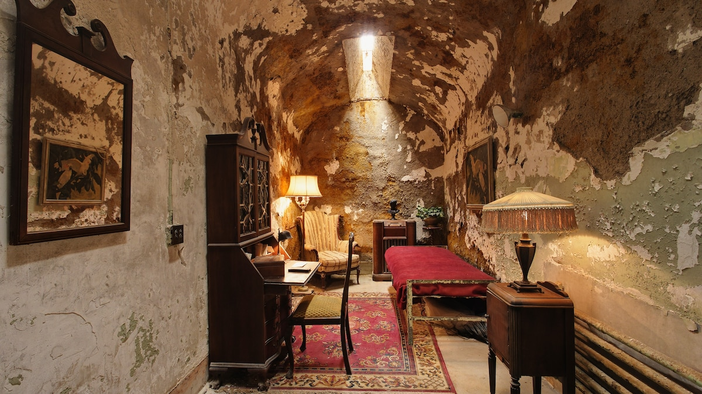 Image discovered from www.nationalgeographic.com. Source image: [These are the most haunted places in the United States](https://i.natgeofe.com/n/e11a8ae0-7249-42c0-9bdf-c565e6dba6b9/haunted-eastern-state-penitentiary-philadelphia-pennsylvania16x9.jpg?w=1200) Trans-Allegheny Lunatic Asylum in Weston, West Virginia 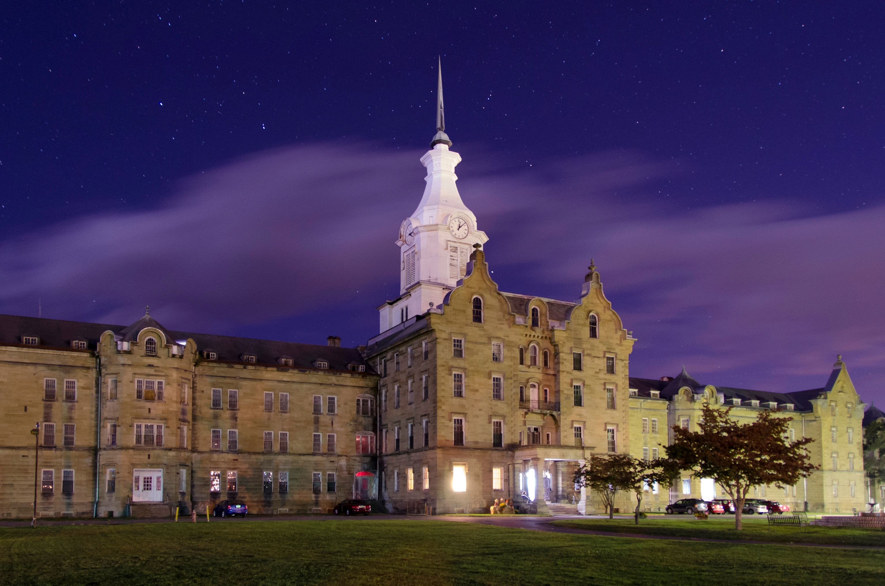 Trans-Allegheny Lunatic Asylum in Weston, West Virginia Source image: [Trans-Allegheny Lunatic Asylum in Weston, West Virginia](https://i.natgeofe.com/n/b247d06e-53fd-4cf5-810e-5b4c01fba7cb/haunted-trans-allegheny-lunatic-asylum-weston-west-virginia.jpg) LaLaurie Mansion in New Orleans, Louisiana 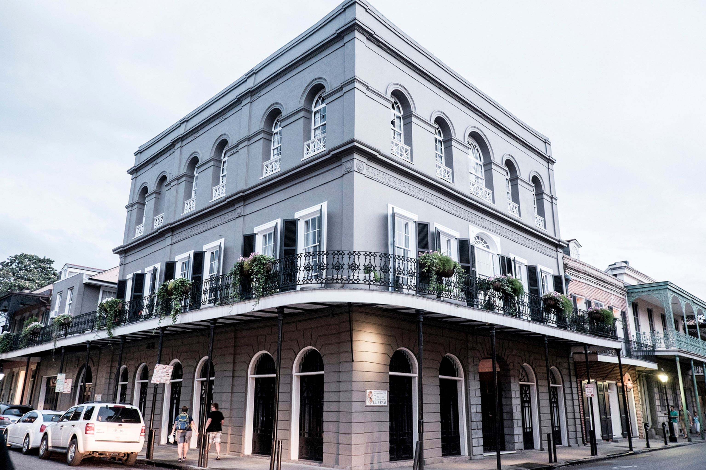 LaLaurie Mansion in New Orleans, Louisiana Source image: [LaLaurie Mansion in New Orleans, Louisiana](https://i.natgeofe.com/n/dd2268d3-e27b-4bed-8732-143c9562cf0f/Haunted-LaLaurie-Mansion-New-Orleans.jpg) Eastern Sstate Penitentiary in Philadelphia Pennsylvania 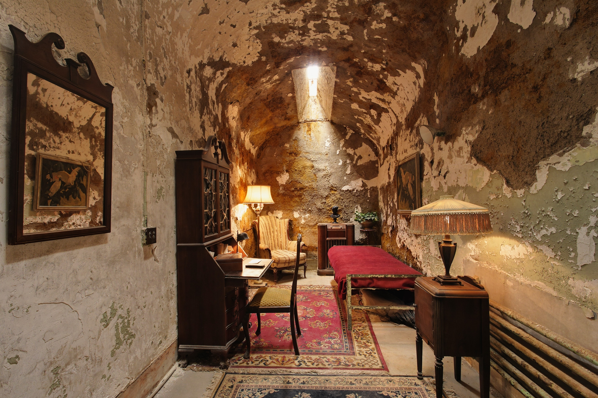 Eastern Sstate Penitentiary in Philadelphia Pennsylvania Source image: [Eastern Sstate Penitentiary in Philadelphia Pennsylvania](https://i.natgeofe.com/n/e11a8ae0-7249-42c0-9bdf-c565e6dba6b9/haunted-eastern-state-penitentiary-philadelphia-pennsylvania.jpg) the Queen Mary docked in Long Beach, California  the Queen Mary docked in Long Beach, California Source image: [the Queen Mary docked in Long Beach, California](https://i.natgeofe.com/n/4aec84c8-68bb-4781-8c68-fa2a2cdcb036/queen-mary-boat-longbeach-california.jpg) Stanley Hotel in Estes Park, Colorado 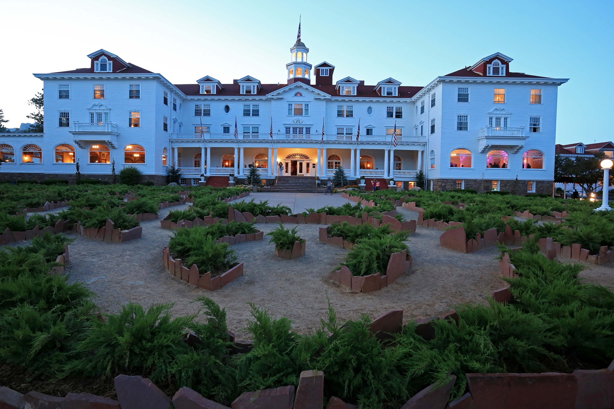 Stanley Hotel in Estes Park, Colorado Source image: [Stanley Hotel in Estes Park, Colorado](https://i.natgeofe.com/n/a3f6bf24-6d8c-4757-bf3e-d6a41b15894c/haunted-stanley-hotel-estes-park-colorado.jpg) These are the most haunted places in the United States  Image discovered from www.nationalgeographic.com. Source image: [www.nationalgeographic.com](https://i.natgeofe.com/n/6c02ad5a-977b-4f12-b9c0-02ffb0736e07/metropolitan-cathedral-zocalo-mexico-citysquare.JPG) These are the most haunted places in the United States 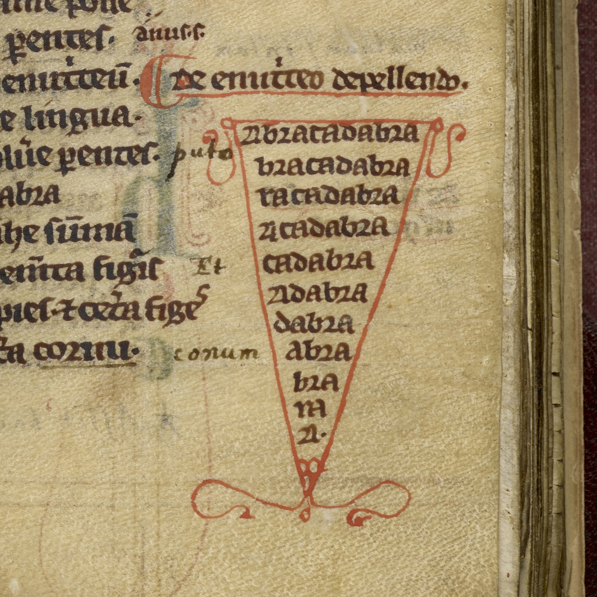 Image discovered from www.nationalgeographic.com. Source image: [www.nationalgeographic.com](https://i.natgeofe.com/n/70f2ccb4-532d-42d0-980c-03722d776e81/BAL3666684square.jpg) GitHub - data-poems/strange-places-dataset: 354K mysterious phenomena worldwide - UFOs, caves, megaliths, ghost towns, meteorites, earthquakes, volcanoes, bigfoot, haunted places 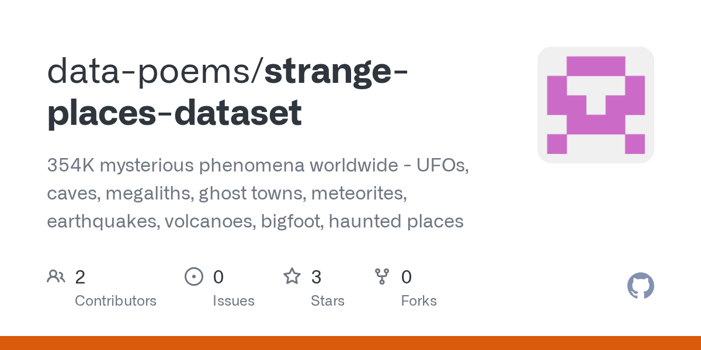 Image discovered from github.com. Source image: [GitHub - data-poems/strange-places-dataset: 354K mysterious phenomena worldwi...](https://opengraph.githubassets.com/74862fd8b4ccc86c18e3480caccd941970b411681e2bc8fec80b464dd8f3f596/data-poems/strange-places-dataset) Banner  Banner Source image: [Banner](https://d2jv02qf7xgjwx.cloudfront.net/sites/832/banner/Banner6.png) Report Data Visuals These maps, charts, and boards are rendered from the report's extracted location and evidence dataset. They are data visuals, not generated photographs or documentary image evidence. [Open the interactive location map](ReportVisuals/64114d9f187a/interactive-map.html) Hotspot Field Route Map 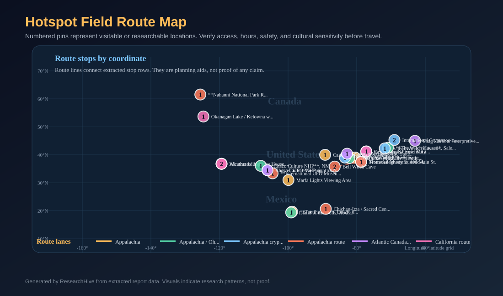 Numbered pins represent visitable or researchable locations. Verify access, hours, safety, and cultural sensitivity before travel. Source data: [visual-dataset.csv](ReportVisuals/64114d9f187a/visual-dataset.csv) Top Hotspots Visitability Board 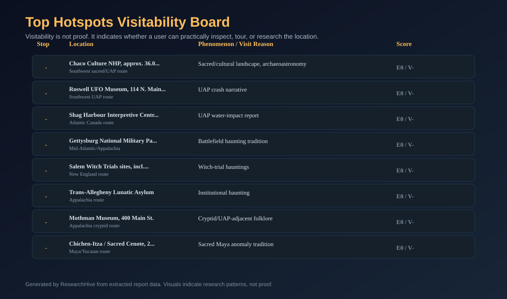 Visitability is not proof. It indicates whether a user can practically inspect, tour, or research the location. Source data: [visual-dataset.csv](ReportVisuals/64114d9f187a/visual-dataset.csv) North America Hotspot Map 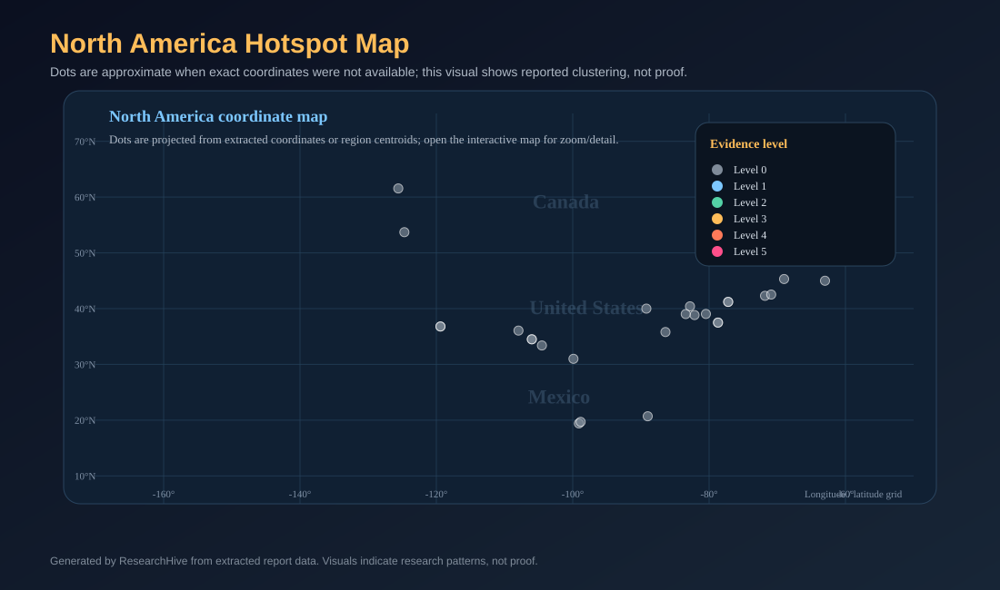 Dots are approximate when exact coordinates were not available; this visual shows reported clustering, not proof. Source data: [visual-dataset.csv](ReportVisuals/64114d9f187a/visual-dataset.csv) Regional Report Density Heat Map 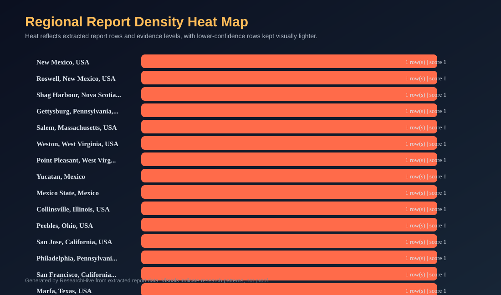 Heat reflects extracted report rows and evidence levels, with lower-confidence rows kept visually lighter. Source data: [visual-dataset.csv](ReportVisuals/64114d9f187a/visual-dataset.csv) Legend And Report Timeline 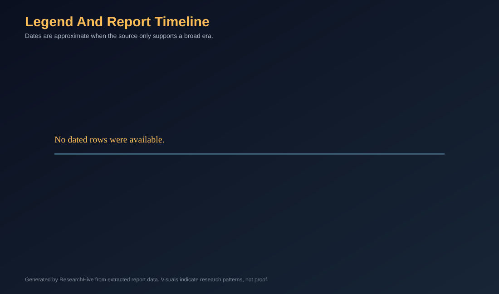 Dates are approximate when the source only supports a broad era. Source data: [visual-dataset.csv](ReportVisuals/64114d9f187a/visual-dataset.csv) Phenomenon By Region Matrix 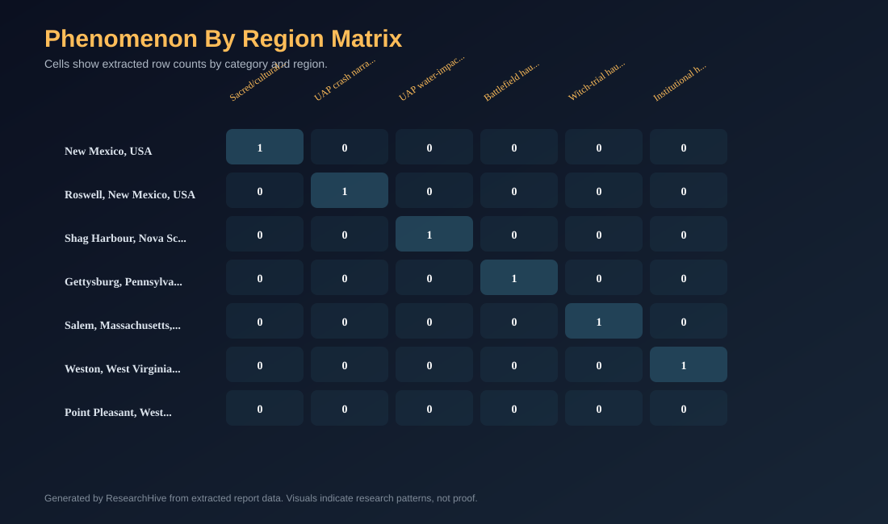 Cells show extracted row counts by category and region. Source data: [visual-dataset.csv](ReportVisuals/64114d9f187a/visual-dataset.csv) Signal Versus Evidence Chart 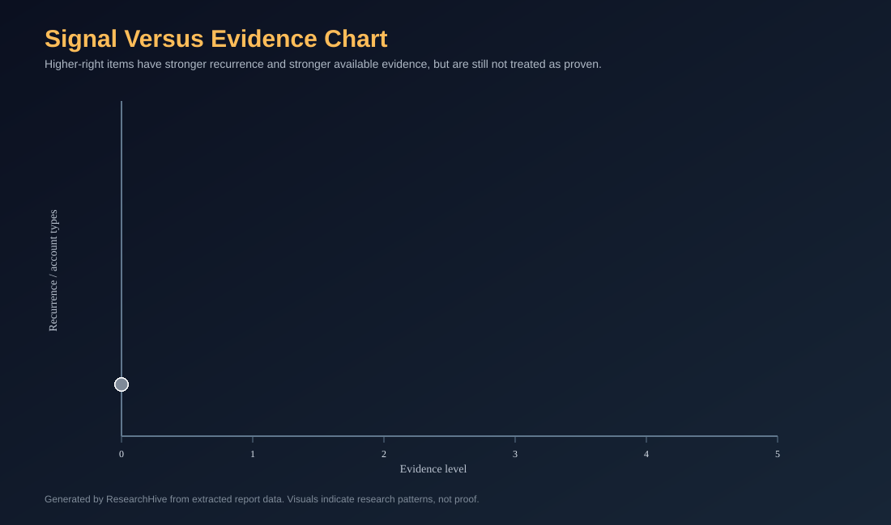 Higher-right items have stronger recurrence and stronger available evidence, but are still not treated as proven. Source data: [visual-dataset.csv](ReportVisuals/64114d9f187a/visual-dataset.csv) Location Source Cards 
 <a class="report-source-card" href="[NPS Chaco](https://www.nps.gov/chcu/planyourvisit/directions.htm)" target="blank" rel="noopener noreferrer"> Chaco Culture NHP, NM Southwest Sacred Landscape &middot; Sacred landscape, archaeoastronomy, anomalous-landscape narratives Dirt-road access; avoid unsafe/private routes; tribal-land respect required </a> <a class="report-source-card" href="[Roswell UFO Museum](https://www.roswellufomuseum.com/) [11]" target="blank" rel="noopener noreferrer"> International UFO Museum, Roswell, NM Southwest UAP Loop &middot; 1947 Roswell incident interpretation Downtown museum; treat alien claims as contested </a> <a class="report-source-card" href="[Mothman Museum](https://www.mothmanmuseum.com/) [9]" target="blank" rel="noopener noreferrer"> Mothman Museum, Point Pleasant, WV Appalachia / Ohio River &middot; 1966 Mothman sightings and archive culture Open public hours; separate folklore from proof </a> <a class="report-source-card" href="[Parks Canada](https://parks.canada.ca/pn-np/nt/nahanni/visit)" target="blank" rel="noopener noreferrer"> Nahanni National Park Reserve Northern Canada &middot; Dene oral history, disappearance traditions, remote landscape lore No public roads; air or hike-in access; Indigenous co-management context </a> <a class="report-source-card" href="[Ohio History](https://www.ohiohistory.org/visit/browse-historical-sites/serpent-mound/)" target="blank" rel="noopener noreferrer"> Serpent Mound, Peebles, OH Great Lakes / Ohio Valley &middot; Effigy mound, sacred landscape, debated dating Limited hours; no trespass after gates close; drones prohibited </a> <a class="report-source-card" href="[UNESCO](https://whc.unesco.org/en/list/414/)" target="blank" rel="noopener noreferrer"> Teotihuacan, Estado de M&233;xico Central Mexico &middot; Sacred city, symbolic geometry, later sacred-place traditions Protected archaeological zone; use official paths and preservation rules </a> <a class="report-source-card" href="[The Witch House](https://www.thewitchhouse.org/) [7]" target="blank" rel="noopener noreferrer"> The Witch House, Salem, MA New England &middot; Salem witch-trial memory; haunting folklore nearby Public house museum; respect memorial tone </a> <a class="report-source-card" href="[TALA](https://trans-alleghenylunaticasylum.com/) [8]" target="blank" rel="noopener noreferrer"> Trans-Allegheny Lunatic Asylum, Weston, WV Appalachia &middot; Historic asylum; ghost tours No drones; interior temperature varies; book tours </a> 
 Source Index - [1] These are the most haunted places in the United States | National Geographic — https://www.nationalgeographic.com/travel/article/the-most-haunted-places-in-the-united-states - [2] GitHub - data-poems/strange-places-dataset: 354K mysterious phenomena worldwide - UFOs, caves, megaliths, ghost towns, meteorites, earthquakes, volcanoes, bigfoot, haunted places · GitHub — https://github.com/lukeslp/strange-places-dataset - [3] Legends: Folklore on Reddit — http://arxiv.org/abs/2007.00750v1 - [4] Primary Sources - History - Research Guides at Loyola / Notre Dame Library — https://guides.lndlibrary.org/history/primarysources - [5] [PDF] historysourcetypes.pdf — https://history.berkeley.edu/sites/default/files/historysourcetypes.pdf - [6] On the astronomical content of the sacred landscape of Cusco in Inka times — http://arxiv.org/abs/physics/0408037v1 - [7] Sacred and secular neolithic landscapes in Ireland — https://doi.org/10.4324/9780203714041-10 - [8] Cryptids of North America | Bureau of Land Management — https://www.blm.gov/blog/2020-10-29/cryptids-north-america - [9] Mythology & Oral Traditions - Native American & Indigenous Studies - Research Guides and Class Pages at Dominican University — https://research.dom.edu/NAS/myth - [10] 99Disciplining the Polyphony of the Herbarium culture to civilization, they both agreed that the best way to examine suc... - [11] Mark Brilliant Department of History Program in American Studies University of California, Berkeley Primary, Secondary,... --- Citation Verification Summary Verified automatically after report generation. | Outcome | Count | |---------|-------| | ✓ Verified (source supports claim) | 121 | | ~ Plausible (partial text match) | 16 | | ⚠ Unverified (claim not found in source) | 0 | | ✗ No Source (citation has no fetched content) | 0 | | [inference] labels from model | 0 |

## Recommendation

- Rank these as documented place + repeated accounts, not as proven paranormal events [1][4].
- Rank each hotspot twice: once for the documented location and once for the extraordinary claim attached to it, because those two evidence questions are not the same [1], [4], [5].
- For every field card, use a fixed evidence line: Documented place, Historical anchor, Claim type, Claim evidence, Visitability, Access risk, and Ethical caution [1], [4], [5].

## Top Risks

- This atlas can identify credible visitable leads and explain why they matter, but it cannot prove paranormal, cryptid, or UAP causation from the cited evidence alone; the strongest defensible conclusions are about documented places, reported traditions, public records, and patterns of circulation. [1][2][3][4][5][10]

## Top Gaps

- No saved claim-verification checks were found.

## Next Actions

- Rank these as documented place + repeated accounts, not as proven paranormal events [1][4].
- Rank each hotspot twice: once for the documented location and once for the extraordinary claim attached to it, because those two evidence questions are not the same [1], [4], [5].
- For every field card, use a fixed evidence line: Documented place, Historical anchor, Claim type, Claim evidence, Visitability, Access risk, and Ethical caution [1], [4], [5].

