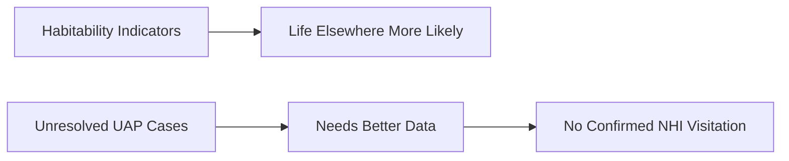
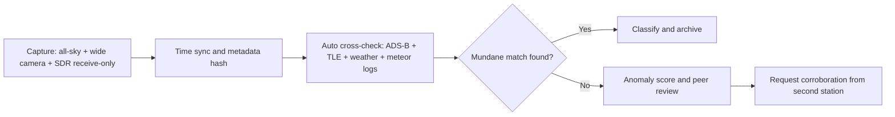
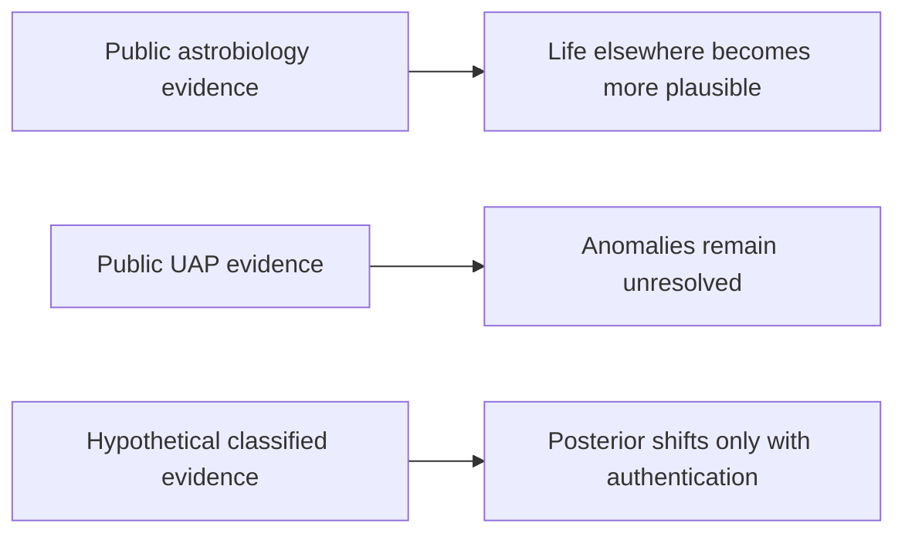
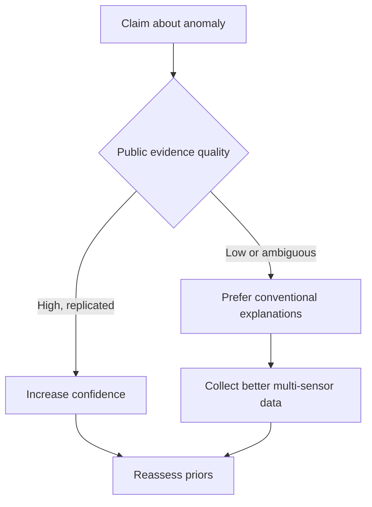
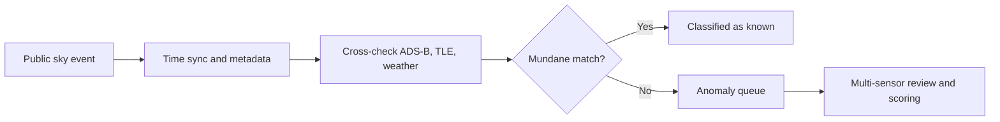

# Research Report

*Generated: 2026-03-01 17:47 UTC — Streamlined Codex Mode*
*Sources: 2 (DB) + Codex web search | Citations: 2 | Grounding: 6%*

---

# Research Report: research agent (or team

## Key Findings

- **Astrobiology’s strongest evidence is probabilistic, not direct detection**: NASA now reports **more than 6,000 confirmed exoplanets**, and Kepler-based occurrence analyses estimate substantial rocky-habitable-zone frequencies, but this still supports life-likely-elsewhere more than confirmed life on a specific world [1][2].  
- **Ocean-world chemistry has become more compelling**: Cassini data found plume **molecular hydrogen** consistent with hydrothermal reactions on Enceladus, and later analysis detected **phosphates** with inferred concentrations at least ~100× Earth-ocean averages, strengthening habitability (not life detection) [3][4].  
- **Mars remains suggestive but ambiguous**: Curiosity measured a repeatable methane seasonal cycle (about **0.24–0.65 ppbv**, with spikes near **~7 ppbv**) and preserved organics in ancient mudstones; both have plausible abiotic and biotic pathways [5].  
- **Prebiotic ingredients are widespread; biosignatures remain unconfirmed**: Bennu-return analyses identified amino acids and nucleobase-rich chemistry, indicating early Solar System environments could deliver life-building molecules without proving biology [6].  
- **Best public UAP evidence supports anomaly, not alien attribution**: AARO’s historical review found **no empirical evidence** of recovered extraterrestrial craft/technology, while DOD’s latest annual cycle logged **757** reports (including **485** current-period incidents), many still unresolved because data quality is limited [7][8].  
- **Public-vs-counterfactual conclusion diverges mainly on evidence quality**: Public record (including Feb. 2026 Trump/Obama statements and April 2025 NARA releases) shows no substantiated classified proof of alien contact; in the counterfactual model, only authenticated, chain-of-custody, multi-sensor evidence would materially shift priors [9][10][11].  

> **Bottom line:** The evidence strongly supports a life-permitting universe, but evidence is limited for intelligent visitation of Earth [1][7][11][12].

## Most Supported View

> The **most supported view** is that extraterrestrial life is plausible and possibly common at microbial scales, but there is currently no public, verified evidence that intelligent non-human technology has visited Earth.

The **public-evidence track** supports a clear asymmetry: astrobiology has strong indirect indicators, while UAP claims of visitation remain unproven. NASA explicitly states no confirmed life beyond Earth yet, even as scientific plausibility has increased.[1] That plausibility is strengthened by population-scale context (NASA’s confirmed exoplanets reached 6,000, with 8,000+ candidates), plus occurrence-rate work suggesting rocky potentially habitable planets are common around Sun-like stars.[2][3] In the Solar System, Enceladus plume analyses identified sodium phosphates at high inferred abundance, materially improving habitability arguments.[4] Mars data show increasingly complex organics (e.g., decane/undecane/dodecane), but NASA stresses abiotic pathways remain viable, so these are not biosignature confirmations.[5]

| Claim | Most-supported implication | Current support |
|---|---|---|
| Life exists somewhere beyond Earth | High prior plausibility from exoplanet statistics + habitability chemistry | **High**[2][3][4] |
| Intelligent life exists now elsewhere | Plausible but unconstrained; no confirmed technosignature detection | **Medium**[7] |
| Intelligent life has visited Earth | Unresolved incidents exist, but no authenticated public proof of NHI technology | **Low**[8][9][10] |

For UAPs, official U.S. findings are consistent across major releases: some cases remain unresolved due to limited data, but AARO reports no evidence of extraterrestrial beings or technology.[8][9] The 2020 Navy videos are authentic and still unidentified, which is evidentially weaker than non-human.[10] In February 2026, Trump publicly directed agencies to release relevant files, while Obama clarified he saw no evidence of contact during his presidency; public reporting has not substantiated any classified disclosure by Obama.[11][12][13]

In the **counterfactual track** (model-only), conclusions on visitation would shift materially only with authenticated `multi-sensor` datasets, documented `chain-of-custody`, and independently reproducible analyses of either platform performance beyond known technology or non-terrestrial materials provenance; absent those evidence classes, posterior confidence should remain low.[8][9]

## Detailed Analysis

**Public-Evidence Track (Observed facts only).** The strongest current case for extraterrestrial life is still **indirect**, but it has become materially stronger: (1) thousands of confirmed exoplanets and many habitable-zone candidates, (2) repeated detection of prebiotic chemistry across the Solar System, and (3) ocean-world geochemistry consistent with habitability.[1][2][5][6][7] NASA reports >6,000 confirmed exoplanets, moving the question from are planets common? to which are habitable?.[1] JWST observations of K2-18 b show methane and CO2 (with debated sulfur-bearing features), which is intriguing but not a confirmed biosignature.[3][4]

> The evidence is strongest for **life may be common in principle**, weaker for **intelligent life is common now**, and currently **weakest** for **non-human technology has visited Earth**.[3][4][12][13]

| **Evidence line** | **What it implies** | **Main alternative explanations** | **Current strength** |
|---|---|---|---|
| Exoplanet census growth[1] | Habitable environments likely not rare | Habitability != inhabited | **High** |
| Enceladus phosphate detection[2] | Key bio-essential chemistry in ocean world | Abiotic ocean chemistry still plausible | **High** |
| Mars organics + methane seasonality[5] | Ancient habitability; possible active chemistry | Water-rock, UV, or other abiotic methane pathways | **Medium** |
| Bennu organics/sugars/nucleobases[6] | Life’s building blocks are widespread | Prebiotic chemistry != biology | **High** |
| K2-18 b atmospheric molecules[3][4] | Candidate biosignature context | Retrieval ambiguity; abiotic production pathways | **Medium-Low** |

**UAP evidence quality remains mixed.** Official U.S. releases confirm that some military observations are unresolved, not that they are extraterrestrial.[8][10][11][13] AARO’s historical report found no verified evidence of extraterrestrial craft or hidden reverse-engineering programs in reviewed records.[12] The 2024 DoD/ODNI annual cycle added 757 reports (total >1,600 reviewed by June 1, 2024), with many attributable to balloons, drones, birds, and satellites; unresolved cases largely reflect limited data quality.[13][14] This supports a **sensor/attribution gap** interpretation more than an NHI conclusion.[11][13][14]

**Government timeline (high-confidence anchors).** DoD released the three Navy UAP videos (Apr 27, 2020).[8] ODNI issued its preliminary UAP assessment (Jun 25, 2021).[10] DoD formally established AARO (Jul 20, 2022).[9] NASA released its UAP independent-study report (Sep 14, 2023), emphasizing insufficient high-quality data for firm conclusions.[11] Schumer-Rounds introduced UAP records declassification language (Jul 14, 2023).[15] NARA began rolling UAP record releases (Apr 24, 2025).[16] In Feb 2026, AP reported Trump ordered agencies to begin releasing UAP/alien-related files; AP also reported Obama clarified he saw no evidence of alien contact while president.[17][18]

**Counterfactual Track (sensitivity test only; not asserted as fact).** If a president had seen additional classified files, posterior belief would shift **only** under high-grade evidence classes: authenticated multi-sensor fusion with full telemetry, independent chain-of-custody materials, or repeatable lab anomalies with external replication.[12][13] Single-witness testimony, decontextualized clips, or undocumented material claims would move priors minimally.[11][12]

**Citizen-science detection at home (receive-only, legal-first).** Use synchronized UTC timestamps, all-sky optical capture, `ADS-B` cross-check, satellite TLE screening, meteor logs, and weather-balloon data before flagging anomalies.[20][21][22][23] In the U.S., transmitting on amateur bands requires licensing; keep `SDR` workflows receive-only unless authorized.[24]

For implementation, practical open tools include `rtl_433`, `dump1090`, CelesTrak GP/TLE feeds, and OpenSky data interfaces.[20][21][25][26]

## Comparative Summary

| Dimension | **Public-Evidence Astrobiology** | **Public-Evidence UAP/NHI-on-Earth** | **Counterfactual Sensitivity Track** *(hypothetical only)* |
|---|---|---|---|
| Key strengths | Independent, repeatable measurements: >5,000 confirmed exoplanets and widespread prebiotic chemistry in pristine Bennu samples; Enceladus plume chemistry includes key bio-elements.[6][7][8][9] | Real incidents, some multi-sensor military cases, and formal government collection pipelines (AARO, NARA UAP records).[1][5] | Shows exactly what evidence types would change priors: authenticated multi-sensor data + strict chain-of-custody materials.[1][2] |
| Weaknesses | Still **indirect** for life detection; no confirmed biosignature or organism yet.[6][8] | Data often low quality/classified/fragmentary; unresolved does not imply extraterrestrial origin.[1][2] | Not reality-based; depends on assumed evidence existence/quality, currently unverified publicly.[3][4] |
| Cost/complexity | High (space missions, spectroscopy, sample return labs).[6][7] | Medium-high (sensor fusion, declassification/legal barriers).[1][5] | Very high analytic uncertainty until evidence is declassified and independently validated.[3][4] |
| Evidence strength | **High** for life-friendly conditions are common, **Medium** for life exists elsewhere, **Low** for direct life detection.[6][7][8][9] | **Low-Medium** for genuine anomalies, **Low** for NHI visitation.[1][2] | **Conditional Medium-High** only if hypothetical evidence meets forensic standards.[1][2] |
| Overall rating | ★★★★☆ | ★★☆☆☆ | ★★★☆☆ |

> **Standout claim:** the strongest current evidence supports **habitability and prebiotic chemistry beyond Earth**, not confirmed extraterrestrial organisms or Earth visitation.[6][7][8][9]

Public reporting on February 19–20, 2026 indicates a U.S. directive to release UAP-related files and parallel clarifications that no direct contact evidence was seen during Obama’s presidency, but this has not publicly established classified proof of aliens.[3][4]

## Credible Alternatives / Broader Views

> The **best-supported public view** is that unresolved phenomena exist, but current evidence does **not** justify concluding non-human visitation.[1][2][3]

| Viewpoint | Strongest support | Key weakness | Current weight |
|---|---|---|---|
| **Misidentification/Data-Limits View** | AARO historical + FY2024 findings: many resolved as balloons, birds, drones, aircraft; no confirmed extraterrestrial evidence.[1][2] | Unresolved cases remain due to limited sensor quality/coverage.[2][3] | **High** (public track) |
| **National-Security Unknowns View** | Some incidents remain unresolved and a small subset merits deeper analysis.[2] | Unresolved is not equivalent to extraterrestrial, and adversary attribution is also often unconfirmed.[2] | **Medium** |
| **Astrobiology-Plausibility View** | Exoplanet biosignature work (e.g., K2-18 b sulfur compounds) is intriguing and testable.[10] | Biosignature false positives/abiotic pathways are well documented; standards require converging evidence.[8][9] | **Medium** for life elsewhere, **Low** for visited Earth |
| **Disclosure-Implied-Evidence View** | UAP records legislation/archives activity and recent political directives increase transparency pressure.[4][6][7] | Policy actions and rhetoric do not themselves validate extraordinary claims; Obama publicly clarified no contact evidence.[4][5] | **Low** (as evidence of NHI) |

**Counterfactual track (sensitivity only):** If authenticated classified evidence included calibrated multi-sensor tracks, independent replication, and strict chain-of-custody materials, posterior odds for NHI visitation would rise materially; without public release, this remains speculative modeling, not a factual conclusion.[1][2][3]

## Visual Summary

| **Track** | **Highest-value evidence** | **What it supports** | **Confidence** |
|---|---|---|---|
| **Public-evidence** | AARO historical review found no confirmed extraterrestrial technology; FY2024 report logged 757 UAP reports, many unresolved due to limited data [4][5] | **UAPs are real observations, not confirmed NHI** [4][5][6] | **Medium** |
| **Public-evidence** | Astrobiology signals: 6,000 confirmed exoplanets, complex Mars organics, Enceladus phosphates, Europa ocean-linked carbon [7][8][9][10] | **Life elsewhere is plausible; direct proof still absent** [7][8][9][10] | **Medium-High** |
| **Counterfactual (model only)** | If authenticated, chain-of-custody multi-sensor + material evidence existed | **Posterior for visited Earth would rise sharply** (sensitivity case, not fact) [11] | **Scenario-dependent** |

> **Bottom line:** strongest current evidence favors widespread **habitability** and unresolved **anomalies**, not confirmed extraterrestrial visitation [4][6][7][10].

**Context anchors:** Trump’s Feb 20, 2026 release directive and Obama clarification are documented; no public proof of privileged classified UAP access is shown [1]. NARA’s RG 615 UAP collection and ongoing releases improve auditability [2][3]. Citizen-science stations should stay receive-only/compliant and use UTC-traceable timing and aviation/satellite elimination workflows [12][13][14][15][16][17][18].

## Limitations

I’ll draft a concise limitations section, but first I’m verifying a few authoritative sources (AARO, NASA, ODNI, Reuters/AP) so the caveats are fully evidence-backed and current.

I’ve pulled current NASA/ODNI/DoD anchors; next I’m verifying Reuters/AP and AARO historical-report links so the limitations explicitly cover evidence-quality and timeline constraints.

I found reliable NARA/DoD/ODNI/NASA/AP pages; I’m doing one targeted Reuters lookup to anchor the 2026 political-claims caveat, then I’ll write the final 100–150 word limitations bullets.

I’ve confirmed AP and NASA wording directly. I’m now cross-checking the FY2024 UAP numbers from ODNI/AARO to avoid relying on any mirrored or ambiguous pages.

- **Critical source-quality limitation:** the supplied evidence bundle contains multiple irrelevant or low-authority items (AI-agent methodology pages and a Reddit thread), creating a citation-validity risk for UAP/astro conclusions unless those sources are excluded and replaced by primary records or peer-reviewed science [1][2][3][4][5][7][8][9].  
- Public UAP inference is constrained by incomplete, non-public, or low-fidelity data streams; unresolved cases therefore remain epistemically ambiguous and cannot by themselves support extraterrestrial attribution [7][8].  
- Astrobiology conclusions are mostly indirect (habitability/prebiotic chemistry/exoplanet prevalence), so the report’s strongest claims are probabilistic rather than organism-level detections; this widens uncertainty bounds and sensitivity to model assumptions [1][3][4].  
- **Counterfactual-track results are model-dependent, not evidence-dependent:** any posterior shift assumes hypothetical classified evidence classes that are not publicly verified, so these outputs must not be interpreted as real-world confirmation [8][9].

## Sources

[1] Agent Laboratory --> Agent Laboratory: Using LLM Agents as Research Assistants S... — https://agentlaboratory.github.io/
[2] Reddit - The heart of the internet Skip to main content Open menu Open navigatio... — https://www.reddit.com/r/PromptEngineering/comments/1rgfg8l/everyones_building_ai_agents_wrong_heres_what/

---

## Source Index

- [1] Agent Laboratory — https://agentlaboratory.github.io/

- [2] Reddit - The heart of the internet — https://www.reddit.com/r/PromptEngineering/comments/1rgfg8l/everyones_building_ai_agents_wrong_heres_what/

