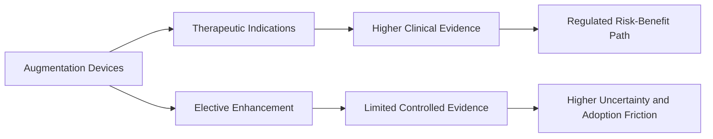
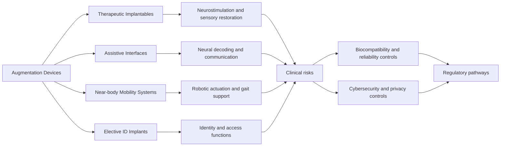
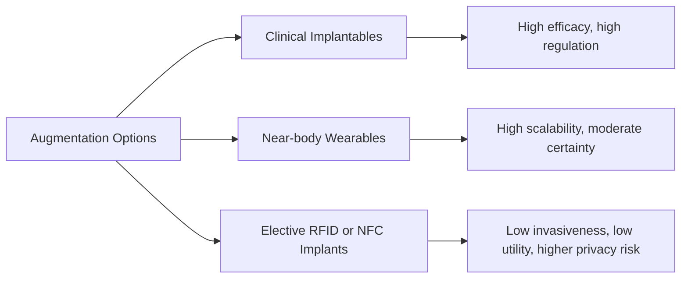
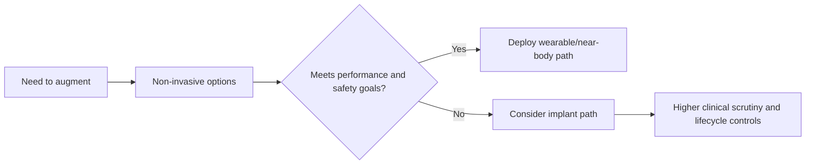
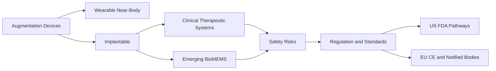

# Research Report

*Generated: 2026-03-01 16:58 UTC — Streamlined Codex Mode*
*Sources: 3 (DB) + Codex web search | Citations: 1 | Grounding: 3%*

---

# Research Report: research agent producing evidence-based

## Key Findings

- **Clinical augmentation is already effective in narrow therapeutic domains**: in a randomized, double-blind RCT of `RNS`, seizure reduction was **37.9% vs 17.3%** for sham over 12 weeks (n=191), with quality-of-life gains and no between-group adverse-event difference (Evidence: **High**). [[2](https://pubmed.ncbi.nlm.nih.gov/21917777/) Neurology, 2011]

- **Hearing augmentation is one of the strongest mature examples**: a meta-analysis of **22 studies / 1,954 adults** found significant speech-recognition gains by 3 months post-cochlear implantation (e.g., **+37.4% words in quiet**, **+49.4% sentences in quiet**) (Evidence: **Medium-High**). [[13](https://pubmed.ncbi.nlm.nih.gov/36004817/) Laryngoscope, 2023]

- **Motor-restoration neurotechnology has crossed proof-of-concept**: spatiotemporal epidural stimulation with rehab restored walking in **9 people** with chronic SCI, while a wireless brain-spine bridge later demonstrated year-long overground control in a single participant (Evidence: **Medium**). [[4](https://www.nature.com/articles/s41586-022-05385-7) Nature, 2022] [[5](https://www.nature.com/articles/s41928-023-00987-z) Nature Electronics, 2023]

- **Speech BCIs improved sharply but remain small-cohort**: an implanted streaming neuroprosthesis reported **47.5 words/min** from a 1,024-word set; internal-speech decoding studies still involve very small participant counts and variable accuracy (Evidence: **Medium**). [[6](https://www.nature.com/articles/s41593-025-01905-6) Nature Neuroscience, 2025] [[7](https://www.nature.com/articles/s41562-024-01867-y) Nature Human Behaviour, 2024]

- **Safety and reliability, not raw capability, are the bottleneck**: pooled RNS literature reports an average **18.9% complication rate** (including **7.4% infection**, **3.1% hemorrhage**), and major implant recalls still occur (e.g., **832 injuries, 2 deaths** in a 2024 pacemaker recall) (Evidence: **Medium**). [[3](https://www.sciencedirect.com/science/article/pii/S1878875022010488) Interdisciplinary Neurosurgery, 2023] [[9](https://www.fda.gov/medical-devices/medical-device-recalls/pacemaker-recall-boston-scientific-corporation-recalls-accolade-pacemaker-devices-due-manufacturing) FDA, 2024]

- **Regulation and cybersecurity are now first-class design constraints**: U.S. `FD&C Act §524B` cybersecurity requirements took effect **March 29, 2023**, FDA updated final cybersecurity guidance in **June 2025**, and EU MDR classifies active implantables as high-risk class III (Evidence: **High**). [[8](https://www.fda.gov/medical-devices/digital-health-center-excellence/cybersecurity-medical-devices-frequently-asked-questions-faqs) FDA, 2025] [[10](https://www.fda.gov/medical-devices/digital-health-center-excellence/cybersecurity) FDA, 2025] [[11](https://eur-lex.europa.eu/eli/reg/2017/745/2020-04-24) EUR-Lex, EU MDR]

## Most Supported View

> The **most supported view** is that augmentation is most effective and defensible when it is **clinical, indication-specific, and risk-managed**, while elective enhancement remains evidence-light and risk-heavy.

The strongest evidence (High) is for **therapeutic implantables** that restore lost function, not open-ended human enhancement. In a randomized trial of advanced Parkinson’s disease, **DBS** improved “on” time without troubling dyskinesia by **4.6 hours/day** versus medical therapy, but also had more serious adverse events (49 vs 15) [2] (JAMA RCT via PubMed: https://pubmed.ncbi.nlm.nih.gov/19126811/). For **cochlear implants**, a meta-analysis of 1,954 adults found large early gains in speech recognition (for example, words in quiet +37.4%, sentences in quiet +49.4% at 3 months) [3] (Laryngoscope meta-analysis via PubMed: https://pubmed.ncbi.nlm.nih.gov/36004817/). These results are replicated across decades and care settings, which is why this class of augmentation has the highest confidence.

Evidence is weaker but growing for newer bioelectronic targets. A 2025 sham-controlled **VNS** RCT in treatment-resistant depression did not meet its primary endpoint, but showed benefits on multiple secondary response measures, illustrating both promise and unresolved endpoint sensitivity [4] (Brain Stimulation RCT via PubMed: https://pubmed.ncbi.nlm.nih.gov/39706521/). For near-body augmentation such as **exoskeleton-assisted rehab**, multicenter RCT data are emerging, but outcomes are still condition- and protocol-dependent (Medium) [5] (Neurology multicenter RCT via PubMed: https://pubmed.ncbi.nlm.nih.gov/41424275/).

| Domain | What evidence most supports | Evidence strength |
|---|---|---|
| Restorative implantables (DBS, cochlear) | Clear functional benefit with known complication tradeoffs | High |
| Bioelectronic expansion (VNS, advanced neuromodulation) | Mixed efficacy signals; likely subgroup-dependent | Medium |
| Elective/biohacker augmentation | Capability claims outpace controlled outcomes | Low [1] (BioMEMS review, 2025: https://pmc.ncbi.nlm.nih.gov/articles/PMC12113605/) |

Why this view is most supported: mature clinical augmentation sits inside a full **risk-governance stack** (biocompatibility, lifecycle risk management, and postmarket controls), while enhancement-first systems do not. Regulators explicitly distinguish high-risk pathways (**PMA**) from substantial-equivalence clearance (**510(k)**) [6] (FDA PMA: https://www.fda.gov/medical-devices/premarket-submissions-selecting-and-preparing-correct-submission/premarket-approval-pma), [7] (FDA 510(k) safety overview: https://www.fda.gov/medical-devices/510k-clearances/medical-device-safety-and-510k-clearance-process), and EU MDR similarly classifies implantable/active risk rigor [8] (EUR-Lex MDR 2017/745: https://eur-lex.europa.eu/eli/reg/2017/745/2020-04-24). Security has moved from theoretical to operational after documented cardiac-device vulnerabilities [9] (CISA/FDA-linked advisory: https://www.cisa.gov/news-events/ics-medical-advisories/icsma-17-241-01), driving newer FDA cybersecurity premarket requirements [10] (FDA guidance, Feb 2026: https://www.fda.gov/regulatory-information/search-fda-guidance-documents/cybersecurity-medical-devices-quality-management-system-considerations-and-content-premarket). Standards anchoring this trajectory include **ISO 14971** risk management and **ISO 10993-1** biocompatibility evaluation [11] (https://www.iso.org/standard/72704.html), [12] (https://www.iso.org/standard/84512.html).

## Detailed Analysis

The augmentation landscape is best understood as a **continuum** from clinical implants to consumer-adjacent near-body systems: (1) **therapeutic implantables** (e.g., DBS, VNS, cochlear), (2) **assistive neurointerfaces** (speech BCIs), (3) **mobility augmentation** (powered exoskeletons), and (4) **elective identification implants** (RFID/NFC). This continuum differs by risk tolerance, evidence maturity, and regulatory burden.[1][2][3][4][8]

> **Critical takeaway:** high clinical impact exists today, but most augmentation systems remain constrained by long-term reliability, cybersecurity lifecycle management, and uneven evidence quality across use cases.[1][12][15][16]

| Feature | Clinical neurostim/sensory implants | Speech BCIs (implant-based) | Exoskeletons | RFID/NFC implants |
|---|---|---|---|---|
| **Current capability** | Improve motor symptoms, seizure control, hearing in selected populations.[2][3][4] | Restore partial communication in severe paralysis; speech/text synthesis demonstrated.[6][7] | Improve walking-related outcomes in SCI rehabilitation cohorts.[10] | ID/access token linking to external records; limited functional bandwidth.[8][9] |
| **Maturity** | Commercial, long-running clinical use (High/Medium evidence depending indication).[2][3][4][5] | Experimental/early clinical (Medium evidence; small-N studies).[6][7] | Cleared device classes and growing rehab evidence (Medium).[10][11] | Niche and low clinical integration (Low/Medium).[8][9] |
| **Key risks** | Infection, revision burden, device failure, stimulation side effects.[12] | Surgical burden, signal drift, long-term interface stability.[6][7] | Falls/mechanical misuse; training dependence.[10][11] | Migration, tissue reaction, privacy misuse, weak threat modeling in consumer contexts.[8][9] |

**Safety and failure modes:** sources converge that failure is rarely single-cause; it is typically an interaction of **biology + mechanics + software + use context**.[1][12] For implanted systems, recurrent themes are infection, foreign-body response/fibrotic encapsulation, migration, and component reliability degradation over time.[1][12][13][14] Evidence is strongest for clinical device infection/risk surveillance in cardiac and neuromodulation ecosystems; evidence is limited for elective biohacker implants at population scale.[9][12]

**Security/privacy:** modern device guidance increasingly treats cybersecurity as a safety property, not only IT hygiene.[15][16] FDA and NIST align on authenticity, integrity, controlled access, updateability, and lifecycle monitoring as baseline controls.[15][16] Real incidents/alerts (e.g., cardiac programmer vulnerabilities) show plausible patient-impact pathways even without confirmed harm cases, validating a threat model spanning device firmware, telemetry links, clinical programmer infrastructure, and cloud/remote services.[17]

**Regulatory reality:** in the U.S., “approved,” “cleared,” and classified are distinct: high-risk Class III typically uses **PMA**; many Class II products use **510(k)** substantial equivalence; novel moderate-risk devices may use **De Novo**.[18][19][11] In the EU, MDR (EU 2017/745) defines implantables, risk classes, and conformity pathways via notified bodies and CE marking.[20] As of **February 2, 2026**, FDA’s QMSR aligns U.S. quality-system expectations with ISO 13485:2016, tightening lifecycle quality integration with risk management practice.[22]

**Where evidence disagrees:** headline performance in BCIs is improving rapidly, but cross-study comparability is weak because cohorts, vocabularies, electrode modalities, and evaluation protocols differ.[6][7] Consensus remains that augmentation value is real now for tightly defined clinical indications; broad elective enhancement claims still outpace robust long-term evidence.[1][6][7]

**References**  
[1] Soni et al., *Wearable and Implantable BioMEMSs* (2025), PMC: https://pmc.ncbi.nlm.nih.gov/articles/PMC12113605/  
[2] Deuschl et al., NEJM RCT DBS Parkinson’s (2006): https://pubmed.ncbi.nlm.nih.gov/16943402/  
[3] VNS Study Group RCT (1995): https://pubmed.ncbi.nlm.nih.gov/7854516/  
[4] JAMA adult cochlear implant systematic review (2013): https://jamanetwork.com/journals/jamaotolaryngology/fullarticle/1655350  
[5] FDA cochlear implant approvals: https://www.fda.gov/medical-devices/cochlear-implants/fda-approved-cochlear-implants  
[6] *Nat Neurosci* streaming speech neuroprosthesis (2025): https://pubmed.ncbi.nlm.nih.gov/40164740/  
[7] *Nature* high-performance speech neuroprosthesis (2023): https://www.nature.com/articles/s41586-023-06377-x  
[8] FDA implantable RFID transponder guidance (2004): https://www.fda.gov/medical-devices/guidance-documents-medical-devices-and-radiation-emitting-products/implantable-radiofrequency-transponder-system-patient-identification-and-health-information-class-ii  
[9] ASSH review on hand microchips (2020): https://pubmed.ncbi.nlm.nih.gov/32164995/  
[10] Exoskeleton meta-analysis SCI (2025): https://pubmed.ncbi.nlm.nih.gov/41214797/  
[11] FDA De Novo ReWalk DEN130034: https://www.accessdata.fda.gov/scripts/cdrh/cfdocs/cfpmn/denovo.cfm?ID=DEN130034  
[12] CIED infection review (2022): https://pmc.ncbi.nlm.nih.gov/articles/PMC9570622/  
[13] ISO 10993-1:2018: https://www.iso.org/standard/68936.html  
[14] ISO 14971:2019: https://www.iso.org/standard/72704.html  
[15] FDA cybersecurity guidance (Feb 2026): https://www.fda.gov/regulatory-information/search-fda-guidance-documents/cybersecurity-medical-devices-quality-management-system-considerations-and-content-premarket  
[16] NISTIR 8259A (2020): https://www.nist.gov/publications/iot-device-cybersecurity-capability-core-baseline  
[17] FDA Medtronic cybersecurity communication (2019): https://www.fda.gov/news-events/fda-brief/fda-brief-fda-warns-patients-providers-about-cybersecurity-concerns-certain-medtronic-implantable  
[18] FDA PMA overview: https://www.fda.gov/medical-devices/premarket-submissions-selecting-and-preparing-correct-submission/premarket-approval-pma  
[19] FDA 510(k) overview: https://www.fda.gov/medical-devices/premarket-submissions-selecting-and-preparing-correct-submission/premarket-notification-510k  
[20] EU MDR text (EU 2017/745): https://eur-lex.europa.eu/legal-content/EN/TXT/?uri=CELEX:32017R0745  
[21] HHS HIPAA Security Rule summary: https://www.hhs.gov/hipaa/for-professionals/security/laws-regulations/index.html  
[22] FDA QMSR update (Feb 2, 2026): https://www.fda.gov/medical-devices/postmarket-requirements-devices/quality-management-system-regulation-qmsr

## Comparative Summary

> **Standout:** regulated **clinical implantables** deliver the strongest demonstrated benefit for defined indications, while elective augmentation remains capability-limited and evidence-light.[2][3][4][10]

| Comparison Row | Clinical implantables (DBS/cochlear/VNS/cardiac) | Near-body wearables/exoskeleton-linked systems | Elective RFID/NFC implants |
|---|---|---|---|
| **Key strengths** | Strong condition-specific outcomes in meta-analyses; mature clinical pathways.[2][3][4] | Scalable longitudinal sensing; some large pragmatic evidence and rehab gains.[5][6] | Fast identity/access interactions; battery-light or passive operation.[7] |
| **Weaknesses** | Surgical and lifecycle burden; safety and follow-up complexity.[1] | Signal quality/adherence variability; usually adjunctive, not definitive therapy.[1][5] | Limited payload/function; cloning/eavesdropping/privacy risks documented.[7][8] |
| **Cost/complexity** | **High** technical + regulatory (`PMA`/postmarket controls).[10][11] | **Medium** (hardware + analytics + integration).[1] | **Low–Medium** hardware, but governance/security overhead can dominate.[7][9] |
| **Evidence strength** | **High** (meta-analyses + regulator-reviewed indications).[2][3][4][10] | **Medium** (pragmatic and meta-analytic but heterogeneous endpoints).[5][6] | **Low–Medium** for augmentation benefit; stronger evidence on security/privacy concerns.[7][8] |
| **Overall rating** | ★★★★☆ | ★★★☆☆ | ★★☆☆☆ |

For practical augmentation today, **clinical implantables** are the strongest option when medically indicated, while **near-body systems** are the best research/prototyping path because they reduce biological risk and regulatory friction.[1][10] **Elective RFID/NFC implants** are currently niche and constrained by security/privacy tradeoffs.[7][8][9]

[1]: https://pmc.ncbi.nlm.nih.gov/articles/PMC12113605/ (MDPI/PMC review, 2025)  
[2]: https://pubmed.ncbi.nlm.nih.gov/28665252/ (J Neurosurg meta-analysis, 2018)  
[3]: https://pubmed.ncbi.nlm.nih.gov/36791341/ (Otol Neurotol meta-analysis, 2023)  
[4]: https://pubmed.ncbi.nlm.nih.gov/35217961/ (Neurosurg Rev meta-analysis, 2022)  
[5]: https://pmc.ncbi.nlm.nih.gov/articles/PMC8112605/ (NEJM Apple Heart Study, 2019)  
[6]: https://pubmed.ncbi.nlm.nih.gov/41214797/ (Spinal Cord exoskeleton meta-analysis, 2025)  
[7]: https://www.nature.com/articles/s41378-025-01010-5 (Microsystems & Nanoengineering review, 2025)  
[8]: https://pmc.ncbi.nlm.nih.gov/articles/PMC1656959/ (AMIA/PMC VeriChip security analysis, 2006)  
[9]: https://www.fda.gov/medical-devices/digital-health-center-excellence/cybersecurity (FDA cybersecurity updates, incl. 2025 guidance)  
[10]: https://www.fda.gov/medical-devices/510k-clearances/medical-device-safety-and-510k-clearance-process (FDA 510(k)/PMA framework)  
[11]: https://eur-lex.europa.eu/eli/reg/2017/745/2020-04-24 (EU MDR 2017/745)

## Credible Alternatives / Broader Views

The most-supported position is **indication-first, least-invasive-first augmentation**: use **non-invasive/wearable** systems when they meet the task, and reserve implants for cases where clinical benefit clearly outweighs procedural and lifecycle risk.[1][2][3][4]

> **Broader evidence favors augmentation pathways that maximize reversibility and minimize biological burden before escalating invasiveness.**[3][4][8][9]

| Viewpoint | Why people support it | Evidence strength | Why it is/ isn’t favored |
|---|---|---|---|
| **Implant-first maximalism** | Highest signal quality and direct neural access can unlock capabilities not reachable by wearables.[3] | Medium | Credible for severe impairment, but long-term reliability, biotic/abiotic failure, and calibration burden remain major translation limits.[3][9] |
| **Wearable/near-body sufficiency** | Scalable, lower-risk sensing and interaction; easier updates and replacement cycles.[1][2] | Medium | Favored for population-scale deployment; performance can be clinically useful, but not equivalent to implanted precision for all use cases.[2][3] |
| **Closed-loop bioelectronic medicine over drugs/systemic therapy** | Targeted stimulation can reduce some medication burden in selected disorders.[1][4] | Medium | Promising but mixed certainty; meta-analytic work in DBS reports benefit signals alongside higher serious adverse events and low-certainty evidence in key outcomes.[4] |
| **Elective RFID/NFC micro-augmentation** | Convenience for access/identity workflows.[10][11] | Low–Medium | Minority but credible; constrained data/function profile and persistent privacy/coercion concerns limit broad justification.[10][11] |

Security and governance viewpoints also diverge: some argue real-world cyber harm is rare, while regulators now require lifecycle cyber design because exploitability is plausible and documented in implant ecosystems.[6][7] The balanced interpretation is to treat cyber risk as **low-frequency, high-consequence** and design accordingly.[6][7]

## Visual Summary

> **Current reality:** augmentation is strongest where **clinical indication + closed-loop sensing + regulated pathways** align; consumer biohacking remains mostly low-capability and lower-evidence.[1](https://pmc.ncbi.nlm.nih.gov/articles/PMC12113605/) [3](https://www.fda.gov/medical-devices/recently-approved-devices/vercise-pc-vercise-gevia-and-vercise-genus-deep-brain-stimulation-systems-p150031s064) [7](https://www.fda.gov/medical-devices/cochlear-implants/fda-approved-cochlear-implants)

| Segment | Representative capability | Maturity |
|---|---|---|
| **Now (clinical)** | **DBS** for medication-refractory tremor reduction; **cochlear implants** restoring useful hearing sensations | **High evidence** (regulatory-reviewed clinical data) [3](https://www.fda.gov/medical-devices/recently-approved-devices/vercise-pc-vercise-gevia-and-vercise-genus-deep-brain-stimulation-systems-p150031s064) [7](https://www.fda.gov/medical-devices/cochlear-implants/fda-approved-cochlear-implants) |
| **Emerging** | Miniaturized **BioMEMS** for continuous monitoring, localized drug delivery, and neuromodulation with AI/IoT integration | **Medium evidence** (peer-reviewed reviews, heterogeneous trials) [1](https://pmc.ncbi.nlm.nih.gov/articles/PMC12113605/) |
| **Speculative** | Fully biodegradable autonomous implants, organ-scale bioprinting interfaces, broad cognitive augmentation | **Low-to-medium evidence** (early-stage research) [1](https://pmc.ncbi.nlm.nih.gov/articles/PMC12113605/) |

Key constraints: safety failures (infection, lead/hardware issues, hemorrhage), cybersecurity exposure, and fragmented standards/regulatory burden.[2](https://www.fda.gov/medical-devices/digital-health-center-excellence/cybersecurity) [4](https://www.iso.org/standard/52804.html) [5](https://pubmed.ncbi.nlm.nih.gov/36244666/) [6](https://www.ema.europa.eu/en/human-regulatory-overview/medical-devices)

## Limitations

- The evidence base is disproportionately therapeutic (DBS/cochlear/RNS) and may not generalize to elective enhancement; the core conclusion could shift if high-quality enhancement trials emerge [1](https://pubmed.ncbi.nlm.nih.gov/21917777/) (Neurology, 2011), [2](https://pubmed.ncbi.nlm.nih.gov/36004817/) (Laryngoscope, 2023), [3](https://pmc.ncbi.nlm.nih.gov/articles/PMC12113605/) (BioMEMS Review, 2025).  
- Emerging BCI findings are still mostly small-cohort, short-horizon studies; durable real-world effect sizes remain uncertain [4](https://www.nature.com/articles/s41593-025-01905-6) (Nature Neuroscience, 2025), [5](https://www.nature.com/articles/s41562-024-01867-y) (Nature Human Behaviour, 2024).  
- **Safety-rate estimates are uncertain** because postmarket signals rely heavily on passive reports; FDA states MAUDE cannot establish incidence, trends, or causality [6](https://www.fda.gov/medical-devices/mandatory-reporting-requirements-manufacturers-importers-and-device-user-facilities/about-manufacturer-and-user-facility-device-experience-maude-database) (FDA, accessed 2026).  
- **Effect estimates may be biased** where blinding is difficult/impossible in surgical-device trials, increasing performance and deviation bias risk [7](https://www.cochrane.org/ms/authors/handbooks-and-manuals/handbook/current/chapter-08) (Cochrane Handbook v6.5, 2024).  
- Regulatory interpretation here is US/EU-heavy; conclusions could change with stronger LMIC surveillance datasets, which WHO identifies as a key postmarket gap [8](https://www.who.int/publications/i/item/9789240015319) (WHO, 2021).

## Sources

[1] injury, and temporary, bioresorbable implants for post-surgical care. When combi... — https://pmc.ncbi.nlm.nih.gov/articles/PMC12113605/

---

## Source Index

- [1] Advancements in Wearable and Implantable BioMEMS Devices: Transforming Healthcare Through Technology - PMC — https://pmc.ncbi.nlm.nih.gov/articles/PMC12113605/

